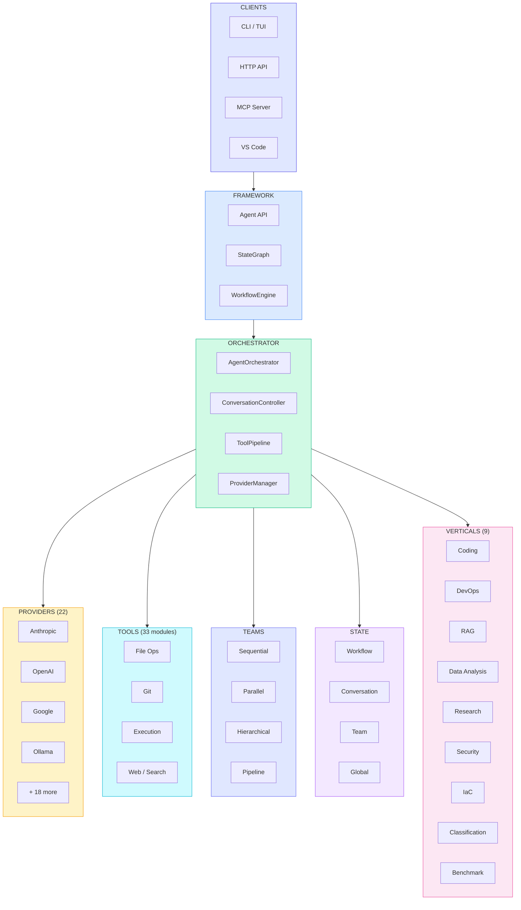

# Victor Architecture

## System View

## Core Components

| Component | Responsibility | Entry Point |
|-----------|----------------|-------------|
| **Agent** | Public API: `run()`, `stream()`, `chat()`, `run_workflow()`, `run_team()` | `victor/framework/agent.py` |
| **AgentOrchestrator** | Conversation loop, tool routing, provider calls | `victor/agent/orchestrator.py` |
| **Providers** | LLM I/O, auth, retry, streaming (22 backends) | `victor/providers/` |
| **Tools** | 33 tool modules across 9 categories | `victor/framework/tools.py` |
| **StateGraph** | Typed-state execution engine with checkpointing | `victor/framework/graph.py` |
| **WorkflowEngine** | YAML-to-StateGraph compiler | `victor/framework/workflow_engine.py` |
| **Teams** | Multi-agent coordination (4 formations) | `victor/teams/` |
| **State** | 4-scope state management (workflow/conversation/team/global) | `victor/state/` |
| **Events/CQRS** | Event sourcing, CommandBus, QueryBus, middleware | `victor/core/` |
| **Evaluation** | Agent harnesses, code quality, SWE-bench | `victor/evaluation/` |
| **Verticals** | 9 domain-specific application bundles | `victor/verticals/` |
| **UI** | CLI (Typer), TUI (Textual), 22 subcommands | `victor/ui/` |

## Data Flows

**Single-agent:** User prompt → Orchestrator → Provider → Tool calls (loop) → Response

**Workflow:** YAML → UnifiedCompiler → StateGraph → Node execution with state transitions → Merged output

**Multi-agent team:** Team spec → Formation strategy → Agent spawning → Result aggregation → Unified response

## Extension Points

- **Providers** — `BaseProvider` subclass + `ProviderRegistry.register()`
- **Tools** — `BaseTool` subclass in `victor/tools/`
- **Verticals** — `VerticalBase` subclass; external via `victor.verticals` entry point
- **Workflows** — YAML DSL or programmatic `StateGraph` construction
- **Middleware** — Pre/post hooks, safety checks, rate limiting

## Design Principles

| Principle | How |
|-----------|-----|
| **Facade pattern** | Orchestrator is a thin coordinator; all logic in extracted components |
| **Protocol-based interfaces** | Python Protocols for ISP compliance (`SubAgentContext`, `CapabilityRegistry`) |
| **Provider agnosticism** | 22 backends behind a unified interface; switch mid-conversation |
| **Opt-in complexity** | Simple `agent.run()` by default; workflows, teams, CQRS when needed |
| **Air-gapped capable** | Full functionality with local models (Ollama, LM Studio, vLLM) |
