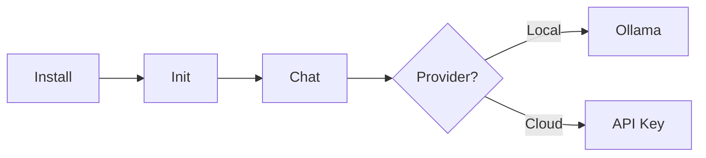

<div align="center">

# Victor

**Open-source, local-first coding assistant**

*Run local or cloud models with one CLI.*

[](https://pypi.org/project/victor-ai/)
[](https://www.python.org/downloads/)
[](LICENSE)

[Quick Start](#quick-start) | [Why Victor](#why-victor) | [Providers](#providers) | [Docs](#documentation)

</div>

---

## Quick Start

**60-second quickstart (no API key):**
```bash
# 1. Install (recommended)
pipx install victor-ai

# Or:
# pip install victor-ai

# 2. Local model
ollama pull qwen2.5-coder:7b

# 3. Initialize and chat
victor init
victor chat
```

**One-shot:**
```bash
victor "refactor this file for clarity"
```

See `docs/QUICKSTART_60S.md` for a concise walkthrough.



<details>
<summary><b>Local Model (No API Key)</b></summary>

```bash
ollama pull qwen2.5-coder:7b
victor chat
```
</details>

<details>
<summary><b>Cloud Provider</b></summary>

```bash
victor keys --set anthropic --keyring
victor chat --provider anthropic --model claude-sonnet-4-5
```
</details>

---

## Why Victor?

- Local-first by default: run Ollama/LM Studio/vLLM without an API key.
- Provider-agnostic: switch models without rewriting workflows.
- Practical workflows: review, refactor, and test from the CLI.
- Extensible: add tools, verticals, and MCP integrations as needed.

---

## Providers

Use the same CLI with local or cloud models. Pick based on privacy, cost, and speed.

- Local: Ollama, LM Studio, vLLM, llama.cpp
- Cloud: Anthropic, OpenAI, Google, Groq, DeepSeek, Mistral, xAI, and more

See `docs/reference/PROVIDERS.md` for setup and examples.

---

## What You Can Do

- Run local or cloud models with the same CLI.
- Use built-in workflows for review, refactor, tests, and docs.
- Make multi-file edits with previews and rollback.
- Add MCP tools and custom verticals when needed.

See `docs/ARCHITECTURE_DEEP_DIVE.md` for system internals.

---

## Workflow Capabilities

Victor includes a YAML-based workflow system with scheduling and versioning.

### What's Included

| Feature | Status | Notes |
|---------|--------|-------|
| YAML Workflow DSL | Stable | Agent, compute, condition, parallel nodes |
| Cron Scheduling | Stable | Standard cron syntax, aliases (@daily, @hourly) |
| Execution Limits | Stable | Timeouts, retries, iteration limits |
| Workflow Versioning | Stable | Semver, migrations, deprecation |
| CLI Management | Stable | `victor scheduler add/list/remove` |

### Quick Example

```yaml
# my_workflow.yaml
workflows:
  daily_analysis:
    schedule:
      cron: "0 9 * * *"
    execution:
      max_timeout_seconds: 3600
    nodes:
      - id: analyze
        type: agent
        role: analyst
        goal: "Analyze daily metrics"
        timeout: 300
        next: []
```

```bash
victor scheduler add daily_analysis --cron "0 9 * * *"
victor scheduler start
```

### Honest Limitations

The built-in scheduler is designed for **single-instance deployments**:

- No distributed execution (one scheduler process only)
- In-memory state (no persistence across restarts without YAML reload)
- No web dashboard (CLI only)
- No DAG-style dependencies between workflows

**For production at scale**, use:
- **Airflow**: Complex DAGs, web UI, distributed workers
- **Temporal.io**: Microservices, durable execution
- **AWS Step Functions**: Serverless, AWS-native

Victor's scheduler is ideal for: dev environments, single-server deployments, and simple recurring tasks where an external orchestrator is overkill.

See `docs/guides/WORKFLOW_SCHEDULER.md` for complete documentation.

---

## Installation

| Method | Command |
|--------|---------|
| pip | `pip install victor-ai` |
| pipx | `pipx install victor-ai` |
| Docker | `docker pull vjsingh1984/victor` |
| Source | `pip install -e ".[dev]"` |

---

## CLI Reference

| Command | Description |
|---------|-------------|
| `victor` | Start TUI |
| `victor chat` | CLI mode |
| `victor chat --provider X` | Use specific provider |
| `victor chat --mode explore` | Exploration mode |
| `victor serve` | API server |
| `victor mcp` | MCP server |
| `victor keys --set X` | Configure API key |
| `victor workflow validate <path>` | Validate YAML workflow file |
| `victor workflow render <path>` | Render workflow as diagram (SVG/PNG/ASCII) |
| `victor scheduler start` | Start workflow scheduler daemon |
| `victor scheduler add <name>` | Add scheduled workflow |
| `victor scheduler list` | List scheduled workflows |
| `victor vertical create <name>` | Scaffold new vertical structure |
| `victor vertical list` | List available verticals |
| `victor dashboard` | Launch observability dashboard |

### Agent Modes

| Mode | Edits | Exploration | Use Case |
|------|:-----:|:-----------:|----------|
| BUILD | Full | 1.0x | Implementation |
| PLAN | Sandbox | 2.5x | Analysis |
| EXPLORE | Notes | 3.0x | Understanding |

---

## Documentation

| Document | Description |
|----------|-------------|
| [User Guide](docs/USER_GUIDE.md) | Complete usage |
| [Developer Guide](docs/DEVELOPER_GUIDE.md) | Contributing |
| [Tool Catalog](docs/TOOL_CATALOG.md) | Tool list |
| [Provider Setup](docs/guides/PROVIDER_SETUP.md) | Provider config |
| [Local Models](docs/guides/LOCAL_MODELS.md) | Ollama, LM Studio, vLLM, llama.cpp |
| [Air-Gapped Mode](docs/embeddings/AIRGAPPED.md) | Offline operation |
| [Workflow DSL](docs/guides/WORKFLOW_DSL.md) | StateGraph guide |
| [Workflow Scheduling](docs/guides/WORKFLOW_SCHEDULER.md) | Cron, versioning, limits |

---

## Project Status

- CLI and core workflows are stable for daily use.
- VS Code extension is beta.
- See `docs/ARCHITECTURE_DEEP_DIVE.md` for system details.

---

## Contributing

```bash
git clone https://github.com/vijayksingh/victor.git
cd victor
pip install -e ".[dev]"
pytest
```

See [CONTRIBUTING.md](CONTRIBUTING.md) for guidelines.

---

## License

Apache License 2.0 - See [LICENSE](LICENSE)

---

<div align="center">

**Open source. Provider agnostic. Privacy first.**

[GitHub](https://github.com/vijayksingh/victor)

</div>
