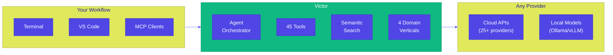
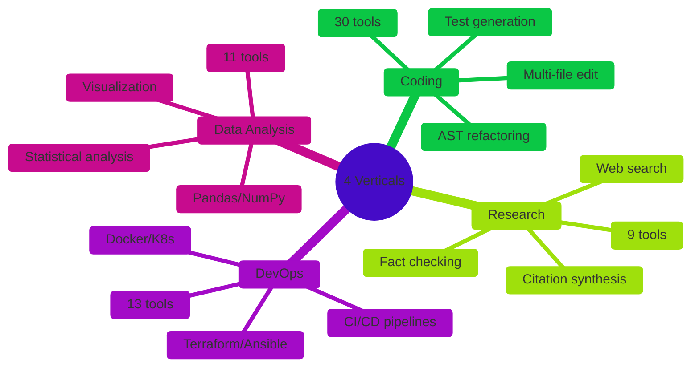
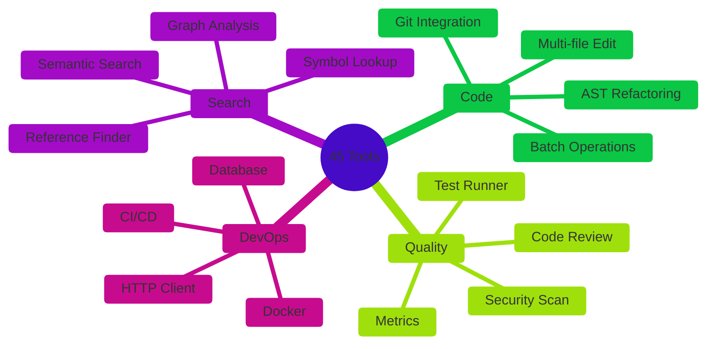
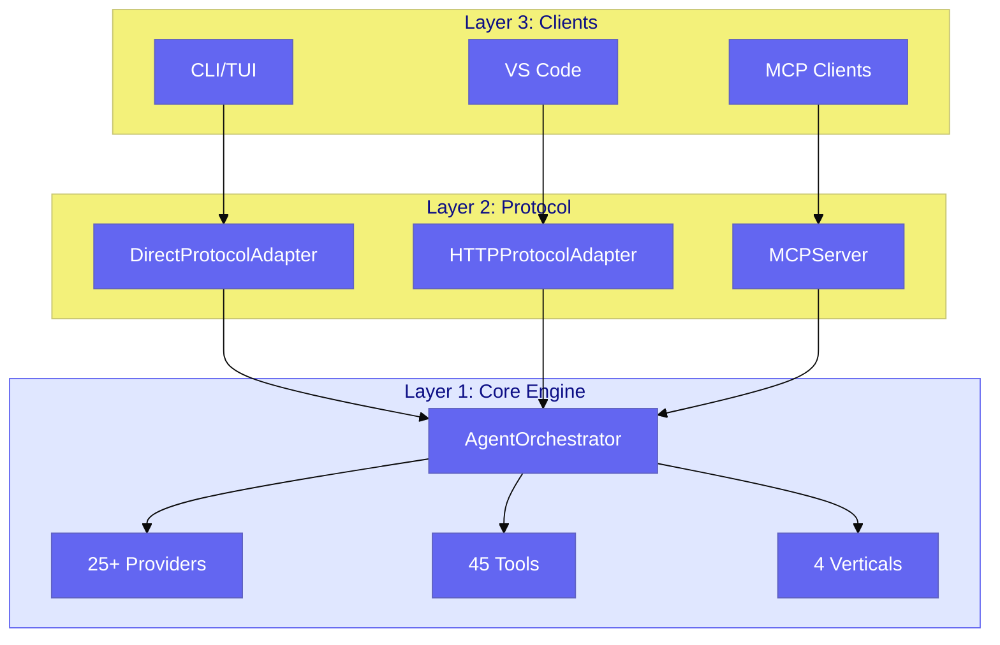
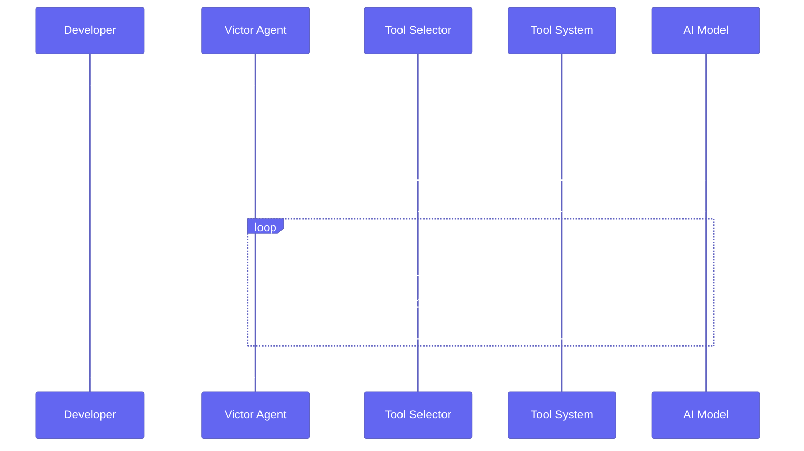
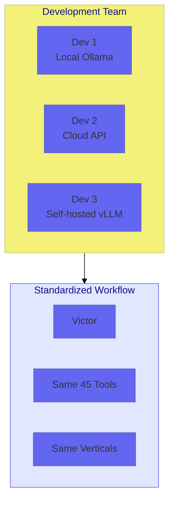

<div align="center">

# Victor

**Open Source AI Coding Assistant**

*Any model. Any provider. Your infrastructure.*

[](https://pypi.org/project/victor-ai/)
[](https://www.python.org/downloads/)
[](LICENSE)
[](https://www.docker.com/)
[](#project-status)

[Quick Start](#quick-start) • [Why Victor](#why-victor) • [Features](#features) • [Documentation](#documentation)

</div>

---

## What is Victor?

Victor is an enterprise-grade, terminal-based AI coding assistant that works with **any LLM provider**—cloud or local. Unlike single-vendor tools, Victor gives you provider freedom, complete data privacy, and specialized domain verticals.



---

## Why Victor?

### The Problem with AI Coding Tools

| Challenge | Typical AI Tool | Victor Solution |
|-----------|-----------------|-----------------|
| **Vendor Lock-in** | Single provider only | 25+ providers, switch anytime |
| **Data Privacy** | Code goes to vendor cloud | 100% air-gapped mode available |
| **Domain Expertise** | Generic code assistant | 4 specialized verticals |
| **Tool Access** | Fixed, limited toolset | 45 tools with cost-aware selection |
| **Protocol Support** | Proprietary integrations | MCP client + server support |

### Evidence-Based Differentiators

<details>
<summary><b>25+ Provider Support</b> - Verified in <code>victor/providers/</code></summary>

```
victor/providers/
├── anthropic.py      # Claude models
├── openai.py         # GPT-4, GPT-4o
├── google.py         # Gemini Pro
├── xai.py            # Grok
├── deepseek.py       # DeepSeek Coder
├── groq.py           # Fast inference
├── mistral.py        # Mistral models
├── together.py       # Together AI
├── ollama.py         # Local: 100+ models
├── lmstudio.py       # Local GUI
├── vllm.py           # Local: production serving
└── ... (15 more)
```

**Technical Detail**: Each provider inherits from `BaseProvider` (victor/providers/base.py) implementing `chat()`, `stream_chat()`, and `supports_tools()`. Tool calling adapters (victor/agent/tool_calling/) normalize provider-specific formats.
</details>

<details>
<summary><b>45 Built-in Tools</b> - Verified in <code>docs/TOOL_CATALOG.md</code></summary>

Tools are classified by cost tier for intelligent selection:

| Tier | Cost | Examples |
|------|------|----------|
| FREE | Local only | read, write, edit, ls, grep, git |
| LOW | Compute | code_review, refactor, metrics |
| MEDIUM | External API | web_search, web_fetch |
| HIGH | Resource-intensive | batch (100+ files) |

**Technical Detail**: Each tool inherits from `BaseTool` (victor/tools/base.py) with `cost_tier`, `priority`, `access_mode`, and `danger_level` properties. The `SemanticToolSelector` uses embeddings for intelligent selection.
</details>

<details>
<summary><b>4 Domain Verticals</b> - Verified in <code>victor/verticals/</code></summary>

| Vertical | Tools | Specialization |
|----------|-------|----------------|
| **Coding** | 30 | Multi-file refactoring, AST operations, test generation |
| **Research** | 9 | Web search, citation management, fact synthesis |
| **DevOps** | 13 | Docker, Terraform, CI/CD, infrastructure |
| **Data Analysis** | 11 | Pandas, visualization, statistical analysis |

**Technical Detail**: Verticals implement `VerticalBase` (victor/verticals/base.py) with protocol-based extensions: `PromptContributorProtocol`, `SafetyExtensionProtocol`, `ModeConfigProviderProtocol`. Framework remains vertical-agnostic.
</details>

<details>
<summary><b>MCP Protocol Support</b> - Verified in <code>victor/mcp/</code></summary>

Victor acts as both MCP client AND server:

```bash
# As MCP server (for Claude Desktop)
victor mcp

# As MCP client (connect to external servers)
# Configure in settings
```

**Technical Detail**: MCP server exposes Victor's 45 tools to Claude Desktop and other MCP clients. MCP client allows Victor to consume tools from external MCP servers.
</details>

---

## Quick Start

```bash
# Install
pip install victor-ai

# Initialize and start
victor init
victor chat
```

**Common CLI overrides**

```bash
# Pick a provider/model directly (bypasses profiles.yaml)
victor chat --provider ollama --model qwen3-coder:30b --endpoint http://localhost:11434

# Switch output renderer (auto|rich|rich-text|text); text is best for debugging
victor chat --renderer text --log-level DEBUG "Hi"

# Select a domain vertical
victor chat --vertical devops "Set up a CI/CD pipeline"
victor chat --vertical research "Summarize recent advances in RAG"

# Set initial mode and budgets
victor chat --mode explore --tool-budget 20 --max-iterations 60
```

<details>
<summary><b>Local Model (Free, Private)</b></summary>

```bash
# Install Ollama from https://ollama.ai
ollama pull qwen2.5-coder:32b
victor chat
```
</details>

<details>
<summary><b>Cloud Provider</b></summary>

```bash
# Store API key securely in system keyring
victor keys --set anthropic --keyring

# Start chatting
victor chat --provider anthropic --model claude-sonnet-4-5
```

**Supported providers**: `anthropic`, `openai`, `google`, `xai`, `deepseek`, `groqcloud`, `mistral`, `moonshot`, `cerebras`, `openrouter`
</details>

---

## Features

### Provider Support (25+)

Works with cloud APIs and local inference engines:

| Category | Providers | Status |
|----------|-----------|--------|
| **Cloud (Tested)** | Anthropic (Claude), OpenAI (GPT-4), Google (Gemini), xAI (Grok), DeepSeek, Groq, Mistral, Moonshot (Kimi), Cerebras, OpenRouter | ✅ Ready |
| **Cloud (Untested)** | Together ($25 free), Fireworks ($1 free), HuggingFace | API compatible |
| **Local** | Ollama (100+ models), LMStudio, vLLM, llama.cpp | ✅ Free, Private |
| **Enterprise** | Azure OpenAI, AWS Bedrock, Google Vertex AI | SSO/SAML support |

**Free Tier Providers** (no credit card required):
- **Groq**: Ultra-fast LPU inference, Llama 3.3 70B
- **Cerebras**: Fastest inference (1000+ tok/s), Llama/Qwen
- **Mistral**: 500K tokens/min, Mistral Large/Codestral
- **OpenRouter**: 350+ models, includes free tier models
- **DeepSeek**: Affordable DeepSeek-V3 at $0.14/1M tokens

### Domain Verticals

Specialized assistants with domain-optimized prompts, tool selection, and safety rules:



### Built-in Tools (45)

Tools organized by function with cost-aware selection:



### Semantic Code Search

Local embedding-based search with multi-language support:

- **10 languages**: Python, TypeScript, JavaScript, Go, Rust, Java, C, HTML, JSON, YAML
- **AST parsing**: Tree-sitter for accurate symbol extraction
- **Incremental indexing**: Only re-embeds changed files
- **Sub-100ms search**: Vector similarity on local embeddings
- **Shared embeddings**: Same model (all-MiniLM-L12-v2) for tools and code search (40% memory reduction)

### Air-Gapped Mode

100% offline operation for regulated environments:

| Requirement | Victor Capability |
|------------|-------------------|
| Data stays on-premises | Local model execution via Ollama/vLLM |
| No cloud dependencies | Local embeddings (sentence-transformers) |
| Audit logging | Built-in compliance logging |
| Container deployment | Official Docker images |

```bash
# Enable air-gapped mode
victor chat --airgapped
# or set in config: airgapped_mode: true
```

---

## Architecture

### Protocol-First Design



### Tool Calling Flow



---

## Use Cases

### 1. Developer Productivity

Multi-file operations, semantic code search, and automated refactoring—all through natural language.

```
$ victor chat

You > Rename UserManager to AccountService across the codebase

Victor > Found 47 references across 12 files. Applying changes...

[✓] Renamed class definition in auth/manager.py
[✓] Updated 23 imports
[✓] Updated 24 usages
[✓] Tests passing
```

### 2. Team Standardization

Consistent tooling regardless of individual model preferences. Teams standardize on Victor while developers choose their preferred AI backend.



### 3. Regulated Environments

100% air-gapped operation with local models and embeddings. No external network calls.

### 4. Domain-Specific Work

Use specialized verticals for focused assistance:

```bash
# DevOps workflow
victor chat --vertical devops "Create a Kubernetes deployment for our API"

# Research workflow
victor chat --vertical research "Analyze recent papers on transformer efficiency"

# Data analysis workflow
victor chat --vertical data_analysis "Profile this dataset and identify correlations"
```

---

## Installation

| Method | Command | Notes |
|--------|---------|-------|
| **pip** | `pip install victor-ai` | Recommended |
| **pipx** | `pipx install victor-ai` | Isolated environment |
| **Docker** | `docker pull vjsingh1984/victor` | Containerized |
| **Source** | `pip install -e ".[dev]"` | Development |

See [Installation Guide](docs/guides/INSTALLATION.md) for details.

---

## Documentation

| Document | Description |
|----------|-------------|
| [Quick Start](docs/guides/QUICKSTART.md) | First steps |
| [User Guide](docs/USER_GUIDE.md) | Complete usage |
| [Tool Catalog](docs/TOOL_CATALOG.md) | All 45 tools |
| [Air-Gapped Mode](docs/embeddings/AIRGAPPED.md) | Offline operation |
| [Provider Setup](docs/guides/PROVIDER_SETUP.md) | Configure providers |
| [Graph Backends](docs/guides/GRAPH_BACKENDS.md) | Configure/extend code graph storage |
| [Developer Guide](docs/DEVELOPER_GUIDE.md) | Contributing |

---

## Graph Store

- Default: embedded SQLite per project at `.victor/graph/graph.db`.
- Configure via settings (`codebase_graph_store`, `codebase_graph_path`) or `VICTOR_GRAPH_STORE`.
- Optional DuckDB backend (`codebase_graph_store=duckdb`, requires `duckdb` installed); in-memory backend available for testing.
- Registry is ready for LanceDB/Neo4j placeholders; extend `victor/codebase/graph/registry.py` to plug additional backends.

---

## Project Status

Victor is in active development with **11,100+ passing tests**. Core functionality is stable and production-ready.

| Component | Status | Evidence |
|-----------|--------|----------|
| Agent Orchestrator | Stable | DI migration complete, async support |
| 45 Tools | Stable | Documented in TOOL_CATALOG.md |
| 25+ Providers | Stable | victor/providers/ directory |
| 4 Domain Verticals | Stable | victor/verticals/ directory |
| Semantic Search | Stable | 10 languages, AST parsing |
| VS Code Extension | Beta | vscode-victor/ directory |
| MCP Support | Stable | Client + server modes |
| PyPI Package | v0.2.3 | `pip install victor-ai` |

---

## Technical Highlights

### Dependency Injection Container

Thread-safe, type-safe service container with lifecycle management (victor/core/container.py):

```python
# Protocol-based service resolution
conversation = container.get(ConversationControllerProtocol)
pipeline = container.get(ToolPipelineProtocol)
```

### Tool Metadata System

Comprehensive tool classification for intelligent selection (victor/tools/base.py):

- **CostTier**: FREE, LOW, MEDIUM, HIGH
- **Priority**: CRITICAL, HIGH, MEDIUM, LOW, CONTEXTUAL
- **AccessMode**: READONLY, WRITE, EXECUTE, NETWORK, MIXED
- **DangerLevel**: SAFE, LOW, MEDIUM, HIGH, CRITICAL

### Conversation Management

4 compaction strategies with SQLite-backed persistence (victor/agent/conversation_controller.py):

- SIMPLE: Keep N most recent
- TIERED: Prioritize tool results (3x weight)
- SEMANTIC: Embeddings-based relevance
- HYBRID: Combined scoring

### Phase 4 Framework Features

Victor's framework includes advanced workflow and multi-agent capabilities:

| Feature | Description | Location |
|---------|-------------|----------|
| **StateGraph DSL** | LangGraph-compatible workflow engine with typed state, conditional edges, and checkpointing | `victor/framework/graph.py` |
| **Multi-Agent Teams** | Coordinate agents in Sequential, Parallel, Pipeline, or Hierarchical formations | `victor/framework/teams.py` |
| **Rich Personas** | CrewAI-compatible agent personas with backstory, expertise, and memory | `TeamMemberSpec` |
| **Dynamic Capabilities** | Runtime capability loading and hot-reload for plugins | `victor/framework/capability_loader.py` |

```python
# StateGraph workflow example
from victor.framework import StateGraph, END

graph = StateGraph(MyState)
graph.add_node("analyze", analyze_fn)
graph.add_node("execute", execute_fn)
graph.add_conditional_edge("execute", retry_condition, {"retry": "analyze", "done": END})
app = graph.compile()
result = await app.invoke(initial_state)

# Multi-agent team example
from victor.framework.teams import TeamMemberSpec, TeamFormation

team = await Agent.create_team(
    name="Feature Team",
    goal="Implement authentication",
    members=[
        TeamMemberSpec(role="researcher", goal="Find patterns", backstory="Senior dev"),
        TeamMemberSpec(role="executor", goal="Write code", tool_budget=30),
    ],
    formation=TeamFormation.PIPELINE,
)
result = await team.run()
```

See [docs/USER_GUIDE.md](docs/USER_GUIDE.md#stategraph-dsl-phase-4) and [docs/guides/WORKFLOW_DSL.md](docs/guides/WORKFLOW_DSL.md) for complete documentation.

### Framework Architecture Strengths

Victor's framework is built on SOLID principles for extensibility and maintainability:

```
┌──────────────────────────────────────────────────────────────────────┐
│                     FRAMEWORK STRENGTHS                              │
├─────────────────┬────────────────────────────────────────────────────┤
│ Capability      │ Evidence                                           │
├─────────────────┼────────────────────────────────────────────────────┤
│ Provider        │ 25+ providers via BaseProvider protocol            │
│ Agnostic        │ (victor/providers/base.py)                         │
├─────────────────┼────────────────────────────────────────────────────┤
│ Tool Ecosystem  │ 45 tools with cost-aware semantic selection        │
│                 │ (victor/tools/, BAAI/bge-small-en-v1.5)            │
├─────────────────┼────────────────────────────────────────────────────┤
│ Multi-Agent     │ 4 formations: Sequential, Parallel, Pipeline,      │
│ Teams           │ Hierarchical (victor/agent/teams/)                 │
├─────────────────┼────────────────────────────────────────────────────┤
│ DAG Workflows   │ YAML-based workflow DSL with HITL nodes            │
│                 │ (victor/workflows/)                                │
├─────────────────┼────────────────────────────────────────────────────┤
│ Adaptive        │ 13 RL learners for tool selection, mode            │
│ Learning        │ transition, quality weights (victor/agent/rl/)     │
├─────────────────┼────────────────────────────────────────────────────┤
│ Vertical        │ 4 domain verticals: Coding, Research, DevOps,      │
│ Extensibility   │ Data Analysis (victor/verticals/)                  │
├─────────────────┼────────────────────────────────────────────────────┤
│ Air-Gapped      │ 100% local operation with Ollama/vLLM              │
│ Support         │ (airgapped_mode=True)                              │
├─────────────────┼────────────────────────────────────────────────────┤
│ MCP Protocol    │ Both client and server implementation              │
│                 │ (victor/mcp/)                                      │
└─────────────────┴────────────────────────────────────────────────────┘
```

**SOLID Principles in Practice**:

| Principle | Implementation | Location |
|-----------|----------------|----------|
| **Single Responsibility** | Each tool/provider handles one concern | `BaseTool`, `BaseProvider` |
| **Open/Closed** | Extend via protocols without modifying core | `VerticalBase`, `PromptContributorProtocol` |
| **Liskov Substitution** | All providers interchangeable | Provider inheritance hierarchy |
| **Interface Segregation** | Small, focused protocols | 15+ protocols in `victor/protocols/` |
| **Dependency Inversion** | DI container for service resolution | `victor/core/container.py` |

See [docs/ARCHITECTURE_ROADMAP.md](docs/ARCHITECTURE_ROADMAP.md) for improvement phases and technical debt tracking.

**Agent Persona Support** (TeamMember with rich attributes):

```python
from victor.agent.teams.team import TeamMember

researcher = TeamMember(
    id="security_analyst",
    role=SubAgentRole.RESEARCHER,
    name="Security Analyst",
    goal="Find authentication vulnerabilities",
    backstory="10 years of security experience...",  # Rich persona
    memory=True,   # Persist discoveries
    cache=True,    # Cache tool results
    tool_budget=25,
)
```

---

## Contributing

```bash
git clone https://github.com/vijayksingh/victor.git
cd victor
pip install -e ".[dev]"
pytest
```

See [CONTRIBUTING.md](CONTRIBUTING.md) for guidelines.

---

## License

Apache License 2.0 - See [LICENSE](LICENSE)

---

<div align="center">

**Open source. Provider agnostic. Privacy first.**

[Documentation](#documentation) • [GitHub](https://github.com/vijayksingh/victor)

</div>
