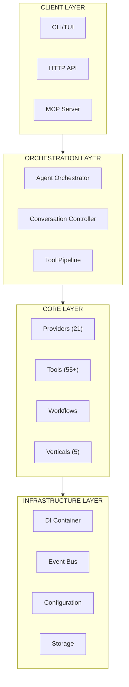

<div align="center">

# Victor

**Provider-agnostic coding assistant. Local or cloud, one CLI.**

[](https://pypi.org/project/victor-ai/)
[](https://www.python.org/downloads/)
[](LICENSE)
[](https://github.com/vjsingh1984/victor/actions/workflows/test.yml)

</div>

---

## Why Victor?

**Switch models without losing context.** Start with Claude, continue with GPT-4, finish with a local model—all in one conversation. Victor manages context independently of the LLM provider.

```bash
# Start with Claude
victor chat --provider anthropic --model claude-sonnet-4-20250514

# Continue with GPT-4 (context preserved)
/provider openai --model gpt-4

# Finish with local model (context preserved)
/provider ollama --model qwen2.5-coder:7b
```

**No API key required.** Run local models (Ollama, LM Studio, vLLM) by default. Add cloud providers when you need them.

**One CLI for everything.** Code review, refactoring, testing, multi-file edits, workflows—all from the terminal.

---

## Quick Start

### Option 1: Local Model (No API Key - Recommended)

```bash
# Install Victor
pipx install victor-ai

# Install Ollama (local model runner)
curl -fsSL https://ollama.ai/install.sh | sh

# Pull a code-focused model
ollama pull qwen2.5-coder:7b

# Start Victor (automatically uses Ollama)
victor chat "Hello, Victor!"
```

**Best for**: Privacy, offline use, free tier

### Option 2: Cloud Provider

```bash
# Install Victor
pipx install victor-ai

# Set API key
export ANTHROPIC_API_KEY=sk-...

# Start with cloud provider
victor chat --provider anthropic
```

**Best for**: Maximum capability, faster execution

### Option 3: Docker

```bash
# Pull image
docker pull ghcr.io/vjsingh1984/victor:latest

# Run Victor
docker run -it \
  -v ~/.victor:/root/.victor \
  ghcr.io/vjsingh1984/victor:latest
```

**Best for**: Isolated environment, easy deployment

[Full Installation Guide →](docs/getting-started/installation.md)

---

## What Victor Does

| Feature | Description | Details |
|---------|-------------|---------|
| **21 Providers** | Anthropic, OpenAI, Google, DeepSeek, Ollama, vLLM, and 15 more | [Provider List →](docs/reference/providers/) |
| **55+ Tools** | File ops, code editing, git, testing, search, web scraping | [Tool Catalog →](docs/reference/tools/) |
| **5 Verticals** | Coding, DevOps, RAG, Data Analysis, Research | [Verticals →](docs/reference/verticals/) |
| **Workflows** | YAML DSL with scheduling, versioning, parallel execution | [Workflows →](docs/guides/workflow-development/) |
| **Multi-Agent** | Team coordination with 5 formations (hierarchical, flat, pipeline, etc.) | [Teams →](docs/guides/multi-agent/) |
| **Provider Switching** | Change models mid-conversation without losing context | [Guide →](docs/user-guide/provider-switching.md) |

---

## Key Capabilities

### 1. Provider Switching

Victor's key differentiator: **switch models without losing context**.

```bash
# Start with Claude for complex reasoning
victor chat --provider anthropic "Design a REST API"

# Continue with GPT-4 for implementation
/provider openai --model gpt-4

# Finish with local model for privacy
/provider ollama --model qwen2.5-coder:7b
```

**Context Independence**: Conversation history managed separately from LLM provider, so you can leverage different model strengths without losing your place.

[Learn More →](docs/user-guide/provider-switching.md)

### 2. Multi-Agent Teams

Coordinate specialized AI agents for complex tasks.

```python
from victor.framework import Agent, AgentTeam

# Create specialized agents
frontend = Agent(role="Frontend developer", tools=["react", "typescript"])
backend = Agent(role="Backend developer", tools=["fastapi", "sqlalchemy"])
tester = Agent(role="QA engineer", tools=["pytest", "selenium"])

# Coordinate team
team = AgentTeam.hierarchical(
    lead="senior-developer",
    subagents=[frontend, backend, tester]
)

result = await team.run("Implement user registration feature")
```

**Team Formations**: Hierarchical, flat, pipeline, consensus, debate

[Learn More →](docs/guides/multi-agent/)

### 3. Workflow Automation

Define reusable workflows in YAML.

```yaml
workflow: CodeReview
description: Automated code review workflow

nodes:
  - id: analyze
    type: agent
    role: You are a code reviewer. Analyze this PR.
    goal: Identify bugs, security issues, and improvements.

  - id: test
    type: compute
    tools: [pytest, coverage]
    config:
      command: pytest tests/ -v

  - id: report
    type: transform
    input: analyze.output, test.output
    template: |
      # Review Report
      {{analyze.output}}
      ## Test Results
      {{test.output}}

edges:
  - source: analyze
    target: test
  - source: test
    target: report
```

**Features**: Scheduling, versioning, parallel execution, error handling

[Learn More →](docs/guides/workflow-development/)

### 4. RAG & Knowledge Base

Build knowledge bases from your codebase and documentation.

```bash
victor --vertical rag
 victor> ingest docs/
 victor> query "How does authentication work?"
```

**Capabilities**:
- Ingest code, documentation, markdown, PDFs
- Semantic search with embeddings
- Context-aware responses
- Multi-format support

[Learn More →](docs/reference/verticals/rag.md)

---

## Core Commands

| Command | Description | Example |
|---------|-------------|---------|
| `victor` | TUI mode (interactive) | `victor` |
| `victor chat` | CLI mode (single task) | `victor chat "refactor this"` |
| `victor chat --mode plan` | Plan mode (no edits) | `victor chat --mode plan` |
| `victor serve` | HTTP API server | `victor serve --port 8080` |
| `victor mcp` | MCP server | `victor mcp --stdio` |
| `victor workflow run` | Execute workflow | `victor workflow run code-review` |
| `victor workflow list` | List workflows | `victor workflow list` |
| `/provider` | Switch provider (in chat) | `/provider openai` |

[Full CLI Reference →](docs/user-guide/cli-reference.md)

---

## Use Cases

### Code Review

```bash
victor "Review this PR for bugs and improvements"
```

Victor analyzes code changes, identifies issues, and suggests improvements with detailed explanations.

[Full Example →](docs/user-guide/)

### Refactoring

```bash
victor --mode build "Refactor to use dependency injection"
```

Plan mode first to understand the code, then build mode to implement changes.

[Full Example →](docs/user-guide/)

### Testing

```bash
victor "Write unit tests for auth.py"
```

Generate comprehensive unit tests with fixtures, mocks, and edge cases.

[Full Example →](docs/user-guide/)

### CI/CD Integration

```yaml
# .github/workflows/review.yml
name: Code Review
on:
  pull_request:
    types: [opened, synchronize]

jobs:
  review:
    runs-on: ubuntu-latest
    steps:
      - uses: actions/checkout@v3
      - name: Install Victor
        run: pipx install victor-ai
      - name: Run Code Review
        run: victor chat "Review this PR" --mode plan
```

[Full Integration Guide →](docs/guides/integration/ci-cd.md)

---

## Installation

### pipx (Recommended)

```bash
pip install pipx
pipx install victor-ai
```

**Benefits**: Isolated installation, easy to uninstall, works with system Python

### pip

```bash
pip install victor-ai
```

**Best for**: Virtual environments, projects with dependencies

### Docker

```bash
docker pull ghcr.io/vjsingh1984/victor:latest
docker run -it ghcr.io/vjsingh1984/victor:latest
```

**Best for**: Containers, reproducible environments, air-gapped deployment

### From Source

```bash
git clone https://github.com/vjsingh1984/victor.git
cd victor
pip install -e ".[dev]"
```

**Best for**: Development, contributing, custom modifications

[Full Installation Guide →](docs/getting-started/installation.md)

---

## Configuration

### Quick Setup

**1. Local model** (default - no config needed):
```bash
victor  # Automatically uses Ollama
```

**2. Cloud provider**:
```bash
export ANTHROPIC_API_KEY=sk-...
victor chat --provider anthropic
```

**3. Profiles** (`~/.victor/profiles.yaml`):
```yaml
profiles:
  development:
    provider: anthropic
    model: claude-sonnet-4-20250514
  production:
    provider: openai
    model: gpt-4
```

### Configuration Files

| File | Purpose | Reference |
|------|---------|----------|
| `profiles.yaml` | Provider and model profiles | [profiles.md →](docs/reference/configuration/profiles.md) |
| `config.yaml` | Global settings and options | [config.md →](docs/reference/configuration/) |
| `mcp.yaml` | MCP server configuration | [mcp.md →](docs/reference/configuration/mcp.md) |
| `.victor.md` | Project context and instructions | [.victor.md →](docs/user-guide/project-context.md) |
| `CLAUDE.md` | AI assistant project instructions | [CLAUDE.md →](docs/CLAUDE.md) |

[Full Configuration Guide →](docs/reference/configuration/)

---

## Documentation

### By Audience

| Audience | Documentation | Description |
|----------|---------------|-------------|
| **New Users** | [Getting Started](docs/getting-started/) | Install and configure Victor |
| **Daily Users** | [User Guide](docs/user-guide/) | Daily usage patterns, commands, modes |
| **Developers** | [Development Guide](docs/development/) | Contributing, architecture, testing |
| **Architects** | [Architecture Deep Dive](docs/development/architecture/deep-dive.md) | System design and patterns |
| **Operators** | [Operations Guide](docs/operations/) | Deployment, monitoring, security |

### By Topic

| Topic | Documentation | Description |
|-------|--------------|-------------|
| **Providers** | [Provider Reference](docs/reference/providers/) | All 21 LLM providers |
| **Tools** | [Tool Catalog](docs/reference/tools/) | 55+ tools and composition |
| **Configuration** | [Configuration](docs/reference/configuration/) | Complete config reference |
| **Workflows** | [Workflow DSL](docs/guides/workflow-development/) | YAML workflow development |
| **Multi-Agent** | [Teams](docs/guides/multi-agent/) | Agent coordination patterns |
| **Integration** | [Integration](docs/guides/integration/) | API, CI/CD, VS Code |

[📚 Full Documentation →](docs/)

---

## Architecture

Victor uses a **layered architecture** with clear separation of concerns:



**Key Architectural Patterns**:
- **Dependency Injection**: Service container for component wiring
- **Event-Driven**: EventBus for cross-component communication
- **Facade Pattern**: AgentOrchestrator as single entry point
- **Protocol-Based Design**: BaseProvider, BaseTool, VerticalBase
- **Plugin System**: Entry points for external verticals

[Architecture Deep Dive →](docs/development/architecture/deep-dive.md)

---

## Performance

| Metric | Value | Notes |
|--------|-------|-------|
| **Startup Time** | <500ms | Lazy loading of tools/providers |
| **Tool Execution** | <100ms | Average (local tools) |
| **Context Switch** | Instant | Provider-independent context |
| **Memory Usage** | ~200MB | Base + model |
| **Workflow Compilation** | <1ms | With caching |

[Performance Guide →](docs/guides/performance.md)

---

## Roadmap

- [x] **21 LLM Providers** - Anthropic, OpenAI, Google, Ollama, vLLM, and 16 more
- [x] **55+ Tools** - File ops, git, testing, search, web, and more
- [x] **5 Verticals** - Coding, DevOps, RAG, Data Analysis, Research
- [x] **Multi-Agent Teams** - 5 formations with message bus
- [x] **Workflow DSL** - YAML-based with scheduling and versioning
- [ ] **Q1 2025**: Enhanced observability and debugging
- [ ] **Q2 2025**: VS Code extension 2.0
- [ ] **Q3 2025**: Distributed task execution
- [ ] **Q4 2025**: Enterprise features (SSO, audit logs)

[Full Roadmap →](docs/ROADMAP.md)

---

## Contributing

We welcome contributions! See [Contributing Guide](CONTRIBUTING.md) for details.

### Quick Start

```bash
# Clone repository
git clone https://github.com/vjsingh1984/victor.git
cd victor

# Create virtual environment
python -m venv .venv
source .venv/bin/activate  # Windows: .venv\Scripts\activate

# Install development dependencies
pip install -e ".[dev]"

# Run tests
make test
pytest tests/unit -v

# Run formatting
make format
```

### Resources

- [Development Guide →](docs/development/)
- [Architecture Deep Dive →](docs/development/architecture/deep-dive.md)
- [Testing Strategy →](docs/development/testing/strategy.md)
- [Code Style →](docs/development/contributing/code-style.md)

---

## Community

- **GitHub**: [vjsingh1984/victor](https://github.com/vjsingh1984/victor)
- **Discord**: [Join our Discord](https://discord.gg/...)
- **GitHub Discussions**: [Start a discussion](https://github.com/vjsingh1984/victor/discussions)
- **Issues**: [Report bugs or request features](https://github.com/vjsingh1984/victor/issues)
- **Stack Overflow**: Tag questions with `victor-ai`

---

## License

Apache License 2.0 - see [LICENSE](LICENSE) for details.

---

## Acknowledgments

**Built with**:
- [Anthropic](https://www.anthropic.com/) - Claude models
- [OpenAI](https://openai.com/) - GPT models
- [Ollama](https://ollama.ai/) - Local model support
- [Textual](https://textual.textual.io/) - TUI framework
- [Typer](https://typer.tiangolo.com/) - CLI framework
- [LangGraph](https://github.com/langchain-ai/langgraph) - Workflow inspiration

**Inspired by**:
- [Aider](https://github.com/paul-gauthier/aider) - Multi-file editing
- [Continue](https://github.com/continuedev/continue) - VS Code integration
- [Cursor](https://cursor.sh/) - AI-assisted IDE

---

<div align="center">

**[Documentation](docs/) · [GitHub](https://github.com/vjsingh1984/victor) · [PyPI](https://pypi.org/project/victor-ai/)**

**Open source. Provider agnostic. Local first.**

[](https://github.com/vjsingh1984/victor/stargazers)
[](https://pypi.org/project/victor-ai/)

</div>
