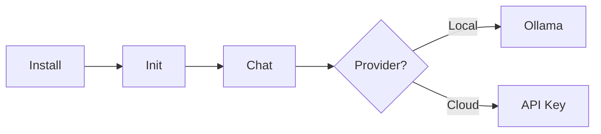
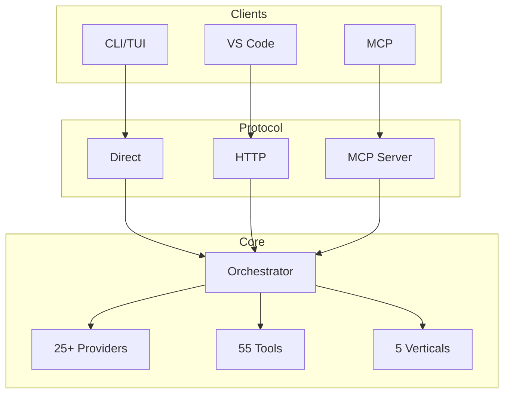

<div align="center">

# Victor

**Open Source AI Coding Assistant**

*Any model. Any provider. Your infrastructure.*

[](https://pypi.org/project/victor-ai/)
[](https://www.python.org/downloads/)
[](LICENSE)
[](#project-status)

[Quick Start](#quick-start) | [Features](#features) | [Providers](#provider-comparison) | [Documentation](#documentation)

</div>

---

## Quick Start

```bash
# 1. Install
pip install victor-ai

# 2. Initialize and run
victor init
victor chat
```



<details>
<summary><b>Local Model (Free, Private)</b></summary>

```bash
ollama pull qwen2.5-coder:32b
victor chat
```
</details>

<details>
<summary><b>Cloud Provider</b></summary>

```bash
victor keys --set anthropic --keyring
victor chat --provider anthropic --model claude-sonnet-4-5
```
</details>

---

## Why Victor?

| Challenge | Traditional Tools | Victor |
|-----------|------------------|--------|
| Vendor Lock-in | Single provider | 25+ providers |
| Data Privacy | Cloud-only | Air-gapped mode |
| Domain Expertise | Generic | 5 specialized verticals |
| Tool Access | Limited | 45 cost-aware tools |
| Protocol Support | Proprietary | MCP client + server |

---

## Provider Comparison

| Provider | Quality | Speed | Cost | Local | Notes |
|----------|:-------:|:-----:|:----:|:-----:|-------|
| **Anthropic** | 5/5 | 3/5 | $$$ | No | Best reasoning |
| **OpenAI** | 4/5 | 4/5 | $$$ | No | GPT-4o multimodal |
| **Google** | 4/5 | 4/5 | $$ | No | 1M token context |
| **Groq** | 3/5 | 5/5 | $ | No | Fastest inference |
| **DeepSeek** | 4/5 | 3/5 | $ | No | $0.14/1M tokens |
| **Ollama** | 3/5 | 2/5 | Free | Yes | 100+ local models |
| **LMStudio** | 3/5 | 2/5 | Free | Yes | GUI + API |
| **vLLM** | 3/5 | 3/5 | Free | Yes | Production serving |

> **Tip**: Use Groq/Cerebras for speed, Anthropic for quality, Ollama for privacy.

**Additional Providers**: xAI (Grok), Mistral, Moonshot, Cerebras, Together, Fireworks, OpenRouter, Azure OpenAI, AWS Bedrock, Google Vertex AI

---

## Features

### Domain Verticals

| Vertical | Tools | Specialization |
|----------|:-----:|----------------|
| **Coding** | 30 | Multi-file refactoring, AST ops, test gen |
| **Research** | 9 | Web search, citations, fact synthesis |
| **DevOps** | 13 | Docker, Terraform, CI/CD |
| **Data Analysis** | 11 | Pandas, visualization, statistics |
| **RAG** | 10 | Document ingestion, vector search |

### Tool System

| Category | Examples | Cost Tier |
|----------|----------|:---------:|
| File Ops | read, write, edit, ls, grep | FREE |
| Git | status, diff, commit, branch | FREE |
| Code | review, refactor, metrics | LOW |
| Web | search, fetch | MEDIUM |
| Batch | 100+ file operations | HIGH |

### Key Capabilities

| Feature | Description |
|---------|-------------|
| **Semantic Search** | 10 languages, Tree-sitter AST, sub-100ms |
| **Air-Gapped Mode** | 100% offline with local models |
| **MCP Protocol** | Client + server for Claude Desktop |
| **StateGraph DSL** | LangGraph-compatible workflows |
| **Multi-Agent Teams** | 4 formations: Sequential, Parallel, Pipeline, Hierarchical |

---

## Architecture



---

## Installation

| Method | Command |
|--------|---------|
| pip | `pip install victor-ai` |
| pipx | `pipx install victor-ai` |
| Docker | `docker pull vjsingh1984/victor` |
| Source | `pip install -e ".[dev]"` |

---

## CLI Reference

| Command | Description |
|---------|-------------|
| `victor` | Start TUI |
| `victor chat` | CLI mode |
| `victor chat --provider X` | Use specific provider |
| `victor chat --mode explore` | Exploration mode |
| `victor serve` | API server |
| `victor mcp` | MCP server |
| `victor keys --set X` | Configure API key |

### Agent Modes

| Mode | Edits | Exploration | Use Case |
|------|:-----:|:-----------:|----------|
| BUILD | Full | 1.0x | Implementation |
| PLAN | Sandbox | 2.5x | Analysis |
| EXPLORE | Notes | 3.0x | Understanding |

---

## Documentation

| Document | Description |
|----------|-------------|
| [User Guide](docs/USER_GUIDE.md) | Complete usage |
| [Developer Guide](docs/DEVELOPER_GUIDE.md) | Contributing |
| [Tool Catalog](docs/TOOL_CATALOG.md) | All 55 tools |
| [Provider Setup](docs/guides/PROVIDER_SETUP.md) | Provider config |
| [Air-Gapped Mode](docs/embeddings/AIRGAPPED.md) | Offline operation |
| [Workflow DSL](docs/guides/WORKFLOW_DSL.md) | StateGraph guide |

---

## Project Status

| Component | Status |
|-----------|:------:|
| Agent Orchestrator | Stable |
| 55 Tools | Stable |
| 25+ Providers | Stable |
| 5 Verticals | Stable |
| Semantic Search | Stable |
| VS Code Extension | Beta |
| MCP Support | Stable |

> **Note**: 11,100+ passing tests. See [ARCHITECTURE_ROADMAP.md](docs/ARCHITECTURE_ROADMAP.md) for improvement plans.

---

## Contributing

```bash
git clone https://github.com/vijayksingh/victor.git
cd victor
pip install -e ".[dev]"
pytest
```

See [CONTRIBUTING.md](CONTRIBUTING.md) for guidelines.

---

## License

Apache License 2.0 - See [LICENSE](LICENSE)

---

<div align="center">

**Open source. Provider agnostic. Privacy first.**

[GitHub](https://github.com/vijayksingh/victor)

</div>
