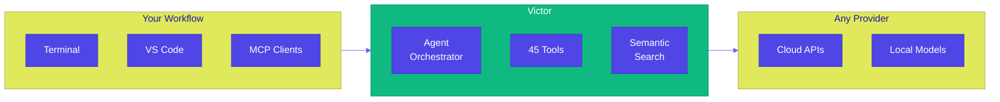
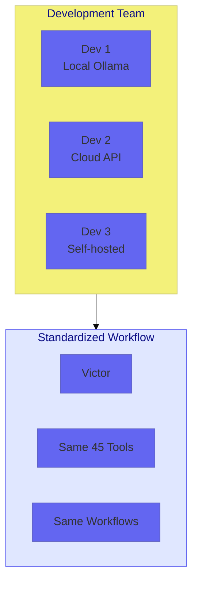
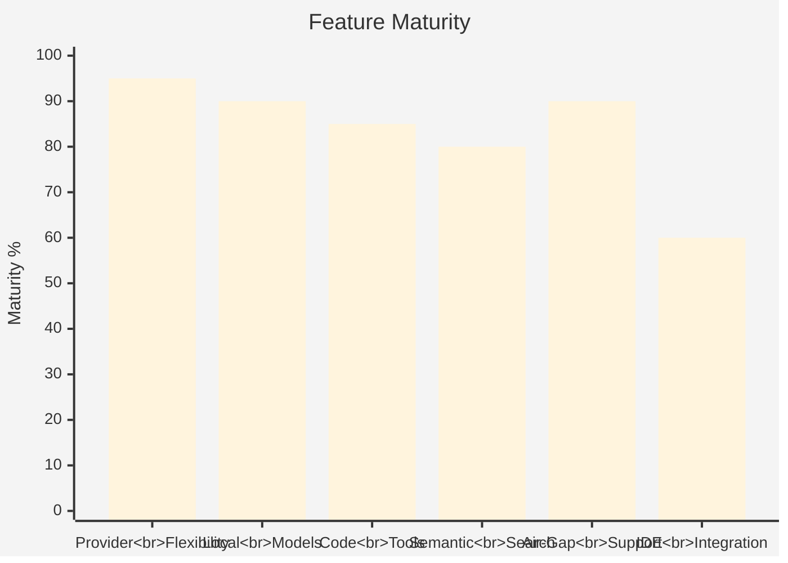
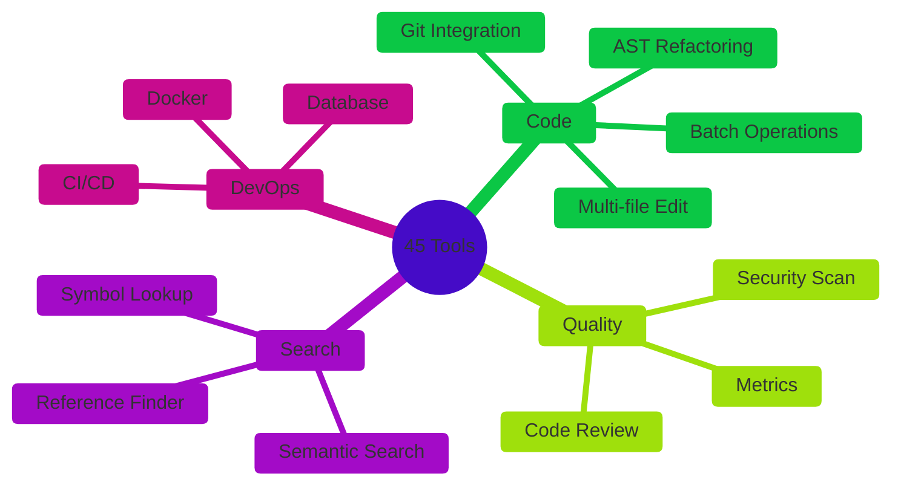
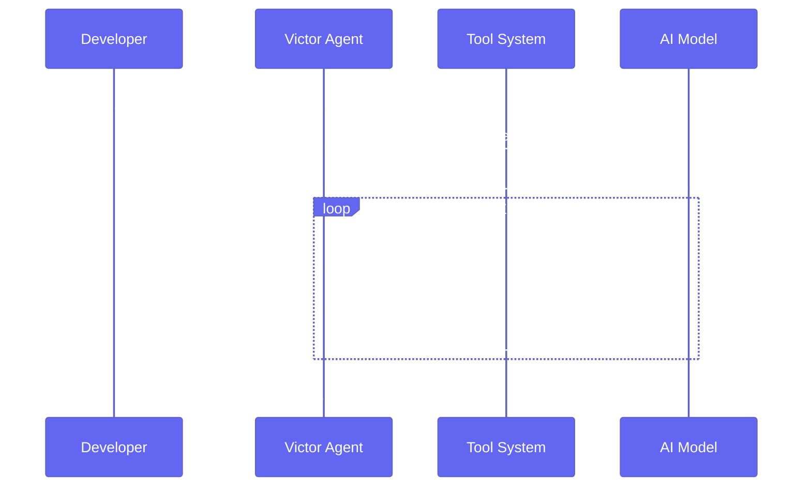

<div align="center">

# Victor

**Open Source AI Coding Assistant**

*Any model. Any provider. Your infrastructure.*

[](https://www.python.org/downloads/)
[](LICENSE)
[](https://www.docker.com/)

[Quick Start](#quick-start) • [Use Cases](#use-cases) • [Features](#features) • [Documentation](#documentation)

</div>

---

## What is Victor?

Victor is a terminal-based AI coding assistant that works with **any LLM provider**—cloud or local. Unlike single-vendor tools, Victor lets you switch models without changing your workflow.



---

## Quick Start

```bash
# Install
pip install victor

# Initialize and start
victor init
victor chat
```

**Common CLI overrides**

```bash
# Pick a provider/model directly (bypasses profiles.yaml)
victor chat --provider ollama --model qwen3-coder:30b --endpoint http://localhost:11434

# Switch output renderer (auto|rich|rich-text|text); text is best for debugging
victor chat --renderer text --log-level DEBUG "Hi"

# Set initial mode (build|plan|explore) and tighten budgets
victor chat --mode explore --tool-budget 20 --max-iterations 60
```

<details>
<summary><b>Local Model (Free, Private)</b></summary>

```bash
# Install Ollama from https://ollama.ai
ollama pull qwen2.5-coder:32b
victor chat
```
</details>

<details>
<summary><b>Cloud Provider</b></summary>

```bash
export ANTHROPIC_API_KEY="your-key"  # or OPENAI_API_KEY, etc.
victor chat --provider anthropic --model claude-sonnet-4-5
```
</details>

---

## Use Cases

Victor addresses three primary scenarios where existing AI coding tools fall short:

### 1. Developer Productivity

Multi-file operations, semantic code search, and automated refactoring—all through natural language.

```
$ victor chat

You > Rename UserManager to AccountService across the codebase

Victor > Found 47 references across 12 files. Applying changes...

[✓] Renamed class definition in auth/manager.py
[✓] Updated 23 imports
[✓] Updated 24 usages
[✓] Tests passing
```

### 2. Team Standardization

Consistent tooling regardless of individual model preferences. Teams can standardize on Victor while developers choose their preferred AI backend.



### 3. Regulated Environments

100% air-gapped operation with local models and embeddings. No external network calls.

| Requirement | Victor Capability |
|------------|-------------------|
| Data stays on-premises | Local model execution via Ollama/vLLM |
| No cloud dependencies | Local embeddings (sentence-transformers) |
| Audit logging | Built-in compliance logging |
| Container deployment | Official Docker images |

---

## Capabilities Comparison

How Victor compares to typical AI coding assistants:



| Capability | Victor | Typical AI Tool |
|------------|--------|-----------------|
| **Provider Lock-in** | None (25+ providers) | Single vendor |
| **Local Model Support** | Full (Ollama, vLLM, LMStudio) | Limited or none |
| **Air-Gapped Mode** | Complete | Not available |
| **Tool Extensibility** | 46 built-in + plugins | Fixed toolset |
| **Code Privacy** | Your infrastructure | Vendor cloud |
| **Open Source** | Apache 2.0 | Proprietary |

---

## Features

### Provider Support

Works with cloud APIs and local inference engines:

| Type | Providers | Cost |
|------|-----------|------|
| **Cloud** | Anthropic, OpenAI, Google, xAI, DeepSeek, Groq, Mistral, Together | Varies |
| **Local** | Ollama (100+ models), LMStudio, vLLM | Free |

### Built-in Tools

45 tools organized by function:



### Semantic Code Search

Local embedding-based search with multi-language support:

- **10 languages**: Python, TypeScript, JavaScript, Go, Rust, Java, C, HTML, JSON, YAML
- **AST parsing**: Tree-sitter for accurate symbol extraction
- **Incremental indexing**: Only re-embeds changed files
- **Sub-100ms search**: Vector similarity on local embeddings

---

## Architecture



---

## Installation

| Method | Command | Notes |
|--------|---------|-------|
| **pip** | `pip install victor` | Recommended |
| **pipx** | `pipx install victor` | Isolated environment |
| **Docker** | `docker run vijayksingh/victor` | Containerized |
| **Source** | `pip install -e ".[dev]"` | Development |

See [Installation Guide](docs/guides/INSTALLATION.md) for details.

---

## Documentation

| Document | Description |
|----------|-------------|
| [Quick Start](docs/guides/QUICKSTART.md) | First steps |
| [User Guide](docs/USER_GUIDE.md) | Complete usage |
| [Tool Catalog](docs/TOOL_CATALOG.md) | All 45 tools |
| [Air-Gapped Mode](docs/embeddings/AIRGAPPED.md) | Offline operation |
| [Provider Setup](docs/guides/PROVIDER_SETUP.md) | Configure providers |
| [Graph Backends](docs/guides/GRAPH_BACKENDS.md) | Configure/extend code graph storage |
| [Developer Guide](docs/DEVELOPER_GUIDE.md) | Contributing |

---

## Graph Store

- Default: embedded SQLite per project at `.victor/graph/graph.db`.
- Configure via settings (`codebase_graph_store`, `codebase_graph_path`) or `VICTOR_GRAPH_STORE`.
- Optional DuckDB backend (`codebase_graph_store=duckdb`, requires `duckdb` installed); in-memory backend available for testing.
- Registry is ready for LanceDB/Neo4j placeholders; extend `victor/codebase/graph/registry.py` to plug additional backends.

---

## Project Status

Victor is in active development. Core functionality is stable.

| Component | Status |
|-----------|--------|
| Agent Orchestrator | Stable |
| 45 Tools | Stable |
| 25+ Providers | Stable |
| Semantic Search | Stable |
| VS Code Extension | Beta |
| Test Generation | In Progress |

---

## Contributing

```bash
git clone https://github.com/vijayksingh/victor.git
cd victor
pip install -e ".[dev]"
pytest
```

See [CONTRIBUTING.md](CONTRIBUTING.md) for guidelines.

---

## License

Apache License 2.0 - See [LICENSE](LICENSE)

---

<div align="center">

**Open source. Provider agnostic. Privacy first.**

[Documentation](#documentation) • [GitHub](https://github.com/vijayksingh/victor)

</div>
