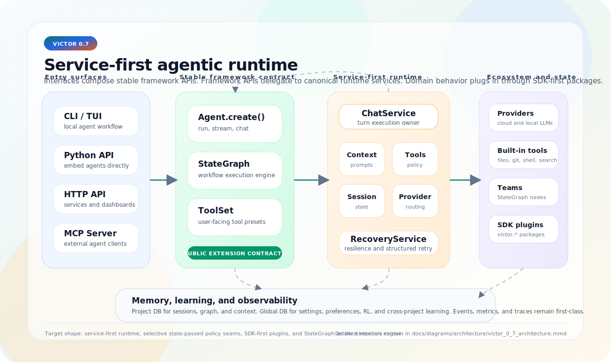

<div align="center">

# Victor

**An contract-first agentic AI framework for building reliable agents across local and cloud models.**

[](https://pypi.org/project/victor-ai/)
[](https://www.python.org/downloads/)
[](https://github.com/vjsingh1984/victor/actions/workflows/ci-fast.yml)
[](https://github.com/vjsingh1984/victor/actions/workflows/ci-test.yml)
[](LICENSE)
[](https://ghcr.io/vjsingh1984/victor)

</div>

---

Victor gives you a typed Python framework, a service-first agent runtime, and an contract-first plugin ecosystem for building agents that can reason, call tools, run workflows, coordinate teams, and operate against project-local code intelligence.

It is designed for teams that need agent systems to be testable, extensible, observable, and portable across Anthropic, OpenAI-compatible providers, Gemini, Bedrock, local models, and air-gapped environments.

## Why Victor

| Capability | What it gives you |
|------------|-------------------|
| **Service-first runtime** | Chat, tools, sessions, context, provider routing, and recovery are owned by focused runtime services instead of a monolithic orchestrator. |
| **StateGraph workflows** | Build typed graph workflows and use teams as graph nodes without inventing a separate multi-agent graph abstraction. |
| **Local and cloud models** | Use cloud providers for capability, local providers for privacy/cost, and provider-specific caching strategies for performance. |
| **Tool-rich execution** | Compose filesystem, git, shell, code search, graph, verification, Docker, web, testing, and refactoring tools. |
| **contract-first plugins** | Put domain behavior in sibling `victor-*` packages through `victor-contracts` and public framework extension contracts. |
| **Project code intelligence** | Keep graph indexes, semantic search, conversations, and project memory in project-local state. |

## Quick Start

| Path | Commands | Best for |
|------|----------|----------|
| Local model | `pipx install victor-ai`<br>`ollama pull qwen2.5-coder:7b`<br>`victor chat "Explain this repo"` | Private, low-cost, air-gapped work |
| Cloud model | `pipx install victor-ai`<br>`export ANTHROPIC_API_KEY=...`<br>`victor chat --provider anthropic "Plan this refactor"` | Highest model capability |
| Python API | `pip install victor-ai` | Embedding Victor in applications |
| Docker | `docker pull ghcr.io/vjsingh1984/victor:latest` | Isolated CLI/API runtime |

## Give Your Agent Durable Memory

Victor pairs with [ProximaDB](https://github.com/vjsingh1984/proximaDB) — a multi-model
(vector + graph + document) context database by the same author — as its durable memory
layer. Index any repository with the shared [`victor-codegraph`](victor-codegraph/)
chunker and get semantic recall ("where do we validate JWTs?") plus call-graph queries
("who calls `parse_jwt`?") that persist across sessions:

**[Quickstart: Durable Code Memory with ProximaDB](docs/quickstart-proximadb-memory.md)** — Docker + two `pip install`s, ~10 minutes.

Victor's embedded ProximaDB backends for project code intelligence are in-tree and
flag-gated (SQLite/LanceDB remain the defaults); the conversational-memory backend is in
progress — see [ProximaDB as the CCG Backend](docs/architecture/proximadb-codegraph-backend.md).

## Python API

```python
from victor.framework import Agent, EventType, ToolSet

agent = await Agent.create(
    provider="anthropic",
    tools=ToolSet.default(),
)

result = await agent.run("Explain the architecture of this codebase")
print(result.content)

async for event in agent.stream("Review the changed files"):
    if event.type == EventType.CONTENT:
        print(event.content, end="")
```

## StateGraph Workflows

```python
from typing import TypedDict

from victor.framework import END, StateGraph


class ReviewState(TypedDict):
    query: str
    findings: list[str]


async def inspect(state: ReviewState) -> ReviewState:
    return {**state, "findings": ["example finding"]}


graph = StateGraph(ReviewState)
graph.add_node("inspect", inspect)
graph.add_edge("inspect", END)

result = await graph.compile().invoke({"query": "review this module", "findings": []})
```

## Architecture

The core rule is simple: interfaces compose framework APIs, framework APIs delegate to the service-first runtime, and domain packages plug in through SDK/public extension contracts.



Victor 0.7 makes the framework/plugin split explicit:

- `victor.framework` is the stable public contract for agents, tools, StateGraph, workflows, events, and extension surfaces.
- `victor.agent` is the internal runtime implementation behind that contract.
- `victor.agent.services` owns effectful runtime behavior through `ChatService`, `ToolService`, `SessionService`, `ContextService`, `ProviderService`, and `RecoveryService`.
- `victor-contracts` is the definition-layer contract for external verticals and plugins.
- Sibling `victor-*` packages own domain behavior such as coding, DevOps, RAG, research, data analysis, and investment workflows.

Detailed references:

- [Architecture overview](ARCHITECTURE.md)
- [Internal architecture diagram](docs/diagrams/architecture/victor_0_7_architecture.mmd)
- [contracts boundary](docs/architecture/CONTRACTS_BOUNDARY.md)
- [State-passed architecture](docs/architecture/state-passed-architecture.md)

## Plugin Ecosystem

External and first-party domain packages should use `victor-contracts` and public framework extension contracts. The root framework stays generic; domain-specific behavior belongs in plugins and vertical packages.

| Package | Focus |
|---------|-------|
| `victor-coding` | Code review, editing, test generation, language tooling |
| `victor-devops` | Infrastructure, containers, CI/CD, cloud operations |
| `victor-rag` | Ingestion, retrieval, hybrid search, grounded answers |
| `victor-dataanalysis` | Data cleaning, statistics, dataframe analysis, visualization |
| `victor-research` | Source research, synthesis, fact checking |
| `victor-invest` | Investment research workflows and dashboard/API integration |
| `victor-registry` | Package marketplace and registry metadata |

Plugin rules:

- Use the `victor.plugins` entry point as the canonical discovery seam.
- Register capabilities through `VictorPlugin.register(context)`.
- Import from `victor_contracts`, `victor.framework.extensions`, or documented public APIs.
- Do not import `victor.agent.*` or private root runtime internals from external packages.

## Use Cases

- Build local or cloud-backed coding agents that can inspect files, search graphs, run tests, and produce review findings.
- Compose workflow agents with typed StateGraph nodes, deterministic handoffs, and resumable execution.
- Run tool-using assistants through CLI, TUI, HTTP API, MCP, or embedded Python.
- Build domain plugins without copying framework internals into vertical packages.
- Keep project code intelligence local while preserving global preferences, learning, and provider settings separately.

## State and Code Intelligence

Victor uses a two-database model:

| Scope | Location | Purpose |
|-------|----------|---------|
| Global database | `~/.victor/victor.db` | Settings, API keys, profiles, RL outcomes, tool/model preferences, cross-project patterns |
| Project database | `./.victor/project.db` | Graph nodes/edges, conversations, project sessions, entity memory, change tracking |

Project code intelligence is derived, rebuildable state. Graph indexes, vector indexes, file watcher state, and `.victor/` runtime artifacts should not become source-of-truth release artifacts.

## Development

```bash
python -m venv .venv
source .venv/bin/activate
# victor-contracts first so victor-ai resolves the in-repo SDK, not PyPI
pip install -e ./victor-contracts -e ".[dev]"

make test-quick
make test
make lint
make check-repo-hygiene
```

Subprojects are scoped:

```bash
npm --prefix vscode-victor run compile
cd rust && cargo test
```

## Documentation

- [Getting Started](docs/getting-started/)
- [Durable Code Memory with ProximaDB](docs/quickstart-proximadb-memory.md)
- [Guides](docs/guides/)
- [Reference](docs/reference/)
- [Operations](docs/operations/)
- [Development](docs/development/)
- [Architecture](ARCHITECTURE.md)
- [Roadmap](roadmap.md)

## Contributing

Start with [CONTRIBUTING.md](CONTRIBUTING.md), [AGENTS.md](AGENTS.md), and the architecture constraints in [CLAUDE.md](CLAUDE.md) or [GEMINI.md](GEMINI.md). Keep changes scoped, prefer public framework/SDK contracts over internal imports, and update docs/tests when public behavior changes.

## License

Apache License 2.0. See [LICENSE](LICENSE).
