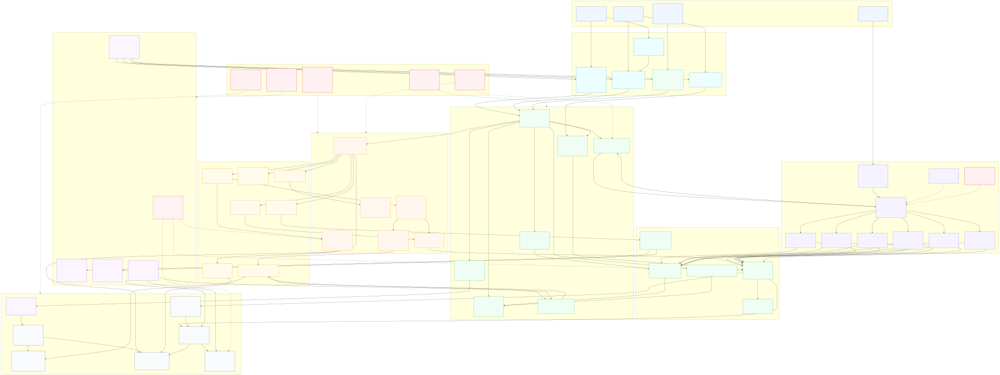

<div align="center">

# Victor

**SDK-first agentic AI framework for building, orchestrating, extending, and operating agents across local and cloud models.**

[](https://pypi.org/project/victor-ai/)
[](https://www.python.org/downloads/)
[](LICENSE)
[](https://github.com/vjsingh1984/victor/actions/workflows/test.yml)
[](https://ghcr.io/vjsingh1984/victor)

</div>

---

## What Victor is

Victor is an open-source Python framework and runtime for agentic systems. It provides:

- A public framework API for agents, tools, StateGraph workflows, streaming events, and teams.
- A service-first agent runtime that coordinates chat, tools, sessions, context, providers, and recovery.
- A provider layer for cloud and local LLMs, including air-gapped/local-model operation.
- A tool and workflow system for filesystem, git, shell, code search, graph, verification, web, Docker, testing, and refactoring tasks.
- An SDK-first plugin/vertical ecosystem for domain packages such as coding, DevOps, RAG, research, data analysis, and investment research.
- Project-local code intelligence through graph indexes, embeddings, semantic search, and verification tooling.

Victor 0.7 is focused on making the framework/plugin split explicit: the root repo owns reusable runtime and public contracts, while first-party domain behavior lives in sibling `victor-*` packages built against `victor-sdk` and public extension surfaces.

## Quick start

| Path | Commands | Best for |
|------|----------|----------|
| Local model | `pipx install victor-ai`<br>`ollama pull qwen2.5-coder:7b`<br>`victor chat "Explain this repo"` | Privacy, low cost, air-gapped work |
| Cloud model | `pipx install victor-ai`<br>`export ANTHROPIC_API_KEY=...`<br>`victor chat --provider anthropic "Plan this refactor"` | Maximum model capability |
| Python API | `pip install victor-ai` | Embedding Victor in applications |
| Docker | `docker pull ghcr.io/vjsingh1984/victor:latest` | Isolated CLI/API runtime |

## Python API

```python
from victor.framework import Agent, EventType, ToolSet

agent = await Agent.create(
    provider="anthropic",
    tools=ToolSet.default(),
)

result = await agent.run("Explain the architecture of this codebase")
print(result.content)

async for event in agent.stream("Review the changed files"):
    if event.type == EventType.CONTENT:
        print(event.content, end="")
```

## StateGraph workflows

```python
from typing import TypedDict
from victor.framework import END, StateGraph

class ReviewState(TypedDict):
    query: str
    findings: list[str]

async def inspect(state: ReviewState) -> ReviewState:
    return {**state, "findings": ["example finding"]}

graph = StateGraph(ReviewState)
graph.add_node("inspect", inspect)
graph.add_edge("inspect", END)

result = await graph.compile().invoke({"query": "review this module", "findings": []})
```

## 0.7 architecture overview

The high-level rule is simple: interfaces compose framework APIs, framework APIs delegate to the service-first runtime, and domain packages plug in through SDK/public extension contracts.



Mermaid source: [docs/diagrams/architecture/victor_0_7_architecture.mmd](docs/diagrams/architecture/victor_0_7_architecture.mmd)

### Layering model

| Layer | Owns | Should not own |
|-------|------|----------------|
| `victor/framework/` | Public Agent, StateGraph, ToolSet, WorkflowEngine, events, extension contracts | Domain-specific behavior for one vertical |
| `victor/agent/` | Internal orchestration and service composition | New public APIs or surface-specific branching |
| `victor/agent/services/` | Effectful runtime behavior for chat, tools, sessions, context, providers, recovery | Compatibility-only facade logic |
| `victor/tools/` | Reusable tool implementations and verification/search tools | Agent orchestration policy that belongs in services |
| `victor/providers/` | Cloud/local provider adapters, retries, circuit breakers, rate-limit behavior | Tool or workflow semantics |
| `victor/workflows/` | YAML/programmatic workflow compilation and execution | Separate multi-agent graph engines |
| `victor/teams/` | Team formations as StateGraph nodes | Wrapper graph abstractions per formation |
| `victor-sdk/` | Definition-layer plugin and vertical contracts | Root runtime internals |
| Sibling `victor-*` repos | Domain verticals/plugins and package-specific tools/workflows | Root framework internals or copied core runtime code |

### Framework and agent relationship

`victor.framework` is the public contract. `victor.agent` is the internal runtime implementation behind that contract. The framework layer exposes stable APIs such as `Agent.create()`, `Agent.run()`, `Agent.stream()`, `StateGraph`, `ToolSet`, and extension contracts. The agent layer performs turn execution, tool orchestration, context assembly, provider routing, and recovery through canonical services.

The desired direction is service-first:

- `ChatService` owns chat turn execution.
- `ToolService` owns tool policy, access, budgets, batching, and execution statistics.
- `SessionService` owns session state.
- `ContextService` owns prompt/context assembly seams.
- `ProviderService` owns provider routing and resilience.
- `RecoveryService` owns structured recovery.
- `AgentOrchestrator` remains a compatibility/composition root, not a place for new business logic.

## SDK-first plugin ecosystem

External and first-party vertical packages should use `victor-sdk` and public framework extension contracts:

- `victor-coding`: coding, review, editing, test generation, language tooling.
- `victor-devops`: infrastructure, containers, CI/CD, cloud operations.
- `victor-rag`: ingestion, retrieval, hybrid search, grounded answers.
- `victor-dataanalysis`: data cleaning, statistics, dataframe analysis, visualization.
- `victor-research`: web/source research, synthesis, fact checking.
- `victor-invest`: investment research workflows and dashboard/API integration.
- `victor-registry`: package marketplace/index metadata.

Plugin rules for 0.7:

- Use the `victor.plugins` entry point as the canonical discovery seam.
- Implement `VictorPlugin.register(context)` and register verticals/capabilities there.
- Import from `victor_sdk`, `victor.framework.extensions`, or documented public APIs.
- Do not import `victor.agent.*`, private loader internals, or root-only runtime services from external packages.
- Treat legacy `victor.verticals` entry points and in-repo contrib verticals as compatibility paths only.

## Code intelligence and verification

Victor keeps user-wide and project-specific state separate:

| Scope | Location | Purpose |
|-------|----------|---------|
| Global database | `~/.victor/victor.db` | Settings, API keys, profiles, RL outcomes, tool/model preferences, cross-project patterns |
| Project database | `./.victor/project.db` | Graph nodes/edges, conversations, project sessions, entity memory, change tracking |

Project code intelligence is derived, rebuildable state. Graph indexes, vector indexes, file watcher state, and `.victor/` runtime artifacts should not become source-of-truth release artifacts.

The verification toolchain under `victor/tools/verification/` handles semantic claim validation, documentation cross-references, false-positive detection, severity weighting, temporal analysis, and report generation.

## Deployment and resource efficiency guidance

- Use local providers and KV prefix caching for privacy-sensitive or cost-sensitive workloads.
- Use cloud provider prompt caching where available for long, stable system prompts.
- Keep optional heavy dependencies optional: embeddings, LanceDB, browser/frontends, native Rust extensions, and async SQLite helpers should fail soft unless explicitly requested.
- Prefer project-local graph/vector rebuilds over global mutable indexes.
- Run only the interface you need: CLI for interactive work, MCP for tool integration, HTTP API for service integration, Python API for embedding.
- Keep Docker/network/sandbox defaults conservative because they define the operational security boundary.

## Static architecture review notes for 0.7

A release-prep static survey of the root repo, SDK, and sibling plugin repos found these improvement areas:

| Area | Observation | Recommended direction |
|------|-------------|-----------------------|
| Large modules | Several files remain very large, including orchestrator, conversation store, code search, graph tool, tool pipeline, chat command, and unified team coordinator. | Continue extracting effectful behavior into canonical services and narrow protocols. Avoid adding new responsibilities to these files. |
| Layering leaks | Some framework, tools, workflows, integrations, and UI modules still import selected `victor.agent` internals. | Promote stable contracts upward into `victor.framework`, `victor.framework.extensions`, or `victor-sdk`; keep `victor.agent` internal. |
| Generic duplicate names | Many modules use generic names such as `base.py`, `registry.py`, `protocols.py`, `context.py`, and `manager.py` across layers. | Keep package-local names where stable, but prefer more specific names for new modules to make ownership clearer. |
| Plugin/runtime split | Sibling packages have mostly migrated toward `victor.plugins` and SDK-first imports, but dependency ranges and optional runtime dependencies vary. | Keep root `victor-ai` and `victor-sdk` compatibility ranges aligned and add contract checks before release. |
| Optional dependencies | Embeddings, LanceDB, native Rust, aiosqlite, and frontend/browser tooling are valuable but resource-heavy. | Preserve graceful degradation and avoid importing heavy optional dependencies at module import time. |
| Generated state | `.victor/`, `dist/`, `build/`, cache folders, benchmark output, graph/vector indexes, and generated docs exist across root and sibling repos. | Keep generated/runtime state out of hand-edited docs, package metadata, and release source artifacts. |

## Development commands

```bash
python -m venv .venv
source .venv/bin/activate
pip install -e ".[dev]"

make test-quick
make test
make lint
make check-repo-hygiene
make docs
```

Frontend and native subprojects are scoped:

```bash
npm --prefix ui run build
npm --prefix web/ui run build
npm --prefix vscode-victor run compile
cd rust && cargo test
```

## Documentation

- [Getting Started](docs/getting-started/)
- [Guides](docs/guides/)
- [Reference](docs/reference/)
- [Operations](docs/operations/)
- [Development](docs/development/)
- [Architecture](ARCHITECTURE.md)
- [Roadmap](roadmap.md)

## Contributing

Start with [CONTRIBUTING.md](CONTRIBUTING.md), [AGENTS.md](AGENTS.md), and the architecture constraints in [CLAUDE.md](CLAUDE.md) or [GEMINI.md](GEMINI.md). Keep changes scoped, prefer public framework/SDK contracts over internal imports, and update docs/tests when public behavior changes.

## License

Apache License 2.0. See [LICENSE](LICENSE).
