<div align="center">

# Victor

**Enterprise-Ready AI Coding Assistant**

*Use any AI model. Keep your code private. Ship faster.*

[](https://www.python.org/downloads/)
[](LICENSE)
[](https://www.docker.com/)
[](CONTRIBUTING.md)

[Quick Start](#quick-start) • [Features](#features) • [Documentation](#documentation) • [Contributing](#contributing)

</div>

---

## Why Victor?

The AI landscape changes weekly. Claude Opus 4.5, GPT-5, Gemini 3—each claiming "best for coding." If your tooling locks you into one provider, you're always one release behind.

**Victor is provider-agnostic by design.** Add a new model, keep your workflows.

```mermaid
%%{init: {'theme': 'base', 'themeVariables': { 'primaryColor': '#4F46E5', 'primaryTextColor': '#fff', 'primaryBorderColor': '#4338CA', 'lineColor': '#6366F1', 'secondaryColor': '#E0E7FF', 'tertiaryColor': '#EEF2FF'}}}%%
flowchart TB
    subgraph YOU["🧑‍💻 YOU"]
        direction LR
        Terminal["Terminal"]
        IDE["VS Code"]
        MCP["Claude Desktop"]
    end

    subgraph VICTOR["⚡ VICTOR"]
        direction TB
        Orchestrator["Agent Orchestrator"]
        Tools["46 Enterprise Tools"]
        Search["Semantic Search"]
    end

    subgraph PROVIDERS["🤖 ANY AI PROVIDER"]
        direction LR
        Claude["Claude"]
        GPT["GPT"]
        Gemini["Gemini"]
        Ollama["Ollama"]
        Local["Local Models"]
    end

    YOU --> VICTOR
    VICTOR --> PROVIDERS

    style YOU fill:#4F46E5,stroke:#4338CA,color:#fff
    style VICTOR fill:#10B981,stroke:#059669,color:#fff
    style PROVIDERS fill:#F59E0B,stroke:#D97706,color:#fff
```



| What You Get | Why It Matters |
|--------------|----------------|
| **25+ LLM Providers** | Claude, GPT, Gemini, Grok, Groq, DeepSeek, Mistral, Together, Ollama, LMStudio + more |
| **46 Enterprise Tools** | Git, refactoring, security scanning, batch ops—all work with any model |
| **100% Air-Gapped Option** | Local embeddings, local models, zero network calls |
| **Apache 2.0 License** | Truly open source, safe for commercial use |

---

## Quick Start

### One-Line Install

**macOS / Linux:**
```bash
curl -fsSL https://raw.githubusercontent.com/vijayksingh/victor/main/scripts/install/install.sh | bash
```

**Windows (PowerShell):**
```powershell
iwr -useb https://raw.githubusercontent.com/vijayksingh/victor/main/scripts/install/install.ps1 | iex
```

**Or with pip:**
```bash
pip install victor
victor init
victor chat
```

### Configure a Provider

<details open>
<summary><b>🖥️ Local Model (Free, Private)</b></summary>

```bash
# Install Ollama from https://ollama.ai
ollama pull qwen2.5-coder:32b

# Start Victor
victor chat
```
</details>

<details>
<summary><b>☁️ Cloud Provider (Claude/GPT/Gemini)</b></summary>

```bash
export ANTHROPIC_API_KEY="your-key"
victor chat --provider anthropic --model claude-sonnet-4-5
```
</details>

### Your First Session

```
$ victor chat

You > Create a FastAPI app with JWT authentication

Victor > I'll create a production-ready FastAPI application...

[✓] Created project structure
[✓] Generated auth endpoints
[✓] Added JWT handling
[✓] Created tests

You > Run the tests

[✓] All 12 tests passed!
```

---

## How It Works

```mermaid
%%{init: {'theme': 'base', 'themeVariables': { 'primaryColor': '#6366F1', 'primaryTextColor': '#fff', 'primaryBorderColor': '#4F46E5', 'lineColor': '#A5B4FC', 'secondaryColor': '#E0E7FF'}}}%%
sequenceDiagram
    participant You as 👤 You
    participant Victor as ⚡ Victor
    participant Tools as 🔧 Tools
    participant AI as 🤖 AI Model

    You->>Victor: "Add authentication to my API"
    Victor->>AI: Analyze request + context
    AI-->>Victor: Plan: create auth module

    loop Tool Execution
        Victor->>Tools: Execute (create files, run tests)
        Tools-->>Victor: Results
        Victor->>AI: Update with results
        AI-->>Victor: Next steps
    end

    Victor-->>You: ✅ Authentication added!
```



---

## Features

### 🎨 Modern Terminal UI

Rich text interface with streaming, syntax highlighting, and real-time tool feedback. Use `--no-tui` for traditional CLI output.

### 🔌 Universal Provider Support


| Provider | Models | Local | Cost |
|----------|--------|-------|------|
| Anthropic | Claude Opus 4.5, Sonnet, Haiku | No | $$$ |
| OpenAI | GPT-4o, GPT-4 | No | $$$ |
| Google | Gemini 2.5 Pro/Flash | No | $$ |
| xAI | Grok 2, Grok 3 | No | $$ |
| DeepSeek | DeepSeek-V3, R1 | No | $ |
| Groq | Llama, Mixtral (ultra-fast) | No | **Free tier** |
| Mistral | Mistral Large, Codestral | No | $ |
| Together | 100+ open models | No | $ |
| **Ollama** | Qwen3, Llama, DeepSeek, +100 | **Yes** | **Free** |
| **LMStudio** | Any GGUF model | **Yes** | **Free** |
| **vLLM** | Any HuggingFace model | **Yes** | **Free** |

See [Provider Setup Guide](docs/guides/PROVIDER_SETUP.md) for complete list of 25+ providers.

### 🛠️ Enterprise Tools


<details>
<summary><b>View all 46 tools by category</b></summary>

**Code Management:** Multi-file editor, batch processor, refactoring engine, git integration

**Code Quality:** Code review, security scanner, complexity metrics, semantic search

**Testing:** Test runner, CI/CD generation (GitHub Actions, more coming)

**Documentation:** Docstring generator, API docs

**Development:** Database tools, Docker, HTTP/API testing, web search, scaffolding

See [Tool Catalog](docs/TOOL_CATALOG.md) for the complete list.
</details>

### 🔍 Semantic Code Search

Intelligent codebase indexing with multi-language support, running 100% locally:

```mermaid
%%{init: {'theme': 'base', 'themeVariables': { 'primaryColor': '#06B6D4'}}}%%
flowchart LR
    subgraph Input["📁 Your Code"]
        Files["Python, TS, Go<br/>Rust, Java +5"]
    end

    subgraph Process["⚡ Indexing"]
        AST["Tree-sitter<br/>+ Python AST"]
        Chunk["Smart<br/>Chunking"]
        Embed["Local<br/>Embeddings"]
    end

    subgraph Output["🎯 Results"]
        Vector["Vector<br/>Store"]
        Search["< 100ms<br/>Search"]
    end

    Files --> AST --> Chunk --> Embed --> Vector --> Search

    style Input fill:#FEF3C7,stroke:#F59E0B
    style Process fill:#DBEAFE,stroke:#3B82F6
    style Output fill:#D1FAE5,stroke:#10B981
```



- **10 languages supported** via tree-sitter: Python, TypeScript, JavaScript, Go, Rust, Java, C, HTML, JSON, YAML
- **Python AST with regex fallback** for imperfect codebases with syntax errors
- **Smart chunking** that respects function boundaries
- **6 metadata filters** (symbol type, visibility, language, test files, docstrings)
- **Incremental updates** (only re-embeds changed files)
- **Architecture pattern detection** (providers, services, repositories, controllers)

### 🔒 Security & Privacy

```mermaid
%%{init: {'theme': 'base', 'themeVariables': { 'primaryColor': '#EF4444'}}}%%
flowchart TB
    subgraph Security["🛡️ Security Features"]
        Air["Air-Gapped Mode<br/>100% Offline"]
        Secrets["Secret Detection<br/>12+ Patterns"]
        Sandbox["Sandboxed Execution<br/>Docker Isolated"]
        Isolated["Project Isolation<br/>Data Stays Local"]
    end

    style Security fill:#FEE2E2,stroke:#EF4444
```



---

## 📊 Benchmark Results

Victor includes an evaluation harness using HumanEval. Full results: [Benchmark Evaluation](docs/BENCHMARK_EVALUATION.md)


| Model | Pass@1 | Cost |
|-------|--------|------|
| Claude Sonnet 4.5 | **93.9%** | $$$ |
| gpt-oss (local) | 88.4% | Free |
| qwen2.5-coder:32b | 86.6% | Free |
| Claude Haiku | 81.1% | $ |

> **💡 Key insight:** Best local model delivers 94% of Claude's performance at zero cost.

---

## 📦 Installation Options

| Method | Command | Best For |
|--------|---------|----------|
| **pip** | `pip install victor` | Most users |
| **pipx** | `pipx install victor` | Isolated install |
| **Docker** | `docker run vijayksingh/victor` | Containers, CI |
| **Homebrew** | `brew install vijayksingh/tap/victor` | macOS users |
| **Binary** | [Download](https://github.com/vijayksingh/victor/releases) | No Python needed |

See [Installation Guide](docs/guides/INSTALLATION.md) for detailed instructions.

---

## 📚 Documentation

| Guide | Description |
|-------|-------------|
| [Installation](docs/guides/INSTALLATION.md) | All installation methods |
| [Quick Start](docs/guides/QUICKSTART.md) | First steps with Victor |
| [User Guide](docs/USER_GUIDE.md) | Complete usage documentation |
| [Tool Catalog](docs/TOOL_CATALOG.md) | All 46 tools with examples |
| [Model Comparison](docs/MODEL_COMPARISON.md) | Ollama model benchmarks |
| [Air-Gapped Mode](docs/embeddings/AIRGAPPED.md) | Offline operation |
| [Docker Deployment](docker/README.md) | Container deployment |
| [Developer Guide](docs/DEVELOPER_GUIDE.md) | Contributing and architecture |
| [Releasing](docs/RELEASING.md) | Release process (maintainers) |

---

## 🚧 Project Status: Alpha

Victor is under active development. The core functionality works well, but some documented features are still being implemented.


**What works today:** 46 tools, 25+ providers, semantic search, TUI, Docker deployment

**In progress:** Test generation, coverage analysis, additional CI/CD platforms

See [Codebase Analysis Report](docs/CODEBASE_ANALYSIS_REPORT.md) for current status.

---

## 🤝 Contributing

We welcome contributions! Victor is community-driven and free forever.

```bash
# Clone and install
git clone https://github.com/vijayksingh/victor.git
cd victor
pip install -e ".[dev]"

# Run tests
pytest

# Submit your PR
```

See [CONTRIBUTING.md](CONTRIBUTING.md) for guidelines.

---

## 📄 License

Apache License 2.0 - See [LICENSE](LICENSE)

---

<div align="center">

### ⭐ Star us if Victor helps you code faster!

[](https://github.com/vijayksingh/victor)

**Made with ❤️ by developers, for developers**

[Get Started](#quick-start) • [Documentation](#documentation) • [Contribute](#contributing)

</div>
