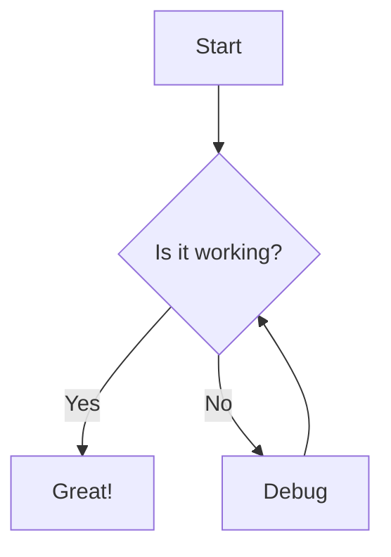
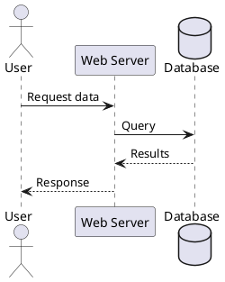
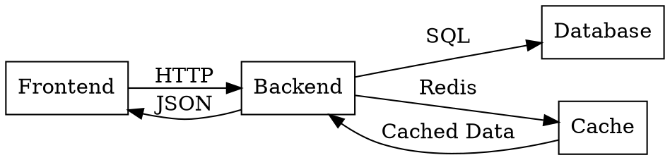
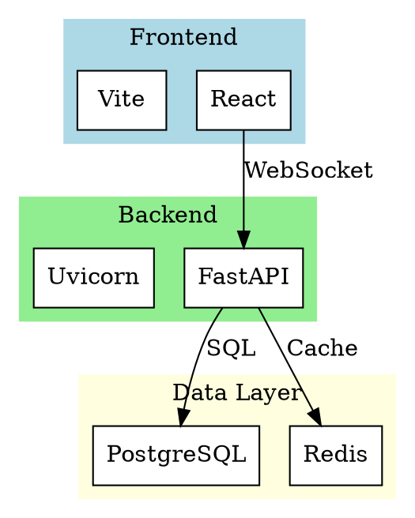
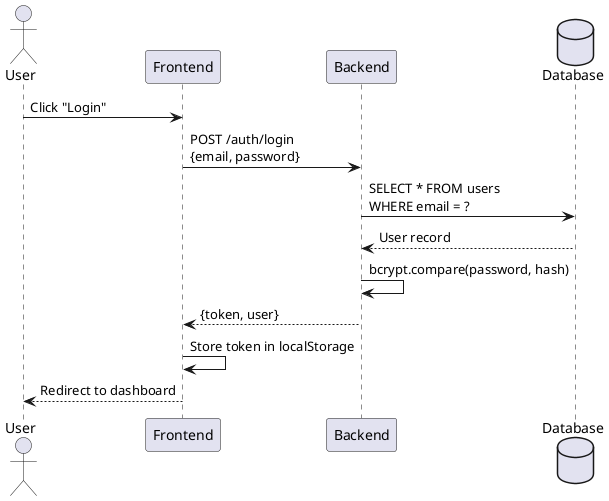
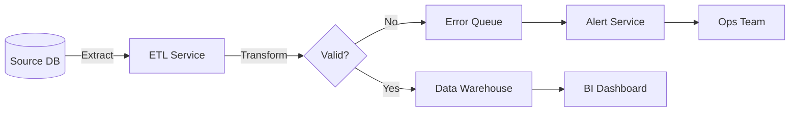

# Victor Rendering Capabilities

**Last Updated**: 2025-11-26
**Version**: 2.0.0

---

## Overview

Victor now supports comprehensive rendering of diagrams, documentation formats, and mathematical equations for a rich interactive experience. This document details all supported rendering capabilities, syntax, and installation requirements.

---

## Supported Rendering Formats

### Client-Side Rendering (Frontend)

Rendered directly in the browser without backend calls.

#### 1. **Mermaid Diagrams** ✅

**Package**: `mermaid@^10.9.3`
**Language**: `mermaid` or `diagram`
**Rendering**: Client-side (JavaScript)

**Supported Diagram Types**:
- Flowchart
- Sequence diagram
- Class diagram
- State diagram
- ER diagram
- Gantt chart
- Pie chart
- Journey diagram
- Quadrant diagram
- Requirement diagram
- Git graph
- Timeline
- Sankey diagram
- XY chart
- Block diagram

**Usage Example**:
````markdown

````

**Rendered Output**: Interactive SVG diagram with auto-layout

---

#### 2. **Mathematical Equations (KaTeX)** ✅ NEW

**Packages**:
- `katex@^0.16.11`
- `remark-math@^6.0.0`
- `rehype-katex@^7.0.0`

**Language**: Inline math `$...$` or block math `$$...$$`
**Rendering**: Client-side (CSS + JavaScript)

**Usage Example**:

Inline math:
```markdown
The quadratic formula is $x = \frac{-b \pm \sqrt{b^2-4ac}}{2a}$.
```

Block math:
```markdown
$$
\int_{-\infty}^{\infty} e^{-x^2} dx = \sqrt{\pi}
$$
```

**Rendered Output**: Beautiful typeset mathematics

**Supported Features**:
- Greek letters: `\alpha`, `\beta`, `\gamma`
- Fractions: `\frac{num}{den}`
- Integrals: `\int`, `\oint`, `\iint`
- Summations: `\sum`, `\prod`
- Matrices: `\begin{matrix}...\end{matrix}`
- Limits: `\lim_{x \to \infty}`
- And all standard LaTeX math commands

---

#### 3. **GitHub-Flavored Markdown** ✅

**Packages**:
- `react-markdown@^9.0.3`
- `remark-gfm@^4.0.0`

**Features**:
- Tables
- Strikethrough (`~~text~~`)
- Task lists (`- [ ]` / `- [x]`)
- Auto-linking URLs
- Syntax highlighting for code blocks

**Usage Example**:
```markdown
| Feature | Status |
|---------|--------|
| Tables  | ✅     |
| ~~Old~~ | ❌     |

- [x] Completed task
- [ ] Pending task
```

---

### Server-Side Rendering (Backend)

Rendered on the backend via CLI tools, returned as SVG to frontend.

#### 4. **PlantUML** ✅

**Endpoint**: `POST /render/plantuml`
**Language**: `plantuml`
**CLI Required**: `plantuml`
**Rendering**: Server-side → SVG

**Installation**:
```bash
# macOS
brew install plantuml

# Ubuntu/Debian
apt-get install plantuml

# Manual
curl -LO https://github.com/plantuml/plantuml/releases/download/v1.2024.0/plantuml.jar
```

**Usage Example**:
````markdown

````

**Supported Diagram Types**:
- Sequence diagrams
- Use case diagrams
- Class diagrams
- Activity diagrams
- Component diagrams
- State diagrams
- Object diagrams
- Deployment diagrams

---

#### 5. **Graphviz/DOT** ✅ NEW

**Endpoint**: `POST /render/graphviz?engine=dot`
**Languages**: `graphviz` or `dot`
**CLI Required**: `graphviz` (provides `dot`, `neato`, `fdp`, etc.)
**Rendering**: Server-side → SVG

**Installation**:
```bash
# macOS
brew install graphviz

# Ubuntu/Debian
apt-get install graphviz

# Windows (via Chocolatey)
choco install graphviz
```

**Engines Available**:
- `dot` - Hierarchical/layered graphs (default)
- `neato` - Spring model layouts
- `fdp` - Force-directed placement
- `circo` - Circular layout
- `twopi` - Radial layouts
- `sfdp` - Scalable force-directed (for large graphs)

**Usage Example**:
````markdown

````

**Use Cases**:
- Network topology diagrams
- Dependency graphs
- State machines
- Call graphs
- Organization charts
- Data flow diagrams

---

#### 6. **D2 Diagrams** ✅ NEW

**Endpoint**: `POST /render/d2`
**Language**: `d2`
**CLI Required**: `d2`
**Rendering**: Server-side → SVG

**Installation**:
```bash
# macOS/Linux/Windows
curl -fsSL https://d2lang.com/install.sh | sh -s --

# Or via package managers
brew install d2  # macOS
```

**Usage Example**:
````markdown
```d2
direction: right

Frontend: {
  shape: rectangle
  style.fill: "#e3f2fd"
}

Backend: {
  shape: rectangle
  style.fill: "#fff3e0"
}

Database: {
  shape: cylinder
  style.fill: "#ffebee"
}

Frontend -> Backend: "REST API"
Backend -> Database: "SQL Queries"
```
````

**Features**:
- Modern declarative syntax
- Auto-layout algorithms
- Built-in themes
- Icons and custom shapes
- Connections with labels
- Nested containers
- Markdown support in labels

**Use Cases**:
- Architecture diagrams
- System design docs
- Data flows
- Network diagrams
- Infrastructure as code visualization

---

#### 7. **Draw.io / Lucidchart** ✅

**Endpoint**: `POST /render/drawio`
**Languages**: `drawio`, `lucid`, `drawio-xml`
**CLI Required**: `drawio` CLI
**Rendering**: Server-side → SVG

**Installation**:
```bash
# macOS
brew install drawio

# Or download from https://github.com/jgraph/drawio-desktop/releases
```

**Usage Example**:
````markdown
```drawio
<mxfile host="app.diagrams.net">
  <diagram name="Page-1">
    <mxGraphModel>
      <root>
        <mxCell id="0"/>
        <mxCell id="1" parent="0"/>
        <mxCell id="2" value="Box 1" style="rounded=1" vertex="1" parent="1">
          <mxGeometry x="120" y="120" width="120" height="60" as="geometry"/>
        </mxCell>
      </root>
    </mxGraphModel>
  </diagram>
</mxfile>
```
````

**Use Cases**:
- Import existing Draw.io diagrams
- Complex visual diagrams
- Flowcharts with custom styling
- Network diagrams

---

#### 8. **AsciiDoc** ✅

**Package**: `@asciidoctor/core@^3.0.4`
**Languages**: `asciidoc` or `adoc`
**Rendering**: Client-side (JavaScript)

**Usage Example**:
````markdown
```asciidoc
= Document Title
Author Name <author@example.com>
v1.0, 2024-11-26

== Introduction

This is a paragraph with *bold* and _italic_ text.

.Image Title
image::diagram.png[alt text, width=300]

[source,python]
----
def hello():
    print("Hello, World!")
----
```
````

**Features**:
- Advanced formatting (admonitions, callouts)
- Table support
- Include directives
- Bibliography support
- Cross-references
- Footnotes

---

## Rendering Architecture

### Client-Side Flow

```
Markdown Message
    ↓
ReactMarkdown (with plugins)
    ↓
remark-gfm (tables, strikethrough)
remark-math (math detection)
    ↓
rehype-katex (math rendering)
    ↓
Custom CodeBlock Component
    ↓
Mermaid.render() or Asciidoctor.convert()
    ↓
Rendered HTML/SVG in DOM
```

### Server-Side Flow

```
Code Block (language: plantuml/graphviz/d2/drawio)
    ↓
Extract code content
    ↓
POST /render/{type}
    ↓
Backend CLI invocation (plantuml/dot/d2/drawio)
    ↓
SVG response
    ↓
Inject into DOM via dangerouslySetInnerHTML
```

---

## Backend API Endpoints

### Rendering Endpoints

| Endpoint | Method | Content-Type | Returns | CLI Required |
|----------|--------|--------------|---------|--------------|
| `/render/plantuml` | POST | text/plain | image/svg+xml | plantuml |
| `/render/mermaid` | POST | text/plain | image/svg+xml | mmdc |
| `/render/drawio` | POST | text/plain | image/svg+xml | drawio |
| `/render/graphviz` | POST | text/plain | image/svg+xml | dot, neato, etc. |
| `/render/d2` | POST | text/plain | image/svg+xml | d2 |

### Query Parameters

**Graphviz** supports `engine` query parameter:
```
POST /render/graphviz?engine=neato
```

---

## Installation Requirements

### Backend CLIs

**Required for full functionality**:

```bash
# PlantUML
brew install plantuml

# Mermaid CLI
npm install -g @mermaid-js/mermaid-cli

# Graphviz (NEW)
brew install graphviz

# D2 (NEW)
curl -fsSL https://d2lang.com/install.sh | sh -s --

# Draw.io (Optional)
brew install drawio
```

**Verification**:
```bash
plantuml -version
mmdc --version
dot -V
d2 --version
drawio --version
```

### Frontend Dependencies

**Automatic** via `npm install`:

```json
{
  "dependencies": {
    "mermaid": "^10.9.3",
    "@asciidoctor/core": "^3.0.4",
    "katex": "^0.16.11",
    "react-markdown": "^9.0.3",
    "remark-gfm": "^4.0.0",
    "remark-math": "^6.0.0",
    "rehype-katex": "^7.0.0"
  }
}
```

---

## Error Handling

### Client-Side Errors

When Mermaid or AsciiDoc rendering fails:

```
┌──────────────────────────────────┐
│ ❌ Mermaid render error:         │
│ Syntax error in line 3           │
└──────────────────────────────────┘
```

### Server-Side Errors

When backend rendering fails (PlantUML, Graphviz, D2, Draw.io):

```
┌──────────────────────────────────┐
│ ❌ Graphviz render error:        │
│ dot not found. Install:          │
│ brew install graphviz (macOS)    │
│ apt-get install graphviz (Linux) │
└──────────────────────────────────┘
```

### Fallback Behavior

If rendering fails, Victor displays:
1. Error message with installation instructions
2. Original raw code block (for manual copying)
3. "View: Render / Raw" toggle to switch between modes

---

## Usage Examples

### Example 1: Technical Documentation with Math

````markdown
# Signal Processing

The Fourier transform of a signal $x(t)$ is defined as:

$$
X(f) = \int_{-\infty}^{\infty} x(t) e^{-j2\pi ft} dt
$$

This allows us to decompose signals into frequency components.

## Implementation

```python
import numpy as np

def fft(signal):
    return np.fft.fft(signal)
```
````

### Example 2: Architecture Diagram (Graphviz)

````markdown
# System Architecture


````

### Example 3: Modern Diagram (D2)

````markdown
# Deployment Architecture

```d2
direction: right

vpc: VPC {
  shape: rectangle
  style.stroke-dash: 3

  public_subnet: Public Subnet {
    style.fill: "#e3f2fd"
    lb: Load Balancer {
      shape: rectangle
      style.fill: "#bbdefb"
    }
  }

  private_subnet: Private Subnet {
    style.fill: "#fff3e0"
    app1: App Server 1 {
      shape: rectangle
      style.fill: "#ffe0b2"
    }
    app2: App Server 2 {
      shape: rectangle
      style.fill: "#ffe0b2"
    }
  }

  data_subnet: Data Subnet {
    style.fill: "#ffebee"
    db: Database {
      shape: cylinder
      style.fill: "#ffcdd2"
    }
  }
}

internet: Internet {
  shape: cloud
}

internet -> vpc.public_subnet.lb: "HTTPS"
vpc.public_subnet.lb -> vpc.private_subnet.app1
vpc.public_subnet.lb -> vpc.private_subnet.app2
vpc.private_subnet.app1 -> vpc.data_subnet.db
vpc.private_subnet.app2 -> vpc.data_subnet.db
```
````

### Example 4: Sequence Diagram (PlantUML)

````markdown
# Authentication Flow


````

### Example 5: Data Flow (Mermaid)

````markdown
# ETL Pipeline


````

---

## Performance Considerations

### Client-Side Rendering

**Pros**:
- ✅ No backend dependency
- ✅ Fast (no network latency)
- ✅ Works offline
- ✅ Reduces server load

**Cons**:
- ❌ Larger bundle size (Mermaid ~500KB)
- ❌ Browser compatibility concerns
- ❌ Initial load time

**Used for**: Mermaid, KaTeX, AsciiDoc, Markdown

### Server-Side Rendering

**Pros**:
- ✅ Smaller frontend bundle
- ✅ Consistent rendering (no browser variations)
- ✅ Can use powerful CLI tools
- ✅ Better for complex diagrams

**Cons**:
- ❌ Requires backend CLI installation
- ❌ Network latency (POST request)
- ❌ Doesn't work offline
- ❌ Server resource usage

**Used for**: PlantUML, Graphviz, D2, Draw.io

---

## Future Enhancements

### Planned Additions

#### 1. **Vega/Vega-Lite** (Data Visualization)
**Package**: `react-vega`
**Use Case**: Interactive charts and graphs from JSON specs

````markdown
```vega-lite
{
  "data": {"values": [...]},
  "mark": "bar",
  "encoding": {
    "x": {"field": "category", "type": "nominal"},
    "y": {"field": "value", "type": "quantitative"}
  }
}
```
````

#### 2. **Excalidraw** (Hand-Drawn Diagrams)
**Package**: `@excalidraw/excalidraw`
**Use Case**: Interactive hand-drawn style diagrams

#### 3. **BPMN.js** (Business Process Modeling)
**Package**: `bpmn-js`
**Use Case**: Business process diagrams (BPMN 2.0)

#### 4. **Nomnoml** (UML Diagrams)
**Language**: Simple text-based UML
**Use Case**: Quick UML class and activity diagrams

---

## Troubleshooting

### Issue: Mermaid diagram not rendering

**Symptoms**: Blank space or error message
**Solutions**:
1. Check syntax in [Mermaid Live Editor](https://mermaid.live/)
2. Verify Mermaid version compatibility
3. Check browser console for errors

### Issue: Math equations showing raw LaTeX

**Symptoms**: `$x^2$` displayed literally instead of rendered
**Solutions**:
1. Verify `katex.min.css` is loaded (check Network tab)
2. Ensure `remark-math` and `rehype-katex` are in ReactMarkdown plugins
3. Check for conflicting CSS styles

### Issue: Graphviz/PlantUML "not found" error

**Symptoms**: Error message about missing CLI tool
**Solutions**:
1. Install the required CLI: `brew install graphviz` or `brew install plantuml`
2. Verify installation: `dot -V` or `plantuml -version`
3. Check PATH environment variable includes installation directory
4. Restart backend server after installation

### Issue: D2 diagrams rendering slowly

**Symptoms**: Long delay before SVG appears
**Solutions**:
1. Simplify diagram (reduce nodes/edges)
2. Use specific layout engine (add `direction: right`)
3. Consider caching rendered SVGs
4. Increase backend timeout settings

---

## Best Practices

### 1. Choose the Right Tool

| Use Case | Recommended Tool | Reason |
|----------|------------------|--------|
| Flowcharts | Mermaid or D2 | Fast, modern syntax |
| Sequence diagrams | PlantUML or Mermaid | Industry standard |
| Network diagrams | Graphviz | Powerful auto-layout |
| Math equations | KaTeX | Fast, beautiful |
| Architecture diagrams | D2 or Graphviz | Modern styling |
| Documentation | Markdown + GFM | Universal support |

### 2. Optimize Diagrams

- Keep diagrams simple (< 50 nodes for Graphviz)
- Use subgraphs/clusters for organization
- Leverage auto-layout (don't manually position)
- Use meaningful labels (not just IDs)

### 3. Error Handling

Always provide:
- Clear error messages
- Installation instructions
- Link to documentation
- Fallback to raw code block

### 4. Accessibility

- Add alt text to diagrams (when supported)
- Use high contrast colors
- Provide text descriptions for complex diagrams
- Test with screen readers

---

## Summary

### Rendering Capabilities Matrix

| Format | Type | Rendering | CLI Required | Status |
|--------|------|-----------|--------------|--------|
| Mermaid | Diagram | Client | ❌ | ✅ |
| KaTeX | Math | Client | ❌ | ✅ NEW |
| Markdown (GFM) | Doc | Client | ❌ | ✅ |
| AsciiDoc | Doc | Client | ❌ | ✅ |
| PlantUML | Diagram | Server | plantuml | ✅ |
| Graphviz | Diagram | Server | graphviz | ✅ NEW |
| D2 | Diagram | Server | d2 | ✅ NEW |
| Draw.io | Diagram | Server | drawio | ✅ |

### Total Supported Formats: **8**

### New Additions (2025-11-26):
1. **KaTeX** - Mathematical equations (inline and block)
2. **Graphviz/DOT** - Network graphs and dependency diagrams
3. **D2** - Modern declarative diagram language

---

**For more information**:
- Backend API: See `web/server/main.py`
- Frontend rendering: See `web/ui/src/components/Message.tsx`
- Dependencies: See `web/ui/package.json`
- Examples: Try in Victor chat interface!
