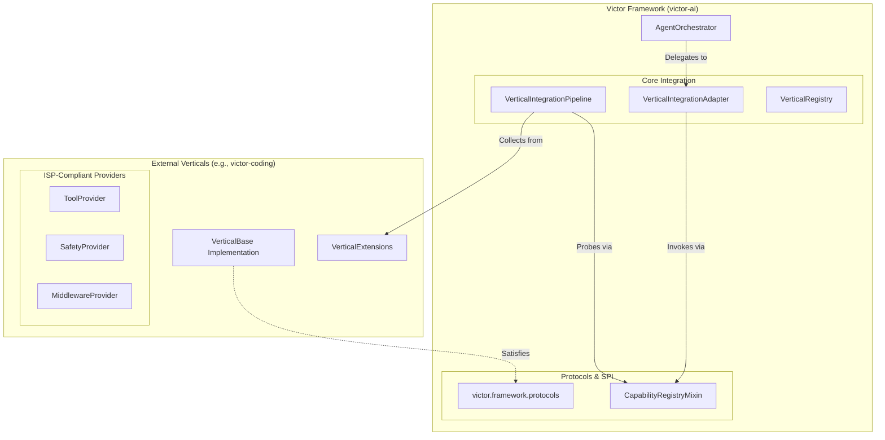

# Victor Architecture Analysis: Decoupled Protocol-First Evolution

## A. Current-State Architecture Map (Post-Refactoring)

The Victor ecosystem has transitioned from a monolithic inheritance model to a **Protocol-First, Pipeline-Driven Architecture**. The core runtime and verticals are now decoupled through explicit capability registries and standardized integration pipelines.

### 1. Component Map

### 2. Execution Flow (Standardized Pipeline)

1.  **Discovery**: `VerticalRegistry` discovers external verticals via `entry_points`.
2.  **Pipeline Construction**: `VerticalIntegrationPipeline` (in `victor/framework/vertical_integration.py`) is initialized with ordered `StepHandlers`.
3.  **Application**: `Pipeline.apply(orchestrator, vertical)` executes:
    *   **Metadata Step**: Validates vertical identity.
    *   **Capability Step**: Probes `orchestrator.has_capability()` (DIP-compliant).
    *   **Extension Steps**: Loads Tools, Middleware, Safety Patterns, Workflows, and Teams via ISP-compliant providers.
4.  **Runtime Integration**: `VerticalIntegrationAdapter` handles dynamic runtime updates (e.g., adding middleware during a chat session) using the same capability-based logic.

---

## B. Decoupling Assessment & Findings

### 1. Significant Improvements (The "Severe Changes")
*   **Protocol-First Boundary**: The introduction of `victor.framework.protocols` creates a hard boundary. Framework components now depend on `OrchestratorProtocol`, not the concrete `AgentOrchestrator`.
*   **Capability Registry**: `CapabilityRegistryMixin` replaces `hasattr` duck-typing with explicit, versioned capability declarations.
    *   *Observation*: `AgentOrchestrator` now explicitly registers capabilities like `enabled_tools`, `vertical_middleware`, etc., in `__init_capability_registry__`.
*   **Interface Segregation (ISP)**: Vertical extensions are now split into focused providers (`ToolProvider`, `SafetyProvider`, `WorkflowProvider`), allowing verticals to implement only what they need.

### 2. Severity: Low/Residual Risks
*   **Shared Singleton Pipeline**: `get_vertical_integration_pipeline` in `vertical_service.py` uses a global singleton. While thread-safe, it complicates multi-tenant scenarios where different pipelines might be needed.
*   **VerticalContext Evolution**: While `VerticalContext` centralizes state, it still contains a mix of shared immutable config and per-agent mutable state. The flyweight pattern (`create_child_context`) is implemented but its usage across complex multi-agent teams needs validation.

---

## C. SOLID Evaluation (Updated)

| Principle | Status | Observation / Action |
| :--- | :--- | :--- |
| **SRP** | ✅ | **Improved**: Integration logic moved from `AgentOrchestrator` to `VerticalIntegrationPipeline` and `VerticalIntegrationAdapter`. |
| **OCP** | ✅ | **Excellent**: `StepHandlers` in the pipeline allow adding new integration phases without modifying the core pipeline logic. |
| **LSP** | ✅ | **Improved**: `StageContract` and `StageValidator` (in `protocols/stages.py`) enforce behavioral consistency across vertical transitions. |
| **ISP** | ✅ | **Excellent**: `victor.core.verticals.protocols` provides highly segregated interfaces (Middleware, Safety, RL, Team, etc.). |
| **DIP** | ✅ | **Excellent**: `CapabilityRegistryMixin` and `OrchestratorProtocol` ensure that the high-level framework depends on abstractions, not orchestrator implementation details. |

---

## D. Scalability & Performance Risks

### 1. Pipeline Caching
The `VerticalIntegrationPipeline` uses two-level caching (Memory + Strategy-based). 
*   *Risk*: Cache invalidation for dynamically loaded plugins. If a vertical is reinstalled/updated without a process restart, the pipeline might use stale cached results.
*   *Observation*: `VerticalRegistry` has `invalidate()` methods, but the pipeline cache must be explicitly cleared via `clear_vertical_integration_pipeline_cache()`.

### 2. Extension Loading Overhead
Lazy loading is used for many components (e.g., `_initialize_provider_runtime`).
*   *Hot Path*: The first tool execution in a session triggers multiple lazy initializations (Middleware, ToolRegistry, ArgumentNormalizer). This can cause a "cold start" latency spike of 100-500ms.

---

## E. Target Architecture: The "Platform Evolution"

The next phase should shift Victor from a **Library** to a **Platform**.

1.  **Process Isolation (Phase 4)**: Move from in-process plugin loading to a sidecar/service model (using MCP - Model Context Protocol). This allows verticals to be written in any language and scales horizontally.
2.  **Capability Negotiation**: Instead of simple `has_capability`, implement a negotiation phase where the Vertical and Orchestrator agree on a shared schema version (e.g., "I support ToolCalling v2.1, but you only support v1.0, so I will fall back").
3.  **State Externalization**: Move `VerticalContext` and `SessionState` to a shared state service (Redis/SQLite) to support multi-node orchestrator clusters.

---

## F. Implementation Roadmap (Phased)

### Phase 1: Hardened SDK (Completed/Stabilizing)
*   Finalize `victor.framework.protocols` and `victor-sdk` separation.
*   Ensure all 22 providers satisfy `ProviderProtocol`.

### Phase 2: Dynamic Capability Discovery (Current)
*   Roll out `CapabilityRegistryMixin` across all sub-agents.
*   Implement version-aware capability invocation (`min_version` checks).

### Phase 3: Distributed Integration (Next)
*   Externalize the `VerticalIntegrationPipeline` cache.
*   Implement `entry_points` refresh without process restart for dynamic plugin updates.

---

## G. Score Tables

### Decoupling Score (1-10)

| Dimension | Score | Rationale |
| :--- | :--- | :--- |
| **Protocol Purity** | 9 | Hard interfaces define all core/vertical interactions. |
| **Capability Discovery**| 9 | Explicit registry replaces duck-typing. |
| **Dependency Direction**| 8 | Verticals depend on SDK, but still inherit from some core base classes. |
| **Runtime Isolation** | 6 | Verticals still run in the same process space as the core. |
| **Weighted Overall** | **8.2** | **Excellent decoupling for a Python-based plugin system.** |

*Weights: Protocol Purity (30%), Capability Discovery (30%), Dependency Direction (25%), Runtime Isolation (15%)*
