# Architecture Deep Dive

A comprehensive view of Victor's architecture, focusing on the new modular components introduced for improved extensibility, SOLID compliance, and performance.

## Overview

Victor is a provider-agnostic coding assistant with a CLI/TUI front end, a core orchestrator, and modular tools/verticals. The architecture emphasizes:

- **Lazy initialization** for faster startup
- **SOLID principles** for maintainability
- **Generic abstractions** for multi-agent collaboration
- **Performance optimizations** through caching and AOT compilation

## System Architecture Overview

The following diagram illustrates the layered architecture of Victor, showing how different components interact:

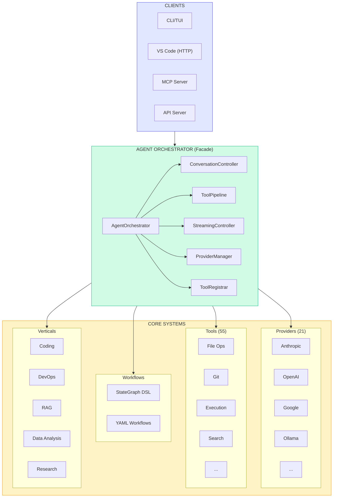

## Core Components

### Entry Points

```
CLI/TUI  -->  Orchestrator  -->  Providers / Tools / Workflows / Verticals
```

- **CLI/TUI**: User-facing entry point for chat and workflows
- **Orchestrator**: Coordinates providers, tools, and workflows
- **Providers**: Local or cloud LLM backends (21 supported)
- **Tools**: File ops, git, testing, search, etc. (55 tools)
- **Verticals**: Domain presets (coding, research, devops, data, rag)

---

## Tool Composition Layer

**Location:** `victor/tools/composition/`

The tool composition layer provides LCEL-style (LangChain Expression Language) composition patterns for building complex tool chains.

### LazyToolRunnable

Lazy-loading wrapper for deferred tool initialization. Reduces startup time by only instantiating tools when first used.

#### Tool Composition Flow

The following diagram shows how LazyToolRunnable handles tool initialization:

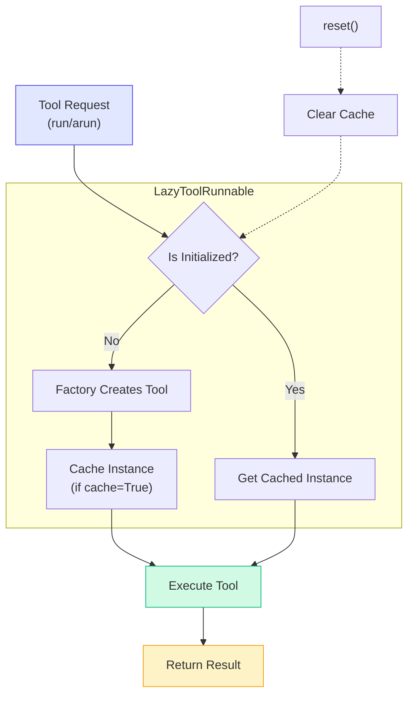

```python
from victor.tools.composition.lazy import LazyToolRunnable

# Tool not created until first use
lazy = LazyToolRunnable(lambda: ExpensiveTool())
result = lazy.run({"input": "test"})  # Now created and cached
```

**Key Features:**
- Deferred initialization until first access
- Optional caching (default: enabled)
- Reset capability for resource cleanup
- Async support via `arun()`

### ToolCompositionBuilder

Builder pattern for composing multiple tools with lazy loading support.

```python
from victor.tools.composition.lazy import ToolCompositionBuilder

tools = (
    ToolCompositionBuilder()
    .add("search", lambda: SearchTool(), lazy=True)
    .add("analyze", lambda: AnalyzeTool(), lazy=True)
    .add_eager("format", FormatTool())  # Immediate init
    .build()
)
```

### LCEL-Style Composition

The `runnable.py` module provides pipe-based chaining:

```python
from victor.tools.composition import as_runnable, parallel, branch

# Pipe chaining
chain = as_runnable(read_tool) | as_runnable(analyze_tool)

# Parallel execution
result = await parallel(
    summary=analyze_tool,
    security=security_scan,
).invoke({"path": "main.py"})

# Conditional routing
router = branch(
    (is_python, python_lint),
    (is_javascript, js_lint),
    default=generic_check,
)
```

---

## Capability Provider System

**Location:** `victor/framework/capabilities/`

Provides a consistent interface for registering and discovering capabilities within verticals.

### Capability Provider Pattern

The following class diagram illustrates the capability provider inheritance hierarchy:

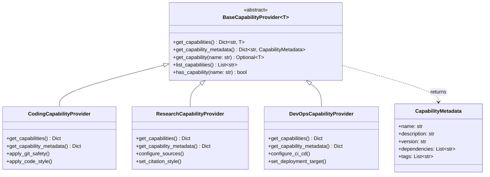

### BaseCapabilityProvider

Abstract base class for vertical capability providers. Uses generics for type-safe capability registration.

```python
from victor.framework.capabilities import BaseCapabilityProvider, CapabilityMetadata

class CodingCapabilityProvider(BaseCapabilityProvider[CodingCapability]):
    def get_capabilities(self) -> Dict[str, CodingCapability]:
        return {"code_review": self._code_review_capability}

    def get_capability_metadata(self) -> Dict[str, CapabilityMetadata]:
        return {
            "code_review": CapabilityMetadata(
                name="code_review",
                description="Review code for quality and issues",
                version="1.0",
                dependencies=["ast_analysis"],
                tags=["review", "quality"]
            )
        }
```

### CapabilityMetadata

Metadata dataclass for registered capabilities:

| Field | Description |
|-------|-------------|
| `name` | Unique identifier |
| `description` | Human-readable description |
| `version` | Semantic version (default: "1.0") |
| `dependencies` | List of required capabilities |
| `tags` | Categorization tags |

---

## Multi-Agent Framework

**Location:** `victor/framework/multi_agent/`

Generic structures for defining agent personas and team configurations.

### Multi-Agent Team Structure

The following diagram illustrates how teams are composed from templates and members:

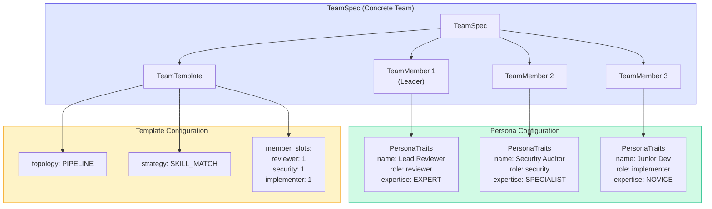

### Team Topologies

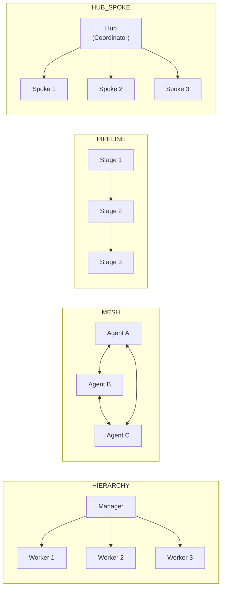

### PersonaTraits

Defines agent characteristics without coupling to specific implementations:

```python
from victor.framework.multi_agent import PersonaTraits, CommunicationStyle, ExpertiseLevel

persona = PersonaTraits(
    name="Security Auditor",
    role="security_reviewer",
    description="Identifies vulnerabilities and security issues",
    communication_style=CommunicationStyle.FORMAL,
    expertise_level=ExpertiseLevel.SPECIALIST,
    strengths=["vulnerability detection", "threat modeling"],
    preferred_tools=["static_analysis", "dependency_check"],
    risk_tolerance=0.2,  # Very risk-averse
    creativity=0.3,
)
```

**Trait Attributes:**
- `verbosity`: Response length (0.0-1.0)
- `risk_tolerance`: Willingness to take risks (0.0-1.0)
- `creativity`: Novel approach tendency (0.0-1.0)
- `custom_traits`: Domain-specific extensions

### PersonaTemplate

Template for creating personas with defaults:

```python
from victor.framework.multi_agent import PersonaTemplate

base = PersonaTraits(name="Reviewer", role="reviewer", ...)
template = PersonaTemplate(base_traits=base)

# Create specialized variants
security_reviewer = template.create(
    name="Security Reviewer",
    strengths=["vulnerability detection"]
)
```

### TeamTemplate and TeamSpec

**TeamTemplate** defines team structure and policies:

```python
from victor.framework.multi_agent import TeamTemplate, TeamTopology, TaskAssignmentStrategy

template = TeamTemplate(
    name="Code Review Team",
    description="Reviews code for quality",
    topology=TeamTopology.PIPELINE,
    assignment_strategy=TaskAssignmentStrategy.SKILL_MATCH,
    member_slots={"researcher": 1, "reviewer": 2},
    escalation_threshold=0.7,
)
```

**TeamSpec** combines template with concrete members:

```python
from victor.framework.multi_agent import TeamSpec, TeamMember

spec = TeamSpec(
    template=template,
    members=[
        TeamMember(persona=researcher, role_in_team="researcher"),
        TeamMember(persona=reviewer, role_in_team="reviewer", is_leader=True),
    ],
)
```

**Team Topologies:**
- `HIERARCHY`: Tree with manager delegating to subordinates
- `MESH`: Fully connected network
- `PIPELINE`: Linear sequence
- `HUB_SPOKE`: Central coordinator with workers

---

## SOLID Compliance Registries

**Location:** `victor/tools/`

### ProgressiveToolsRegistry

Registry for tools with progressive parameter escalation (OCP fix - removes hardcoded constants).

#### Progressive Tools Registry Flow

The following diagram shows how tools escalate parameters progressively:

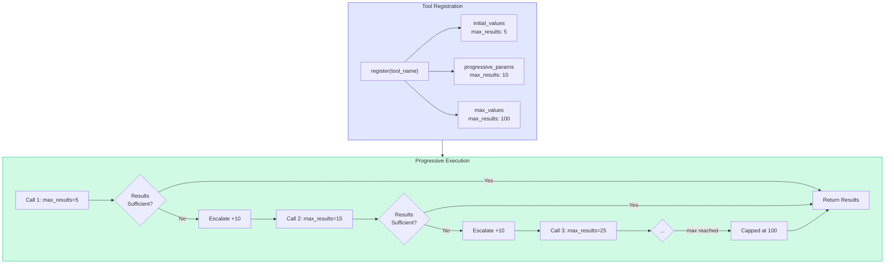

```python
from victor.tools.progressive_registry import get_progressive_registry

registry = get_progressive_registry()
registry.register(
    tool_name="code_search",
    progressive_params={"max_results": 10},
    initial_values={"max_results": 5},
    max_values={"max_results": 100},
)

if registry.is_progressive("code_search"):
    config = registry.get_config("code_search")
```

### ToolAliasResolver

Resolves tool aliases to enabled variants (OCP fix - allows dynamic alias registration).

```python
from victor.tools.alias_resolver import get_alias_resolver

resolver = get_alias_resolver()
resolver.register("shell", ["bash", "zsh", "sh"])
resolver.register("grep", ["ripgrep", "rg"])

# Resolve to an enabled variant
actual = resolver.resolve("shell", enabled_tools=["zsh"])  # Returns "zsh"
```

---

## SubAgent Protocol

**Location:** `victor/agent/subagents/protocols.py`

Interface Segregation Principle (ISP) compliant protocol for SubAgent dependencies.

### SubAgent Context Protocol

The following diagram shows the ISP-compliant interface design:

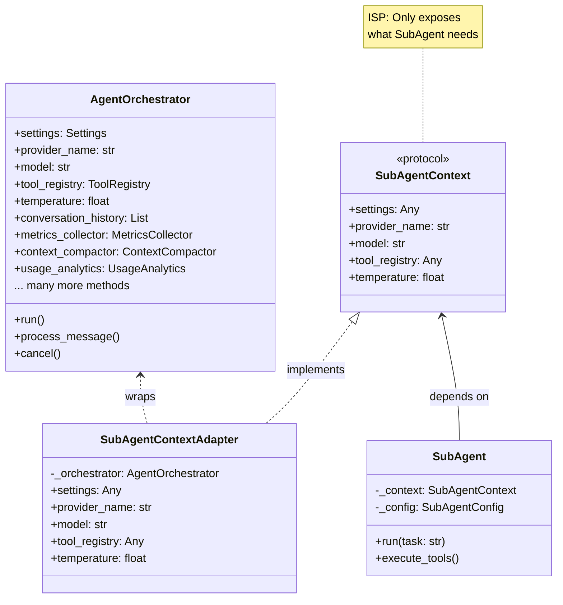

#### Adapter Pattern Flow

```mermaid
flowchart LR
    subgraph Full["Full Interface (AgentOrchestrator)"]
        F1["settings"]
        F2["provider_name"]
        F3["model"]
        F4["tool_registry"]
        F5["temperature"]
        F6["conversation_history"]
        F7["metrics_collector"]
        F8["...20+ more"]
    end

    subgraph Adapter["SubAgentContextAdapter"]
        A["Wraps Orchestrator"]
    end

    subgraph Minimal["Minimal Interface (SubAgentContext)"]
        M1["settings"]
        M2["provider_name"]
        M3["model"]
        M4["tool_registry"]
        M5["temperature"]
    end

    Full --> Adapter
    Adapter --> Minimal
    Minimal --> SA["SubAgent"]

    style Full fill:#fef3c7,stroke:#f59e0b
    style Adapter fill:#e0e7ff,stroke:#4f46e5
    style Minimal fill:#d1fae5,stroke:#10b981
```

### SubAgentContext

Minimal protocol defining only what SubAgent needs:

```python
from victor.agent.subagents.protocols import SubAgentContext

class SubAgentContext(Protocol):
    @property
    def settings(self) -> Any: ...
    @property
    def provider_name(self) -> str: ...
    @property
    def model(self) -> str: ...
    @property
    def tool_registry(self) -> Any: ...
```

### SubAgentContextAdapter

Adapter bridging AgentOrchestrator to the minimal protocol:

```python
from victor.agent.subagents.protocols import SubAgentContextAdapter

# Adapt full orchestrator to minimal interface
context = SubAgentContextAdapter(parent_orchestrator)
subagent = SubAgent(config, context)
```

**Benefits:**
- Easier testing with mocks
- Clearer dependency contracts
- Reduced coupling to orchestrator

---

## Vertical Integration Pipeline

**Location:** `victor/core/verticals/vertical_loader.py`

Verticals are loaded dynamically at runtime with support for built-in verticals, registered verticals, and plugin discovery via entry points.

### Vertical Loading Flow

The following diagram shows how verticals are discovered, loaded, and configured:

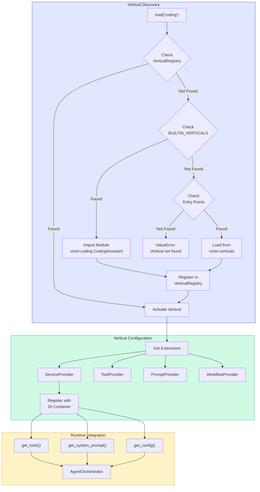

### Vertical Extension Protocol

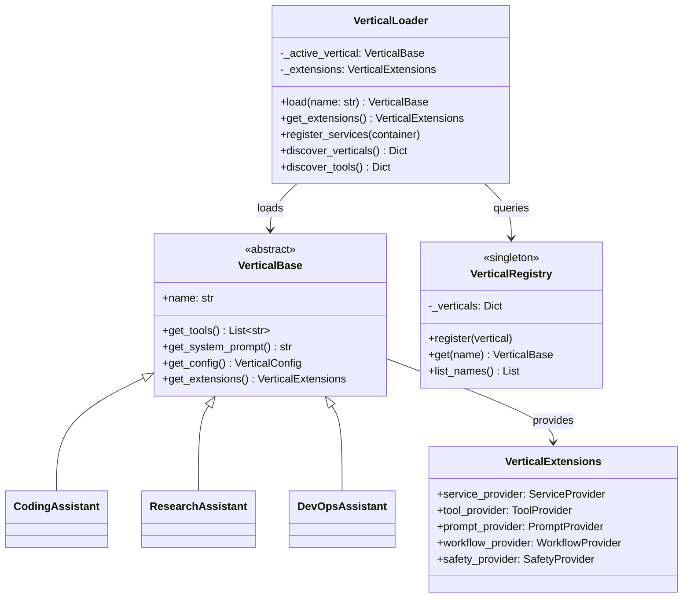

### Plugin Discovery via Entry Points

External packages can register custom verticals:

```toml
# In external package's pyproject.toml
[project.entry-points."victor.verticals"]
security = "victor_security:SecurityAssistant"
```

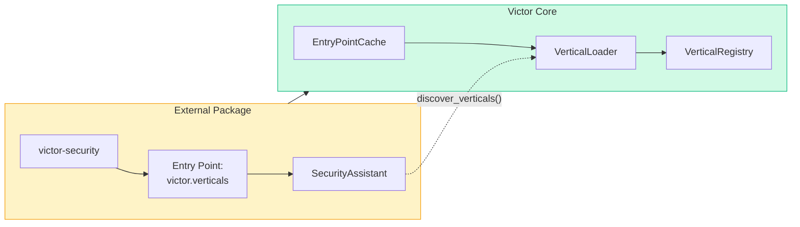

---

## Performance Optimizations

### AOTManifestManager

**Location:** `victor/core/aot_manifest.py`

Ahead-of-time entry point caching for faster startup. Avoids scanning installed packages on every startup.

```python
from victor.core.aot_manifest import AOTManifestManager

manager = AOTManifestManager()

# Try cached manifest
manifest = manager.load_manifest()
if manifest is None:
    # Build and cache
    manifest = manager.build_manifest(["victor.verticals", "victor.providers"])
    manager.save_manifest(manifest)

# Use cached entries
for entry in manifest.entries.get("victor.verticals", []):
    module = importlib.import_module(entry.module)
```

**Features:**
- Environment hash validation (invalidates on package changes)
- Version compatibility checking
- JSON-based persistence in `~/.victor/cache`

### BoundedQTable

**Location:** `victor/storage/cache/rl_eviction_policy.py`

LRU-evicting Q-table for reinforcement learning cache policies.

```python
from victor.storage.cache.rl_eviction_policy import BoundedQTable

table = BoundedQTable(max_size=100000)
table.set("state_key", 0.75)
value = table.get("state_key", default=0.0)
```

**RLEvictionPolicy** uses Q-learning to decide cache evictions:

```python
from victor.storage.cache.rl_eviction_policy import RLEvictionPolicy, CacheEntryState

policy = RLEvictionPolicy()
state = CacheEntryState(
    key="cache_key",
    tool_type="code_search",
    entry_age_seconds=120.0,
    hit_count=5,
)
decision = policy.get_decision(state, cache_utilization=0.85)

if decision.action == EvictionAction.EVICT:
    cache.remove(state.key)
```

---

## Data Flow

```
                                    ┌─────────────────────────────┐
                                    │     AOTManifestManager      │
                                    │  (startup optimization)     │
                                    └─────────────┬───────────────┘
                                                  │
┌──────────────┐    ┌─────────────────────────────▼───────────────────────────┐
│   CLI/TUI    │───>│                   AgentOrchestrator                     │
└──────────────┘    │  ┌─────────────────────────────────────────────────┐    │
                    │  │              SubAgentContextAdapter              │    │
                    │  │  (ISP: exposes only needed orchestrator props)   │    │
                    │  └───────────────────────┬─────────────────────────┘    │
                    └──────────────────────────┼──────────────────────────────┘
                                               │
                    ┌──────────────────────────▼──────────────────────────────┐
                    │                    Tool System                          │
                    │  ┌─────────────────┐  ┌──────────────────────────┐     │
                    │  │ToolAliasResolver│  │ProgressiveToolsRegistry  │     │
                    │  │ (OCP: dynamic   │  │ (OCP: dynamic param      │     │
                    │  │  alias mapping) │  │  escalation)             │     │
                    │  └────────┬────────┘  └────────────┬─────────────┘     │
                    │           │                        │                    │
                    │  ┌────────▼────────────────────────▼─────────────┐     │
                    │  │           ToolCompositionBuilder              │     │
                    │  │  ┌─────────────────────────────────────────┐  │     │
                    │  │  │           LazyToolRunnable              │  │     │
                    │  │  │      (deferred initialization)          │  │     │
                    │  │  └─────────────────────────────────────────┘  │     │
                    │  └───────────────────────────────────────────────┘     │
                    └─────────────────────────────────────────────────────────┘
                                               │
                    ┌──────────────────────────▼──────────────────────────────┐
                    │                 Vertical System                         │
                    │  ┌─────────────────────────────────────────────────┐   │
                    │  │            BaseCapabilityProvider               │   │
                    │  │  (generic capability registration per vertical) │   │
                    │  └─────────────────────────────────────────────────┘   │
                    └─────────────────────────────────────────────────────────┘
                                               │
                    ┌──────────────────────────▼──────────────────────────────┐
                    │              Multi-Agent Collaboration                  │
                    │  ┌─────────────┐  ┌──────────────┐  ┌─────────────┐    │
                    │  │PersonaTraits│  │TeamTemplate  │  │  TeamSpec   │    │
                    │  │ (agent      │  │ (structure   │  │ (concrete   │    │
                    │  │  behavior)  │  │  policies)   │  │  members)   │    │
                    │  └─────────────┘  └──────────────┘  └─────────────┘    │
                    └─────────────────────────────────────────────────────────┘
                                               │
                    ┌──────────────────────────▼──────────────────────────────┐
                    │                   Cache Layer                           │
                    │  ┌─────────────────────────────────────────────────┐   │
                    │  │              RLEvictionPolicy                   │   │
                    │  │  ┌─────────────────────────────────────────┐   │   │
                    │  │  │           BoundedQTable                 │   │   │
                    │  │  │    (LRU-evicting Q-table for RL)        │   │   │
                    │  │  └─────────────────────────────────────────┘   │   │
                    │  └─────────────────────────────────────────────────┘   │
                    └─────────────────────────────────────────────────────────┘
```

---

## Module Reference

| Module | Purpose |
|--------|---------|
| `victor/tools/composition/lazy.py` | LazyToolRunnable, ToolCompositionBuilder |
| `victor/tools/composition/runnable.py` | LCEL-style Runnable base classes |
| `victor/framework/capabilities/base.py` | BaseCapabilityProvider, CapabilityMetadata |
| `victor/framework/multi_agent/personas.py` | PersonaTraits, PersonaTemplate |
| `victor/framework/multi_agent/teams.py` | TeamTemplate, TeamSpec, TeamMember |
| `victor/tools/progressive_registry.py` | ProgressiveToolsRegistry |
| `victor/tools/alias_resolver.py` | ToolAliasResolver |
| `victor/agent/subagents/protocols.py` | SubAgentContext, SubAgentContextAdapter |
| `victor/core/aot_manifest.py` | AOTManifestManager, AOTManifest |
| `victor/storage/cache/rl_eviction_policy.py` | RLEvictionPolicy, BoundedQTable |

---

## Where to Dig Deeper

- Full deep-dive appendix: `ARCHITECTURE_DEEP_DIVE_APPENDIX.md`
- Developer guide: `DEVELOPER_GUIDE.md`
- Testing patterns: `TESTING_STRATEGY.md`
