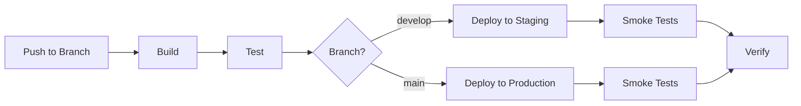

# CI/CD Setup Guide

This guide covers setting up and using Victor's comprehensive CI/CD pipeline.

## Table of Contents

- [Overview](#overview)
- [GitHub Actions Workflows](#github-actions-workflows)
- [Local Development](#local-development)
- [Pre-commit Hooks](#pre-commit-hooks)
- [Testing](#testing)
- [Deployment](#deployment)
- [Release Process](#release-process)
- [Troubleshooting](#troubleshooting)

## Overview

Victor's CI/CD pipeline includes:

- **Automated Testing**: Multi-version Python testing with coverage reporting
- **Linting**: Code quality checks with Black, Ruff, MyPy, and Bandit
- **Workflow Validation**: Automated validation of YAML workflows
- **Security Scanning**: Gitleaks, dependency audit, and Bandit security checks
- **Docker Builds**: Multi-platform Docker image builds
- **Deployment**: Automated deployment to staging and production
- **Release Automation**: Version bumping, changelog generation, and PyPI releases

## GitHub Actions Workflows

### Available Workflows

#### 1. Test Workflow (`.github/workflows/test.yml`)

Runs on every push and pull request.

```bash
# Triggers
- Push to main, develop, release branches
- Pull requests to main/develop
- Manual workflow dispatch

# What it does
- Runs unit tests on Python 3.10, 3.11, 3.12
- Runs integration tests (subset)
- Runs smoke tests
- Uploads coverage to Codecov
```

**Jobs:**
- `test`: Main test suite across Python versions and OS
- `test-workflows`: Workflow validation tests
- `test-providers`: Provider-specific tests
- `test-coordinators`: Coordinator tests
- `test-report`: Summary report

#### 2. Lint Workflow (`.github/workflows/lint.yml`)

Code quality checks.

```bash
# What it checks
- Black formatting
- Ruff linting
- MyPy type checking
- Bandit security scanning
- YAML syntax
- Import validation
```

**Jobs:**
- `lint-python`: Python linting (Black, Ruff, MyPy, Bandit)
- `lint-imports`: Import dependency validation
- `lint-yaml`: YAML syntax validation
- `lint-workflows`: YAML workflow validation
- `lint-summary`: Summary report

#### 3. CI Workflow (`.github/workflows/ci.yml`)

Comprehensive CI pipeline.

Combines testing, linting, security scanning, guards, Rust checks, and VS Code extension builds.

#### 4. Deploy Workflow (`.github/workflows/deploy.yml`)

Automated deployment pipeline.

```bash
# Triggers
- Push to main/develop
- Manual workflow dispatch with environment selection

# What it does
- Builds Python packages
- Builds Docker images
- Deploys to staging (on develop)
- Deploys to production (on main)
- Runs smoke tests
```

**Jobs:**
- `build`: Build Python packages
- `docker`: Build and push Docker images
- `deploy-staging`: Deploy to staging environment
- `deploy-production`: Deploy to production (main branch only)
- `deploy-report`: Summary report

#### 5. Release Workflow (`.github/workflows/release.yml`)

Automated release process.

See [Release Process](#release-process) below.

#### 6. Workflow Validation (`.github/workflows/workflow-validation.yml`)

Validates all YAML workflows across multiple platforms.

#### 7. Security Workflow (`.github/workflows/security.yml`)

Security scanning and vulnerability detection.

#### 8. Performance Workflow (`.github/workflows/workflow-performance.yml`)

Performance benchmarking and regression detection.

### Required Secrets

Configure these in your GitHub repository settings:

```bash
# Codecov
CODECOV_TOKEN              # Codecov API token

# Docker Hub
DOCKER_USERNAME            # Docker Hub username
DOCKER_PASSWORD            # Docker Hub password/token

# AWS (for deployment)
AWS_ACCESS_KEY_ID          # AWS access key for staging
AWS_SECRET_ACCESS_KEY      # AWS secret key for staging
AWS_ACCESS_KEY_ID_STAGING  # AWS access key for staging
AWS_SECRET_ACCESS_KEY_STAGING  # AWS secret key for staging

# PyPI (for releases)
PYPI_API_TOKEN             # PyPI API token
TEST_PYPI_API_TOKEN        # Test PyPI API token

# GitHub (for releases)
GH_TOKEN                   # GitHub token for creating releases
```

### Setting Up Secrets

1. Go to repository Settings
2. Navigate to Secrets and Variables > Actions
3. Click "New repository secret"
4. Add each secret with its value

## Local Development

### Installation

```bash
# Install with development dependencies
pip install -e ".[dev]"

# Install pre-commit hooks
pre-commit install
```

### Running Tests Locally

```bash
# Run all unit tests
pytest tests/unit -v

# Run with coverage
pytest tests/unit --cov=victor --cov-report=html

# Run integration tests
pytest tests/integration -v

# Run specific test
pytest tests/unit/test_file.py::test_function -v

# Run by marker
pytest -m "unit" -v
pytest -m "not slow" -v

# Run CI test suite
bash scripts/ci/run_tests.sh unit --cov

# Run smoke tests
pytest tests/smoke -v
```

### Running Linters Locally

```bash
# Run all linters
make lint

# Or using CI script
bash scripts/ci/run_lint.sh

# Individual tools
black --check victor tests
ruff check victor tests
mypy victor/protocols victor/framework/coordinators
bandit -r victor/ -ll -ii

# Auto-fix issues
make format
bash scripts/ci/run_lint.sh --fix
```

### Validating Workflows Locally

```bash
# Validate all workflows
bash scripts/ci/validate_workflows.sh

# Validate specific workflow
bash scripts/ci/validate_workflows.sh victor/coding/workflows/bugfix.yaml

# Using Victor CLI
victor workflow validate victor/coding/workflows/bugfix.yaml

# Verbose mode
VICTOR_VERBOSE_VALIDATION=1 bash scripts/ci/validate_workflows.sh
```

## Pre-commit Hooks

### Installing Hooks

```bash
# Install pre-commit
pip install pre-commit

# Install hooks
pre-commit install

# Install commit-msg hook (optional)
pre-commit install --hook-type commit-msg
```

### Running Hooks Manually

```bash
# Run on all files
pre-commit run --all-files

# Run on specific files
pre-commit run --files victor/coding/workflows/*.yaml

# Run specific hook
pre-commit run black --all-files
```

### Hook Configuration

See `.pre-commit-config.yaml` for configuration.

Available hooks:
- **Standard**: trailing whitespace, end-of-file, YAML/TOML/JSON syntax
- **Python**: Black formatting, Ruff linting, MyPy type checking
- **Security**: Bandit security scanning
- **YAML**: yamllint
- **Custom**: workflow validation, import checking, mode/capability/team config validation

### Auto-fixing Issues

```bash
# Pre-commit will auto-fix some issues
git add .
git commit -m "feat: add feature"

# If hooks fail, fix and retry
pre-commit run --all-files
git add .
git commit -m "feat: add feature"
```

## Testing

### Test Organization

```
tests/
├── unit/              # Unit tests (fast, isolated)
│   ├── agent/
│   ├── providers/
│   ├── tools/
│   └── workflows/
├── integration/       # Integration tests (slower, external deps)
│   ├── agent/
│   ├── workflows/
│   └── providers/
├── smoke/            # Smoke tests (quick sanity checks)
└── benchmarks/       # Performance benchmarks
```

### Test Markers

```python
@pytest.mark.unit           # Unit test
@pytest.mark.integration    # Integration test
@pytest.mark.slow          # Slow test (can be skipped)
@pytest.mark.workflows     # Workflow test
@pytest.mark.agents        # Multi-agent test
@pytest.mark.hitl          # Human-in-the-loop test
@pytest.mark.benchmark     # Performance benchmark
@pytest.mark.smoke         # Smoke test
```

### Running Marked Tests

```bash
# Run only unit tests
pytest -m unit -v

# Run everything except slow tests
pytest -m "not slow" -v

# Run smoke tests only
pytest -m smoke -v

# Run workflow tests
pytest -m workflows -v
```

### Coverage Goals

Target coverage: **70% overall**

Critical modules:
- Coordinators: >80%
- Framework: >85%
- Protocols: >90%

## Deployment

### Deployment Pipeline



### Manual Deployment

```bash
# Deploy to staging
bash scripts/ci/deploy.sh staging

# Deploy to production
bash scripts/ci/deploy.sh production

# Deploy specific version
bash scripts/ci/deploy.sh staging --version 0.5.0

# Dry run
bash scripts/ci/deploy.sh staging --dry-run
```

### Docker Deployment

```bash
# Build image
bash scripts/ci/build_docker.sh

# Build and push
bash scripts/ci/build_docker.sh --push

# Build specific tag
bash scripts/ci/build_docker.sh --tag v0.5.0

# Run locally
docker run -it vijayksingh/victor:latest
```

### Smoke Tests

```bash
# Run smoke tests against staging
bash scripts/ci/smoke_test.sh staging

# Run against production
bash scripts/ci/smoke_test.sh production

# Custom URL
bash scripts/ci/smoke_test.sh --url https://custom.example.com
```

## Release Process

### Automated Release Workflow

The release workflow (`.github/workflows/release.yml`) automates:

1. Version bumping
2. Changelog generation
3. Git tag creation
4. PyPI release
5. Docker release
6. GitHub release

### Creating a Release

#### Option 1: GitHub Release (Recommended)

1. Go to GitHub Releases
2. Click "Draft a new release"
3. Enter tag version (e.g., `v0.5.0`)
4. Select target branch (main)
5. Title: `Release v0.5.0`
6. Generate release notes
7. Click "Publish release"

This triggers the release workflow automatically.

#### Option 2: Manual Trigger

```bash
# Using make
make release VERSION=0.5.0

# Or manually
git tag -a v0.5.0 -m "Release v0.5.0"
git push origin v0.5.0
```

#### Option 3: GitHub Actions Manual Dispatch

1. Go to Actions > Release workflow
2. Click "Run workflow"
3. Select branch
4. Enter version
5. Click "Run workflow"

### Release Checklist

Before releasing:

- [ ] All tests pass
- [ ] Coverage meets threshold
- [ ] No security vulnerabilities
- [ ] Changelog updated
- [ ] Version bumped in `pyproject.toml`
- [ ] Migration guide updated (if breaking changes)

After releasing:

- [ ] GitHub release created
- [ ] PyPI package published
- [ ] Docker image pushed
- [ ] Documentation updated
- [ ] Announcement posted

### Version Bumping

```bash
# Update version in pyproject.toml
version = "0.5.0"  # Update this

# Commit changes
git add pyproject.toml
git commit -m "chore: bump version to 0.5.0"

# Create tag
git tag -a v0.5.0 -m "Release v0.5.0"

# Push
git push origin main
git push origin v0.5.0
```

### Changelog Generation

The release workflow automatically generates changelog from commit messages.

Format:
```
feat: new feature
fix: bug fix
docs: documentation change
perf: performance improvement
refactor: code refactoring
test: adding/updating tests
chore: maintenance tasks
```

## Troubleshooting

### Tests Failing in CI

```bash
# Reproduce locally
docker run -it --rm \
  -v $(pwd):/workspace \
  -w /workspace \
  python:3.11 \
  bash -c "pip install -e '.[dev]' && pytest tests/unit -v"

# Check Python version
python --version  # Should match CI (3.10, 3.11, or 3.12)

# Check dependencies
pip list | grep victor
```

### Linting Failures

```bash
# Run locally with verbose output
black --check --diff victor tests
ruff check victor tests --output-format=full
mypy victor --show-error-codes --show-error-context

# Auto-fix
make format
ruff check --fix victor tests
```

### Workflow Validation Failures

```bash
# Validate with verbose output
VICTOR_VERBOSE_VALIDATION=1 bash scripts/ci/validate_workflows.sh

# Check specific workflow
python -c "
from victor.workflows import load_workflow_from_file
from victor.workflows.unified_compiler import UnifiedWorkflowCompiler

compiler = UnifiedWorkflowCompiler()
loaded = load_workflow_from_file('path/to/workflow.yaml')
compiled = compiler.compile_definition(loaded)
"
```

### Deployment Failures

```bash
# Check deployment logs
# GitHub Actions: Actions > Deploy workflow > Run > View logs

# Test deployment locally
bash scripts/ci/deploy.sh staging --dry-run

# Check smoke tests
bash scripts/ci/smoke_test.sh staging

# Check Docker image
docker pull vijayksingh/victor:latest
docker run -it vijayksingh/victor:latest victor --version
```

### Pre-commit Hook Issues

```bash
# Skip hooks (not recommended)
git commit --no-verify -m "message"

# Update hooks
pre-commit autoupdate

# Clean and reinstall
pre-commit clean
pre-commit install

# Debug specific hook
pre-commit run <hook-id> --verbose --all-files
```

### Coverage Issues

```bash
# Generate coverage report locally
pytest tests/unit --cov=victor --cov-report=html
open htmlcov/index.html

# Check specific module coverage
pytest tests/unit/agent/test_coordinators.py \
  --cov=victor.agent.coordinators \
  --cov-report=term-missing

# Run with coverage context
pytest tests/unit --cov=victor --cov-context=test
```

### Docker Build Failures

```bash
# Build with no cache
docker build --no-cache -t victor:test .

# Build with BuildKit debugging
DOCKER_BUILDKIT=1 docker build --debug -t victor:test .

# Check Dockerfile syntax
docker build --check -f Dockerfile .

# Test in container
docker run -it --rm -v $(pwd):/workspace victor:latest bash
```

## Best Practices

1. **Always run tests locally before pushing**
   ```bash
   pytest tests/unit -v
   make lint
   ```

2. **Use pre-commit hooks to catch issues early**
   ```bash
   pre-commit install
   pre-commit run --all-files
   ```

3. **Keep coverage high**
   - Write tests for new features
   - Maintain >70% coverage
   - Focus on critical paths

4. **Validate workflows before committing**
   ```bash
   bash scripts/ci/validate_workflows.sh
   ```

5. **Use feature branches**
   - Create branch from main/develop
   - Work on feature branch
   - Create PR when ready
   - CI runs automatically

6. **Review CI results**
   - Check all jobs pass
   - Review coverage reports
   - Check security scans
   - Review test failures

7. **Fix failing tests immediately**
   - Don't ignore test failures
   - Fix or skip flaky tests
   - Update tests when refactoring

## Additional Resources

- [GitHub Actions Documentation](https://docs.github.com/en/actions)
- [Pre-commit Documentation](https://pre-commit.com/)
- [Pytest Documentation](https://docs.pytest.org/)
- [Codecov Documentation](https://docs.codecov.com/)
- [Docker Documentation](https://docs.docker.com/)
