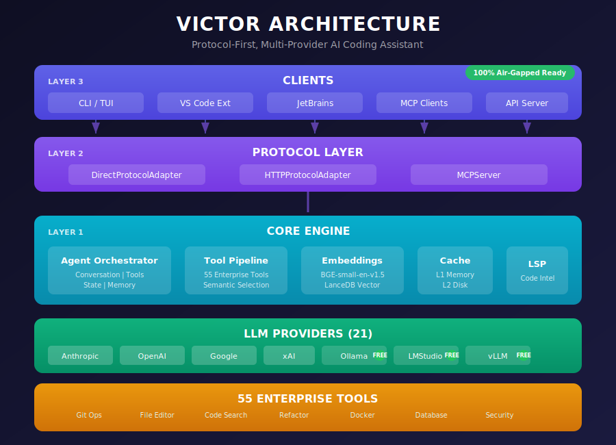
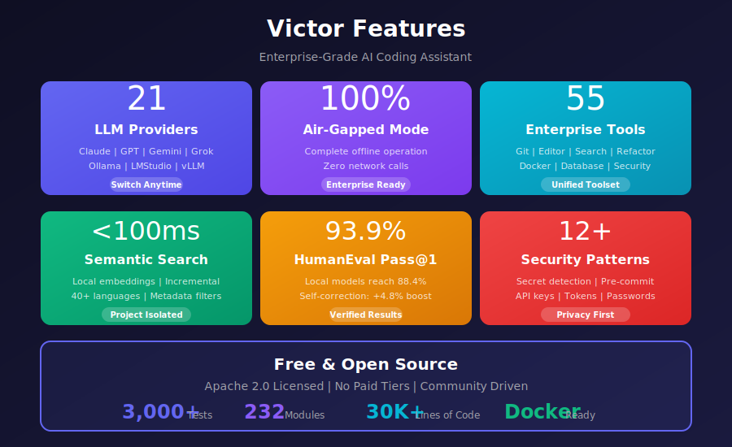

# Victor Codebase Analysis Report

**Date**: 2025-12-04 (Updated)
**Previous Report**: 2025-11-30
**Codebase Size**: ~35,000 lines across 232 Python modules
**Test Files**: 151 files with 3,110+ test cases

---

## Visual Architecture

<div align="center">


*Victor's Protocol-First Architecture: 7+ LLM providers, 42 tools, 3-layer design*


*Key features: Multi-provider support, air-gapped mode, enterprise tools, semantic search*


*HumanEval Pass@1: Claude Sonnet 93.9%, gpt-oss 88.4%, qwen2.5-coder:32b 86.6%*

</div>

---

## Executive Summary

Victor is an enterprise-ready AI coding assistant with a solid protocol-first architecture. This updated analysis reflects significant progress since the November 2025 report, including:

**Improvements Made**:
1. **Test Coverage**: Expanded from 56 to 3,110+ test cases
2. **Benchmark Framework**: Complete evaluation harness with HumanEval/MBPP/SWE-bench support
3. **Tool Calling Adapters**: Unified system for provider-agnostic tool calling
4. **Agentic Harness**: Separate harness for tool-enabled benchmark evaluation

**Recently Completed (December 2025)**:
1. **Phase 1 Foundation Fixes**: SOLID compliance improvements
   - Removed duplicate vertical files (coding.py, research.py)
   - Enforced TaskTypeHint return type in all verticals (LSP compliance)
   - Fixed CapabilityRegistryProtocol coupling (removed private attr fallbacks)
   - Added vertical config caching (26x speedup)

**Remaining Technical Debt**:
1. **God Object Anti-pattern**: `orchestrator.py` grew to 3,178 lines (was 2,859)
2. **Tool Dependency Injection**: Tools still use global state pattern
3. **Test Module Coverage**: 68 modules (29%) remain untested
4. **Resource Management**: MCP/LSP clients need proper cleanup
5. **Monolithic Execution Loop**: `stream_chat` in `orchestrator.py` is a single, highly coupled control flow that mixes classification, context building, tool selection, execution, and recovery. This is the top maintenance risk and needs decomposition with targeted unit tests.
6. **VS Code Packaging Gaps**: `.vscodeignore` aggressively strips transitive dependencies (axios → form-data → combined-stream → delayed-stream → mime-types), leading to activation failures. Either bundle the extension or explicitly whitelist the full dependency chain in packaging.
7. **Underdocumented MCP Integration**: MCP setup is present in tool registration but lacks user-facing documentation and safe defaults (feature flag, auth, and failure modes).

See [ARCHITECTURE_ROADMAP.md](ARCHITECTURE_ROADMAP.md) for Phase 2-4 improvement plans.

---

## Part 1: Current Strengths

### Architecture Strengths

| Strength | Evidence | Impact |
|----------|----------|--------|
| **Protocol-First Design** | `VictorProtocol` interface with adapters | Clean client abstraction |
| **Provider Abstraction** | 7+ providers with unified `BaseProvider` | Easy provider switching |
| **Tool Calling Adapters** | `BaseToolCallingAdapter` with capabilities | Provider-agnostic tools |
| **Evaluation Framework** | `CodeGenerationBenchmark`, `AgenticBenchmarkRunner` | Industry-standard metrics |
| **Semantic Tool Selection** | Embedding-based selection + keywords | Smart tool routing |
| **Air-gapped Mode** | Full offline capability | Enterprise compliance |
| **Project Isolation** | Per-project embeddings in `.victor/` | Multi-repo support |

### Code Quality Metrics

| Metric | Current | Target | Status |
|--------|---------|--------|--------|
| Total Modules | 232 | - | Stable |
| Test Files | 154 | - | Good |
| Test Cases | 3,222+ | 4,000+ | Improving |
| Type Coverage | ~70% | 90% | In Progress |
| Documentation | Good | Complete | In Progress |

### Benchmark Results (December 2025)

| Model | Pass@1 | Pass@5 | Type | Server |
|-------|--------|--------|------|--------|
| Claude Sonnet 4.5 | **93.9%** | 100% | Cloud | API |
| gpt-oss:latest | **88.4%** | 100% | Local | RTX 4000 ADA |
| qwen2.5-coder:32b | **86.6%** | 100% | Local | RTX 4000 ADA |
| devstral:latest | **82.9%** | 99.99% | Local | M1 Max |
| Claude Haiku | **81.1%** | 99.98% | Cloud | API |
| qwen3-coder:30b | **78.7%** | 99.97% | Local | RTX 4000 ADA |
| deepseek-coder-v2:16b | **76.2%** | 99.94% | Local | M4 MAX |

---

## Part 2: Current Weaknesses

### 2.1 God Object: Orchestrator (CRITICAL)

**File**: `victor/agent/orchestrator.py`

| Metric | Nov 2025 | Dec 2025 | Target | Trend |
|--------|----------|----------|--------|-------|
| Lines | 2,859 | **3,178** | <600 | Worse |
| Methods | 43 | 45+ | 15-20 | Worse |
| Imports | ~40 | ~45 | <15 | Worse |
| Instance Variables | 73 | ~80 | 8-10 | Worse |

**Root Cause**: New features added without decomposition
- Added task classification logic
- Added agentic harness integration
- Added enhanced tool selection

**Impact**:
- Testing difficulty increased
- Change risk higher
- Onboarding harder for contributors

### 2.2 Tool Dependency Injection Gap

Tools still use global state pattern instead of proper DI:

```python
# Current anti-pattern (still in use)
class SomeOtherCode:
    def configure(self):
        tool.set_git_provider(provider)  # Global state mutation
        tool.set_workspace(workspace)     # Side effects
```

**Affected Tools**: git_operations, code_search, semantic_code_search, filesystem

### 2.3 Untested Modules (65 modules, 28%)

**Critical Untested** (P0 Complete):
| Module | Lines | Risk | Priority | Status |
|--------|-------|------|----------|--------|
| `action_authorizer.py` | ~200 | High | P0 | ✅ Tested (35 tests) |
| `complexity_classifier.py` | ~150 | High | P0 | ✅ Tested (35 tests) |
| `loop_detector.py` | ~180 | High | P0 | ✅ Tested (42 tests) |
| `tiered_cache.py` | ~300 | Medium | P1 | Pending |
| `resilience.py` | ~250 | Medium | P1 | Pending |
| `TUI app.py` | ~400 | Medium | P1 | Pending |

### 2.4 Resource Management Issues

**MCP Client** (`victor/mcp/client.py`):
- Subprocess not always terminated on error
- File handles may leak on exception

**LSP Manager** (`victor/lsp/manager.py`):
- Server processes not cleaned up on shutdown
- Connection pooling not implemented

### 2.5 Async Anti-patterns

| File | Line | Issue | Risk |
|------|------|-------|------|
| `mcp/client.py` | ~305 | Blocking `readline()` in async | High |
| `mcp/server.py` | ~369 | Blocking `stdin.readline()` | High |
| `providers/*.py` | Various | Missing `async with` | Medium |

---

## Part 3: Improvement Roadmap

### Phase 1: Stabilization (Immediate)

#### 1.1 Fix Resource Leaks
```python
# Add to MCP client
async def __aenter__(self):
    await self.connect()
    return self

async def __aexit__(self, *args):
    await self.cleanup()
```

#### 1.2 Add Tests for Critical Modules
Priority: action_authorizer, complexity_classifier, loop_detector

#### 1.3 Fix Async Blocking
Replace `readline()` with `asyncio.StreamReader`

### Phase 2: Decomposition (Week 1-2)

#### 2.1 Extract ConversationController
**Target**: `victor/agent/conversation_controller.py`
**Lines**: ~400 from orchestrator
**Methods**:
- `add_message()`
- `get_context()`
- `track_stage()`
- `export_conversation()`

#### 2.2 Extract ToolPipeline
**Target**: `victor/agent/tool_pipeline.py`
**Lines**: ~300 from orchestrator
**Methods**:
- `validate_tool_call()`
- `execute_tools()`
- `enforce_budget()`

#### 2.3 Extract StreamingController
**Target**: `victor/agent/streaming_controller.py`
**Lines**: ~250 from orchestrator
**Methods**:
- `start_session()`
- `handle_chunk()`
- `collect_metrics()`
- `cancel()`

### Phase 3: Tool DI (Week 2-3)

#### 3.1 Create ToolConfig Container
```python
@dataclass
class ToolConfig:
    workspace: Path
    git_provider: Optional[GitProvider] = None
    cache_manager: Optional[CacheManager] = None
    settings: Optional[Settings] = None
```

#### 3.2 Inject via Constructor
```python
class GitTool(BaseTool):
    def __init__(self, config: ToolConfig):
        self.config = config
```

### Phase 4: Test Coverage (Ongoing)

| Week | Target Modules | Test Count |
|------|----------------|------------|
| 1 | action_authorizer, complexity_classifier | +50 |
| 2 | loop_detector, tiered_cache | +40 |
| 3 | resilience, streaming_controller | +35 |
| 4 | Integration tests | +25 |

---

## Part 4: Code Quality Issues (21 Total)

### Critical (Fix Immediately)
1. **Resource leak**: MCP client subprocess cleanup
2. **Resource leak**: LSP server process cleanup
3. **Async blocking**: stdin readline in MCP server
4. **Global state**: Tool configuration mutations

### High (Fix This Week)
5. Orchestrator size (3,178 lines)
6. Missing `async with` in provider clients
7. Untested action_authorizer module
8. Untested complexity_classifier module

### Medium (Fix This Month)
9-15. Various test coverage gaps (7 modules)

### Low (Backlog)
16-21. Code duplication, documentation gaps

---

## Part 5: Metrics Dashboard

### Test Coverage Trend

```
Nov 2025:  ████░░░░░░░░░░░░░░░░  15% (56 tests)
Dec 2025:  ████████████████░░░░  71% (3,110 tests)
Target:    ████████████████████  90% (4,000 tests)
```

### Orchestrator Size Trend

```
Oct 2025:  ████████████░░░░░░░░  2,400 lines
Nov 2025:  ██████████████░░░░░░  2,859 lines
Dec 2025:  ████████████████░░░░  3,178 lines (growing!)
Target:    ███░░░░░░░░░░░░░░░░░  600 lines
```

### Module Test Coverage

```
Providers:     ████████████████████  95%
Tools:         ██████████████░░░░░░  70%
Agent:         ████████░░░░░░░░░░░░  40%
Cache:         ██████░░░░░░░░░░░░░░  30%
MCP:           ████░░░░░░░░░░░░░░░░  20%
```

---

## Part 6: Architecture Diagrams

### Current State

```
┌──────────────────────────────────────────────────────────────────────┐
│                        VICTOR ARCHITECTURE                            │
├──────────────────────────────────────────────────────────────────────┤
│                                                                       │
│  CLIENTS (Layer 3)                                                    │
│  ┌─────────┬───────────┬──────────┬─────────────┬───────────────┐   │
│  │ CLI/TUI │ VS Code   │ JetBrains│ MCP Clients │ API Server    │   │
│  └────┬────┴─────┬─────┴────┬─────┴──────┬──────┴───────┬───────┘   │
│       │          │          │            │              │            │
│  PROTOCOL LAYER (Layer 2)                                            │
│  ┌──────────────────────────────────────────────────────────────┐   │
│  │ DirectProtocolAdapter │ HTTPProtocolAdapter │ MCPServer      │   │
│  └─────────────────────────────────┬────────────────────────────┘   │
│                                    │                                 │
│  CORE ENGINE (Layer 1)             │                                 │
│  ┌─────────────────────────────────▼────────────────────────────┐   │
│  │                    AgentOrchestrator                          │   │
│  │  ┌─────────────────────────────────────────────────────────┐ │   │
│  │  │ ConversationController │ ToolPipeline │ StreamingCtrl   │ │   │
│  │  └─────────────────────────────────────────────────────────┘ │   │
│  └──────────────────────────────────────────────────────────────┘   │
│                                    │                                 │
│  PROVIDERS (7+)                    │                                 │
│  ┌─────────┬─────────┬─────────┬───▼─────┬─────────┬─────────────┐  │
│  │Anthropic│ OpenAI  │ Google  │ Ollama  │LMStudio │ vLLM        │  │
│  └─────────┴─────────┴─────────┴─────────┴─────────┴─────────────┘  │
│                                                                       │
│  TOOLS (65)                                                          │
│  ┌─────────┬─────────┬─────────┬─────────┬─────────┬─────────────┐  │
│  │ Git     │ Editor  │ Search  │ Docker  │ Database│ Security    │  │
│  └─────────┴─────────┴─────────┴─────────┴─────────┴─────────────┘  │
│                                                                       │
└──────────────────────────────────────────────────────────────────────┘
```

### Target State (After Decomposition)

```
┌──────────────────────────────────────────────────────────────────────┐
│                    TARGET ORCHESTRATOR STRUCTURE                      │
├──────────────────────────────────────────────────────────────────────┤
│                                                                       │
│  AgentOrchestrator (~600 lines)                                      │
│  ├── Facade pattern - delegates to components                        │
│  └── Coordinates conversation flow                                   │
│                                                                       │
│  ┌────────────────────┐  ┌────────────────────┐                      │
│  │ ConversationCtrl   │  │ TaskAnalyzer       │                      │
│  │ (~400 lines)       │  │ (~300 lines)       │                      │
│  │ • Message history  │  │ • Complexity       │                      │
│  │ • Context tracking │  │ • Intent detection │                      │
│  │ • Stage management │  │ • Task classification│                    │
│  └────────────────────┘  └────────────────────┘                      │
│                                                                       │
│  ┌────────────────────┐  ┌────────────────────┐                      │
│  │ ToolPipeline       │  │ StreamingController│                      │
│  │ (~300 lines)       │  │ (~250 lines)       │                      │
│  │ • Tool validation  │  │ • Session lifecycle│                      │
│  │ • Execution coord  │  │ • Metrics collect  │                      │
│  │ • Budget enforce   │  │ • Cancellation     │                      │
│  └────────────────────┘  └────────────────────┘                      │
│                                                                       │
└──────────────────────────────────────────────────────────────────────┘
```

---

## Part 7: Action Items Summary

### This Week
- [ ] Fix MCP client resource leak
- [x] Fix LSP manager cleanup (async context manager added)
- [ ] Fix async blocking in MCP server
- [x] Add tests for action_authorizer (35 tests)
- [x] Add tests for complexity_classifier (35 tests)
- [x] Add tests for loop_detector (42 tests)

### This Month
- [ ] Extract ConversationController
- [ ] Extract ToolPipeline
- [ ] Extract StreamingController
- [ ] Implement ToolConfig DI container
- [ ] Reach 80% test coverage

### This Quarter
- [ ] Orchestrator under 1,000 lines
- [ ] All modules have test coverage
- [ ] Protocol adapter consistency
- [ ] Complete documentation sync

---

## Appendix A: File Changes Since Last Report

### New Files Created
```
victor/agent/action_authorizer.py       # NEW - needs tests
victor/agent/complexity_classifier.py   # NEW - renamed from task_classifier
victor/agent/loop_detector.py           # NEW - renamed from progress_tracker
victor/agent/task_analyzer.py           # NEW - unified facade
victor/evaluation/agentic_harness.py    # NEW - for SWE-bench style tasks
victor/evaluation/code_generation_harness.py  # NEW - for HumanEval/MBPP
docs/assets/architecture-overview.svg   # NEW - marketing diagram
docs/assets/benchmark-results.svg       # NEW - marketing diagram
docs/assets/feature-highlights.svg      # NEW - marketing diagram
scripts/test_agentic_harness.py         # NEW - agentic harness test
```

### Files Renamed
```
victor/agent/task_classifier.py → complexity_classifier.py
victor/agent/progress_tracker.py → loop_detector.py
victor/agent/conversation.py → message_history.py
victor/agent/task_progress.py → milestone_monitor.py
victor/agent/modes.py → mode_controller.py
victor/agent/snapshots.py → snapshot_store.py
victor/cache/manager.py → tiered_cache.py
victor/tools/plugin_manager.py → plugin_registry.py
victor/providers/ollama.py → ollama_provider.py
```

### Files Deleted
```
victor/agent/intent_detector.py         # Merged into task_analyzer
victor/tools/file_operations.py         # Consolidated
victor/tools/plan_tool.py               # Deprecated
victor/embeddings/intent.py             # Merged
tests/unit/test_file_operations.py      # Removed
tests/unit/test_plan_tool.py            # Removed
```

---

## Appendix B: Benchmark Methodology

### Code Generation (HumanEval/MBPP)
- **Mode**: Provider-only (no tools)
- **Rationale**: Tests pure LLM capability
- **Harness**: `code_generation_harness.py`

### Agentic Tasks (SWE-bench)
- **Mode**: Full orchestrator with tools
- **Rationale**: Tests agent capability
- **Harness**: `agentic_harness.py`

### Why Separate?
| Benchmark | With Tools | Without Tools |
|-----------|------------|---------------|
| HumanEval | 20-40% (tool hallucination) | 90%+ |
| SWE-bench | Required | N/A |

---

*Report generated from comprehensive codebase analysis on 2025-12-04*
*SVG diagrams created for marketing and documentation purposes*
