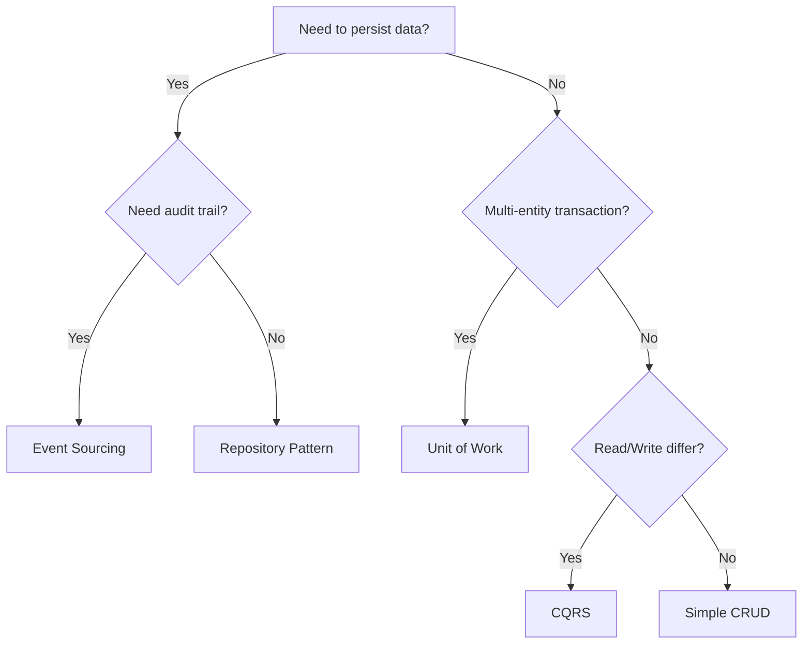

# Core Design Patterns

> Victor's core infrastructure implements enterprise design patterns for robust, scalable code.
> Last Updated: December 2025

## Quick Reference

| Pattern | Purpose | Victor Usage | Key Classes |
|---------|---------|--------------|-------------|
| Event Sourcing | Store state as event history | Audit trail, temporal queries | `Event`, `EventStore`, `Aggregate` |
| Repository | Abstract data access | Multi-backend support | `Repository`, `Entity` |
| Unit of Work | Atomic transactions | Cross-entity consistency | `UnitOfWork`, `transactional` |
| CQRS | Separate reads/writes | Scale optimization | `CommandBus`, `QueryBus`, `Mediator` |

---

## Pattern Comparison

| Pattern | When to Use | Pros | Cons |
|---------|-------------|------|------|
| **Event Sourcing** | Audit trail, temporal queries, complex domain | Complete history, replay/debug | Storage growth, complexity |
| **Repository** | Decouple persistence, multi-backend | Testable, swappable | Extra abstraction layer |
| **Unit of Work** | Multi-entity transactions | Atomic commits, rollback | Memory overhead |
| **CQRS** | Different read/write patterns | Scale independently | More infrastructure |

---

## Architecture Overview

```
+----------------------------------------------------------------------------+
|                         Victor Core Patterns                                |
+-----------------------+----------------------+------------------------------+
|  Event Sourcing       |     Repository       |      Unit of Work            |
|  - Event Store        |     - CRUD Ops       |      - Transactions          |
|  - Aggregates         |     - Specifications |      - Identity Map          |
|  - Projections        |     - Caching        |      - Change Tracking       |
+-----------+-----------+-----------+----------+--------------+---------------+
            |                       |                         |
            +-----------------------+-------------------------+
                                    |
                        +-----------v-----------+
                        |         CQRS          |
                        |  - Command Bus        |
                        |  - Query Bus          |
                        |  - Mediator           |
                        |  - Read Models        |
                        +-----------------------+
```

---

## Event Sourcing

### Core Components

| Component | Purpose | Usage |
|-----------|---------|-------|
| `Event` | Base event class | `@dataclass class TaskCreated(Event)` |
| `EventStore` | Store events | `await store.append(id, event)` |
| `Aggregate` | Domain logic | `task.apply(TaskCreatedEvent(...))` |
| `Projection` | Read-optimized views | `async def handle_TaskCreatedEvent(self, e)` |
| `EventDispatcher` | Route events | `dispatcher.register(projection)` |

### Quick Example

```python
from victor.core import Event, InMemoryEventStore, Aggregate

@dataclass
class TaskCreated(Event):
    task_id: str = ""
    title: str = ""

class TaskAggregate(Aggregate):
    def __init__(self):
        super().__init__()
        self.title = ""

    def create(self, task_id: str, title: str):
        self.apply(TaskCreated(task_id=task_id, title=title))

    def _apply_TaskCreated(self, event):
        self.id = event.task_id
        self.title = event.title

# Usage
store = InMemoryEventStore()
task = TaskAggregate()
task.create("task-1", "Build feature")
for event in task.pending_events:
    await store.append(task.id, event)
task.mark_events_committed()
```

### Event Store Options

| Store | Use Case | Configuration |
|-------|----------|---------------|
| `InMemoryEventStore` | Testing | `store = InMemoryEventStore()` |
| `SQLiteEventStore` | Production | `store = SQLiteEventStore("events.db")` |

---

## Repository Pattern

### Core Components

| Component | Purpose | Usage |
|-----------|---------|-------|
| `Entity` | Base entity with ID | `@dataclass class User(Entity)` |
| `Repository` | Abstract interface | `await repo.add(entity)` |
| `Specification` | Composable queries | `ActiveSpec() & NameSpec("Alice")` |
| `CachedRepository` | Add caching layer | `CachedRepository(base, ttl=300)` |

### Quick Example

```python
from victor.core import Entity, InMemoryRepository, AttributeSpecification

@dataclass
class User(Entity):
    name: str = ""
    email: str = ""
    active: bool = True

repo = InMemoryRepository[User]()

# CRUD
user = User(name="Alice", email="alice@example.com")
await repo.add(user)
found = await repo.get(user.id)
await repo.update(user)
await repo.delete(user.id)

# Query with specification
active_users = await repo.find(AttributeSpecification("active", True))
```

### Specification Combinators

| Operation | Example | Result |
|-----------|---------|--------|
| AND | `spec1 & spec2` | Both must match |
| OR | `spec1 | spec2` | Either matches |
| NOT | `~spec1` | Inverse match |

### Repository Options

| Repository | Use Case | Caching |
|------------|----------|---------|
| `InMemoryRepository` | Testing | No |
| `SQLiteRepository` | Production | No |
| `CachedRepository` | Performance | Yes (TTL-based) |

---

## Unit of Work

### Core Components

| Component | Purpose | Usage |
|-----------|---------|-------|
| `UnitOfWork` | Track changes | `uow.register_new(entity)` |
| `EntityState` | Track state | `NEW`, `MODIFIED`, `DELETED`, `CLEAN` |
| `transactional` | Context manager | `async with transactional(...) as uow` |

### Quick Example

```python
from victor.core import UnitOfWork, transactional

uow = UnitOfWork()
uow.register_repository(user_repo, User)
uow.register_repository(order_repo, Order)

# Track changes
user = User(name="Bob")
order = Order(user_id=user.id, total=99.99)
uow.register_new(user)
uow.register_new(order)

# Commit atomically
await uow.commit()  # Both saved or neither
```

### Context Manager Pattern

```python
async with transactional((user_repo, User), (order_repo, Order)) as uow:
    user = User(name="Charlie")
    order = Order(user_id=user.id, total=50.0)
    uow.register_new(user)
    uow.register_new(order)
    # Auto-commit on success, auto-rollback on error
```

### Change Tracking

| Method | Purpose |
|--------|---------|
| `register_new(entity)` | Mark as new (INSERT) |
| `register_modified(entity)` | Mark as modified (UPDATE) |
| `register_deleted(entity)` | Mark as deleted (DELETE) |
| `attach(entity)` | Start tracking existing entity |
| `has_changes()` | Check for pending changes |
| `rollback()` | Revert all changes |

---

## CQRS

### Core Components

| Component | Purpose | Usage |
|-----------|---------|-------|
| `Command` | Write operation | `CreateUserCommand(name="Alice")` |
| `CommandBus` | Route commands | `await bus.execute(command)` |
| `Query` | Read operation | `GetUserQuery(user_id="1")` |
| `QueryBus` | Route queries | `await bus.execute(query)` |
| `Mediator` | Unified dispatch | `await mediator.send(cmd_or_query)` |

### Quick Example

```python
from victor.core import Command, Query, CommandResult, QueryResult, Mediator

@dataclass
class CreateUserCommand(Command):
    name: str = ""
    email: str = ""

@dataclass
class GetUserQuery(Query[dict]):
    user_id: str = ""

async def handle_create_user(cmd):
    user_id = f"user-{cmd.email.split('@')[0]}"
    return CommandResult(success=True, data={"user_id": user_id})

async def handle_get_user(query):
    return QueryResult(success=True, data={"name": "Alice"})

mediator = Mediator()
mediator.register_command(CreateUserCommand, handle_create_user)
mediator.register_query(GetUserQuery, handle_get_user)

# Execute
result = await mediator.send(CreateUserCommand(name="Eve", email="eve@ex.com"))
user = await mediator.send(GetUserQuery(user_id="user-1"))
```

### Middleware

| Middleware | Purpose | Usage |
|------------|---------|-------|
| `LoggingCommandMiddleware` | Log execution | `bus.use(LoggingCommandMiddleware())` |
| `ValidationCommandMiddleware` | Validate input | `bus.use(ValidationCommandMiddleware())` |
| `RetryCommandMiddleware` | Retry on failure | `bus.use(RetryCommandMiddleware(max=3))` |
| `CachingQueryMiddleware` | Cache results | `bus.use(CachingQueryMiddleware(ttl=60))` |

---

## Integration Patterns

### Event Sourcing + CQRS

```python
@command_handler(CreateTaskCommand)
async def create_task(cmd):
    task = TaskAggregate()
    task.create(cmd.task_id, cmd.title)

    for event in task.pending_events:
        await event_store.append(task.id, event)
        await dispatcher.dispatch(event)  # Update projections

    task.mark_events_committed()
    return CommandResult(success=True)

@query_handler(GetTasksQuery)
async def get_tasks(query):
    return QueryResult(success=True, data=projection.tasks)
```

### Repository + Unit of Work

```python
async with transactional((user_repo, User), (order_repo, Order)) as uow:
    user = User(name="Helen")
    order = Order(user_id=user.id, total=100.0)
    uow.register_new(user)
    uow.register_new(order)
    # Auto-commit on success
```

---

## API Reference

### Event Sourcing

| Class | Description |
|-------|-------------|
| `Event` | Base with id, timestamp, aggregate_id |
| `InMemoryEventStore` | In-memory storage |
| `SQLiteEventStore` | SQLite persistence |
| `Aggregate` | Domain aggregate with event application |
| `EventDispatcher` | Dispatch to projections |
| `Projection` | Build read models from events |

### Repository

| Class | Description |
|-------|-------------|
| `Entity` | Base with id, created_at, updated_at |
| `InMemoryRepository` | In-memory repository |
| `SQLiteRepository` | SQLite repository |
| `CachedRepository` | Caching decorator |
| `BaseSpecification` | Query specification base |
| `AttributeSpecification` | Match entity attribute |

### Unit of Work

| Class | Description |
|-------|-------------|
| `UnitOfWork` | Track and commit changes |
| `SQLiteUnitOfWork` | SQLite transactions |
| `EntityState` | NEW, MODIFIED, DELETED, CLEAN |
| `transactional` | Context manager |

### CQRS

| Class | Description |
|-------|-------------|
| `Command` | Base command with id, timestamp |
| `CommandResult` | Command execution result |
| `CommandBus` | Route commands to handlers |
| `Query` | Base query with result type |
| `QueryResult` | Query execution result |
| `QueryBus` | Route queries to handlers |
| `Mediator` | Unified dispatch |

---

## Decision Guide



---

## Related Documentation

- [ARCHITECTURE_DEEP_DIVE.md](./ARCHITECTURE_DEEP_DIVE.md) - Overall architecture
- [STATE_MACHINE.md](./STATE_MACHINE.md) - Conversation state management
- [VERTICALS.md](./VERTICALS.md) - Domain-specific assistants
