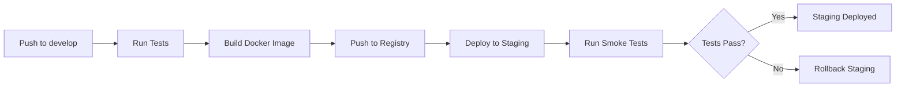
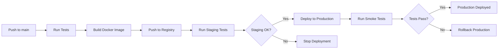

# Deployment Pipeline Guide

This guide covers deploying Victor applications to staging and production environments.

## Table of Contents

- [Overview](#overview)
- [Prerequisites](#prerequisites)
- [Environments](#environments)
- [Deployment Methods](#deployment-methods)
- [Deployment Pipeline](#deployment-pipeline)
- [Monitoring](#monitoring)
- [Rollback](#rollback)
- [Troubleshooting](#troubleshooting)

## Overview

Victor uses automated deployment with:

- **Docker containers** for consistent environments
- **GitHub Actions** for CI/CD
- **Multi-stage deployment** (staging → production)
- **Smoke tests** for verification
- **Rollback capability** for quick recovery

### Architecture

```
┌─────────────┐
│   GitHub    │
│  (Source)   │
└──────┬──────┘
       │
       ▼
┌─────────────┐
│  Docker Hub │
│ (Registry)  │
└──────┬──────┘
       │
       ▼
┌─────────────┐
│   Staging   │
│  (Test)     │
└──────┬──────┘
       │
       ▼
┌─────────────┐
│ Production  │
│  (Live)     │
└─────────────┘
```

## Prerequisites

### Tools Required

- Docker (>=20.10)
- kubectl (for Kubernetes) or docker-compose (for local)
- AWS CLI (for AWS deployment)
- Python 3.10+

### Access Required

- Docker Hub account
- AWS account (if deploying to AWS)
- Kubernetes cluster access (if using K8s)
- GitHub repository access

### Secrets Configuration

Set these in GitHub repository settings:

```bash
# Docker Hub
DOCKER_USERNAME=vijayksingh
DOCKER_PASSWORD=********

# AWS (staging)
AWS_ACCESS_KEY_ID_STAGING=********
AWS_SECRET_ACCESS_KEY_STAGING=********
AWS_REGION=us-east-1

# AWS (production)
AWS_ACCESS_KEY_ID=********
AWS_SECRET_ACCESS_KEY=********
AWS_REGION=us-east-1
```

## Environments

### Staging Environment

- **Purpose**: Testing before production
- **URL**: https://staging.victor.example.com
- **Trigger**: Push to `develop` branch
- **Auto-deploy**: Yes
- **Tests**: Full smoke tests

### Production Environment

- **Purpose**: Live deployment
- **URL**: https://victor.example.com
- **Trigger**: Push to `main` branch
- **Auto-deploy**: Yes (after staging passes)
- **Tests**: Smoke tests

## Deployment Methods

### 1. Automated Deployment (Recommended)

#### Deploy to Staging

```bash
# Push to develop branch
git checkout develop
git merge feature-branch
git push origin develop

# GitHub Actions automatically:
# 1. Runs tests
# 2. Builds Docker image
# 3. Pushes to registry
# 4. Deploys to staging
# 5. Runs smoke tests
```

#### Deploy to Production

```bash
# Option 1: Merge develop to main
git checkout main
git merge develop
git push origin main

# Option 2: Create release
gh release create v0.5.0 --notes "Release v0.5.0"

# GitHub Actions automatically:
# 1. Runs tests
# 2. Builds Docker image
# 3. Pushes to registry
# 4. Deploys to production
# 5. Runs smoke tests
```

### 2. Manual Deployment

#### Using Deployment Script

```bash
# Deploy to staging
bash scripts/ci/deploy.sh staging

# Deploy to production
bash scripts/ci/deploy.sh production

# Deploy specific version
bash scripts/ci/deploy.sh production --version 0.5.0

# Dry run (show what would happen)
bash scripts/ci/deploy.sh staging --dry-run
```

#### Using GitHub Actions Workflow Dispatch

1. Go to Actions > Deploy workflow
2. Click "Run workflow"
3. Select branch (main or develop)
4. Select environment (staging or production)
5. Enter version (optional)
6. Click "Run workflow"

### 3. Docker Deployment

#### Build and Run Locally

```bash
# Build image
docker build -t victor:local .

# Run container
docker run -it --rm \
  -v $(pwd):/workspace \
  victor:local \
  victor --help

# Run with environment variables
docker run -it --rm \
  -e ANTHROPIC_API_KEY=$ANTHROPIC_API_KEY \
  -e OPENAI_API_KEY=$OPENAI_API_KEY \
  victor:local \
  victor chat
```

#### Deploy to Docker Registry

```bash
# Build and push
bash scripts/ci/build_docker.sh --push

# Or manually
docker build -t vijayksingh/victor:v0.5.0 .
docker push vijayksingh/victor:v0.5.0
```

#### Pull and Run

```bash
# Pull image
docker pull vijayksingh/victor:latest

# Run container
docker run -it --rm \
  -v ~/.victor:/root/.victor \
  vijayksingh/victor:latest
```

### 4. Kubernetes Deployment

#### Create Deployment

```yaml
# k8s/deployment.yaml
apiVersion: apps/v1
kind: Deployment
metadata:
  name: victor
spec:
  replicas: 3
  selector:
    matchLabels:
      app: victor
  template:
    metadata:
      labels:
        app: victor
    spec:
      containers:
      - name: victor
        image: vijayksingh/victor:0.5.0
        ports:
        - containerPort: 8000
        env:
        - name: ANTHROPIC_API_KEY
          valueFrom:
            secretKeyRef:
              name: victor-secrets
              key: anthropic-api-key
```

#### Deploy

```bash
# Apply deployment
kubectl apply -f k8s/deployment.yaml

# Check status
kubectl get deployments
kubectl get pods

# View logs
kubectl logs -f deployment/victor
```

#### Update Deployment

```bash
# Update image
kubectl set image deployment/victor \
  victor=vijayksingh/victor:0.5.1

# Rollout status
kubectl rollout status deployment/victor

# Rollback if needed
kubectl rollout undo deployment/victor
```

### 5. Docker Compose Deployment

#### Docker Compose File

```yaml
# docker-compose.yml
version: '3.8'

services:
  victor:
    image: vijayksingh/victor:latest
    container_name: victor
    volumes:
      - ~/.victor:/root/.victor
      - ./workspace:/workspace
    environment:
      - ANTHROPIC_API_KEY=${ANTHROPIC_API_KEY}
      - OPENAI_API_KEY=${OPENAI_API_KEY}
    ports:
      - "8000:8000"
```

#### Deploy

```bash
# Start services
docker-compose up -d

# Check status
docker-compose ps

# View logs
docker-compose logs -f

# Stop services
docker-compose down
```

## Deployment Pipeline

### Staging Pipeline



### Production Pipeline



### Deployment Steps

#### 1. Build

```bash
# Build Docker image
docker build \
  --build-arg "VERSION=0.5.0" \
  --build-arg "BUILD_DATE=$(date -u +'%Y-%m-%dT%H:%M:%SZ')" \
  --build-arg "VCS_REF=$(git rev-parse --short HEAD)" \
  -t vijayksingh/victor:0.5.0 \
  -t vijayksingh/victor:latest \
  .
```

#### 2. Test

```bash
# Run smoke tests
bash scripts/ci/smoke_test.sh staging

# Tests:
# - Health check endpoint
# - Version endpoint
# - API availability
# - CLI functionality
```

#### 3. Deploy

```bash
# Kubernetes
kubectl set image deployment/victor \
  victor=vijayksingh/victor:0.5.0

# Docker Compose
docker-compose pull
docker-compose up -d

# AWS ECS
aws ecs update-service \
  --cluster victor-cluster \
  --service victor-service \
  --force-new-deployment
```

#### 4. Verify

```bash
# Check health
curl https://staging.victor.example.com/health

# Check version
curl https://staging.victor.example.com/version

# Run smoke tests
bash scripts/ci/smoke_test.sh staging
```

## Monitoring

### Health Checks

```bash
# Health endpoint
curl https://victor.example.com/health

# Expected response:
{
  "status": "healthy",
  "version": "0.5.0",
  "timestamp": "2025-01-15T10:00:00Z"
}
```

### Metrics

Monitor these metrics:

- **Response time**: <500ms (p95)
- **Error rate**: <1%
- **Availability**: >99.9%
- **CPU usage**: <70%
- **Memory usage**: <80%

### Logs

```bash
# Kubernetes logs
kubectl logs -f deployment/victor

# Docker logs
docker logs -f victor

# CloudWatch (AWS)
aws logs tail /victor/production --follow
```

### Alerts

Set up alerts for:

- High error rate (>5%)
- Slow response time (>1s)
- Service down (health check fails)
- High CPU/memory (>90%)

## Rollback

### Automatic Rollback

If smoke tests fail:

```bash
# Kubernetes
kubectl rollout undo deployment/victor

# Docker Compose
docker-compose down
docker-compose up -d --scale victor=0
docker-compose up -d --scale victor=3

# Git
git revert HEAD
git push origin main
```

### Manual Rollback

```bash
# 1. Identify previous version
kubectl rollout history deployment/victor

# 2. Rollback to specific version
kubectl rollout undo deployment/victor --to-revision=3

# 3. Verify
bash scripts/ci/smoke_test.sh production

# 4. If rollback succeeds, investigate failed version
```

### Rollback Decision Tree

```
Deployment Failed?
│
├─ Smoke Tests Failed?
│  └─ Automatic Rollback
│
├─ High Error Rate?
│  └─ Rollback if >5% for 5min
│
├─ Slow Response?
│  └─ Rollback if >1s for 5min
│
└─ Service Down?
   └─ Immediate Rollback
```

## Troubleshooting

### Deployment Fails

```bash
# Check deployment logs
kubectl logs -f deployment/victor

# Check pod status
kubectl describe pod <pod-name>

# Check events
kubectl get events --sort-by=.metadata.creationTimestamp

# Common issues:
# - Image pull error → Check image name/tag
# - CrashLoopBackOff → Check application logs
# - OOMKilled → Increase memory limits
```

### Smoke Tests Fail

```bash
# Run smoke tests manually
bash scripts/ci/smoke_test.sh staging --verbose

# Check specific test
curl -v https://staging.victor.example.com/health

# Check logs
kubectl logs -f deployment/victor

# Common issues:
# - Health check fails → Service not ready
# - API unavailable → Port not exposed
# - CLI not working → Missing dependencies
```

### Rollback Fails

```bash
# Check rollback history
kubectl rollout history deployment/victor

# Force rollback to specific version
kubectl rollout undo deployment/victor --to-revision=2

# If all else fails, scale to zero
kubectl scale deployment/victor --replicas=0

# Then redeploy known good version
kubectl set image deployment/victor \
  victor=vijayksingh/victor:0.4.9
kubectl scale deployment/victor --replicas=3
```

### Performance Issues

```bash
# Check resource usage
kubectl top pods -l app=victor

# Check HPA status
kubectl get hpa

# Check metrics
kubectl get --raw /apis/metrics.k8s.io/v1beta1/pods

# Common fixes:
# - Increase CPU/memory limits
# - Scale up replicas
# - Optimize application code
# - Add caching
```

## Best Practices

1. **Always deploy to staging first**
   - Test thoroughly
   - Run smoke tests
   - Verify manually

2. **Use semantic versioning**
   - MAJOR: Breaking changes
   - MINOR: New features
   - PATCH: Bug fixes

3. **Tag releases**
   ```bash
   git tag -a v0.5.0 -m "Release v0.5.0"
   git push origin v0.5.0
   ```

4. **Keep deployments small**
   - Frequent small releases
   - Easier to rollback
   - Faster to debug

5. **Monitor everything**
   - Set up alerts
   - Check dashboards
   - Review logs regularly

6. **Test in production-like environment**
   - Use staging
   - Load test
   - Security scan

7. **Have rollback plan**
   - Know previous version
   - Test rollback procedure
   - Document issues

## Resources

- [Kubernetes Documentation](https://kubernetes.io/docs/)
- [Docker Documentation](https://docs.docker.com/)
- [GitHub Actions Documentation](https://docs.github.com/en/actions)
- [AWS ECS Documentation](https://docs.aws.amazon.com/ecs/)
