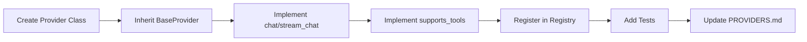
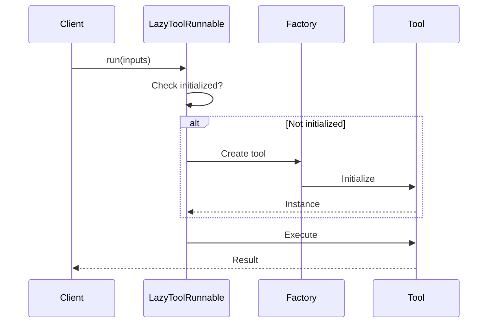
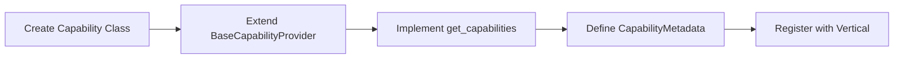
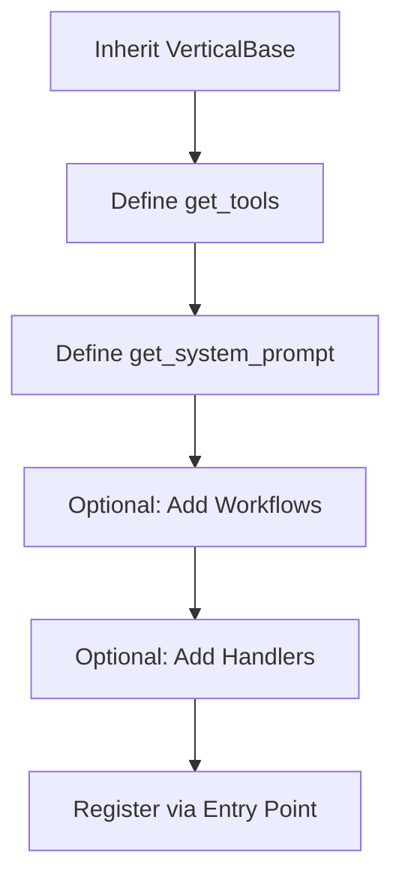

# Victor Developer Guide

A focused guide for contributing changes or extensions.

## Setup
```bash
git clone https://github.com/vijayksingh/victor.git
cd victor
pip install -e ".[dev]"
```

## Run Tests
```bash
pytest
ruff check victor tests
mypy victor
```

## Add a Provider (LLM)



1. Create a new provider in `victor/providers/`.
2. Implement the base interface.
3. Register it in the provider registry.
4. Add tests under `tests/unit/`.
5. Update `reference/PROVIDERS.md`.

## Add a Tool


1. Create a tool in `victor/tools/` (use the `@tool` decorator).
2. Add tests under `tests/unit/tools/`.
3. Regenerate the tool catalog if needed: `python scripts/generate_tool_catalog.py`.

## Add a Lazy Tool

Use `LazyToolRunnable` to defer tool initialization until first use. This reduces startup time for applications with many tools.



```python
from victor.tools.composition import LazyToolRunnable

# Basic lazy loading - tool created on first use
lazy_tool = LazyToolRunnable(lambda: ExpensiveTool(), name="expensive")

# Tool not created yet - no memory/resources used
result = lazy_tool.run({"input": "test"})  # Now created and cached
result2 = lazy_tool.run({"input": "test2"})  # Uses cached instance

# Disable caching for stateful tools that need fresh instances
stateful = LazyToolRunnable(lambda: StatefulTool(), cache=False)

# Check initialization status
if lazy_tool.is_initialized:
    lazy_tool.reset()  # Clear cached instance
```

For composing multiple lazy tools, use `ToolCompositionBuilder`:

```python
from victor.tools.composition import ToolCompositionBuilder

builder = ToolCompositionBuilder()
tools = (
    builder
    .add("search", lambda: SearchTool(), lazy=True)
    .add("analyze", lambda: AnalyzeTool(), lazy=True)
    .add_eager("format", FormatTool())  # Eager initialization
    .build()
)
# tools["search"] is a LazyToolRunnable (deferred)
# tools["format"] is the FormatTool instance (immediate)
```

## Add a Capability Provider

Extend `BaseCapabilityProvider` to register capabilities for a vertical. Capabilities are type-safe and include metadata for discovery.



```python
from typing import Dict
from victor.framework.capabilities import BaseCapabilityProvider, CapabilityMetadata

class MyCapability:
    """Your capability implementation."""
    def execute(self, context: dict) -> dict:
        return {"result": "done"}

class MyCapabilityProvider(BaseCapabilityProvider[MyCapability]):
    def __init__(self):
        self._capability = MyCapability()

    def get_capabilities(self) -> Dict[str, MyCapability]:
        return {"my_cap": self._capability}

    def get_capability_metadata(self) -> Dict[str, CapabilityMetadata]:
        return {
            "my_cap": CapabilityMetadata(
                name="my_cap",
                description="My custom capability",
                version="1.0",
                dependencies=["other_cap"],  # Optional dependencies
                tags=["custom", "example"]
            )
        }

# Usage
provider = MyCapabilityProvider()
cap = provider.get_capability("my_cap")
print(provider.list_capabilities())  # ["my_cap"]
print(provider.has_capability("my_cap"))  # True
```

## Create Agent Personas

Use `PersonaTraits` to define agent behavior and characteristics for multi-agent systems.

```python
from victor.framework.multi_agent import (
    PersonaTraits,
    CommunicationStyle,
    ExpertiseLevel,
    PersonaTemplate,
)

# Create a persona with traits
persona = PersonaTraits(
    name="CodeReviewer",
    role="reviewer",
    description="Reviews code for quality and correctness",
    communication_style=CommunicationStyle.TECHNICAL,
    expertise_level=ExpertiseLevel.EXPERT,
    verbosity=0.7,  # 0.0-1.0
    strengths=["code quality", "bug detection"],
    weaknesses=["UI design"],
    preferred_tools=["static_analysis", "grep_codebase"],
    risk_tolerance=0.3,  # Conservative
    creativity=0.4,
)

# Generate system prompt fragment
system_prompt = persona.to_system_prompt_fragment()

# Serialize/deserialize
data = persona.to_dict()
restored = PersonaTraits.from_dict(data)

# Create specialized personas from templates
base = PersonaTraits(
    name="Reviewer",
    role="reviewer",
    description="Reviews code",
    communication_style=CommunicationStyle.TECHNICAL,
)
template = PersonaTemplate(base_traits=base)
security_reviewer = template.create(
    name="Security Reviewer",
    description="Reviews code for security vulnerabilities",
    strengths=["vulnerability detection", "threat modeling"],
)
```

Communication styles: `FORMAL`, `CASUAL`, `TECHNICAL`, `CONCISE`
Expertise levels: `NOVICE`, `INTERMEDIATE`, `EXPERT`, `SPECIALIST`

## Register Progressive Tools

Use `ProgressiveToolsRegistry` for tools that escalate parameters based on context (e.g., increasing search depth).

```python
from victor.tools.progressive_registry import get_progressive_registry

registry = get_progressive_registry()

# Register a tool with progressive parameters
registry.register(
    tool_name="codebase_search",
    progressive_params={"depth": [1, 5, 10, 20]},  # Escalation levels
    initial_values={"depth": 1},
    max_values={"depth": 20},
)

# Check if a tool is progressive
if registry.is_progressive("codebase_search"):
    config = registry.get_config("codebase_search")
    print(config.progressive_params)  # {"depth": [1, 5, 10, 20]}

# List all progressive tools
tools = registry.list_progressive_tools()
```

## Register Tool Aliases

Use `ToolAliasResolver` to map alternative tool names (e.g., shell variants, grep alternatives).

```python
from victor.tools.alias_resolver import get_alias_resolver

resolver = get_alias_resolver()

# Register shell variants
resolver.register("shell", ["bash", "zsh", "sh"])

# Register grep alternatives
resolver.register("grep", ["ripgrep", "rg", "grep"])

# Resolve to an enabled variant
enabled_tools = ["zsh", "ripgrep"]
actual = resolver.resolve("shell", enabled_tools)  # Returns "zsh"
actual = resolver.resolve("grep", enabled_tools)   # Returns "ripgrep"

# Get canonical name
canonical = resolver.get_canonical("rg")  # Returns "grep"

# Check registration and get aliases
resolver.is_registered("bash")  # True
resolver.get_aliases("shell")   # ["bash", "zsh", "sh"]
```

## Add a Vertical

Create custom domain verticals for specialized use cases. Verticals bundle tools, system prompts, and optional workflows.



1. Create a new vertical inheriting from `VerticalBase` in `victor/core/verticals/`.
2. Implement `get_tools() -> List[str]` to specify which tools are available.
3. Implement `get_system_prompt() -> str` for domain-specific instructions.
4. Optionally add YAML workflows in `victor/{vertical}/workflows/`.
5. Optionally add handlers in `victor/{vertical}/handlers.py`.
6. For external verticals, register via entry points in `pyproject.toml`.

```python
from victor.core.verticals import VerticalBase

class SecurityVertical(VerticalBase):
    name = "security"

    def get_tools(self) -> list[str]:
        return ["static_analysis", "vulnerability_scan", "grep_codebase"]

    def get_system_prompt(self) -> str:
        return "You are a security analyst focused on identifying vulnerabilities..."
```

## Where to Look

| Directory | Purpose |
|-----------|---------|
| `victor/framework/` | Framework entrypoints, Agent API |
| `victor/agent/` | Core agent orchestration |
| `victor/tools/` | Tool implementations |
| `victor/tools/composition/` | Lazy loading, LCEL-style composition |
| `victor/tools/progressive_registry.py` | Progressive parameter escalation |
| `victor/tools/alias_resolver.py` | Tool name aliases and variants |
| `victor/providers/` | LLM provider implementations |
| `victor/core/verticals/` | Vertical base classes and registry |
| `victor/framework/capabilities/` | Capability providers for verticals |
| `victor/framework/multi_agent/` | Personas, teams, multi-agent systems |

## Docs
- Contributing: `../CONTRIBUTING.md`
- Tool catalog: `TOOL_CATALOG.md`
- Workflow DSL: `guides/WORKFLOW_DSL.md`
