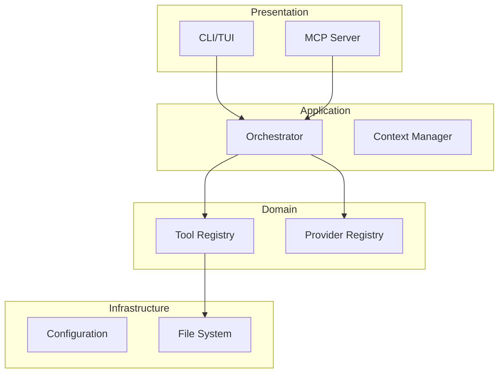
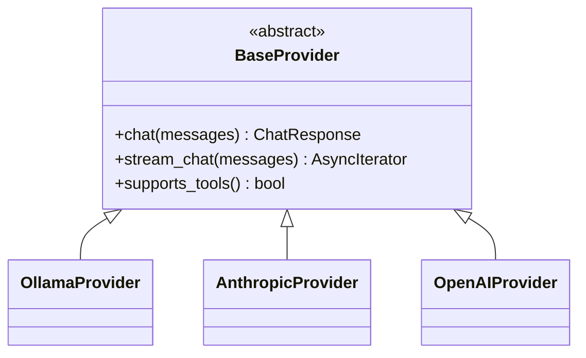
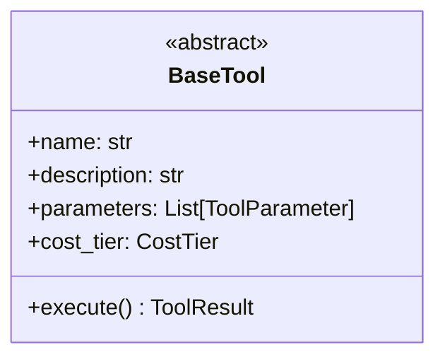
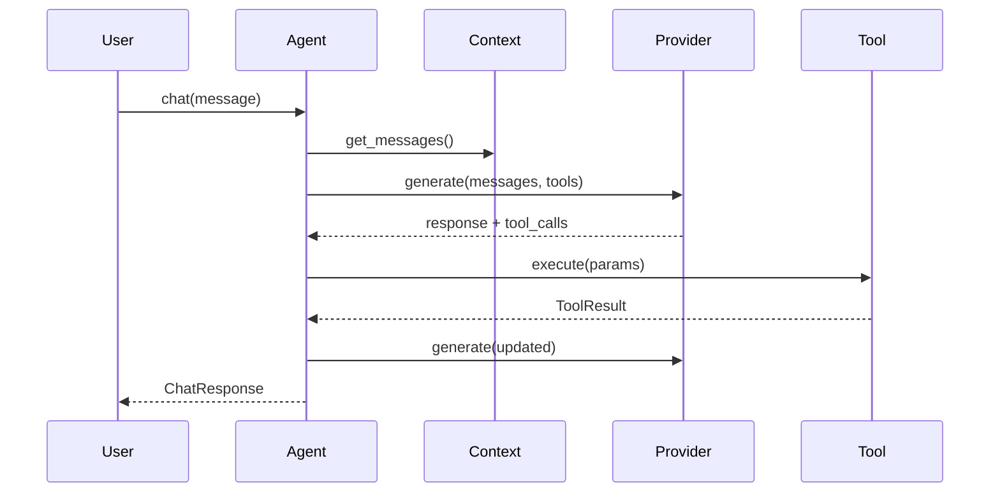
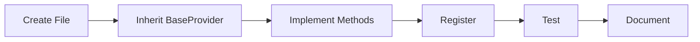
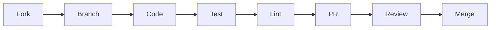

# Victor Developer Guide

> Comprehensive guide for developers contributing to or extending Victor

## Table of Contents

- [Architecture Overview](#architecture-overview)
- [Design Patterns](#design-patterns)
- [Core Systems](#core-systems)
- [Adding Components](#adding-components)
- [Phase 4 Features](#phase-4-features)
- [Development Workflow](#development-workflow)
- [Best Practices](#best-practices)

---

## Architecture Overview



### Design Principles

| Principle | Implementation |
|-----------|----------------|
| Provider Abstraction | Unified interface for all LLMs |
| Tool Registry | Dynamic discovery and registration |
| Plugin Architecture | Extension without core changes |
| Type Safety | Pydantic models throughout |
| Async First | All I/O operations async |
| Transaction-Based | Atomic operations with rollback |

---

## Design Patterns

### Pattern Matrix

| Pattern | When to Use | Example |
|---------|-------------|---------|
| **Facade** | Simplify complex subsystem | `AgentOrchestrator` |
| **Strategy** | Pluggable algorithms | `ToolSelector` |
| **Observer** | Event-driven | `EventBus` |
| **Protocol** | Duck typing contracts | `IRegistry` |
| **Registry** | Dynamic lookup | `ProviderRegistry` |
| **Adapter** | Normalize interfaces | `ToolCallingAdapter` |

### Key Abstractions

| Abstraction | Location | Purpose |
|-------------|----------|---------|
| `BaseProvider` | `victor/providers/base.py` | LLM interface |
| `BaseTool` | `victor/tools/base.py` | Tool interface |
| `ServiceProvider` | `victor/agent/service_provider.py` | DI container |
| `StateGraph` | `victor/framework/graph.py` | Workflow DSL |

---

## Core Systems

### Provider System



**Required Methods**:

| Method | Return | Description |
|--------|--------|-------------|
| `chat()` | `ChatResponse` | Synchronous completion |
| `stream_chat()` | `AsyncIterator` | Streaming completion |
| `supports_tools()` | `bool` | Tool calling support |
| `name` | `str` | Provider identifier |

### Tool System



**Tool Properties**:

| Property | Type | Purpose |
|----------|------|---------|
| `name` | `str` | Unique identifier |
| `description` | `str` | LLM-visible description |
| `parameters` | `List[ToolParameter]` | JSON Schema params |
| `cost_tier` | `CostTier` | FREE/LOW/MEDIUM/HIGH |
| `priority` | `Priority` | Selection weight |
| `access_mode` | `AccessMode` | READONLY/WRITE/EXECUTE |

### Agent Orchestrator



---

## Adding Components

### New Provider



**Steps**:

1. Create `victor/providers/my_provider.py`
2. Inherit from `BaseProvider`
3. Implement required methods
4. Register in `ProviderRegistry`
5. Add tests in `tests/unit/providers/`
6. Update documentation

**Template**:

```python
from victor.providers.base import BaseProvider, ChatResponse

class MyProvider(BaseProvider):
    def __init__(self, api_key: str):
        self.api_key = api_key

    @property
    def name(self) -> str:
        return "my_provider"

    async def chat(self, messages, **kwargs) -> ChatResponse:
        # Implementation
        pass

    async def stream_chat(self, messages, **kwargs):
        # Implementation
        pass

    def supports_tools(self) -> bool:
        return True
```

### New Tool

**Steps**:

1. Create `victor/tools/my_tool.py`
2. Inherit from `BaseTool`
3. Define properties and `execute()`
4. Register in orchestrator
5. Add tests
6. Run `python scripts/generate_tool_catalog.py`

**Template**:

```python
from victor.tools.base import BaseTool, ToolResult, CostTier

class MyTool(BaseTool):
    @property
    def name(self) -> str:
        return "my_tool"

    @property
    def description(self) -> str:
        return "Does something useful"

    @property
    def parameters(self) -> list:
        return [
            {"name": "param", "type": "string", "required": True}
        ]

    @property
    def cost_tier(self) -> CostTier:
        return CostTier.LOW

    async def execute(self, **kwargs) -> ToolResult:
        return ToolResult(success=True, output="Done")
```

### New Model Support

Edit `victor/config/model_capabilities.yaml`:

```yaml
models:
  "my-model*":
    native_tool_calls: true
    parallel_tool_calls: true
    recommended_tool_budget: 15
```

> **Note**: No code changes required - `ModelCapabilityLoader` auto-discovers patterns.

---

## Phase 4 Features

### StateGraph DSL

| Feature | Description |
|---------|-------------|
| Typed State | TypedDict schemas |
| Conditional Edges | Branch on state |
| Cycles | Retry loops |
| Checkpointing | Resume workflows |

```python
from victor.framework.graph import StateGraph, END

graph = StateGraph(MyState)
graph.add_node("process", process_fn)
graph.add_conditional_edge("process", condition, {"retry": "process", "done": END})
graph.set_entry_point("process")
app = graph.compile()
```

### Multi-Agent Teams

| Formation | Description |
|-----------|-------------|
| SEQUENTIAL | One after another |
| PARALLEL | Simultaneous |
| PIPELINE | Output flows through |
| HIERARCHICAL | Manager coordinates |

```python
from victor.framework.teams import AgentTeam, TeamMemberSpec, TeamFormation

team = await AgentTeam.create(
    orchestrator=orchestrator,
    name="Team",
    goal="Implement feature",
    members=[TeamMemberSpec(role="executor", goal="Write code")],
    formation=TeamFormation.PIPELINE,
)
```

### Dynamic Capability Loading

```python
from victor.framework import CapabilityLoader, capability, CapabilityType

@capability(name="custom", capability_type=CapabilityType.TOOL)
def custom_handler(**kwargs):
    pass

loader = CapabilityLoader()
loader.load_from_module("my_plugin.capabilities")
loader.apply_to(orchestrator)
```

---

## Development Workflow

### Contribution Flow



### Commands

| Task | Command |
|------|---------|
| Test | `pytest` |
| Single test | `pytest tests/unit/test_X.py::test_name` |
| Coverage | `pytest --cov --cov-report=html` |
| Format | `black victor tests` |
| Lint | `ruff check victor tests` |
| Type check | `mypy victor` |
| All checks | `black . && ruff check . && mypy victor && pytest` |

### PR Checklist

| Check | Command |
|-------|---------|
| Tests pass | `pytest` |
| Code formatted | `black --check .` |
| No lint errors | `ruff check .` |
| Types valid | `mypy victor` |
| Docs updated | Manual review |

---

## Best Practices

### Error Handling

```python
async def execute(self, **kwargs) -> ToolResult:
    try:
        result = await self._operation(kwargs)
        return ToolResult(success=True, output=result)
    except ValidationError as e:
        return ToolResult(success=False, error=f"Validation: {e}")
    except Exception as e:
        logger.exception("Unexpected error")
        return ToolResult(success=False, error=str(e))
```

### Async Patterns

```python
# Good: Batch operations
results = await asyncio.gather(op1(), op2(), op3())

# Good: Context managers
async with client as c:
    response = await c.post(url, json=data)

# Good: Streaming
async for chunk in provider.stream_chat(messages):
    yield chunk
```

### Type Hints

```python
from typing import List, Optional, Dict, Any

async def process(
    self,
    items: List[str],
    options: Optional[Dict[str, Any]] = None
) -> List[Dict[str, str]]:
    """Process items with options."""
    ...
```

### Logging

```python
import logging
logger = logging.getLogger(__name__)

logger.debug("Detailed info")
logger.info("General info", extra={"operation": op})
logger.warning("Warning condition")
logger.error("Error occurred", exc_info=True)
```

### Testing

```python
@pytest.fixture
def tool():
    return MyTool()

async def test_success(tool):
    result = await tool.execute(operation="test")
    assert result.success

async def test_error(tool):
    result = await tool.execute(operation="invalid")
    assert not result.success
```

---

## Related Documentation

| Document | Description |
|----------|-------------|
| [USER_GUIDE.md](USER_GUIDE.md) | End-user guide |
| [CONTRIBUTING.md](../CONTRIBUTING.md) | Contribution guidelines |
| [TOOL_CATALOG.md](TOOL_CATALOG.md) | All 45 tools |
| [WORKFLOW_DSL.md](guides/WORKFLOW_DSL.md) | StateGraph guide |

---

*Last Updated: 2025-12-30*
