# Victor Developer Guide

> Comprehensive guide for developers contributing to or extending Victor

## Table of Contents

- [Architecture Overview](#architecture-overview)
- [Core Concepts](#core-concepts)
- [System Design](#system-design)
- [Module Deep Dives](#module-deep-dives)
- [Adding New Features](#adding-new-features)
- [Development Workflow](#development-workflow)
- [Best Practices](#best-practices)

## Architecture Overview

Victor follows a layered architecture with clear separation of concerns:

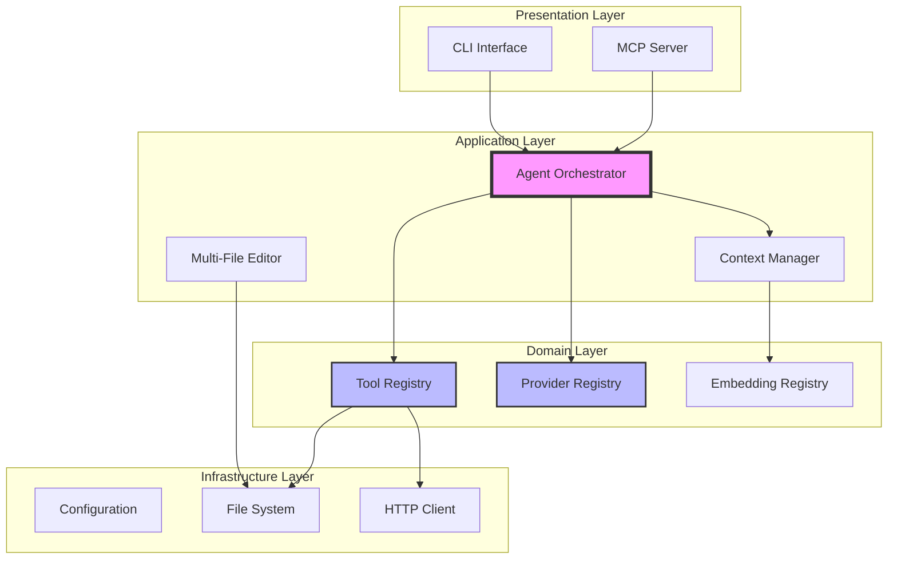

### Design Principles

1. **Provider Abstraction**: Unified interface for all LLM providers
2. **Tool Registry**: Dynamic tool discovery and registration
3. **Plugin Architecture**: Easy extension without core modifications
4. **Type Safety**: Pydantic models throughout
5. **Async First**: All I/O operations are async
6. **Transaction-Based**: Atomic operations with rollback support

## Core Concepts

### 1. Provider System

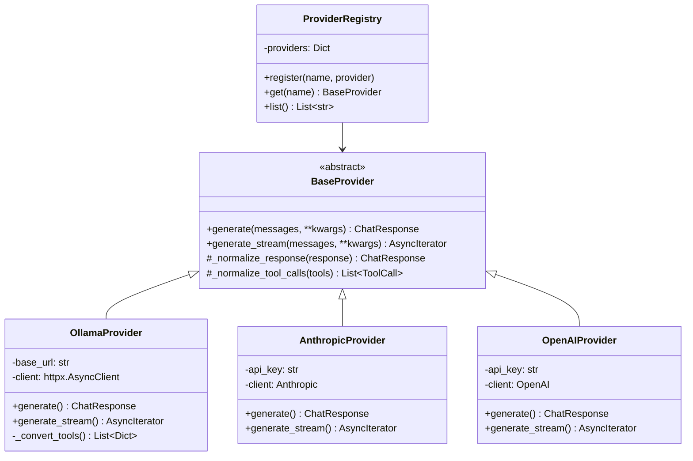

**Key Points**:
- All providers implement `BaseProvider` interface
- Response normalization ensures consistent output
- Tool call translation handles provider-specific formats
- Async streaming for real-time responses

### 2. Tool System

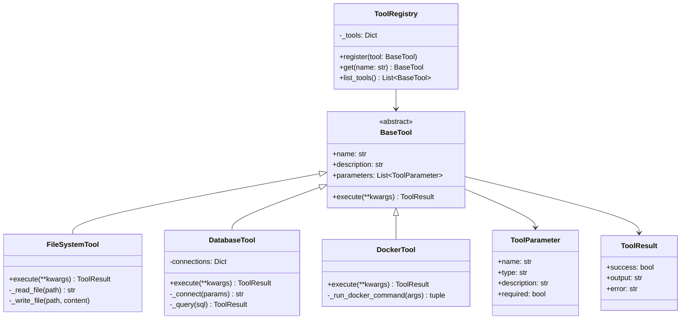

**Key Points**:
- Standardized tool interface
- Self-describing with parameters
- Consistent result format
- Registry pattern for discovery

### 3. Agent Orchestrator

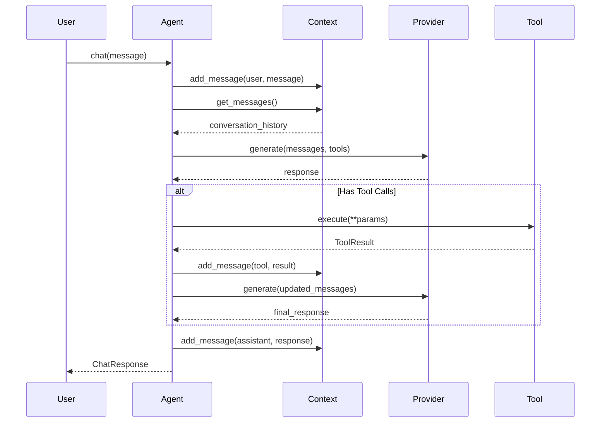

**Key Points**:
- Manages conversation flow
- Coordinates tool execution
- Handles multi-turn interactions
- Context window management

## System Design

### Request Flow

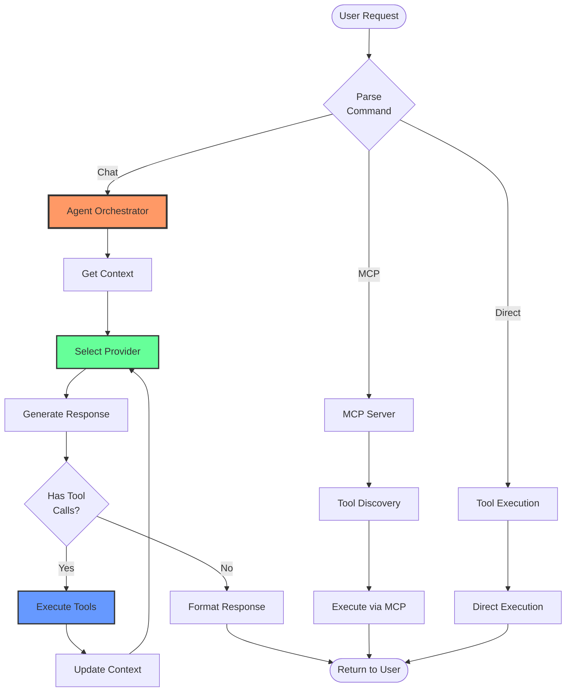

### Multi-File Editing System

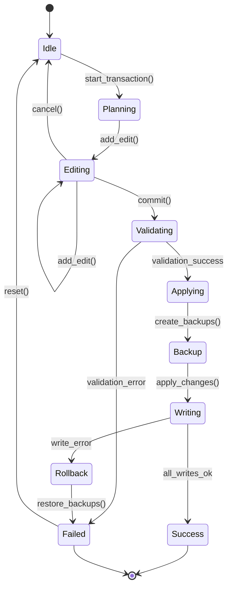

**Transaction Properties**:
- **Atomic**: All edits succeed or none do
- **Consistent**: Files remain in valid state
- **Isolated**: No partial state visible
- **Durable**: Changes persist after commit

### MCP Protocol Integration

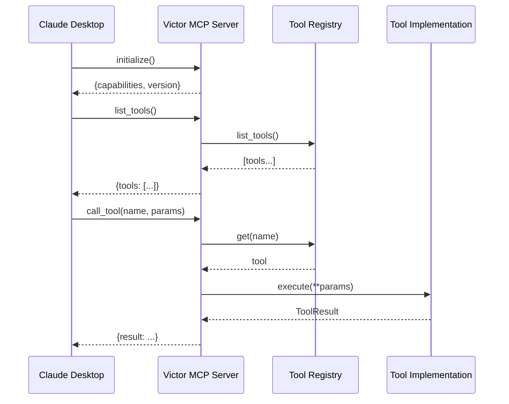

## Module Deep Dives

### Provider Module (`victor/providers/`)

**Purpose**: Abstract LLM provider differences

```python
# Base Provider Interface
class BaseProvider:
    async def generate(
        self,
        messages: List[Message],
        tools: Optional[List[Dict]] = None,
        **kwargs
    ) -> ChatResponse:
        """Generate completion from messages."""
        raise NotImplementedError

    async def generate_stream(
        self,
        messages: List[Message],
        tools: Optional[List[Dict]] = None,
        **kwargs
    ) -> AsyncIterator[ChatResponse]:
        """Stream completion chunks."""
        raise NotImplementedError
```

**Provider Lifecycle**:

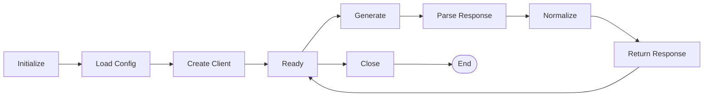

### Tool Module (`victor/tools/`)

**Tool Execution Pipeline**:

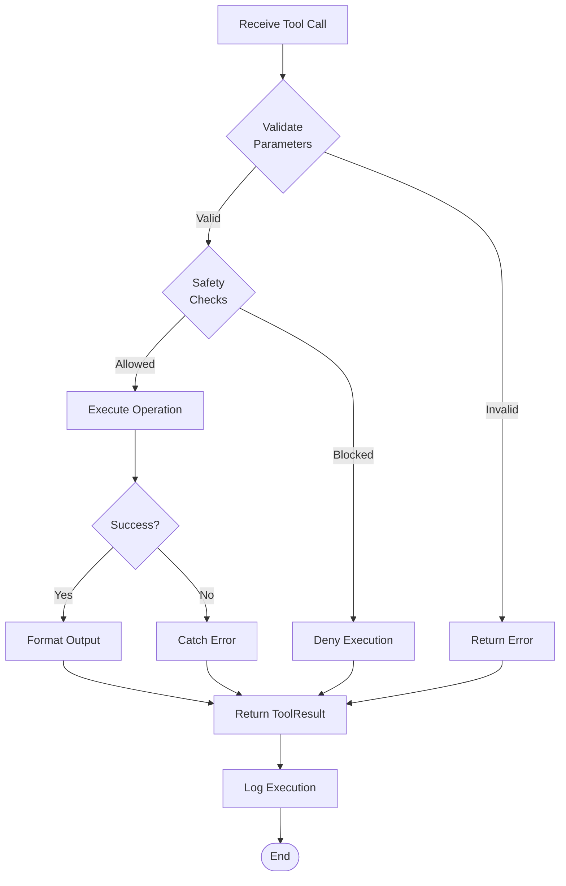

**Database Tool Architecture**:

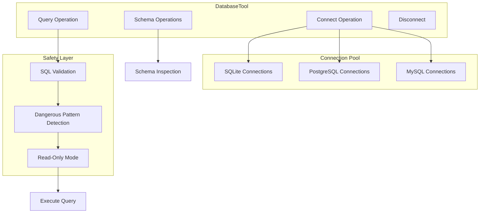

### Context Management (`victor/context/`)

**Context Window Strategy**:

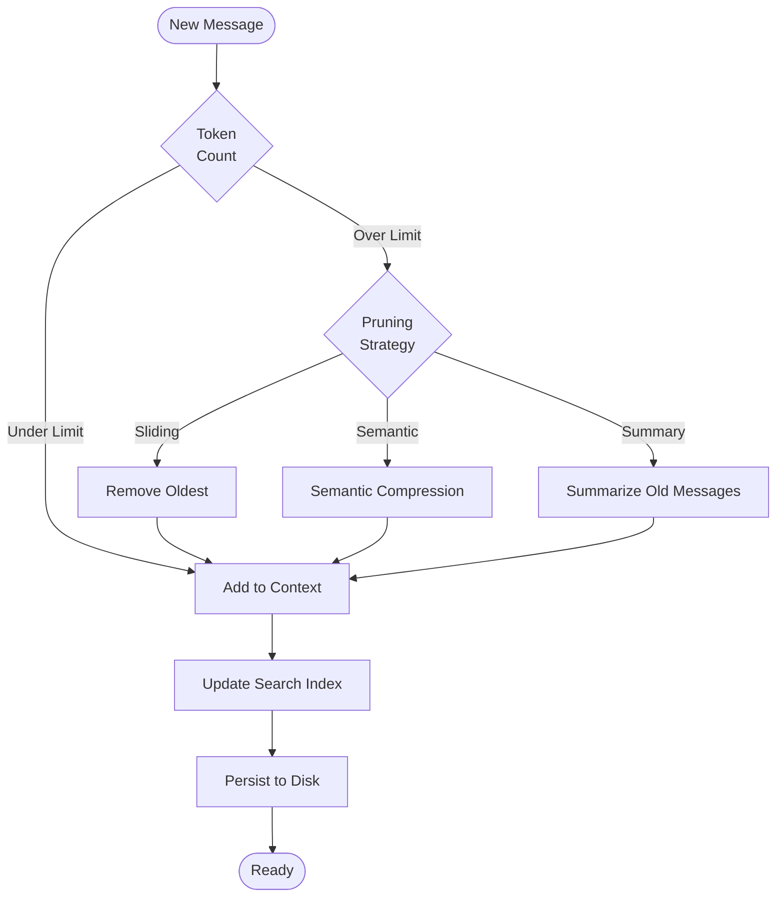

## Adding New Features

### Adding a New Provider

```mermaid
flowchart TD
    Start([New Provider]) --> Inherit[Inherit BaseProvider]
    Inherit --> Implement[Implement Methods]

    Implement --> Gen[generate()]
    Implement --> Stream[generate_stream()]
    Implement --> Norm[_normalize_response()]

    Gen --> Client[Create HTTP Client]
    Stream --> Client
    Norm --> Format[Format to ChatResponse]

    Client --> Test[Write Unit Tests]
    Format --> Test

    Test --> Register[Register in Registry]
    Register --> Config[Add to Config Schema]
    Config --> Docs[Update Documentation]
    Docs --> Example[Create Example]
    Example --> End([Complete])

    style Start fill:#9f9
    style End fill:#9f9
```

**Step-by-Step**:

1. **Create provider file**: `victor/providers/my_provider.py`

```python
from typing import List, Optional, AsyncIterator
from victor.providers.base import BaseProvider, ChatResponse, Message
import httpx

class MyProvider(BaseProvider):
    def __init__(self, api_key: str, base_url: str):
        super().__init__()
        self.api_key = api_key
        self.client = httpx.AsyncClient(
            base_url=base_url,
            headers={"Authorization": f"Bearer {api_key}"}
        )

    async def generate(
        self,
        messages: List[Message],
        **kwargs
    ) -> ChatResponse:
        # Implementation
        response = await self.client.post(
            "/chat",
            json={"messages": messages, **kwargs}
        )
        return self._normalize_response(response.json())

    def _normalize_response(self, response: dict) -> ChatResponse:
        # Convert provider format to ChatResponse
        return ChatResponse(
            content=response["output"],
            role="assistant",
            model=response["model"]
        )
```

2. **Register provider**: Update `victor/providers/registry.py`

3. **Add tests**: `tests/unit/providers/test_my_provider.py`

4. **Update config**: Add to `profiles.yaml.example`

5. **Document**: Add to README and PROVIDERS.md

### Adding a New Tool

```mermaid
flowchart TD
    Start([New Tool Idea]) --> Design[Design Interface]
    Design --> Params[Define Parameters]
    Params --> Impl[Implement execute()]

    Impl --> Safety{Needs<br/>Safety?}
    Safety -->|Yes| Checks[Add Safety Checks]
    Safety -->|No| Test

    Checks --> Test[Write Tests]
    Test --> Register[Register in Registry]
    Register --> MCP[Verify MCP Exposure]
    MCP --> Docs[Write Documentation]
    Docs --> Example[Create Example]
    Example --> End([Complete])

    style Start fill:#9f9
    style End fill:#9f9
```

**Example: Custom Tool**:

```python
from typing import Any, List
from victor.tools.base import BaseTool, ToolParameter, ToolResult

class MyCustomTool(BaseTool):
    """Custom tool for specific operations."""

    @property
    def name(self) -> str:
        return "my_custom_tool"

    @property
    def description(self) -> str:
        return """Perform custom operations.

        Operations:
        - operation1: Does X
        - operation2: Does Y

        Example:
        my_custom_tool(operation="operation1", param="value")
        """

    @property
    def parameters(self) -> List[ToolParameter]:
        return [
            ToolParameter(
                name="operation",
                type="string",
                description="Operation to perform",
                required=True
            ),
            ToolParameter(
                name="param",
                type="string",
                description="Operation parameter",
                required=False
            )
        ]

    async def execute(self, **kwargs: Any) -> ToolResult:
        operation = kwargs.get("operation")

        if operation == "operation1":
            result = self._operation1(kwargs)
            return ToolResult(
                success=True,
                output=result,
                error=""
            )

        return ToolResult(
            success=False,
            output="",
            error=f"Unknown operation: {operation}"
        )
```

## Development Workflow

### Feature Development Lifecycle

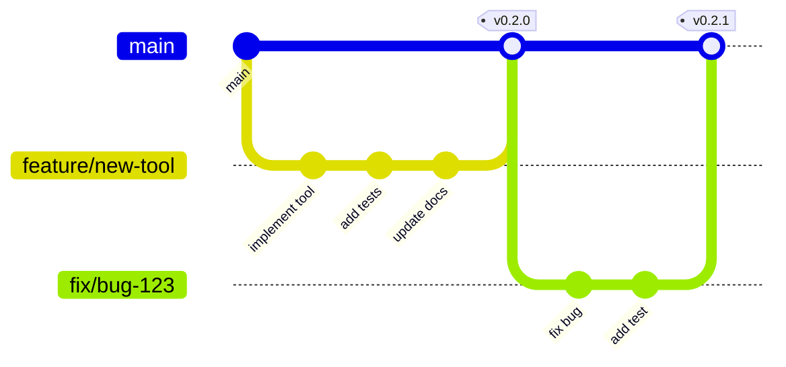

### Code Review Checklist

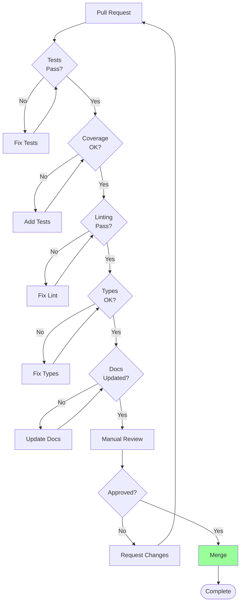

## Best Practices

### 1. Error Handling

```python
# Good: Specific error handling
async def execute(self, **kwargs):
    try:
        result = await self._perform_operation(kwargs)
        return ToolResult(success=True, output=result, error="")
    except ValidationError as e:
        logger.error("Validation failed: %s", e)
        return ToolResult(success=False, output="", error=f"Validation: {e}")
    except ConnectionError as e:
        logger.error("Connection failed: %s", e)
        return ToolResult(success=False, output="", error=f"Connection: {e}")
    except Exception as e:
        logger.exception("Unexpected error")
        return ToolResult(success=False, output="", error=str(e))
```

### 2. Async Best Practices

```python
# Good: Use async context managers
async with self.client as client:
    response = await client.post(url, json=data)

# Good: Batch async operations
results = await asyncio.gather(
    self.operation1(),
    self.operation2(),
    self.operation3()
)

# Good: Stream processing
async for chunk in provider.generate_stream(messages):
    yield chunk
```

### 3. Type Hints

```python
# Good: Complete type hints
from typing import List, Optional, Dict, Any

async def process(
    self,
    items: List[str],
    options: Optional[Dict[str, Any]] = None
) -> List[Dict[str, str]]:
    """Process items with options."""
    results: List[Dict[str, str]] = []
    for item in items:
        result = await self._process_item(item, options or {})
        results.append(result)
    return results
```

### 4. Logging

```python
import logging

logger = logging.getLogger(__name__)

# Good: Structured logging with context
logger.info("Processing request", extra={
    "operation": operation,
    "user_id": user_id,
    "request_id": request_id
})

# Good: Log levels
logger.debug("Detailed debugging info")
logger.info("General information")
logger.warning("Warning condition")
logger.error("Error occurred", exc_info=True)
```

### 5. Testing

```python
# Good: Comprehensive test coverage
class TestMyTool:
    @pytest.fixture
    def tool(self):
        return MyTool(config={"key": "value"})

    async def test_success_case(self, tool):
        """Test successful execution."""
        result = await tool.execute(operation="test")
        assert result.success
        assert "expected" in result.output

    async def test_error_handling(self, tool):
        """Test error handling."""
        result = await tool.execute(operation="invalid")
        assert not result.success
        assert "error" in result.error.lower()

    async def test_edge_cases(self, tool):
        """Test edge cases."""
        # Empty input
        result = await tool.execute()
        assert not result.success

        # Large input
        result = await tool.execute(data="x" * 10000)
        assert result.success
```

---

**Next**: See [USER_GUIDE.md](USER_GUIDE.md) for end-user documentation

**Related**:
- [TESTING_STRATEGY.md](TESTING_STRATEGY.md) - Testing approach
- [CONTRIBUTING.md](../CONTRIBUTING.md) - Contribution guidelines
- [ARCHITECTURE.md](ARCHITECTURE.md) - Detailed architecture

*Last Updated: 2025-11-24*
