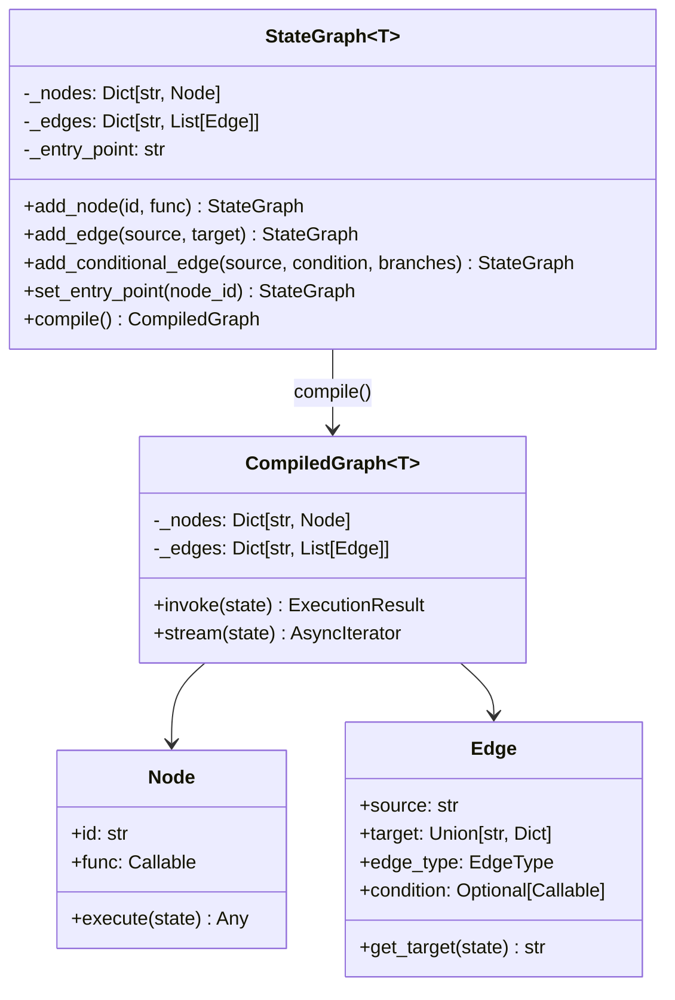
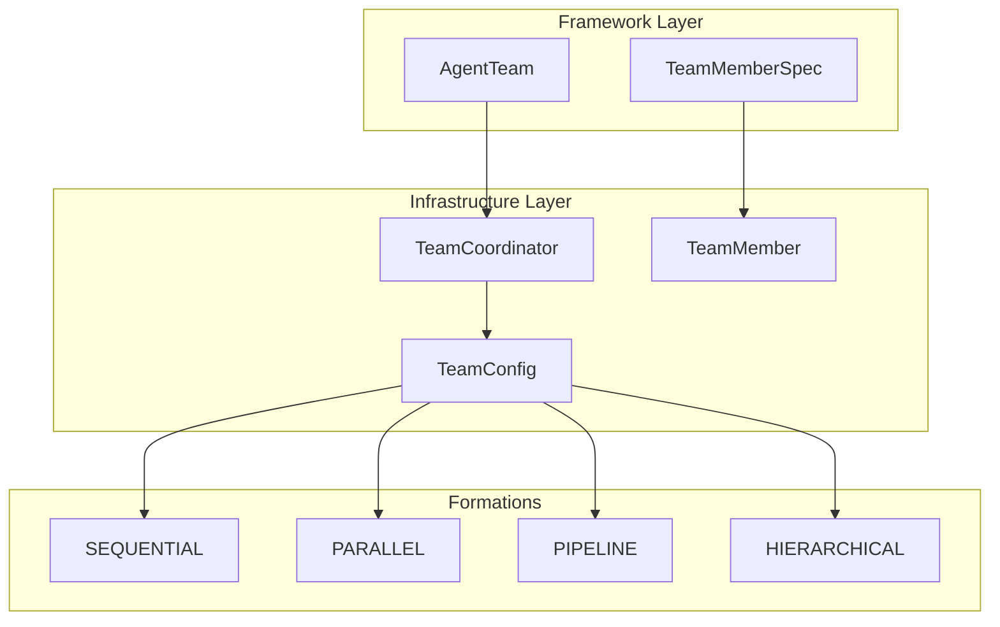

# Victor Developer Guide

> Comprehensive guide for developers contributing to or extending Victor

## Table of Contents

- [Architecture Overview](#architecture-overview)
- [Core Concepts](#core-concepts)
- [System Design](#system-design)
- [Module Deep Dives](#module-deep-dives)
- [Adding New Features](#adding-new-features)
- [Phase 4 Features](#phase-4-features)
  - [StateGraph DSL](#stategraph-dsl)
  - [Multi-Agent Teams](#multi-agent-teams)
  - [Rich Agent Personas](#rich-agent-personas)
  - [Dynamic Capability Loading](#dynamic-capability-loading)
- [Development Workflow](#development-workflow)
- [Best Practices](#best-practices)

## Architecture Overview

Victor follows a layered architecture with clear separation of concerns:


### Design Principles

1. **Provider Abstraction**: Unified interface for all LLM providers
2. **Tool Registry**: Dynamic tool discovery and registration
3. **Plugin Architecture**: Easy extension without core modifications
4. **Type Safety**: Pydantic models throughout
5. **Async First**: All I/O operations are async
6. **Transaction-Based**: Atomic operations with rollback support

## Core Concepts

### 1. Provider System

```mermaid
classDiagram
    class BaseProvider {
        <<abstract>>
        +generate(messages, **kwargs) ChatResponse
        +generate_stream(messages, **kwargs) AsyncIterator
        #_normalize_response(response) ChatResponse
        #_normalize_tool_calls(tools) List~ToolCall~
    }

    class OllamaProvider {
        -base_url: str
        -client: httpx.AsyncClient
        +generate() ChatResponse
        +generate_stream() AsyncIterator
        -_convert_tools() List~Dict~
    }

    class AnthropicProvider {
        -api_key: str
        -client: Anthropic
        +generate() ChatResponse
        +generate_stream() AsyncIterator
    }

    class OpenAIProvider {
        -api_key: str
        -client: OpenAI
        +generate() ChatResponse
        +generate_stream() AsyncIterator
    }

    BaseProvider <|-- OllamaProvider
    BaseProvider <|-- AnthropicProvider
    BaseProvider <|-- OpenAIProvider

    class ProviderRegistry {
        -providers: Dict
        +register(name, provider)
        +get(name) BaseProvider
        +list() List~str~
    }

    ProviderRegistry --> BaseProvider
```



**Key Points**:
- All providers implement `BaseProvider` interface
- Response normalization ensures consistent output
- Tool call translation handles provider-specific formats
- Async streaming for real-time responses

### 2. Tool System


**Key Points**:
- Standardized tool interface
- Self-describing with parameters
- Consistent result format
- Registry pattern for discovery

### 3. Agent Orchestrator


**Key Points**:
- Manages conversation flow
- Coordinates tool execution
- Handles multi-turn interactions
- Context window management

## System Design

### Request Flow


### Multi-File Editing System


**Transaction Properties**:
- **Atomic**: All edits succeed or none do
- **Consistent**: Files remain in valid state
- **Isolated**: No partial state visible
- **Durable**: Changes persist after commit

### MCP Protocol Integration


## Module Deep Dives

### Provider Module (`victor/providers/`)

**Purpose**: Abstract LLM provider differences

```python
# Base Provider Interface
class BaseProvider:
    async def generate(
        self,
        messages: List[Message],
        tools: Optional[List[Dict]] = None,
        **kwargs
    ) -> ChatResponse:
        """Generate completion from messages."""
        raise NotImplementedError

    async def generate_stream(
        self,
        messages: List[Message],
        tools: Optional[List[Dict]] = None,
        **kwargs
    ) -> AsyncIterator[ChatResponse]:
        """Stream completion chunks."""
        raise NotImplementedError
```

**Provider Lifecycle**:


### Tool Module (`victor/tools/`)

**Tool Execution Pipeline**:


**Database Tool Architecture**:


### Context Management (`victor/context/`)

**Context Window Strategy**:


## Adding New Features

### Adding a New Provider

```mermaid
flowchart TD
    Start([New Provider]) --> Inherit[Inherit BaseProvider]
    Inherit --> Implement[Implement Methods]

    Implement --> Gen[generate()]
    Implement --> Stream[generate_stream()]
    Implement --> Norm[_normalize_response()]

    Gen --> Client[Create HTTP Client]
    Stream --> Client
    Norm --> Format[Format to ChatResponse]

    Client --> Test[Write Unit Tests]
    Format --> Test

    Test --> Register[Register in Registry]
    Register --> Config[Add to Config Schema]
    Config --> Docs[Update Documentation]
    Docs --> Example[Create Example]
    Example --> End([Complete])

    style Start fill:#9f9
    style End fill:#9f9
```

**Step-by-Step**:

1. **Create provider file**: `victor/providers/my_provider.py`

```python
from typing import List, Optional, AsyncIterator
from victor.providers.base import BaseProvider, ChatResponse, Message
import httpx

class MyProvider(BaseProvider):
    def __init__(self, api_key: str, base_url: str):
        super().__init__()
        self.api_key = api_key
        self.client = httpx.AsyncClient(
            base_url=base_url,
            headers={"Authorization": f"Bearer {api_key}"}
        )

    async def generate(
        self,
        messages: List[Message],
        **kwargs
    ) -> ChatResponse:
        # Implementation
        response = await self.client.post(
            "/chat",
            json={"messages": messages, **kwargs}
        )
        return self._normalize_response(response.json())

    def _normalize_response(self, response: dict) -> ChatResponse:
        # Convert provider format to ChatResponse
        return ChatResponse(
            content=response["output"],
            role="assistant",
            model=response["model"]
        )
```

2. **Register provider**: Update `victor/providers/registry.py`

3. **Add tests**: `tests/unit/providers/test_my_provider.py`

4. **Update config**: Add to `profiles.yaml.example`

5. **Document**: Add to README and PROVIDERS.md

### Adding a New Tool

```mermaid
flowchart TD
    Start([New Tool Idea]) --> Design[Design Interface]
    Design --> Params[Define Parameters]
    Params --> Impl[Implement execute()]

    Impl --> Safety{Needs<br/>Safety?}
    Safety -->|Yes| Checks[Add Safety Checks]
    Safety -->|No| Test

    Checks --> Test[Write Tests]
    Test --> Register[Register in Registry]
    Register --> MCP[Verify MCP Exposure]
    MCP --> Docs[Write Documentation]
    Docs --> Example[Create Example]
    Example --> End([Complete])

    style Start fill:#9f9
    style End fill:#9f9
```

**Example: Custom Tool**:

```python
from typing import Any, List
from victor.tools.base import BaseTool, ToolParameter, ToolResult

class MyCustomTool(BaseTool):
    """Custom tool for specific operations."""

    @property
    def name(self) -> str:
        return "my_custom_tool"

    @property
    def description(self) -> str:
        return """Perform custom operations.

        Operations:
        - operation1: Does X
        - operation2: Does Y

        Example:
        my_custom_tool(operation="operation1", param="value")
        """

    @property
    def parameters(self) -> List[ToolParameter]:
        return [
            ToolParameter(
                name="operation",
                type="string",
                description="Operation to perform",
                required=True
            ),
            ToolParameter(
                name="param",
                type="string",
                description="Operation parameter",
                required=False
            )
        ]

    async def execute(self, **kwargs: Any) -> ToolResult:
        operation = kwargs.get("operation")

        if operation == "operation1":
            result = self._operation1(kwargs)
            return ToolResult(
                success=True,
                output=result,
                error=""
            )

        return ToolResult(
            success=False,
            output="",
            error=f"Unknown operation: {operation}"
        )
```

## Phase 4 Features

Phase 4 introduces advanced workflow and multi-agent capabilities. This section covers implementation details for developers extending these features.

### StateGraph DSL

The StateGraph DSL (victor/framework/graph.py) provides a LangGraph-compatible API for building stateful, cyclic agent workflows.

**Architecture**:



**Creating Custom Workflows**:

```python
from victor.framework.graph import StateGraph, END, GraphConfig, MemoryCheckpointer
from typing import TypedDict

# 1. Define your state schema
class MyWorkflowState(TypedDict):
    input: str
    intermediate: list[str]
    output: str
    iteration_count: int

# 2. Create node functions (sync or async)
async def process_input(state: MyWorkflowState) -> MyWorkflowState:
    """Node functions receive state and return modified state."""
    state["intermediate"].append(f"Processed: {state['input']}")
    return state

async def validate_output(state: MyWorkflowState) -> MyWorkflowState:
    state["iteration_count"] += 1
    # Logic to determine if output is valid
    return state

# 3. Create condition functions for branching
def needs_more_processing(state: MyWorkflowState) -> str:
    """Returns branch name based on state."""
    if state["iteration_count"] < 3 and not state.get("output"):
        return "retry"
    return "complete"

# 4. Build the graph
graph = StateGraph(MyWorkflowState)

# Add nodes
graph.add_node("process", process_input)
graph.add_node("validate", validate_output)

# Add edges
graph.add_edge("process", "validate")
graph.add_conditional_edge(
    "validate",
    needs_more_processing,
    {"retry": "process", "complete": END}
)

# Set entry point
graph.set_entry_point("process")

# 5. Compile with optional checkpointing
checkpointer = MemoryCheckpointer()  # Or RLCheckpointerAdapter for persistence
app = graph.compile(
    checkpointer=checkpointer,
    max_iterations=25,  # Cycle limit
    timeout=60.0,       # Overall timeout
)

# 6. Execute
result = await app.invoke({
    "input": "Hello",
    "intermediate": [],
    "output": "",
    "iteration_count": 0
})

# Access results
print(result.success)       # True/False
print(result.state)         # Final state
print(result.node_history)  # ["process", "validate", "process", ...]
print(result.iterations)    # Number of iterations
```

**Integration with RL System**:

```python
from victor.framework.graph import RLCheckpointerAdapter

# Use existing RL checkpoint store for workflow persistence
checkpointer = RLCheckpointerAdapter(learner_name="my_workflow")
app = graph.compile(checkpointer=checkpointer)

# Workflow completions emit RL events automatically
# See victor/agent/rl/hooks.py for event types
```

### Multi-Agent Teams

The Teams module (victor/framework/teams.py) provides a high-level API for multi-agent coordination.

**Architecture**:



**Creating Custom Team Workflows**:

```python
from victor.framework.teams import (
    AgentTeam,
    TeamMemberSpec,
    TeamFormation,
    TeamEvent,
    TeamEventType,
)
from victor.agent.orchestrator import AgentOrchestrator

# Create orchestrator first
orchestrator = await AgentOrchestrator.from_settings(settings)

# Define team members with rich specs
members = [
    TeamMemberSpec(
        role="researcher",
        goal="Find relevant code patterns",
        name="Code Researcher",
        tool_budget=20,
        priority=0,  # Runs first in sequential/pipeline
    ),
    TeamMemberSpec(
        role="executor",
        goal="Implement the solution",
        name="Implementation Agent",
        tool_budget=30,
        priority=1,
    ),
]

# Create team
team = await AgentTeam.create(
    orchestrator=orchestrator,
    name="Implementation Team",
    goal="Implement feature X",
    members=members,
    formation=TeamFormation.PIPELINE,
    total_tool_budget=100,
    max_iterations=50,
    timeout_seconds=600,
    shared_context={"feature": "authentication"},
)

# Execute with event handling
async for event in team.stream():
    match event.type:
        case TeamEventType.TEAM_START:
            print(f"Team started: {event.team_name}")
        case TeamEventType.MEMBER_START:
            print(f"Member started: {event.member_name}")
        case TeamEventType.MEMBER_COMPLETE:
            print(f"Member completed: {event.member_name}")
            if event.result:
                print(f"  Output: {event.result.output[:100]}...")
        case TeamEventType.TEAM_COMPLETE:
            print(f"Team completed: {event.message}")
```

**Formation Selection Guide**:

| Formation | When to Use | How It Works |
|-----------|-------------|--------------|
| SEQUENTIAL | Simple task handoffs | Members run one-by-one in priority order |
| PARALLEL | Independent subtasks | All members run concurrently |
| PIPELINE | Staged workflows | Output flows as input to next stage |
| HIERARCHICAL | Complex coordination | Manager delegates and aggregates |

### Rich Agent Personas

TeamMember supports CrewAI-compatible rich persona attributes for natural agent characterization.

**Persona Attributes**:

```python
from victor.framework.teams import TeamMemberSpec
from victor.agent.teams.team import MemoryConfig

# Full persona specification
spec = TeamMemberSpec(
    # Core attributes
    role="researcher",
    goal="Find security vulnerabilities in authentication code",
    name="Security Analyst",

    # Rich persona (affects prompt construction)
    backstory="""Senior security researcher with 10 years experience.
    Previously led red team exercises at Fortune 500 companies.
    Specializes in OAuth vulnerabilities and JWT implementation flaws.""",

    expertise=["security", "oauth", "jwt", "penetration-testing"],

    personality="""Methodical and thorough. Always provides severity ratings.
    Prefers to over-communicate findings rather than miss issues.""",

    # Capabilities
    max_delegation_depth=2,  # Can spawn sub-agents

    # Memory configuration
    memory=True,  # Simple flag
    memory_config=MemoryConfig(  # Detailed config (overrides simple flag)
        enabled=True,
        persist_across_sessions=True,
        memory_types={"entity", "semantic"},
        relevance_threshold=0.7,
    ),

    # Tool management
    cache=True,           # Cache tool results
    tool_budget=25,       # Max tool calls
    max_iterations=50,    # Per-member iteration limit

    # Debugging
    verbose=True,         # Show detailed logs
)
```

**Memory Integration**:

```python
# Memory coordinator auto-attaches when memory=True
member = spec.to_team_member()

# Access memory coordinator
if member.memory_enabled:
    coordinator = member.get_memory_coordinator()
    # Stores discoveries across tasks
```

### Dynamic Capability Loading

The CapabilityLoader (victor/framework/capability_loader.py) enables runtime capability discovery and hot-reload.

**Creating Capability Modules**:

```python
# my_plugin/capabilities.py
from victor.framework import capability, CapabilityType
from victor.framework.protocols import OrchestratorCapability

# Method 1: Decorator-based definition
@capability(
    name="custom_safety_check",
    capability_type=CapabilityType.SAFETY,
    version="1.0",
    description="Apply custom safety patterns to agent responses",
)
def custom_safety_check(patterns: list[str]) -> None:
    """Handler function for the capability."""
    for pattern in patterns:
        # Apply pattern logic
        pass

# Method 2: CAPABILITIES list
from victor.framework.capability_loader import CapabilityEntry

CAPABILITIES = [
    CapabilityEntry(
        capability=OrchestratorCapability(
            name="custom_tool",
            capability_type=CapabilityType.TOOL,
            version="1.0",
            setter="set_custom_tool",
        ),
        handler=my_tool_handler,
        getter_handler=get_custom_tool,
    ),
]

# Method 3: Capability classes
class CustomAnalyzer:
    def get_capability(self) -> OrchestratorCapability:
        return OrchestratorCapability(
            name="analyzer",
            capability_type=CapabilityType.TOOL,
            version="2.0",
        )

    def execute(self, **kwargs):
        return {"analysis": "result"}
```

**Loading and Hot-Reloading**:

```python
from victor.framework import (
    CapabilityLoader,
    create_capability_loader,
    get_default_capability_loader,
)
from pathlib import Path

# Create loader with plugin directories
loader = create_capability_loader(
    plugin_dirs=[Path("~/.victor/capabilities"), Path("./plugins")],
    auto_discover=True,  # Scan directories on init
)

# Or get the default loader (~/.victor/capabilities/)
loader = get_default_capability_loader()

# Load from specific module
loaded = loader.load_from_module("my_plugin.capabilities")
print(f"Loaded: {loaded}")  # ["custom_safety_check", "custom_tool", "analyzer"]

# Load from file path
loader.load_from_path("./custom_capabilities.py")

# Hot-reload during development
loader.reload_module("my_plugin.capabilities")  # Invalidates cache, reloads

# File watching (requires watchdog)
loader.watch_for_changes(callback=lambda mod: print(f"Reloaded: {mod}"))

# Apply to orchestrator
from victor.agent.orchestrator import AgentOrchestrator

orchestrator = await AgentOrchestrator.from_settings(settings)
applied = loader.apply_to(orchestrator)
print(f"Applied {len(applied)} capabilities")

# Query loaded capabilities
print(loader.list_capabilities())
print(loader.get_capabilities_by_type(CapabilityType.SAFETY))
print(loader.list_loaded_modules())

# Cleanup
loader.stop_watching()
```

**Capability Types**:

| Type | Purpose | Example |
|------|---------|---------|
| TOOL | Add new tools | Custom code analyzer |
| SAFETY | Safety checks | Custom content filter |
| PROMPT | Prompt modifications | Domain-specific context |
| MIDDLEWARE | Request/response hooks | Logging, metrics |
| CONFIG | Configuration overrides | Provider settings |

## Development Workflow

### Feature Development Lifecycle


### Code Review Checklist


## Best Practices

### 1. Error Handling

```python
# Good: Specific error handling
async def execute(self, **kwargs):
    try:
        result = await self._perform_operation(kwargs)
        return ToolResult(success=True, output=result, error="")
    except ValidationError as e:
        logger.error("Validation failed: %s", e)
        return ToolResult(success=False, output="", error=f"Validation: {e}")
    except ConnectionError as e:
        logger.error("Connection failed: %s", e)
        return ToolResult(success=False, output="", error=f"Connection: {e}")
    except Exception as e:
        logger.exception("Unexpected error")
        return ToolResult(success=False, output="", error=str(e))
```

### 2. Async Best Practices

```python
# Good: Use async context managers
async with self.client as client:
    response = await client.post(url, json=data)

# Good: Batch async operations
results = await asyncio.gather(
    self.operation1(),
    self.operation2(),
    self.operation3()
)

# Good: Stream processing
async for chunk in provider.generate_stream(messages):
    yield chunk
```

### 3. Type Hints

```python
# Good: Complete type hints
from typing import List, Optional, Dict, Any

async def process(
    self,
    items: List[str],
    options: Optional[Dict[str, Any]] = None
) -> List[Dict[str, str]]:
    """Process items with options."""
    results: List[Dict[str, str]] = []
    for item in items:
        result = await self._process_item(item, options or {})
        results.append(result)
    return results
```

### 4. Logging

```python
import logging

logger = logging.getLogger(__name__)

# Good: Structured logging with context
logger.info("Processing request", extra={
    "operation": operation,
    "user_id": user_id,
    "request_id": request_id
})

# Good: Log levels
logger.debug("Detailed debugging info")
logger.info("General information")
logger.warning("Warning condition")
logger.error("Error occurred", exc_info=True)
```

### 5. Testing

```python
# Good: Comprehensive test coverage
class TestMyTool:
    @pytest.fixture
    def tool(self):
        return MyTool(config={"key": "value"})

    async def test_success_case(self, tool):
        """Test successful execution."""
        result = await tool.execute(operation="test")
        assert result.success
        assert "expected" in result.output

    async def test_error_handling(self, tool):
        """Test error handling."""
        result = await tool.execute(operation="invalid")
        assert not result.success
        assert "error" in result.error.lower()

    async def test_edge_cases(self, tool):
        """Test edge cases."""
        # Empty input
        result = await tool.execute()
        assert not result.success

        # Large input
        result = await tool.execute(data="x" * 10000)
        assert result.success
```

---

**Next**: See [USER_GUIDE.md](USER_GUIDE.md) for end-user documentation

**Related**:
- [TESTING_STRATEGY.md](TESTING_STRATEGY.md) - Testing approach
- [CONTRIBUTING.md](../CONTRIBUTING.md) - Contribution guidelines
- [ARCHITECTURE_DEEP_DIVE.md](ARCHITECTURE_DEEP_DIVE.md) - Detailed architecture

*Last Updated: 2025-11-24*
