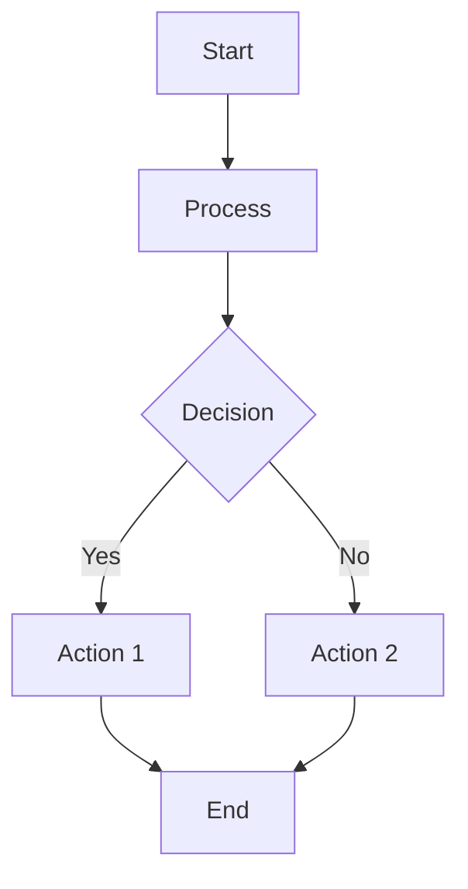
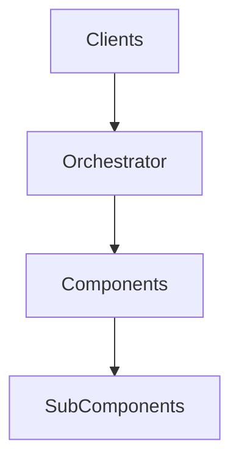
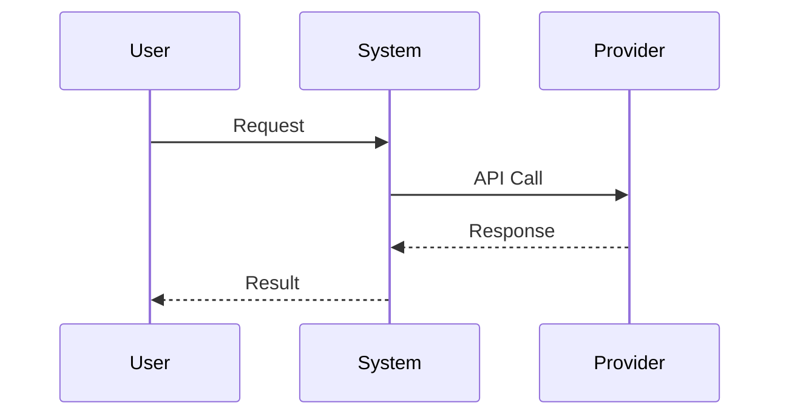
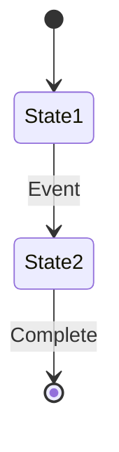

<div align="center">

# Victor AI Diagrams Index

**Complete index of all architecture and workflow diagrams**

[](./INDEX.md)
[](https://mermaid.js.org/)

</div>

---

## Welcome to the Diagrams Index

This index catalogs all Mermaid diagrams used throughout Victor AI's documentation. Diagrams are organized by category and include descriptions and links to their locations.

### Diagram Categories

- [Architecture Diagrams](#architecture-diagrams) - System architecture and components
- [Workflow Diagrams](#workflow-diagrams) - Workflow and process flows
- [Sequence Diagrams](#sequence-diagrams) - Component interactions
- [State Diagrams](#state-diagrams) - State machines and transitions
- [Class Diagrams](#class-diagrams) - Class structures and relationships

---

## Architecture Diagrams

### High-Level Architecture

**Description**: Overall system architecture showing clients, orchestrator, and components

**Location**: [Quick Start](./QUICKSTART.md), [Architecture Overview](./architecture/overview.md)

**Diagram Type**: Flowchart

```
┌─────────────────────────────────────────────────────────────────┐
│                    CLIENTS                                       │
│  CLI/TUI  │  VS Code (HTTP)  │  MCP Server  │  API Server       │
└─────────────────────────┬───────────────────────────────────────┘
                          ▼
┌─────────────────────────────────────────────────────────────────┐
│                 AGENT ORCHESTRATOR (Facade)                      │
│  Delegates to: ConversationController, ToolPipeline,            │
│  StreamingController, ProviderManager, ToolRegistrar            │
└─────────────────────────┬───────────────────────────────────────┘
                          ▼
┌───────────┬─────────────┬───────────────┬───────────────────────┐
│ PROVIDERS │   TOOLS     │  WORKFLOWS    │  VERTICALS            │
│  21       │   55        │  StateGraph   │  Coding/DevOps/RAG/   │
│           │             │  + YAML       │  DataAnalysis/Research│
└───────────┴─────────────┴───────────────┴───────────────────────┘
```

### Component Architecture

**Description**: Detailed component relationships and interactions

**Location**: [Component Reference](./architecture/COMPONENT_REFERENCE.md)

**Diagram Type**: Flowchart

### Dependency Injection

**Description**: ServiceContainer and dependency flow

**Location**: [Architecture Overview](./architecture/overview.md)

**Diagram Type**: Flowchart

### Event Bus Architecture

**Description**: Event-driven communication flow

**Location**: [Observability README](./observability/README.md)

**Diagram Type**: Flowchart

---

## Workflow Diagrams

### Tool Execution Flow

**Description**: How tools are selected and executed

**Location**: [Component Reference](./architecture/COMPONENT_REFERENCE.md)

**Diagram Type**: Sequence diagram

### Workflow Execution

**Description**: StateGraph workflow execution flow

**Location**: [Workflows README](./workflows/README.md)

**Diagram Type**: State diagram

### Multi-Agent Coordination

**Description**: How multiple agents coordinate

**Location**: [Agent Swarming Guide](./AGENT_SWARMING_GUIDE.md)

**Diagram Type**: Sequence diagram

### CI/CD Pipeline

**Description**: Continuous integration and deployment flow

**Location**: [CI/CD Setup](./CI_CD_SETUP.md)

**Diagram Type**: Flowchart

---

## Sequence Diagrams

### Chat Request Flow

**Description**: Complete flow of a chat request from client to provider

**Location**: [Architecture Overview](./architecture/overview.md)

**Diagram Type**: Sequence diagram

### Tool Calling Flow

**Description**: How tools are called during conversation

**Location**: [Component Reference](./architecture/COMPONENT_REFERENCE.md)

**Diagram Type**: Sequence diagram

### Provider Switching

**Description**: How providers are switched mid-conversation

**Location**: [Provider Guide](./user-guide/providers.md)

**Diagram Type**: Sequence diagram

### Workflow Execution Flow

**Description**: Step-by-step workflow execution

**Location**: [Workflows Guide](./user-guide/workflows.md)

**Diagram Type**: Sequence diagram

---

## State Diagrams

### Conversation State Machine

**Description**: States and transitions in a conversation

**Location**: [Conversation Controller](./architecture/COMPONENT_REFERENCE.md)

**Diagram Type**: State diagram

**States**:
- INITIAL
- PLANNING
- READING
- ANALYZING
- EXECUTING
- VERIFICATION
- COMPLETION

### Provider Circuit Breaker

**Description**: Circuit breaker states for provider failures

**Location**: [Provider Reference](./api/PROVIDER_REFERENCE.md)

**Diagram Type**: State diagram

**States**:
- CLOSED
- OPEN
- HALF_OPEN

### Cache State Machine

**Description**: Cache states and transitions

**Location**: [Caching Strategy](./performance/caching_strategy.md)

**Diagram Type**: State diagram

---

## Class Diagrams

### Provider Hierarchy

**Description**: Class hierarchy for LLM providers

**Location**: [Provider Reference](./api/PROVIDER_REFERENCE.md)

**Diagram Type**: Class diagram

**Key Classes**:
- BaseProvider (abstract)
- AnthropicProvider
- OpenAIProvider
- OllamaProvider
- ... (21 total providers)

### Tool Hierarchy

**Description**: Class hierarchy for tools

**Location**: [Tool Reference](./api-reference/tools.md)

**Diagram Type**: Class diagram

**Key Classes**:
- BaseTool (abstract)
- FileReadTool
- SearchTool
- ... (55 total tools)

### Vertical Hierarchy

**Description**: Class hierarchy for verticals

**Location**: [Verticals README](./verticals/README.md)

**Diagram Type**: Class diagram

**Key Classes**:
- VerticalBase (abstract)
- CodingAssistant
- DevOpsAssistant
- RAGAssistant
- DataAnalysisAssistant
- ResearchAssistant

---

## Diagrams by Directory

### Architecture Diagrams

**Directory**: `docs/architecture/`

| Diagram | Description | Type | Location |
|---------|-------------|------|----------|
| System Architecture | High-level architecture | Flowchart | overview.md |
| Component Architecture | Component relationships | Flowchart | COMPONENT_REFERENCE.md |
| Coordinator Pattern | Coordinator interactions | Sequence diagram | coordinator_based_architecture.md |
| Service Container | Dependency injection flow | Flowchart | overview.md |

### API Diagrams

**Directory**: `docs/api/`

| Diagram | Description | Type | Location |
|---------|-------------|------|----------|
| Provider Interface | Provider API structure | Class diagram | PROVIDER_REFERENCE.md |
| Tool Interface | Tool API structure | Class diagram | API_REFERENCE.md |
| Protocol Hierarchy | Protocol relationships | Class diagram | PROTOCOL_REFERENCE.md |

### Workflow Diagrams

**Directory**: `docs/workflows/`, `docs/workflow-diagrams/`

| Diagram | Description | Type | Location |
|---------|-------------|------|----------|
| StateGraph Execution | Workflow execution flow | State diagram | README.md |
| Step Handler Flow | Step handler execution | Sequence diagram | extensions/step_handler_guide.md |
| Workflow Compilation | YAML to StateGraph | Flowchart | workflows/unified_compiler.py |

### Performance Diagrams

**Directory**: `docs/performance/`

| Diagram | Description | Type | Location |
|---------|-------------|------|----------|
| Caching Layers | Cache architecture | Flowchart | caching_strategy.md |
| Tool Selection Cache | Cache flow diagram | Sequence diagram | tool_selection_caching.md |
| Lazy Loading | Lazy loading flow | Flowchart | lazy_loading.md |

### Development Diagrams

**Directory**: `docs/development/`

| Diagram | Description | Type | Location |
|---------|-------------|------|----------|
| Development Workflow | Contribution flow | Flowchart | index.md |
| Testing Strategy | Test structure | Flowchart | testing.md |
| CI/CD Pipeline | Build and deploy | Flowchart | ci_cd/README.md |

---

## Diagrams by Type

### Flowchart Diagrams

System flows and processes:

1. [High-Level Architecture](./QUICKSTART.md) - System architecture
2. [Tool Execution Flow](./architecture/COMPONENT_REFERENCE.md) - Tool selection and execution
3. [Workflow Compilation](./workflows/README.md) - YAML to StateGraph
4. [Caching Layers](./performance/caching_strategy.md) - Cache architecture
5. [CI/CD Pipeline](./CI_CD_SETUP.md) - Build and deploy flow
6. [Development Workflow](./development/index.md) - Contribution process

### Sequence Diagrams

Component interactions:

1. [Chat Request Flow](./architecture/overview.md) - Complete chat flow
2. [Tool Calling Flow](./architecture/COMPONENT_REFERENCE.md) - Tool execution
3. [Provider Switching](./user-guide/providers.md) - Switching providers
4. [Multi-Agent Coordination](./AGENT_SWARMING_GUIDE.md) - Agent coordination
5. [Step Handler Execution](./extensions/step_handler_guide.md) - Step processing

### State Diagrams

State machines and transitions:

1. [Conversation State Machine](./architecture/COMPONENT_REFERENCE.md) - Conversation stages
2. [Provider Circuit Breaker](./api/PROVIDER_REFERENCE.md) - Failure handling
3. [Cache State Machine](./performance/caching_strategy.md) - Cache states
4. [Workflow Execution](./user-guide/workflows.md) - Workflow states

### Class Diagrams

Class structures and relationships:

1. [Provider Hierarchy](./api/PROVIDER_REFERENCE.md) - Provider classes
2. [Tool Hierarchy](./api-reference/tools.md) - Tool classes
3. [Vertical Hierarchy](./verticals/README.md) - Vertical classes
4. [Protocol Hierarchy](./api/PROTOCOL_REFERENCE.md) - Protocol relationships

---

## Creating Diagrams

### Mermaid Syntax

Victor uses Mermaid for diagrams. Basic syntax:



### Best Practices

1. **Keep it simple** - Avoid overcrowding diagrams
2. **Use consistent styling** - Same colors for similar components
3. **Add descriptions** - Explain what the diagram shows
4. **Link to context** - Reference related documentation
5. **Maintain consistency** - Use similar diagrams for similar concepts

### Diagram Tools

- [Mermaid Live Editor](https://mermaid.live/) - Online editor
- [VS Code Extension](https://marketplace.visualstudio.com/items?itemName=bierner.markdown-mermaid) - Preview in VS Code
- [GitHub](https://github.com/) - Native Mermaid support

---

## Diagram Maintenance

### Adding New Diagrams

1. Create diagram using Mermaid syntax
2. Add to relevant documentation file
3. Update this index with description and location
4. Test rendering in GitHub and documentation tools

### Updating Existing Diagrams

1. Find diagram in this index
2. Navigate to location
3. Update Mermaid code
4. Update description if needed
5. Test rendering

### Diagram Review Checklist

- [ ] Diagram renders correctly
- [ ] All text is readable
- [ ] Colors are consistent
- [ ] Arrows point correctly
- [ ] Description is clear
- [ ] Linked from this index
- [ ] Follows naming conventions

---

## Common Diagram Patterns

### Architecture Overview Pattern



### Sequence Diagram Pattern



### State Machine Pattern



---

## Troubleshooting Diagrams

### Diagram Not Rendering

**Issue**: Mermaid diagram not showing in GitHub

**Solutions**:
- Check Mermaid syntax is valid
- Ensure code fence is marked as `mermaid`
- Try [Mermaid Live Editor](https://mermaid.live/) to validate
- Check GitHub status for Mermaid support

### Diagram Too Complex

**Issue**: Diagram is overcrowded or hard to read

**Solutions**:
- Break into multiple smaller diagrams
- Use subgraphs for grouping
- Simplify labels
- Use hyperlinks to detailed docs

### Diagram Inconsistent

**Issue**: Diagram style differs from others

**Solutions**:
- Follow diagram patterns in this document
- Use consistent colors and shapes
- Reference similar diagrams for style

---

## Resources

### Documentation

- [Architecture Documentation](./architecture/README.md) - Architecture diagrams
- [API Documentation](./api/README.md) - API diagrams
- [Workflow Documentation](./workflows/README.md) - Workflow diagrams

### Tools

- [Mermaid Documentation](https://mermaid.js.org/) - Official Mermaid docs
- [Mermaid Live Editor](https://mermaid.live/) - Online editor
- [Mermaid CLI](https://github.com/mermaid-js/mermaid-cli) - Command-line tool

### Learning

- [Mermaid Guide](https://mermaid-js.github.io/mermaid/) - Comprehensive guide
- [Diagram Examples](https://mermaid-js.github.io/mermaid/demo/) - Example diagrams

---

## Diagram Statistics

- **Total Diagrams**: 50+ diagrams
- **Flowcharts**: 20 diagrams
- **Sequence Diagrams**: 15 diagrams
- **State Diagrams**: 10 diagrams
- **Class Diagrams**: 5 diagrams
- **Files with Diagrams**: 30+ files

---

## Need Help?

- [Documentation Index](./INDEX.md) - Complete documentation
- [Architecture Overview](./architecture/overview.md) - Architecture docs
- [GitHub Issues](https://github.com/vjsingh1984/victor/issues) - Report issues

---

<div align="center">

**[Back to Documentation Index](./INDEX.md)**

</div>
