<div align="center">


# Victor Enterprise Deployment Guide

**Enterprise-Ready AI Coding Assistant • Apache 2.0 Licensed • Production-Grade**

</div>

This guide covers deploying Victor in enterprise environments with focus on security, compliance, cost optimization, and scale.

---

## Table of Contents

1. [Why Victor for Enterprises](#why-victor-for-enterprises)
2. [Architecture Overview](#architecture-overview)
3. [Deployment Models](#deployment-models)
4. [Security & Compliance](#security--compliance)
5. [Cost Optimization](#cost-optimization)
6. [Implementation Guide](#implementation-guide)
7. [Monitoring & Operations](#monitoring--operations)
8. [Commercial Support](#commercial-support)

---

## Why Victor for Enterprises

### Apache 2.0 License Benefits

**Patent Protection:**
- Explicit patent grant included in license
- No patent litigation risk
- Safe for commercial modification and distribution
- Enterprise legal teams pre-approve Apache 2.0

**Commercial Freedom:**
- Use in commercial products without restrictions
- Modify and redistribute freely
- Create proprietary extensions
- No royalty or licensing fees

**Industry Standard:**
- Used by Google (TensorFlow), Meta (PyTorch), Apache Foundation
- Trusted by Fortune 500 companies
- CNCF projects (Kubernetes, Prometheus) use Apache 2.0
- Preferred over MIT for enterprise projects

### Enterprise Requirements Met

| Requirement | Victor Solution | Status |
|-------------|----------------|--------|
| **Compliance** | Air-gapped mode, no data leakage | Compatible with HIPAA, SOC2, ISO 27001 |
| **Security** | Secret scanning, sandboxed execution | Enterprise-grade features |
| **Cost Control** | Hybrid cloud/local deployment | Flexible cost management |
| **Vendor Lock-in** | Multi-provider support | Zero lock-in |
| **Audit Trail** | Complete activity logging | Full auditability |
| **Support** | Commercial support available | Community and paid tiers |

---

## Architecture Overview

### Deployment Architecture

```mermaid
flowchart TB
    subgraph ENTERPRISE["🏢 Enterprise Network"]
        LB["Load Balancer<br/>(Optional)"]

        subgraph CLUSTER["Victor Application Cluster"]
            V1["Victor 1"]
            V2["Victor 2"]
            VN["Victor N"]
        end

        subgraph LLM["LLM Provider Layer"]
            OLLAMA["Ollama<br/>(Local)"]
            VLLM["vLLM<br/>(Local)"]
            LMSTUDIO["LMStudio<br/>(Local)"]
        end

        GATEWAY["☁️ Cloud API Gateway<br/>(Optional - Claude/GPT/Gemini)"]

        LB --> V1 & V2 & VN
        V1 & V2 & VN --> OLLAMA & VLLM & LMSTUDIO
        V1 & V2 & VN -.->|HTTPS encrypted| GATEWAY
    end

    style ENTERPRISE fill:#f0f9ff,stroke:#0284c7
    style CLUSTER fill:#d1fae5,stroke:#10b981
    style LLM fill:#fef3c7,stroke:#f59e0b
    style GATEWAY fill:#e0e7ff,stroke:#4f46e5
```



### Security Zones

1. **Internal Zone** (Air-gapped)
   - Victor application
   - Local LLM servers (Ollama, vLLM)
   - No internet access
   - Fully compliant

2. **DMZ Zone** (Hybrid)
   - API gateway for cloud models
   - Rate limiting and monitoring
   - Firewall protected

3. **Development Zone**
   - Developer workstations
   - Access controls via SSO
   - Audit logging

---

## Deployment Models

### 1. Air-Gapped Deployment (Maximum Security)

**Use Cases:**
- Healthcare (HIPAA)
- Finance (SOX, PCI-DSS)
- Government (FedRAMP)
- Any regulated industry

**Architecture:**


**Setup:**

```bash
# 1. Download models on internet-connected machine
ollama pull qwen2.5-coder:7b
ollama pull llama3.1:8b

# 2. Export models
docker save ollama/ollama:latest > ollama-image.tar
tar -czf ollama-models.tar.gz ~/.ollama/models/

# 3. Transfer to air-gapped environment (USB, secure transfer)

# 4. Import on air-gapped machine
docker load < ollama-image.tar
tar -xzf ollama-models.tar.gz -C ~/.ollama/

# 5. Configure Victor for offline mode
cat > ~/.victor/profiles.yaml <<EOF
profiles:
  default:
    provider: ollama
    model: qwen2.5-coder:7b
    base_url: http://localhost:11434

offline_mode: true
telemetry: false
EOF

# 6. Start services
docker-compose --profile ollama up -d
victor
```

**Compliance:**
- ✅ HIPAA compliant (no PHI leaves premises)
- ✅ SOC2 Type II ready
- ✅ ISO 27001 compatible
- ✅ FedRAMP moderate baseline

### 2. Hybrid Deployment (Cost Optimized)

**Use Cases:**
- Startups scaling up
- Cost-conscious enterprises
- Development/test environments

**Architecture:**



```mermaid
flowchart TB
    subgraph INTERNAL["🏠 Internal Network"]
        direction TB
        VICTOR["Victor App"]
        OLLAMA["Ollama<br/>(Local)"]
        GATEWAY["Secure API Gateway"]

        VICTOR <-->|90% FREE| OLLAMA
        VICTOR -->|10% critical| GATEWAY
    end

    CLOUD["☁️ Claude/GPT API"]

    GATEWAY -->|HTTPS encrypted| CLOUD

    style INTERNAL fill:#d1fae5,stroke:#10b981
    style VICTOR fill:#e0e7ff,stroke:#4f46e5
    style OLLAMA fill:#fef3c7,stroke:#f59e0b
    style GATEWAY fill:#fee2e2,stroke:#ef4444
    style CLOUD fill:#dbeafe,stroke:#3b82f6
```

**Configuration:**

```yaml
# ~/.victor/profiles.yaml
profiles:
  # Default: Free local model
  default:
    provider: ollama
    model: qwen2.5-coder:7b

  # Production: Premium cloud model
  production:
    provider: anthropic
    model: claude-sonnet-4-5
    api_key: ${ANTHROPIC_API_KEY}

# Usage routing rules
routing:
  # Use local for these tasks
  local_tasks:
    - code_review
    - test_generation
    - documentation
    - refactoring

  # Use cloud for critical tasks
  cloud_tasks:
    - architecture_decisions
    - production_debugging
    - security_analysis
```

**Potential Cost Model (Theoretical Example):**

```
50-person team hypothetical:

Cloud-Only Approach:
├─ Premium API per developer: $X/month
└─ Total: Significant expenditure

Hybrid Approach (local + selective cloud):
├─ Free local models for routine tasks
├─ Minimal cloud API for critical work
└─ Total: Primarily infrastructure costs

Potential Benefit: Cost reduction through selective API usage
```

### 3. Multi-Tenant SaaS Deployment

**Use Cases:**
- Serving multiple customers/teams
- Internal platform for large enterprises
- MSP/consulting firms

**Architecture:**



```mermaid
flowchart TB
    LB["🌐 Load Balancer + Auth"]

    subgraph TENANTS["Isolated Tenant Containers"]
        direction LR
        TA["Tenant A<br/>Victor"]
        TB["Tenant B<br/>Victor"]
        TN["Tenant N<br/>Victor"]
    end

    SHARED["🖥️ Shared LLM<br/>Infrastructure"]

    LB --> TA & TB & TN
    TA & TB & TN --> SHARED

    style LB fill:#e0e7ff,stroke:#4f46e5
    style TENANTS fill:#fef3c7,stroke:#f59e0b
    style TA fill:#d1fae5,stroke:#10b981
    style TB fill:#d1fae5,stroke:#10b981
    style TN fill:#d1fae5,stroke:#10b981
    style SHARED fill:#dbeafe,stroke:#3b82f6
```

**Isolation:**
- Separate Docker containers per tenant
- Isolated file systems and databases
- API key segregation
- Usage tracking and billing
- Resource limits (CPU, memory, requests)

---

## Security & Compliance

### Secret Detection

Victor includes comprehensive secret scanning:

```python
# Detected patterns (12+):
- API keys (AWS, Azure, GCP, OpenAI, Anthropic)
- Database credentials
- Private keys (RSA, SSH)
- OAuth tokens
- JWT tokens
- Passwords in config files
```

**Pre-commit hook:**

```bash
# Install pre-commit hook
cat > .git/hooks/pre-commit <<'EOF'
#!/bin/bash
victor scan-secrets --staged
if [ $? -ne 0 ]; then
    echo "❌ Secrets detected! Commit blocked."
    exit 1
fi
EOF

chmod +x .git/hooks/pre-commit
```

### Sandboxed Execution

All code execution happens in isolated Docker containers:

```yaml
# docker-compose.yml
services:
  victor-sandbox:
    image: victor:latest
    security_opt:
      - no-new-privileges:true
    read_only: true
    tmpfs:
      - /tmp:size=100M,noexec
    cap_drop:
      - ALL
    cap_add:
      - NET_BIND_SERVICE
    ulimits:
      nproc: 100
      nofile:
        soft: 1024
        hard: 2048
```

### Audit Logging

Complete activity logging for compliance:

```python
# Enable audit logging
VICTOR_AUDIT_LOG=true
VICTOR_AUDIT_PATH=/var/log/victor/audit.log

# Log format
{
  "timestamp": "2025-01-26T10:30:00Z",
  "user": "john.doe@company.com",
  "action": "chat",
  "provider": "ollama",
  "model": "qwen2.5-coder:7b",
  "tool_calls": ["read_file", "write_file"],
  "files_accessed": ["/src/app.py"],
  "success": true,
  "session_id": "abc123"
}
```

### Data Encryption

- **At rest**: AES-256 encryption for stored data
- **In transit**: TLS 1.3 for all network communication
- **In memory**: Secure memory wiping for sensitive data
- **Backups**: Encrypted backups with separate key management

---

## Cost Optimization

### Cost Considerations

**Victor offers flexible deployment models:**

| Approach | Primary Cost | Trade-offs |
|----------|-------------|------------|
| **Air-Gapped (Local Only)** | Infrastructure (GPU servers) | One-time setup, no ongoing API costs |
| **Hybrid (Mixed)** | Infrastructure + selective API | Balance of cost and capability |
| **Cloud (API Only)** | Pay-per-use API costs | No infrastructure needed |

**Cost Factors to Consider:**
- Infrastructure costs (if using local models)
- API usage patterns and pricing
- Team size and usage frequency
- Compliance requirements
- Development vs production needs

**Example Calculation Framework:**

```python
# Estimate your potential costs

# Option 1: Cloud-only
cloud_api_cost_per_user = X  # Based on your usage
team_size = Y
annual_cloud_cost = cloud_api_cost_per_user * team_size * 12

# Option 2: Hybrid
infrastructure_cost = Z  # One-time + maintenance
selective_api_cost = W  # For critical tasks only
annual_hybrid_cost = infrastructure_cost + selective_api_cost

# Compare based on your specific needs
```

---

## Implementation Guide

### Phase 1: Pilot (Week 1-2)

**Goal:** Validate Victor with 5-10 developers

```bash
# Day 1-2: Setup
1. Provision infrastructure
   - 1x GPU server for Ollama (or cloud VM)
   - Docker host for Victor

2. Install Victor
   git clone https://github.com/vjsingh1984/victor.git
   cd victor
   pip install -e ".[dev]"

3. Pull models
   ollama pull qwen2.5-coder:7b
   ollama pull deepseek-coder:6.7b

# Day 3-5: Pilot group onboarding
4. Configure profiles for pilot users
5. Train 5-10 developers (1 hour session)
6. Set up feedback channels

# Day 6-14: Evaluation
7. Collect metrics:
   - Usage frequency
   - Tasks completed
   - Cost savings
   - Developer satisfaction

8. Iterate based on feedback
```

**Success Criteria:**
- 80%+ pilot users active daily
- Positive developer feedback (>7/10 satisfaction)
- Measurable productivity gains
- Zero security incidents

### Phase 2: Rollout (Week 3-6)

**Goal:** Deploy to full engineering team

```bash
# Week 3: Infrastructure scaling
1. Scale Ollama to handle full team
   - Add GPU capacity (estimate: 1 GPU per 20 users)
   - Set up load balancing
   - Configure monitoring

# Week 4: Training
2. Train all developers
   - Group sessions (20 people max)
   - Recorded videos for async learning
   - Documentation and quick reference

# Week 5-6: Gradual rollout
3. Deploy in waves
   - Week 5: 50% of team
   - Week 6: 100% of team

4. Monitor and support
   - Daily check-ins first week
   - Weekly reviews
   - Adjust resources as needed
```

### Phase 3: Optimization (Month 2-3)

**Goal:** Fine-tune for maximum efficiency

```bash
# Month 2: Usage optimization
1. Analyze usage patterns
   - Which features most used?
   - Which models perform best?
   - Where are bottlenecks?

2. Optimize configuration
   - Adjust model selection
   - Fine-tune routing rules
   - Optimize caching

# Month 3: Advanced features
3. Enable advanced capabilities
   - Semantic search for codebase
   - Custom model fine-tuning
   - Integration with CI/CD

4. Measure ROI
   - Calculate actual cost savings
   - Measure productivity gains
   - Document success stories
```

---

## Monitoring & Operations

### Key Metrics

**Performance:**
```bash
# Prometheus metrics
victor_requests_total
victor_request_duration_seconds
victor_model_latency_seconds
victor_cache_hit_rate
```

**Cost:**
```bash
# Track API usage
victor_api_calls_total{provider="anthropic"}
victor_tokens_used{provider="anthropic"}
victor_estimated_cost_usd
```

**Reliability:**
```bash
# Uptime and errors
victor_uptime_seconds
victor_errors_total{type="provider_error"}
victor_errors_total{type="tool_error"}
```

### Grafana Dashboard

Import pre-built dashboard:

```bash
curl -O https://raw.githubusercontent.com/vjsingh1984/victor/main/monitoring/grafana-dashboard.json
```

**Key Panels:**
- Request rate and latency
- Cost tracking (by provider, by team)
- Error rates and types
- Model performance comparison
- Resource utilization

### Alerting Rules

```yaml
# alertmanager.yml
alerts:
  - name: HighErrorRate
    condition: error_rate > 5%
    for: 5m
    action: page_oncall

  - name: HighCost
    condition: daily_cost > $500
    for: 1h
    action: notify_finance

  - name: SlowResponse
    condition: p95_latency > 10s
    for: 10m
    action: notify_engineering
```

---

## Commercial Support

For enterprise deployment assistance, we offer:

### Implementation Packages

**Starter Package** - $15,000
- 2 weeks of implementation support
- Infrastructure setup and configuration
- Training for up to 20 developers
- 30 days of email support

**Enterprise Package** - $50,000
- 6 weeks of full implementation
- Custom integration development
- Training for unlimited developers
- On-site deployment assistance
- 90 days of priority support
- Architecture review and optimization

**Managed Service** - Custom pricing
- Fully managed Victor deployment
- 24/7 monitoring and support
- Automatic scaling and updates
- SLA guarantees (99.9% uptime)
- Dedicated account manager

### Contact

**Email:** singhvjd@gmail.com
**Subject:** "Victor Enterprise - [Your Company]"

**Include:**
- Company size and industry
- Compliance requirements
- Expected usage (number of developers)
- Timeline and budget

We typically respond within 24 hours for enterprise inquiries.

---

## Getting Started

Victor is a new project focused on providing enterprise-grade capabilities for AI-assisted development. While we don't have customer case studies yet, the platform is built with production-ready features from day one:

- Apache 2.0 licensed for commercial use
- Air-gapped deployment capabilities
- Multi-provider support (cloud and local)
- Comprehensive security scanning
- Enterprise-grade tools

**Try the demo:**
```bash
# Run the FastAPI webapp demo
docker-compose --profile demo up

# This demonstrates building a complete SQLite-based webapp
# with Victor's capabilities
```

---

## FAQ

**Q: Can Victor run completely offline?**
A: Yes. Air-gapped mode uses only local models (Ollama, vLLM, LMStudio) with zero internet connectivity.

**Q: How does Apache 2.0 compare to MIT for enterprises?**
A: Apache 2.0 includes explicit patent grants and stronger legal protections. Enterprise legal teams prefer it for commercial use.

**Q: What about data privacy?**
A: In air-gapped mode, zero data leaves your premises. In hybrid mode, only data you explicitly route to cloud APIs is sent (encrypted in transit).

**Q: Can we fine-tune models?**
A: Yes. You can fine-tune open source models (Llama, Qwen, etc.) on your proprietary code and deploy them via Ollama or vLLM.

**Q: What's the implementation timeline?**
A: Pilot: 2 weeks. Full rollout: 4-6 weeks. With commercial support: 2-3 weeks total.

**Q: How much does commercial support cost?**
A: Professional tier starts at $24k/year. Enterprise tier (24/7, SLA) starts at $60k/year. Implementation services: $15k-50k one-time.

**Q: Can Victor integrate with our CI/CD?**
A: Yes. Victor includes tools for GitHub Actions, GitLab CI, CircleCI, Jenkins. Custom integrations available with commercial support.

**Q: What if we're already using another AI coding assistant?**
A: Migration typically takes 1-2 weeks. Victor can run alongside existing tools during transition. Migration assistance available ($5k-10k depending on team size).

---

## Next Steps

1. **Evaluate**: Start with the [Quick Start](../README.md#quick-start) guide
2. **Pilot**: Deploy for 5-10 developers (free tier)
3. **Measure**: Track usage and ROI for 2 weeks
4. **Decide**: Continue with free community edition or contact us for enterprise support

**Ready to deploy Victor at your enterprise?**

Email: singhvjd@gmail.com
Subject: "Victor Enterprise Deployment"

---

**Document Version:** 1.0
**Last Updated:** January 26, 2025
**Maintained By:** Vijaykumar Singh (singhvjd@gmail.com)
