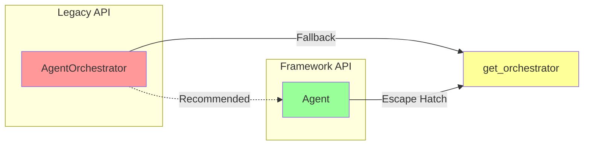
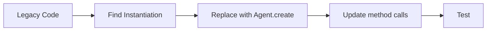
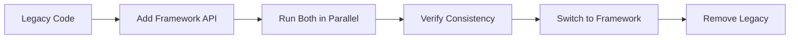
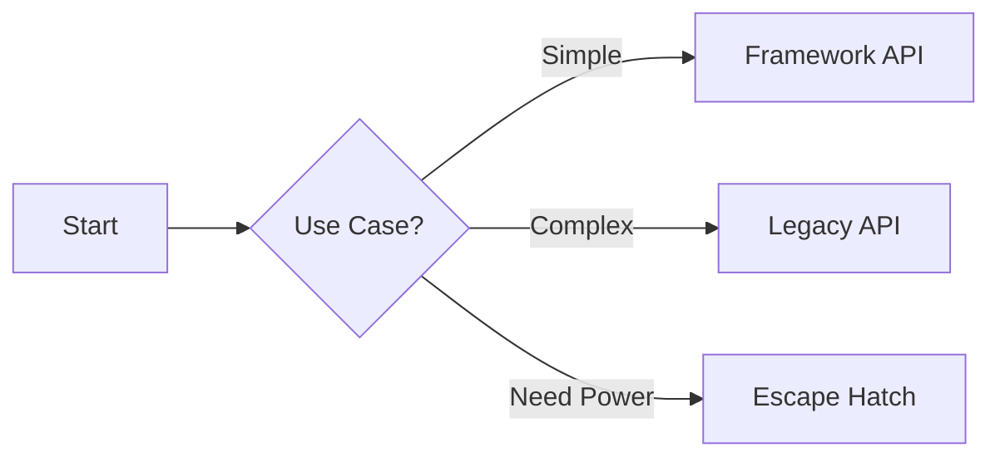

# Migration Guide: Legacy → Framework API

**Migrate from AgentOrchestrator to simplified Agent API**

---

## 🎯 Why Migrate?

| Aspect | Legacy (AgentOrchestrator) | Framework (Agent) |
|--------|---------------------------|------------------|
| **Lines of Code** | 5-10 lines | 1-3 lines |
| **Complexity** | High (27 exports) | Low (5 concepts) |
| **Learning Curve** | Steep | Gentle |
| **Boilerplate** | Significant | Minimal |
| **Best For** | Advanced use | 90% of use cases |

---

## 📊 Migration Overview



---

## 🔄 Quick Reference

### Side-by-Side Comparison

| Task | Legacy API | Framework API |
|------|-----------|---------------|
| **Create** | `AgentOrchestrator(settings, provider, model, ...)` | `await Agent.create(provider, model)` |
| **Execute** | `await orchestrator.chat(message)` | `await agent.run(message)` |
| **Stream** | `async for chunk in orchestrator.stream_chat(message)` | `async for event in agent.stream(message)` |
| **Config** | Modify settings object | Pass parameters to `create()` |
| **Tools** | Tool registration | `ToolSet.presets()` |
| **State** | `orchestrator.conversation_state.stage` | `agent.state.stage` |

---

## 🎓 Common Migrations

### Migration 1: Basic Creation

#### Before (Legacy)

```python
from victor.agent.orchestrator import AgentOrchestrator
from victor.config.settings import Settings
from victor.providers.provider_factory import ProviderFactory

settings = Settings()
provider = ProviderFactory.get_provider("anthropic")
orchestrator = AgentOrchestrator(
    settings=settings,
    provider=provider,
    model="claude-sonnet-4-20250514"
)

result = await orchestrator.chat("Write a function")
```

#### After (Framework)

```python
from victor.framework import Agent

agent = await Agent.create(
    provider="anthropic",
    model="claude-sonnet-4-20250514"
)

result = await agent.run("Write a function")
```

**Reduction**: 7 lines → 3 lines (**57% fewer**)

---

### Migration 2: Streaming

#### Before (Legacy)

```python
async def stream_example(orchestrator):
    response = ""
    async for chunk in orchestrator.stream_chat("Explain this"):
        if chunk.type == "content":
            response += chunk.content
            print(chunk.content, end="")
        elif chunk.type == "tool_call":
            print(f"Tool: {chunk.tool_name}")
    return response
```

#### After (Framework)

```python
async def stream_example(agent):
    async for event in agent.stream("Explain this"):
        if event.type == EventType.CONTENT:
            print(event.content, end="")
        elif event.type == EventType.TOOL_CALL:
            print(f"Tool: {event.tool_name}")
```

**Benefits**:
- ✅ Structured events (not raw chunks)
- ✅ Type-safe (`EventType` enum)
- ✅ Richer event data

---

### Migration 3: Tool Configuration

#### Before (Legacy)

```python
from victor.tools.tool_registry import ToolRegistry

# Manual tool registration
registry = ToolRegistry.get_instance()
tools = [
    registry.get_tool("read"),
    registry.get_tool("write"),
    registry.get_tool("edit"),
    registry.get_tool("grep"),
]

orchestrator = AgentOrchestrator(
    settings=settings,
    provider=provider,
    tools=tools
)
```

#### After (Framework)

```python
from victor.framework import Agent, ToolSet

agent = await Agent.create(
    tools=ToolSet.minimal()  # read, write, edit, shell
)
```

**Reduction**: 12 lines → 3 lines (**75% fewer**)

---

### Migration 4: State Observation

#### Before (Legacy)

```python
# Access conversation state
state = orchestrator.conversation_state
stage = state.current_stage
tools_used = state.tool_call_count

# Get stage info
if stage == ConversationStage.EXECUTION:
    print("Executing...")
```

#### After (Framework)

```python
# Direct property access
stage = agent.state.stage
tools_used = agent.state.tool_calls_used

# Stage is string enum
if stage == Stage.EXECUTION:
    print("Executing...")
```

**Benefits**:
- ✅ Cleaner syntax
- ✅ No imports needed
- ✅ String-based enums

---

### Migration 5: Custom Configuration

#### Before (Legacy)

```python
settings = Settings()
settings.model = "claude-sonnet-4-20250514"
settings.temperature = 0.0
settings.max_tokens = 4096
settings.tool_budget = 20

provider = ProviderFactory.get_provider(
    "anthropic",
    settings=settings
)

orchestrator = AgentOrchestrator(
    settings=settings,
    provider=provider
)
```

#### After (Framework)

```python
agent = await Agent.create(
    provider="anthropic",
    model="claude-sonnet-4-20250514",
    temperature=0.0,
    max_tokens=4096
)
```

**Reduction**: 13 lines → 6 lines (**54% fewer**)

---

## 🗺️ Migration Paths

### Path 1: Simple Replacement



**Best for**: Simple use cases, standard patterns

**Steps**:
1. Find `AgentOrchestrator` instantiation
2. Replace with `await Agent.create()`
3. Update `.chat()` → `.run()`
4. Update `.stream_chat()` → `.stream()`

---

### Path 2: Gradual Migration



**Best for**: Complex codebases, critical systems

**Steps**:
1. Keep legacy code
2. Add framework API alongside
3. Run both, compare results
4. Switch to framework once confident
5. Remove legacy code

---

### Path 3: Hybrid Approach



**Best for**: Diverse requirements, gradual transition

**Pattern**:
```python
# Use framework for 90% of cases
agent = await Agent.create()
result = await agent.run("Simple task")

# Escape hatch for 10% (advanced features)
orchestrator = agent.get_orchestrator()
await orchestrator.checkpoint_manager.save_checkpoint()
```

---

## 📋 Migration Checklist

### Phase 1: Assessment

- [ ] Identify all `AgentOrchestrator` instantiations
- [ ] Catalog usage patterns
- [ ] Note custom configurations
- [ ] Identify tool registrations
- [ ] Document state access patterns

### Phase 2: Planning

- [ ] Choose migration path
- [ ] Estimate effort
- [ ] Schedule migration
- [ ] Plan testing strategy
- [ ] Prepare rollback plan

### Phase 3: Execution

- [ ] Update imports
- [ ] Replace instantiations
- [ ] Update method calls
- [ ] Add event handling
- [ ] Test each migration

### Phase 4: Verification

- [ ] Run unit tests
- [ ] Run integration tests
- [ ] Compare outputs
- [ ] Check performance
- [ ] Validate state consistency

### Phase 5: Cleanup

- [ ] Remove legacy imports
- [ ] Remove dead code
- [ ] Update documentation
- [ ] Update examples
- [ ] Commit changes

---

## ⚠️ Breaking Changes

| Change | Impact | Mitigation |
|--------|--------|------------|
| `.chat()` → `.run()` | Method name | Simple find/replace |
| `.stream_chat()` → `.stream()` | Method name | Simple find/replace |
| `StreamChunk` → `Event` | Event structure | Update event handling |
| `ConversationStage` → `Stage` | Stage type | Update stage checks |
| Tool registration | Tool configuration | Use `ToolSet` presets |

---

## 🆘 Troubleshooting

### Issue: Import Errors

```python
# ❌ Wrong
from victor.agent import Agent

# ✅ Correct
from victor.framework import Agent
```

### Issue: Async Creation

```python
# ❌ Wrong
agent = Agent.create()

# ✅ Correct
agent = await Agent.create()
```

### Issue: Event Types

```python
# ❌ Wrong
if event.type == "content":

# ✅ Correct
if event.type == EventType.CONTENT:
```

### Issue: State Access

```python
# ❌ Wrong
stage = agent.conversation_state.stage

# ✅ Correct
stage = agent.state.stage
```

---

## 📚 Additional Resources

| Resource | Link |
|----------|------|
| **Framework API** | [FRAMEWORK_API.md](FRAMEWORK_API.md) |
| **Quick Start** | [QUICK_START.md](QUICK_START.md) |
| **Examples** | `examples/` |
| **Changelog** | `CHANGELOG.md` |

---

## 🎉 Summary

| Metric | Improvement |
|--------|-------------|
| **Lines of Code** | -50% to -75% |
| **Concepts** | 27 → 5 |
| **Setup Time** | 10 min → 1 min |
| **Learning Curve** | High → Low |
| **Best Practices** | Manual → Built-in |

**Bottom Line**: Framework API is simpler, cleaner, and easier to use for 90% of use cases.

---

**Need Help Migrating?**
- 📖 Check [FRAMEWORK_API.md](FRAMEWORK_API.md)
- 💬 Ask on [GitHub Discussions](https://github.com/vijay-singh/victor/discussions)
- 🐛 [Open an Issue](https://github.com/vijay-singh/victor/issues)
