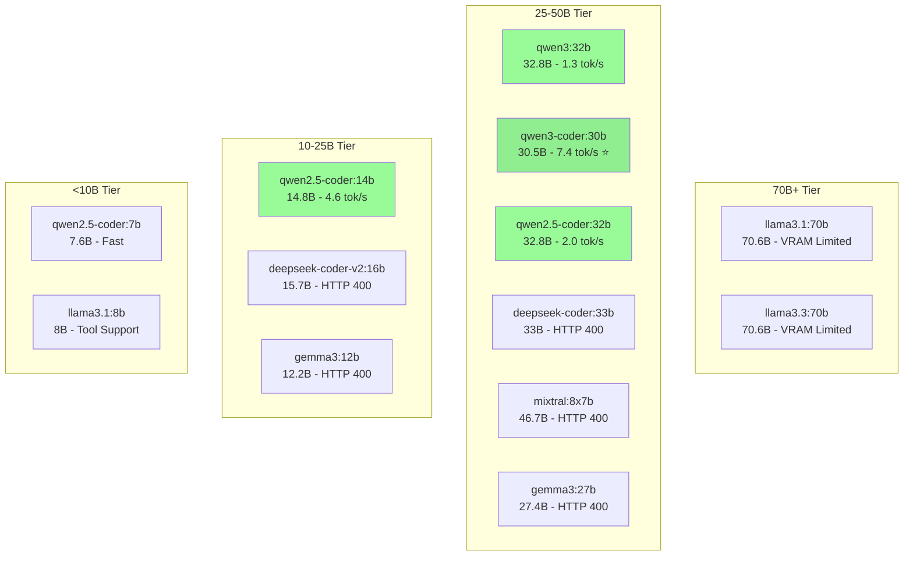
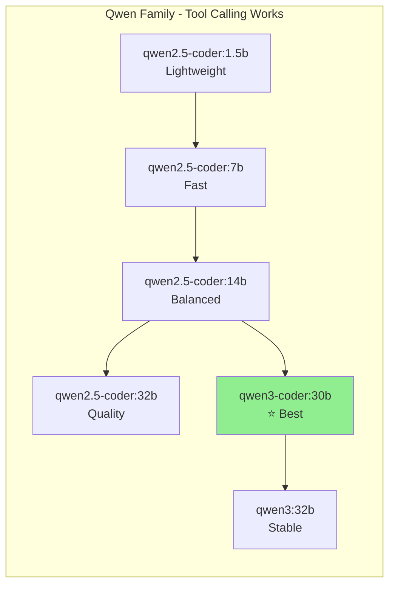
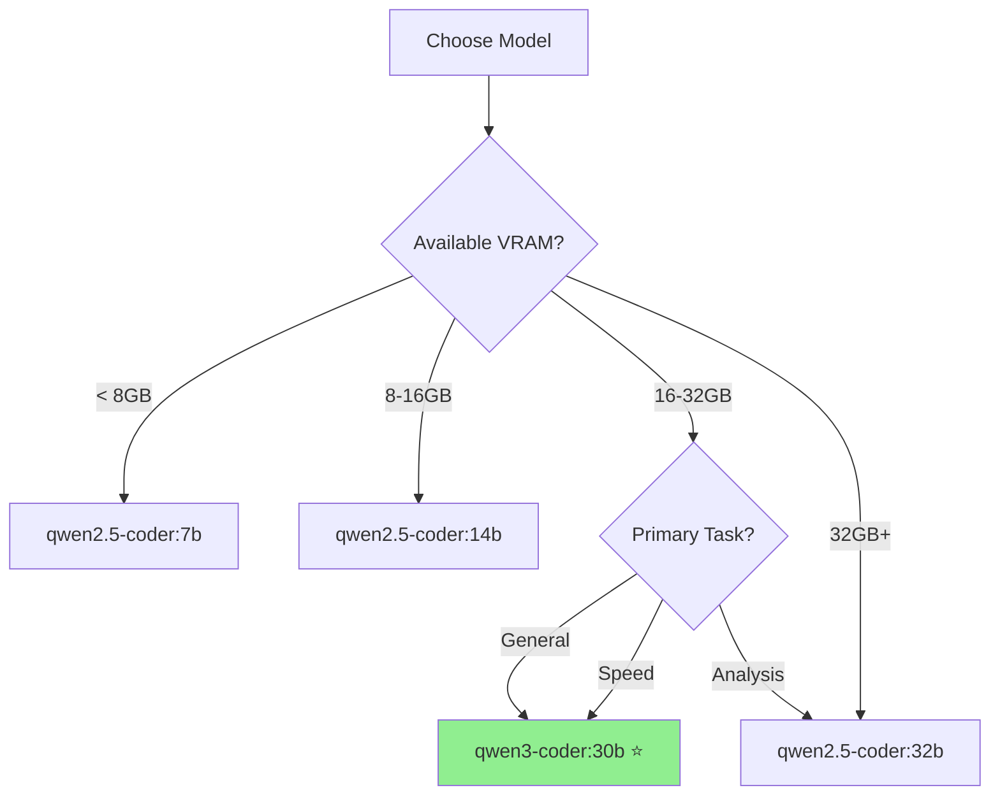

# Victor Model Comparison: Ollama Local Models

Comprehensive comparison of local LLM models for Victor coding assistant, tested on 2025-11-30.

## Test Environment

- **Platform**: macOS (Darwin 24.6.0)
- **Provider**: Ollama (localhost:11434)
- **Hardware**: Tested on 64GB unified memory system
- **Test Command**: `python -m victor.ui.cli main --log-level WARN -p <profile> "<prompt>"`

## Test Matrix by Model Family and Tier



## Summary Results

| Model | Family | Size | Speed | Tool Execution | Code Gen | Analysis | Recommended |
|-------|--------|------|-------|----------------|----------|----------|-------------|
| **qwen3-coder:30b** | Qwen3 MoE | 30.5B | 7.4 tok/s | ✅ Full | ✅ Excellent | ✅ Detailed | ⭐ **Best Overall** |
| qwen3:32b | Qwen3 | 32.8B | 1.3 tok/s | ✅ Full | ✅ Good | ✅ Good | Quality focused |
| qwen2.5-coder:32b | Qwen2.5 | 32.8B | 2.0 tok/s | ✅ Full | ✅ Good | ✅ Detailed | Stable quality |
| qwen2.5-coder:14b | Qwen2.5 | 14.8B | 4.6 tok/s | ⚠️ JSON only | ✅ Good | ⚠️ Limited | Speed focused |
| llama3.1:70b | Llama | 70.6B | <1 tok/s | ❌ VRAM crash | N/A | N/A | Not recommended |
| deepseek-coder:33b | DeepSeek | 33B | N/A | ❌ HTTP 400 | N/A | N/A | Incompatible |
| mixtral:8x7b | Mistral MoE | 46.7B | N/A | ❌ HTTP 400 | N/A | N/A | Incompatible |
| gemma3:27b | Gemma | 27.4B | N/A | ❌ HTTP 400 | N/A | N/A | Incompatible |

## Detailed Test Results

### Test 1: Simple Git Query

```bash
victor main "Show the current git branch name and last commit message"
```

| Model | Tool Calls | Speed | Status |
|-------|------------|-------|--------|
| qwen3-coder:30b | 2 (execute_bash × 2) | 6.8 tok/s | ✅ Success |
| qwen3:32b | 2 (execute_bash × 2) | 1.3 tok/s | ✅ Success |
| qwen2.5-coder:32b | 1 (execute_bash) | 2.9 tok/s | ✅ Success |
| qwen2.5-coder:14b | 1 (execute_bash) | 5.8 tok/s | ✅ Success |

### Test 2: Python Code Generation + Execution

```bash
victor main "Write a Python Fibonacci function using DP. Save to /tmp/fibonacci.py and execute."
```

| Model | write_file | execute_bash | Speed | Output |
|-------|------------|--------------|-------|--------|
| qwen3-coder:30b | ✅ Executed | ✅ Executed | 7.4 tok/s | Correct F(0-9) |
| qwen2.5-coder:32b | ✅ Executed | ✅ Executed | 2.0 tok/s | Correct F(0-9) |
| qwen2.5-coder:14b | ⚠️ JSON only | ⚠️ JSON only | 4.6 tok/s | Not executed |

### Test 3: Java Code with Compile Chain

```bash
victor main "Write Fibonacci.java, find javac, compile and execute."
```

| Model | write_file | find compiler | compile | execute | Status |
|-------|------------|---------------|---------|---------|--------|
| qwen3-coder:30b | ✅ | ✅ (`which javac`) | ✅ | ⚠️ Path issue | Multi-step orchestration |

### Test 4: Module Analysis (Read-only)

```bash
victor main "Analyze victor/agent/orchestrator.py - summarize architecture and suggest improvements"
```

| Model | read_file | analyze_docs | Quality | Speed | Tokens |
|-------|-----------|--------------|---------|-------|--------|
| qwen3-coder:30b | ✅ | ✅ | Detailed (9 patterns, 3 suggestions) | 9.7 tok/s | 1417 |

## Model Family Analysis

### Qwen Family (Recommended)



**Findings:**
- All Qwen models have native tool calling support
- qwen3-coder:30b (MoE) is often faster due to sparse activation
- qwen2.5-coder:14b sometimes returns JSON instead of executing
- qwen3:32b is slower but more thorough

### Llama Family (Limited)

| Model | Status | Issue |
|-------|--------|-------|
| llama3.1:70b | ❌ | VRAM exhaustion, server crash |
| llama3.3:70b | ⚠️ | Not in tool-capable manifest |
| llama3.1:8b | ✅ | Works for simple tasks |

### Other Families (Incompatible)

| Family | Models Tested | Status | Issue |
|--------|---------------|--------|-------|
| DeepSeek | deepseek-coder:33b, v2:16b | ❌ | HTTP 400 - tool format |
| Gemma | gemma3:12b, gemma3:27b | ❌ | HTTP 400 - tool format |
| Mixtral | mixtral:8x7b | ❌ | HTTP 400 - tool format |

## Recommendations by Use Case



### Quick Reference

| Scenario | Model | Why |
|----------|-------|-----|
| Fast prototyping | qwen3-coder:30b | 7.4 tok/s, excellent tools |
| Code review | qwen2.5-coder:32b | Most detailed analysis |
| CI/CD pipelines | qwen2.5-coder:14b | Fast, reliable |
| Air-gapped servers | qwen2.5-coder:7b | Low VRAM (~5GB) |
| Complex refactoring | qwen3-coder:30b | Multi-step orchestration |

## Profile Configuration

```yaml
# ~/.victor/profiles.yaml
profiles:
  # Best overall (recommended default)
  default:
    provider: ollama
    model: qwen3-coder:30b
    temperature: 0.7
    max_tokens: 4096

  # Fast development
  fast:
    provider: ollama
    model: qwen2.5-coder:14b
    temperature: 0.7
    max_tokens: 4096

  # Maximum quality
  quality:
    provider: ollama
    model: qwen2.5-coder:32b
    temperature: 0.7
    max_tokens: 4096

  # Low resource
  lite:
    provider: ollama
    model: qwen2.5-coder:7b
    temperature: 0.7
    max_tokens: 4096

providers:
  ollama:
    base_url: http://localhost:11434
    timeout: 300
```

## Known Issues & Workarounds

| Issue | Models Affected | Solution |
|-------|-----------------|----------|
| HTTP 400 errors | DeepSeek, Gemma, Mixtral | Use Qwen family models |
| VRAM exhaustion | 70B models | Use 32B or smaller |
| JSON-only output | qwen2.5-coder:14b (sometimes) | Retry or use 30b/32b |
| Slow generation | qwen3:32b (dense) | Use qwen3-coder:30b (MoE) |

## Tool-Capable Models Registry

Updated in `victor/config/model_capabilities.py`:

```python
"ollama": [
    # 50B-70B (need 48GB+ VRAM)
    "llama3.1:70b", "llama3.3:70b", "llama3-groq-tool-use:70b",

    # 25-50B (recommended)
    "qwen3:32b", "qwen3-coder:30b", "qwen3:30b",
    "qwen2.5-coder:32b", "qwen2.5:32b",
    "mixtral:8x7b",  # Listed but HTTP 400 in practice

    # 10-25B
    "qwen2.5-coder:14b", "qwen2.5-coder:7b",

    # <10B
    "llama3.1:8b", "mistral:7b-instruct", "phi-4",
]
```

## Conclusion

For Victor coding assistant with Ollama:

1. **Best Overall**: `qwen3-coder:30b` - Fast (7.4 tok/s), reliable tool execution, excellent code generation
2. **Best Quality**: `qwen2.5-coder:32b` - Detailed analysis, stable performance
3. **Avoid**: DeepSeek, Gemma, Mixtral families - incompatible tool format
4. **70B Models**: Not practical on consumer hardware (VRAM limits)

The Qwen model family provides the most reliable tool-calling experience with Victor.
