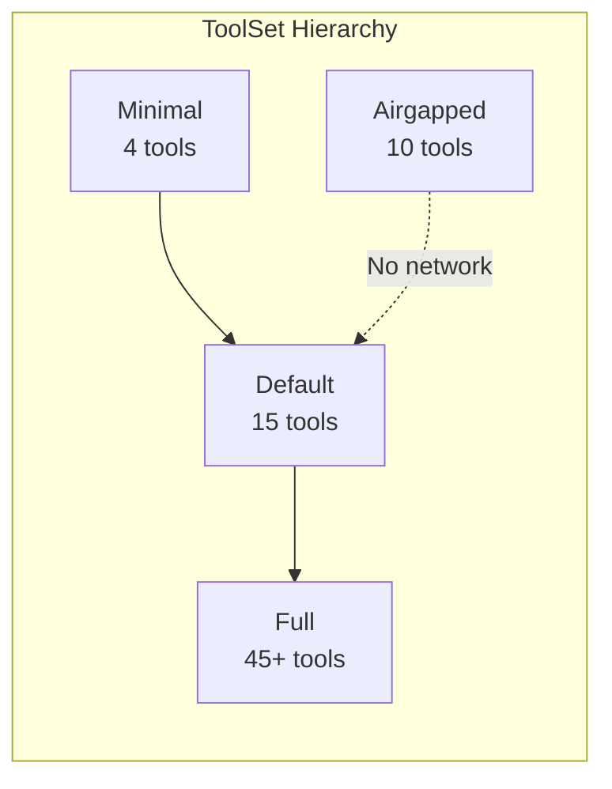
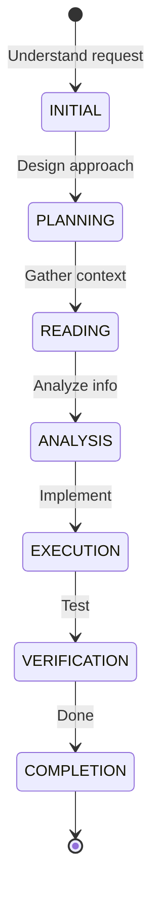

# Victor Framework - Quick Start Guide

**Get up and running in 5 minutes**

---

## ⚡ 30-Second Setup

```bash
# Install
pip install victor-ai

# Initialize (optional)
victor init

# Run
victor chat
```

---

## 🚀 Usage Patterns

### Pattern 1: One-Liner

```python
from victor.framework import Agent

agent = await Agent.create()
result = await agent.run("Write a hello world function")
```

### Pattern 2: With Streaming

```python
async for event in agent.stream("Explain this code"):
    print(event.content, end="")
```

### Pattern 3: With Tools

```python
from victor.framework import Agent, ToolSet

agent = await Agent.create(tools=ToolSet.minimal())
result = await agent.run("Create a new feature branch")
```

---

## 📊 Decision Tree

```mermaid
graph TD
    START[Start] → CHOICE{Task Type?}

    CHOICE -->|Simple| MINIMAL[ToolSet.minimal]
    CHOICE -->|Coding| DEFAULT[ToolSet.default]
    CHOICE -->|Research| FULL[ToolSet.full]
    CHOICE -->|Offline| AIRGAPPED[ToolSet.airgapped]

    MINIMAL → CREATE[Create Agent]
    DEFAULT → CREATE
    FULL → CREATE
    AIRGAPPED → CREATE

    CREATE → RUN[Run or Stream]
```

---

## 🎯 Common Tasks

### Task 1: Generate Code

```python
agent = await Agent.create()
result = await agent.run("""
    Create a Flask API endpoint
    for user authentication
""")
```

### Task 2: Analyze Code

```python
agent = await Agent.create(tools=["read", "grep", "code_search"])
result = await agent.run("Analyze the authentication flow")
```

### Task 3: Refactor Code

```python
agent = await Agent.create(tools=ToolSet.default())

async for event in agent.stream("Refactor for better performance"):
    if event.type == EventType.THINKING:
        print(f"💭 {event.content[:60]}...")
    elif event.type == EventType.CONTENT:
        print(event.content, end="")
```

### Task 4: Git Operations

```python
agent = await Agent.create(tools=["git", "read", "write"])
result = await agent.run("""
    Create a new feature branch 'user-auth'
    and commit the changes
""")
```

### Task 5: Web Research

```python
agent = await Agent.create(tools=ToolSet.full())
result = await agent.run("""
    Research latest Python async patterns
    and provide best practices
""")
```

---

## 📦 Tool Selection Guide

| Task Type | Recommended ToolSet | Tools Included |
|-----------|-------------------|----------------|
| **Simple edits** | `ToolSet.minimal()` | read, write, edit, shell |
| **Coding** | `ToolSet.default()` | + git, search, lsp |
| **Full project** | `ToolSet.full()` | + web, docker, testing |
| **Offline** | `ToolSet.airgapped()` | No network tools |

### Tool Selection Diagram



---

## 🔑 Provider Selection

### Quick Comparison

| Provider | Best For | Tool Calling | Local? |
|----------|----------|-------------|--------|
| **Anthropic** | Coding | ✅ Yes | ❌ No |
| **OpenAI** | General | ✅ Yes | ❌ No |
| **Ollama** | Privacy | ✅ Yes | ✅ Yes |
| **LMStudio** | Testing | ✅ Yes | ✅ Yes |
| **Google** | Speed | ✅ Yes | ❌ No |

### Usage Examples

```python
# Anthropic (default)
agent = await Agent.create(provider="anthropic")

# OpenAI
agent = await Agent.create(
    provider="openai",
    model="gpt-4-turbo"
)

# Local Ollama
agent = await Agent.create(
    provider="ollama",
    model="llama3:70b"
)

# Local LMStudio
agent = await Agent.create(
    provider="lmstudio",
    model="local-model"
)
```

---

## 🎭 Understanding Stages



### Stage Characteristics

| Stage | Purpose | Typical Tools |
|-------|---------|---------------|
| **INITIAL** | Understand | read, ls |
| **PLANNING** | Design | grep, read |
| **READING** | Context | read, code_search |
| **ANALYSIS** | Understand | lsp, symbol |
| **EXECUTION** | Implement | write, edit, shell |
| **VERIFICATION** | Test | shell, test |
| **COMPLETION** | Wrap up | - |

---

## 📡 Event Streaming

### Event Types Overview

| Event | When It Fires | Key Fields |
|-------|---------------|------------|
| `THINKING` | Model is thinking | `content` |
| `TOOL_CALL` | Tool being called | `tool_name`, `arguments` |
| `CONTENT` | Text generated | `content` |
| `STAGE_CHANGE` | Stage changed | `old_stage`, `new_stage` |
| `ERROR` | Error occurred | `error` |

### Streaming Template

```python
async def stream_agent(agent: Agent, prompt: str):
    """Stream agent execution with formatted output."""
    async for event in agent.stream(prompt):
        match event.type:
            case EventType.THINKING:
                print(f"💭 {event.content[:60]}...")
            case EventType.TOOL_CALL:
                print(f"🔧 {event.tool_name}")
            case EventType.TOOL_RESULT:
                status = "✅" if event.success else "❌"
                print(f"{status} {event.tool_name}")
            case EventType.CONTENT:
                print(event.content, end="")
            case EventType.STAGE_CHANGE:
                print(f"\n📍 {event.new_stage}")
            case EventType.ERROR:
                print(f"❌ {event.error}")
```

---

## 🎛️ Configuration Options

### Common Configurations

| Use Case | Provider | Tools | Temperature |
|----------|----------|-------|-------------|
| **Code generation** | anthropic | default | 0.0 |
| **Creative writing** | openai | full | 0.7 |
| **Code analysis** | anthropic | minimal | 0.0 |
| **Research** | google | full | 0.3 |
| **Refactoring** | anthropic | default | 0.0 |

### Configuration Template

```python
# Coding (recommended)
config = {
    "provider": "anthropic",
    "model": "claude-sonnet-4-20250514",
    "tools": ToolSet.default(),
    "temperature": 0.0,
}

# Analysis
config = {
    "provider": "anthropic",
    "tools": ToolSet.minimal(),
    "temperature": 0.0,
}

# Research
config = {
    "provider": "google",
    "tools": ToolSet.full(),
    "temperature": 0.3,
}
```

---

## 🚨 Common Pitfalls

### ❌ Don't Do This

```python
# ❌ Wrong: Too many tools
agent = await Agent.create(tools=ToolSet.full())
# ...for simple task

# ❌ Wrong: High temperature for coding
agent = await Agent.create(temperature=0.9)

# ❌ Wrong: Not using streaming
result = await agent.run(very_long_task)
# ...no progress indication
```

### ✅ Do This Instead

```python
# ✅ Right: Appropriate tools
agent = await Agent.create(tools=ToolSet.minimal())
# ...for simple task

# ✅ Right: Low temperature for coding
agent = await Agent.create(temperature=0.0)

# ✅ Right: Use streaming for long tasks
async for event in agent.stream(long_task):
    print(event.content, end="")
```

---

## 📚 Next Steps

1. **Learn More**: Read [FRAMEWORK_API.md](FRAMEWORK_API.md)
2. **Explore**: See [TOOLS.md](TOOLS.md)
3. **Build**: Create your own vertical
4. **Extend**: Add custom tools

---

**Need Help?**
- 📖 [Documentation](../docs)
- 💬 [Community](https://github.com/vijay-singh/victor)
- 🐛 [Issues](https://github.com/vijay-singh/victor/issues)
