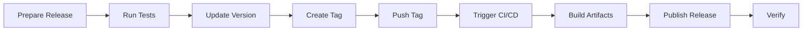

# Release Process Guide

This guide covers the Victor release process from version bumping to publication.

## Table of Contents

- [Overview](#overview)
- [Release Types](#release-types)
- [Pre-release Checklist](#pre-release-checklist)
- [Release Methods](#release-methods)
- [Post-release Tasks](#post-release-tasks)
- [Emergency Releases](#emergency-releases)
- [Troubleshooting](#troubleshooting)

## Overview

Victor uses automated releases with:

- **Semantic versioning** (MAJOR.MINOR.PATCH)
- **Automated changelog generation**
- **Multi-platform releases** (PyPI, Docker, GitHub)
- **Automated testing** before release
- **Rollback capability**

### Version Number Format

```
vMAJOR.MINOR.PATCH

Examples:
v0.5.0  - Initial release, major version 0, minor version 5, patch 0
v0.5.1  - Bug fix release
v1.0.0  - First stable release
v1.2.3  - Stable release with bug fixes
```

### Release Workflow



## Release Types

### 1. Major Release (MAJOR)

**When**: Breaking changes, major features

**Examples**:
- v0.5.0 → v1.0.0 (first stable release)
- v1.0.0 → v2.0.0 (breaking API changes)

**Process**:
```bash
# Update version in pyproject.toml
version = "1.0.0"

# Update breaking changes in CHANGELOG.md
# Add migration guide

# Create release branch
git checkout -b release/v1.0.0

# Commit changes
git add pyproject.toml CHANGELOG.md
git commit -m "chore: prepare release v1.0.0"

# Create tag
git tag -a v1.0.0 -m "Release v1.0.0: First stable release"

# Push
git push origin release/v1.0.0
git push origin v1.0.0

# Create PR to merge release branch to main
```

### 2. Minor Release (MINOR)

**When**: New features, backward-compatible changes

**Examples**:
- v0.5.0 → v0.6.0 (new features)
- v1.0.0 → v1.1.0 (new capabilities)

**Process**:
```bash
# Update version
version = "0.6.0"

# Update CHANGELOG.md with new features

# Commit and tag
git add pyproject.toml CHANGELOG.md
git commit -m "chore: prepare release v0.6.0"
git tag -a v0.6.0 -m "Release v0.6.0"

# Push
git push origin main
git push origin v0.6.0
```

### 3. Patch Release (PATCH)

**When**: Bug fixes, small improvements

**Examples**:
- v0.5.0 → v0.5.1 (bug fix)
- v1.0.0 → v1.0.1 (hotfix)

**Process**:
```bash
# Update version
version = "0.5.1"

# Update CHANGELOG.md with bug fixes

# Commit and tag
git add pyproject.toml CHANGELOG.md
git commit -m "chore: prepare release v0.5.1"
git tag -a v0.5.1 -m "Release v0.5.1: Bug fixes"

# Push
git push origin main
git push origin v0.5.1
```

### 4. Pre-release

**When**: Alpha, beta, or RC releases

**Examples**:
- v0.5.0a1 (alpha 1)
- v0.5.0b1 (beta 1)
- v0.5.0rc1 (release candidate 1)

**Process**:
```bash
# Update version with pre-release suffix
version = "0.5.0a1"

# Add pre-release notes to CHANGELOG.md

# Commit and tag
git add pyproject.toml CHANGELOG.md
git commit -m "chore: prepare release v0.5.0a1"
git tag -a v0.5.0a1 -m "Release v0.5.0a1: Alpha release"

# Push
git push origin main
git push origin v0.5.0a1
```

## Pre-release Checklist

Before creating a release, ensure:

### Code Quality

- [ ] All tests pass locally
- [ ] All tests pass in CI
- [ ] Coverage meets threshold (70%)
- [ ] No linting errors
- [ ] No security vulnerabilities
- [ ] Code is reviewed and approved

### Documentation

- [ ] CHANGELOG.md updated
- [ ] Migration guide updated (if breaking changes)
- [ ] README.md updated (if needed)
- [ ] API documentation updated
- [ ] Examples updated (if needed)

### Version

- [ ] Version bumped in `pyproject.toml`
- [ ] Version follows semver
- [ ] Git tag created
- [ ] Release notes prepared

### Testing

- [ ] Unit tests pass
- [ ] Integration tests pass
- [ ] Smoke tests pass
- [ ] Manual testing completed
- [ ] Performance tests pass (if applicable)

### Build

- [ ] Docker image builds successfully
- [ ] Python package builds successfully
- [ ] No build warnings or errors
- [ ] Artifacts tested locally

## Release Methods

### Method 1: GitHub Release (Recommended)

**Steps**:

1. Go to GitHub repository
2. Click "Releases" > "Draft a new release"
3. Enter tag version (e.g., `v0.5.0`)
4. Select target branch (main)
5. Enter release title: `Release v0.5.0`
6. Generate release notes (or write manually)
7. Review and publish

**Automation**:
- Triggered when you publish the release
- Runs `.github/workflows/release.yml`
- Builds and publishes to:
  - PyPI
  - Docker Hub
  - GitHub Releases

### Method 2: Git Tag (Manual)

**Steps**:

```bash
# 1. Update version
vim pyproject.toml
# version = "0.5.0"

# 2. Update CHANGELOG
vim CHANGELOG.md
# Add release notes

# 3. Commit changes
git add pyproject.toml CHANGELOG.md
git commit -m "chore: bump version to 0.5.0"

# 4. Create tag
git tag -a v0.5.0 -m "Release v0.5.0"

# 5. Push tag
git push origin main
git push origin v0.5.0

# 6. Create GitHub release
gh release create v0.5.0 \
  --title "Release v0.5.0" \
  --notes "Release notes here"
```

### Method 3: Make Command

**Steps**:

```bash
# Using make
make release VERSION=0.5.0

# This does:
# 1. Updates version in pyproject.toml
# 2. Commits changes
# 3. Creates git tag
# 4. Pushes to GitHub

# Then create GitHub release manually
gh release create v0.5.0 \
  --title "Release v0.5.0" \
  --notes-file CHANGELOG.md
```

### Method 4: GitHub Actions Workflow Dispatch

**Steps**:

1. Go to Actions > Release workflow
2. Click "Run workflow"
3. Select branch (main)
4. Enter version (e.g., `0.5.0`)
5. Enter release notes
6. Click "Run workflow"

**Note**: This method doesn't create a GitHub release page, just publishes artifacts.

## Release Workflow

### What Happens Automatically

When you create a GitHub release, the workflow:

1. **Validates**
   - Checks version format
   - Validates changelog
   - Runs tests

2. **Builds**
   - Python package (sdist + wheel)
   - Docker image (multi-platform)
   - VS Code extension

3. **Publishes**
   - PyPI (python package)
   - Docker Hub (docker image)
   - GitHub Releases (artifacts)

4. **Notifies**
   - Creates GitHub release
   - Posts announcement
   - Updates documentation

### Workflow Steps

```yaml
# .github/workflows/release.yml
jobs:
  release:
    runs-on: ubuntu-latest
    steps:
      - Checkout code
      - Set up Python
      - Install dependencies
      - Run tests
      - Build package
      - Publish to PyPI
      - Build Docker image
      - Publish to Docker Hub
      - Create GitHub release
      - Update documentation
```

### Monitoring Release

**Check status**:
```bash
# GitHub Actions
gh run list --workflow=release.yml

# PyPI
pip index versions victor-ai

# Docker Hub
docker pull vijayksingh/victor:v0.5.0
```

## Post-release Tasks

After release:

### 1. Verify Release

```bash
# Test PyPI installation
pip install victor-ai==0.5.0
victor --version

# Test Docker image
docker pull vijayksingh/victor:v0.5.0
docker run vijayksingh/victor:v0.5.0 victor --version

# Test GitHub release
gh release view v0.5.0
```

### 2. Update Documentation

- Update version in docs
- Add release notes to website
- Update migration guides
- Update examples

### 3. Notify Users

- Post announcement on GitHub
- Tweet about release
- Update Discord/Slack
- Send email newsletter

### 4. Monitor

- Watch for issues
- Check error reports
- Monitor performance
- Review feedback

### 5. Next Version

```bash
# Bump to next development version
version = "0.6.0.dev0"

# Commit
git add pyproject.toml
git commit -m "chore: bump to 0.6.0.dev0"
git push origin main
```

## Emergency Releases

For critical bugs:

### Hotfix Process

```bash
# 1. Create hotfix branch from main
git checkout main
git checkout -b hotfix/v0.5.1

# 2. Fix bug
vim victor/fix.py

# 3. Update version
vim pyproject.toml
# version = "0.5.1"

# 4. Update CHANGELOG
vim CHANGELOG.md
# Add hotfix notes

# 5. Commit and tag
git add .
git commit -m "hotfix: critical bug fix"
git tag -a v0.5.1 -m "Release v0.5.1: Hotfix"

# 6. Push and release
git push origin hotfix/v0.5.1
git push origin v0.5.1

# 7. Merge back to main and develop
git checkout main
git merge hotfix/v0.5.1
git push origin main

git checkout develop
git merge hotfix/v0.5.1
git push origin develop
```

### Rollback Release

If release is broken:

```bash
# 1. Delete PyPI release (contact PyPI admin)
# 2. Delete tag (local and remote)
git tag -d v0.5.0
git push origin :refs/tags/v0.5.0

# 3. Revert commit
git revert HEAD

# 4. Create new release (v0.5.1)
# ... follow normal release process
```

## Troubleshooting

### Release Fails

**Problem**: GitHub Actions workflow fails

**Solutions**:
```bash
# Check logs
gh run view --log-failed

# Common fixes:
# 1. Tests failing → Fix tests or skip if not critical
# 2. Build failing → Check pyproject.toml
# 3. PyPI error → Check API token
# 4. Docker error → Check Dockerfile
```

### PyPI Publish Fails

**Problem**: Package not published to PyPI

**Solutions**:
```bash
# Check PyPI token
gh secret set PYPI_API_TOKEN

# Test build locally
python -m build
twine check dist/*

# Manually publish
twine upload dist/*
```

### Docker Push Fails

**Problem**: Docker image not published

**Solutions**:
```bash
# Check Docker credentials
echo $DOCKER_PASSWORD | docker login -u $DOCKER_USERNAME --password-stdin

# Test build locally
docker build -t victor:test .

# Manually push
docker push vijayksingh/victor:v0.5.0
```

### Version Already Exists

**Problem**: Git tag already exists

**Solutions**:
```bash
# Delete existing tag (local and remote)
git tag -d v0.5.0
git push origin :refs/tags/v0.5.0

# Create new tag with different version
git tag -a v0.5.1 -m "Release v0.5.1"
git push origin v0.5.1
```

### Changelog Issues

**Problem**: Changelog not updated

**Solutions**:
```bash
# Manually update CHANGELOG.md
vim CHANGELOG.md

# Regenerate from git history
git log v0.4.0..v0.5.0 --pretty=format:"- %s" >> CHANGELOG.md

# Use towncrier (if installed)
towncrier build --version v0.5.0
```

## Best Practices

1. **Use semantic versioning**
   - Follow semver strictly
   - Document breaking changes
   - Keep API stable

2. **Test before release**
   - Run full test suite
   - Test installation
   - Test Docker image
   - Manual testing

3. **Document changes**
   - Update CHANGELOG.md
   - Add migration guide
   - Update examples
   - Release notes

4. **Automate everything**
   - Use GitHub Actions
   - Auto-generate changelog
   - Auto-publish artifacts
   - Auto-notify users

5. **Monitor after release**
   - Watch for issues
   - Check error reports
   - Monitor performance
   - Gather feedback

6. **Have rollback plan**
   - Know rollback procedure
   - Test rollback process
   - Document issues
   - Communicate clearly

## Resources

- [Semantic Versioning](https://semver.org/)
- [PyPI Publishing](https://packaging.python.org/tutorials/packaging-projects/)
- [Docker Hub](https://hub.docker.com/)
- [GitHub Releases](https://docs.github.com/en/repositories/releasing-projects-on-github)
- [Towncrier (Changelog tool)](https://github.com/twisted/towncrier)
