# Victor User Guide

> Complete guide for using Victor - Your Universal AI Coding Assistant

## Table of Contents

- [Quick Start](#quick-start)
- [Installation](#installation)
- [Basic Usage](#basic-usage)
- [Working with Providers](#working-with-providers)
- [Using Tools](#using-tools)
- [Advanced Features](#advanced-features)
- [Workflows](#workflows)
  - [StateGraph DSL](#stategraph-dsl-phase-4)
  - [Multi-Agent Teams](#multi-agent-teams)
  - [Enhanced TeamMember Personas](#enhanced-teammember-personas)
  - [Dynamic Capability Loading](#dynamic-capability-loading)
- [Tips & Tricks](#tips--tricks)
- [Troubleshooting](#troubleshooting)

## Quick Start

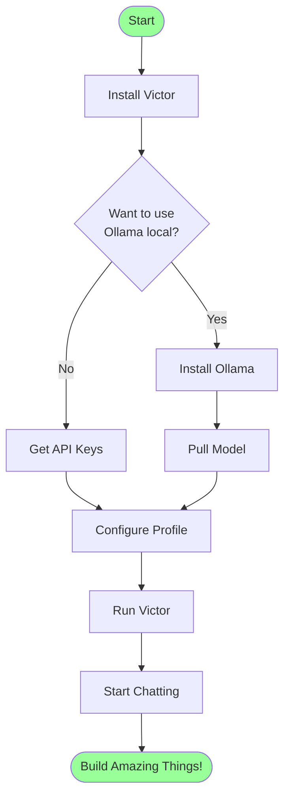

### 5-Minute Setup

```bash
# 1. Install Victor
pip install victor

# 2. Quick start with Ollama (FREE!)
ollama pull qwen2.5-coder:7b

# 3. Run Victor
victor

# That's it! Start coding with AI
```

## Installation

### Prerequisites

- Python 3.10 or higher
- pip (Python package manager)
- Git (optional, for development)

### Installation Methods

#### Option 1: Using pip (Recommended)

```bash
pip install victor
```

#### Option 2: From Source

```bash
git clone https://github.com/vjsingh1984/victor.git
cd victor
pip install -e ".[dev]"
```

#### Option 3: Using pipx (Isolated Installation)

```bash
pipx install victor
```

### Setting Up Providers

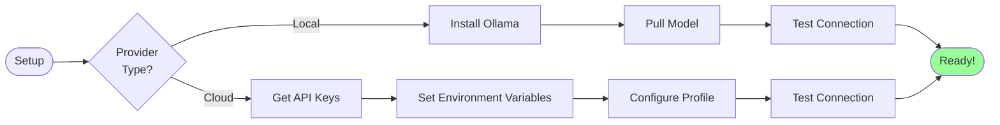

#### Local Models (Ollama)

```bash
# Install Ollama (https://ollama.ai)
# macOS/Linux:
curl https://ollama.ai/install.sh | sh

# Pull a coding model
ollama pull qwen2.5-coder:7b

# Verify
ollama list
```

#### Cloud Providers

```bash
# Set API keys
export ANTHROPIC_API_KEY="sk-ant-..."
export OPENAI_API_KEY="sk-..."
export GOOGLE_API_KEY="..."

# Create profile
victor init
```

## Basic Usage

### Interactive REPL Mode

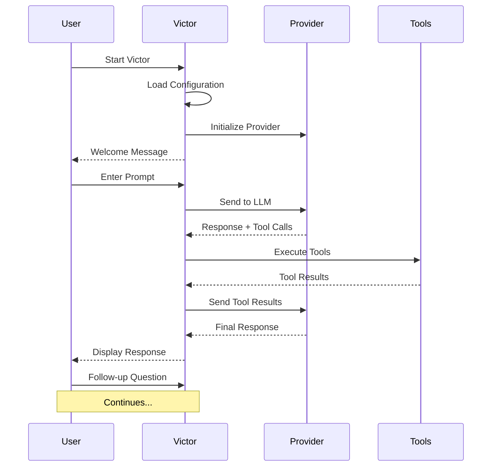

**Example Session**:

```bash
$ victor

Welcome to Victor v0.1.0
Using: Ollama (qwen2.5-coder:7b)

> Create a Python function to calculate Fibonacci numbers

I'll help you create a Fibonacci function...

[Victor creates fib.py with implementation]

> Now add tests for this function

[Victor creates test_fib.py with pytest tests]

> Run the tests

[Victor executes: pytest test_fib.py]
All tests passed! ✓
```

### One-Shot Mode

```bash
# Single command execution
victor "Write a FastAPI hello world endpoint"

# With specific provider
victor --provider anthropic "Explain async/await in Python"

# With specific model
victor --model gpt-4 "Review my code for security issues"
```

### Command Modes

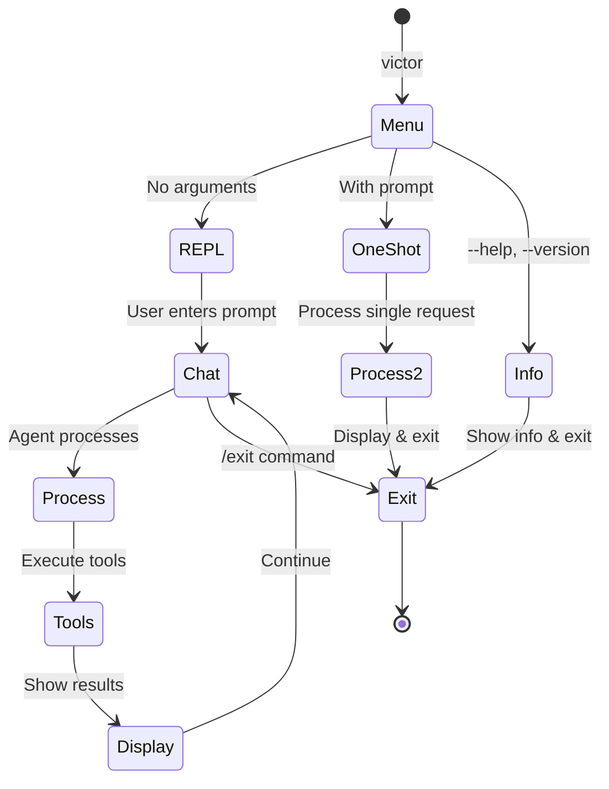

## Working with Providers

### Provider Selection Strategy

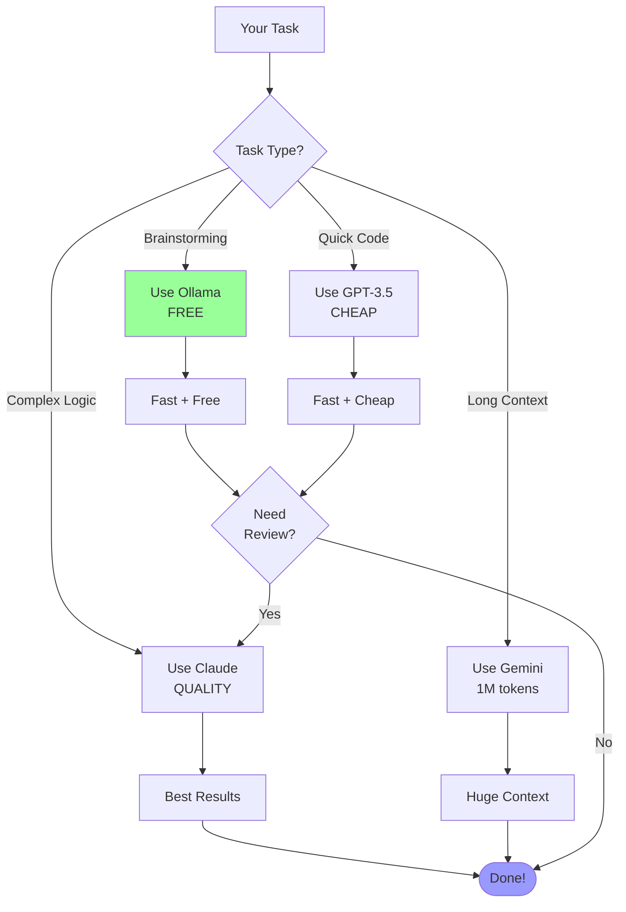

### Switching Providers

#### In REPL Mode

```
> /provider anthropic
Switched to Anthropic (claude-sonnet-4-5)

> /provider ollama
Switched to Ollama (qwen2.5-coder:7b)

> /model gpt-4
Switched to OpenAI (gpt-4)
```

#### Via Profiles

```yaml
# ~/.victor/profiles.yaml
profiles:
  dev:
    provider: ollama
    model: qwen2.5-coder:7b
    temperature: 0.7

  production:
    provider: anthropic
    model: claude-sonnet-4-5
    temperature: 1.0

  fast:
    provider: openai
    model: gpt-3.5-turbo
    temperature: 0.5
```

```bash
victor --profile dev     # Use Ollama
victor --profile production  # Use Claude
victor --profile fast    # Use GPT-3.5
```

## Using Tools

### Available Tools

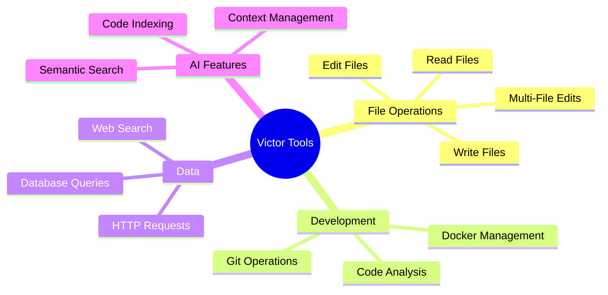

### File Operations

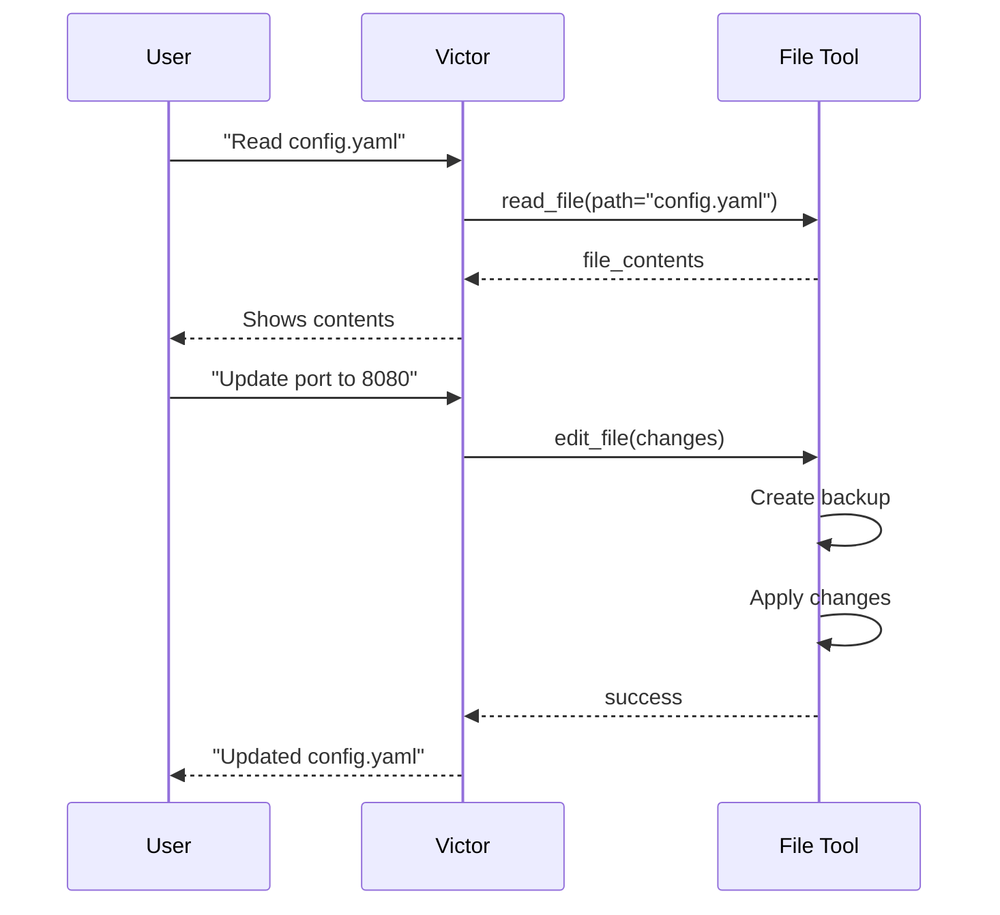

**Examples**:

```
> Read the README.md file

> Edit main.py and add error handling to the connect function

> Create a new file called utils.py with helper functions
```

### Git Integration

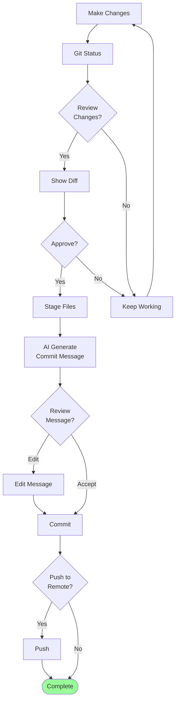

**Examples**:

```
> Show me what files have changed

> Create a commit with an appropriate message for these changes

> Push my changes to the main branch
```

### Database Operations

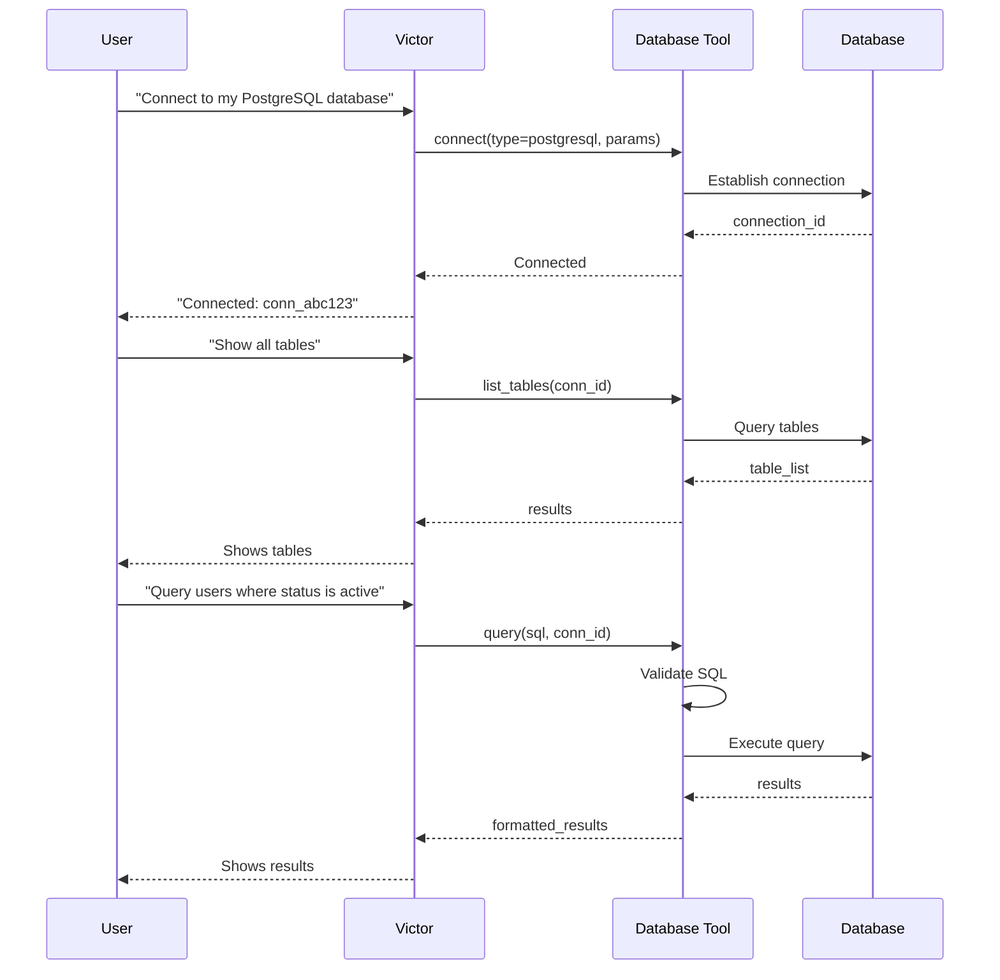

**Examples**:

```
> Connect to SQLite database at ./data/app.db

> Show me all tables in this database

> Query the users table for users created in the last week

> Describe the schema of the orders table
```

### Docker Management

**Examples**:

```
> List all running Docker containers

> Show logs for the api-server container

> Start the database container

> Check stats for all containers
```

### HTTP/API Testing

**Examples**:

```
> Make a GET request to https://api.github.com/users/octocat

> Test the /health endpoint and verify it returns 200

> POST this JSON data to the API endpoint
```

## Advanced Features

### Multi-File Editing

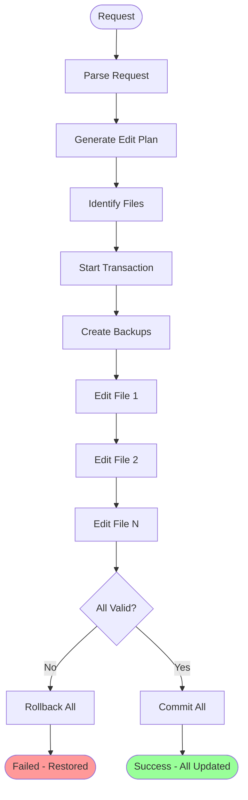

**Example**:

```
> Refactor the authentication system across all files:
  - Move auth logic from main.py to auth/manager.py
  - Update imports in api/routes.py
  - Add new tests in tests/test_auth.py

[Victor creates a transaction and updates all files atomically]
✓ All files updated successfully
```

### Semantic Search

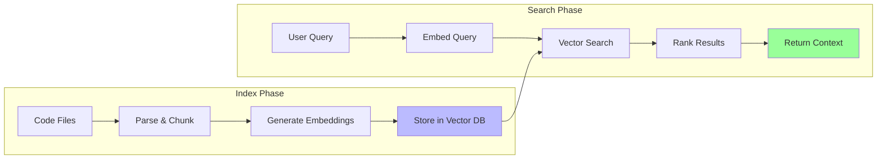

**Examples**:

```
> Index my codebase for semantic search

> Find code related to "user authentication"

> Show me examples of error handling in this project

> Where is the database connection logic?
```

### Context Management

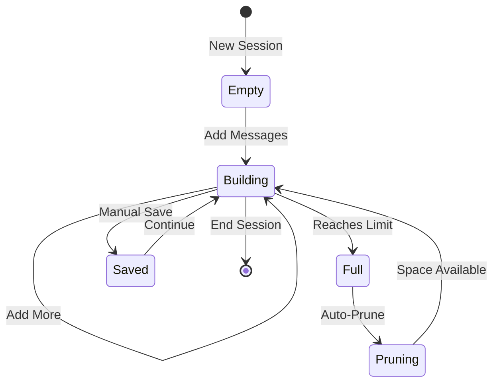

**Features**:
- **Auto-pruning**: Removes old messages when limit reached
- **Semantic compression**: Keeps relevant context
- **Manual save**: Preserve important conversations
- **Search history**: Find previous discussions

## Workflows

### StateGraph DSL (Phase 4)

Victor provides a LangGraph-compatible StateGraph DSL for building stateful, cyclic agent workflows. This allows you to define complex multi-step processes with conditional branching and checkpointing.

**Basic StateGraph Usage**:

```python
from victor.framework import StateGraph, END
from typing import TypedDict, Optional

# Define typed state
class TaskState(TypedDict):
    messages: list[str]
    task: str
    result: Optional[str]
    needs_retry: bool

# Define node functions
async def analyze(state: TaskState) -> TaskState:
    state["messages"].append("Analyzed task")
    return state

async def execute(state: TaskState) -> TaskState:
    state["result"] = "Completed execution"
    return state

async def review(state: TaskState) -> TaskState:
    state["messages"].append("Reviewed result")
    return state

# Condition function for branching
def should_retry(state: TaskState) -> str:
    return "retry" if state.get("needs_retry") else "done"

# Create graph
graph = StateGraph(TaskState)

# Add nodes
graph.add_node("analyze", analyze)
graph.add_node("execute", execute)
graph.add_node("review", review)

# Add edges (including cycles for retry logic)
graph.add_edge("analyze", "execute")
graph.add_conditional_edge(
    "execute",
    should_retry,
    {"retry": "analyze", "done": "review"}
)
graph.add_edge("review", END)

# Set entry point
graph.set_entry_point("analyze")

# Compile and run
app = graph.compile()
result = await app.invoke({"messages": [], "task": "Fix bug", "result": None, "needs_retry": False})
print(result.state)  # Final state
print(result.node_history)  # ["analyze", "execute", "review"]
```

**StateGraph Features**:

| Feature | Description |
|---------|-------------|
| Typed State | TypedDict-based state schemas for type safety |
| Conditional Edges | Branch execution based on state conditions |
| Cycles | Support for retry loops and iterative workflows |
| Checkpointing | Resume workflows from saved checkpoints |
| Streaming | Stream intermediate states during execution |

See [docs/guides/WORKFLOW_DSL.md](guides/WORKFLOW_DSL.md) for the complete guide.

### Multi-Agent Teams

Victor supports multi-agent teams with different coordination patterns:

```python
from victor.framework import Agent
from victor.framework.teams import TeamMemberSpec, TeamFormation

# Create a pipeline team for feature implementation
team = await Agent.create_team(
    name="Feature Team",
    goal="Implement user authentication",
    members=[
        TeamMemberSpec(
            role="researcher",
            goal="Find existing auth patterns",
            backstory="Senior developer with security expertise",
            tool_budget=20,
        ),
        TeamMemberSpec(
            role="planner",
            goal="Design implementation approach",
            backstory="Architect specializing in API design",
        ),
        TeamMemberSpec(
            role="executor",
            goal="Write the code",
            backstory="Full-stack developer",
            tool_budget=30,
        ),
        TeamMemberSpec(
            role="reviewer",
            goal="Review and improve code",
            backstory="QA engineer focused on security",
        ),
    ],
    formation=TeamFormation.PIPELINE,
)

# Run the team
result = await team.run()
print(result.final_output)

# Or stream team events
async for event in team.stream():
    if event.type == TeamEventType.MEMBER_START:
        print(f"Starting: {event.member_name}")
    elif event.type == TeamEventType.MEMBER_COMPLETE:
        print(f"Completed: {event.member_name}")
```

**Team Formations**:

| Formation | Description | Use Case |
|-----------|-------------|----------|
| SEQUENTIAL | Members work one after another | Simple handoffs |
| PARALLEL | Members work simultaneously | Independent tasks |
| PIPELINE | Output flows through stages | Feature implementation |
| HIERARCHICAL | Manager coordinates workers | Complex projects |

### Enhanced TeamMember Personas

TeamMembers support rich persona attributes for better agent characterization:

```python
TeamMemberSpec(
    role="researcher",
    goal="Find authentication vulnerabilities",
    name="Security Analyst",
    # Rich persona attributes (CrewAI-compatible)
    backstory="10 years of security experience at major tech companies. "
              "Previously led red team exercises at a Fortune 500 company.",
    expertise=["security", "authentication", "oauth", "jwt"],
    personality="methodical and thorough; communicates findings with severity ratings",
    # Capabilities
    max_delegation_depth=2,  # Can delegate to sub-agents
    memory=True,             # Persist discoveries across tasks
    cache=True,              # Cache tool results
    verbose=True,            # Show detailed logs
    # Budget controls
    tool_budget=25,
    max_iterations=50,
)
```

### Dynamic Capability Loading

Load custom capabilities at runtime for plugins and extensions:

```python
from victor.framework import CapabilityLoader, capability, CapabilityType

# Method 1: Using the @capability decorator
@capability(
    name="custom_safety",
    capability_type=CapabilityType.SAFETY,
    version="1.0",
    description="Apply custom safety patterns",
)
def apply_custom_safety(patterns: list[str]) -> None:
    for pattern in patterns:
        # Apply pattern logic
        pass

# Method 2: Load from a module
loader = CapabilityLoader()
loader.load_from_module("my_plugin.capabilities")

# Method 3: Manual registration
loader.register_capability(
    name="custom_tool",
    handler=my_tool_function,
    capability_type=CapabilityType.TOOL,
    version="1.0",
)

# Apply to orchestrator
agent = await Agent.create(provider="anthropic")
loader.apply_to(agent.get_orchestrator())

# Hot-reload during development
loader.watch_for_changes()  # Requires watchdog package
```

### Workflow 1: Building a New Feature

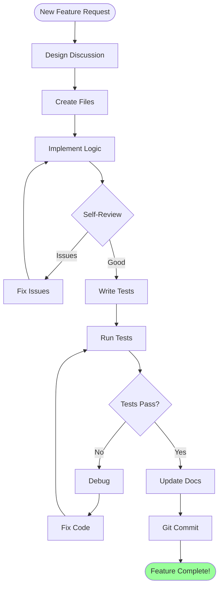

**Example Commands**:

```
1. > Design a REST API for user management
2. > Create the file structure for this API
3. > Implement the user model and database schema
4. > Add CRUD endpoints in routes.py
5. > Write comprehensive tests
6. > Run the tests
7. > Create a commit with an appropriate message
```

### Workflow 2: Debugging Issues

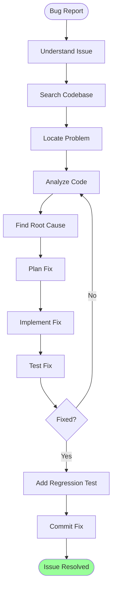

**Example Session**:

```
> The login endpoint is returning 500 errors. Help me debug this.

Let me search for the login endpoint...
[Searches codebase]

I found the issue in auth/routes.py:45 - missing error handling
for database connection failures.

> Show me that code

[Displays problematic code]

> Fix this by adding proper error handling

[Implements fix with try/except and logging]

> Add a test to prevent this from happening again

[Creates regression test]

> Run the tests

[All tests pass ✓]

> Create a commit for this fix

[Creates commit with descriptive message]
```

### Workflow 3: Code Review

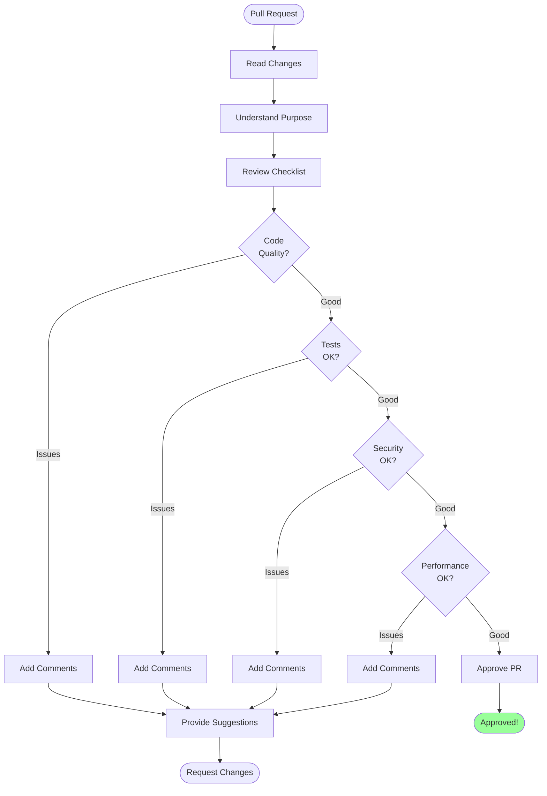

**Example**:

```
> Review the changes in PR #123

[Analyzes all changed files]

**Code Quality**: ✓ Good structure and naming
**Tests**: ⚠ Missing edge case tests
**Security**: ✓ No security issues found
**Performance**: ⚠ N+1 query detected in users endpoint

Suggestions:
1. Add test for empty user list
2. Use eager loading for user relationships
3. Add input validation for email format

> Generate review comments for these issues

[Creates detailed review comments]
```

### Workflow 4: Documentation

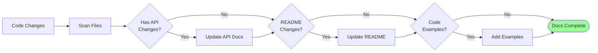

**Example**:

```
> I just added a new authentication feature. Help me document it.

I'll help document the authentication feature...

1. API Documentation:
   [Updates API.md with new endpoints]

2. README Update:
   [Adds authentication section to README]

3. Code Examples:
   [Creates example usage in examples/auth_demo.py]

4. Docstrings:
   [Adds/updates docstrings in auth modules]

All documentation updated! ✓
```

## Tips & Tricks

### Cost Optimization

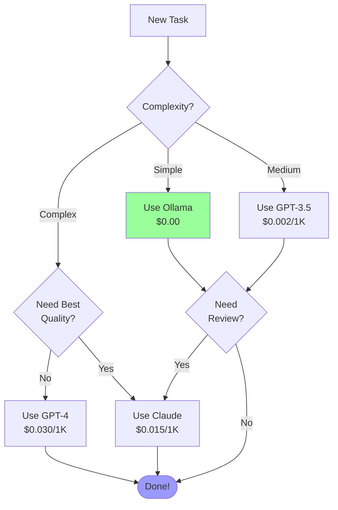

**Strategy**:
1. **Brainstorm**: Use Ollama (free)
2. **Implementation**: Use GPT-3.5 (cheap)
3. **Review**: Use Claude (quality)
4. **Tests**: Use Ollama (free)

**Savings**: ~90% vs using Claude for everything!

### Keyboard Shortcuts

| Shortcut | Action |
|----------|--------|
| `Ctrl+C` | Cancel current operation |
| `Ctrl+D` | Exit Victor |
| `/help` | Show help |
| `/clear` | Clear screen |
| `/history` | Show conversation history |
| `/save` | Save conversation |
| `/provider <name>` | Switch provider |

### Best Practices

#### 1. Be Specific

```
❌ "Fix the bug"
✅ "Fix the null pointer exception in user_service.py line 45"

❌ "Add tests"
✅ "Add pytest tests for the UserService class covering edge cases"

❌ "Make it better"
✅ "Refactor the calculate_total function to handle decimal precision"
```

#### 2. Provide Context

```
Good: > I'm working on a FastAPI application. Add authentication to the /users endpoint using JWT tokens.

Better: > I'm working on a FastAPI application with SQLAlchemy ORM. Add JWT authentication to the /users endpoint. Use existing auth dependencies in auth/dependencies.py. Follow the pattern in /posts endpoint.
```

#### 3. Iterate

```
1. > Create a basic user model
2. > Add email validation to the user model
3. > Add password hashing using bcrypt
4. > Add tests for the user model
```

### Common Patterns

#### Pattern 1: Explore → Understand → Modify

```
1. > Search for database connection code
2. > Explain how the connection pooling works
3. > Update the pool size to 20 connections
```

#### Pattern 2: Test-Driven Development

```
1. > Write tests for a function that validates email addresses
2. > Now implement the email validation function to pass these tests
3. > Run the tests and show results
```

#### Pattern 3: Refactoring

```
1. > Analyze the UserService class for code smells
2. > Extract the validation logic into a separate validator class
3. > Update all references to use the new validator
4. > Run tests to verify nothing broke
```

## Troubleshooting

### Common Issues

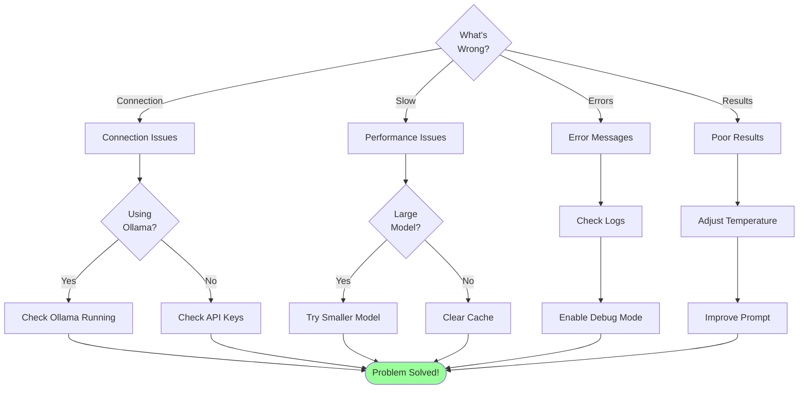

### Issue: "Connection refused"

**Ollama**:
```bash
# Check if Ollama is running
ollama list

# Start Ollama
ollama serve

# Pull model if missing
ollama pull qwen2.5-coder:7b
```

**Cloud Providers**:
```bash
# Verify API key
echo $ANTHROPIC_API_KEY

# Test connection
victor test-provider anthropic
```

### Issue: "Slow responses"

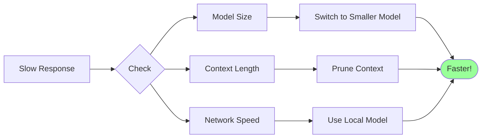

**Solutions**:
- Use smaller, faster models (GPT-3.5, Gemini Flash)
- Reduce context with `/clear`
- Use local models (Ollama)
- Enable streaming for real-time feedback

### Issue: "Poor code quality"

**Solutions**:
1. **Be more specific** in prompts
2. **Provide examples** of desired output
3. **Use better models** (Claude, GPT-4)
4. **Iterate** on the output
5. **Review and refine** the results

### Getting Help

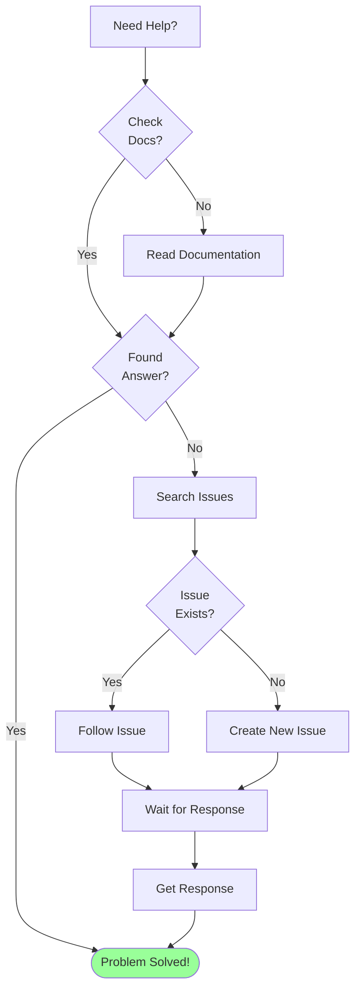

**Resources**:
- **Documentation**: [Full Docs](https://github.com/vjsingh1984/victor/docs)
- **Issues**: [GitHub Issues](https://github.com/vjsingh1984/victor/issues)
- **Discussions**: [GitHub Discussions](https://github.com/vjsingh1984/victor/discussions)
- **Examples**: See `examples/` directory

---

**Next Steps**:
- Read [DEVELOPER_GUIDE.md](DEVELOPER_GUIDE.md) for advanced usage
- Explore [examples/](../examples/) for code samples
- Join the community discussions

**Happy Coding with Victor!** 🚀

*Last Updated: 2025-11-24*
