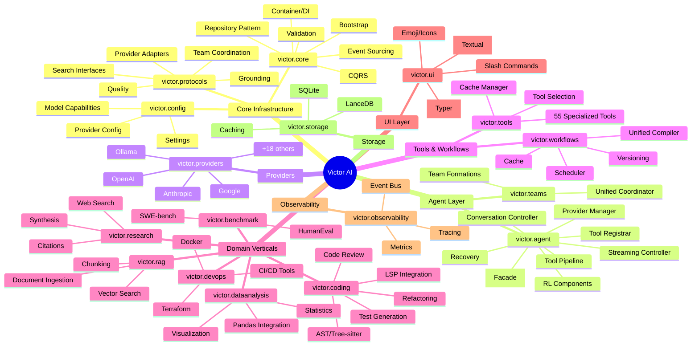
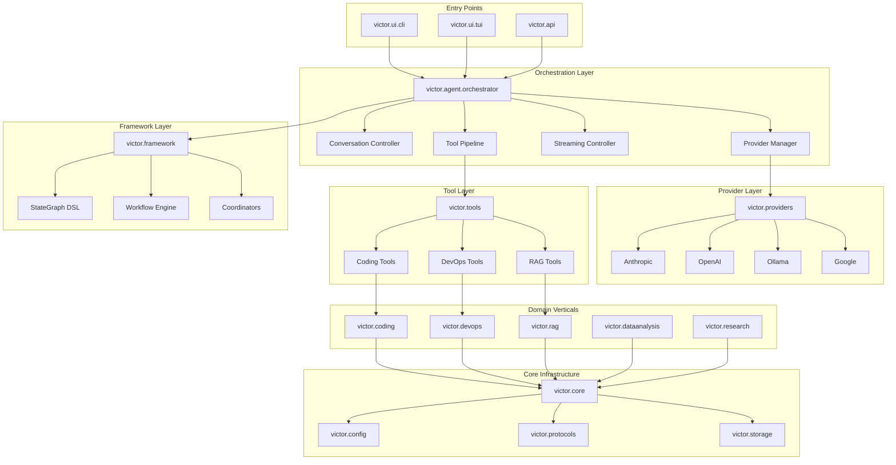
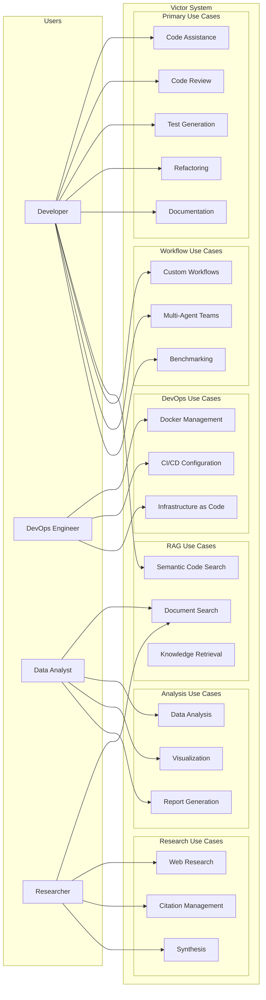
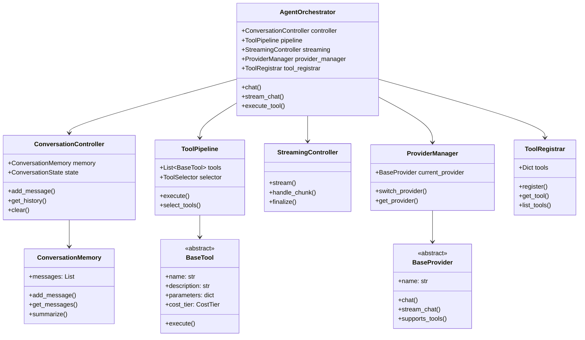
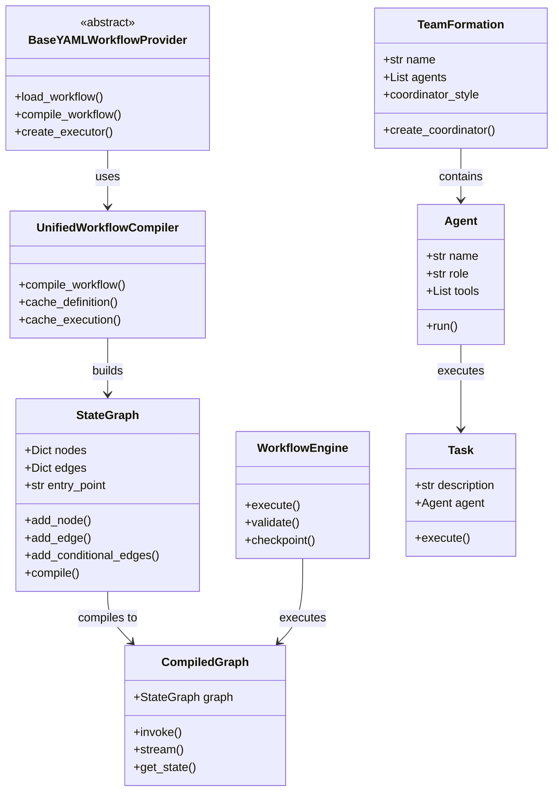
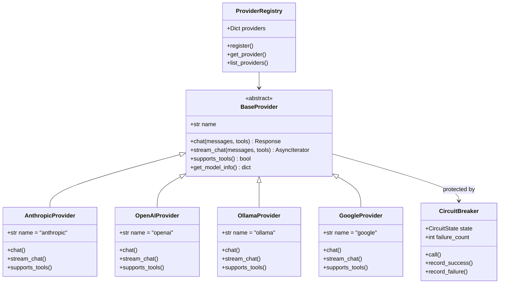
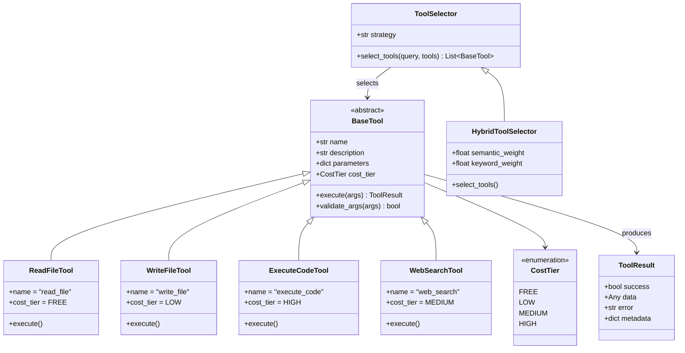
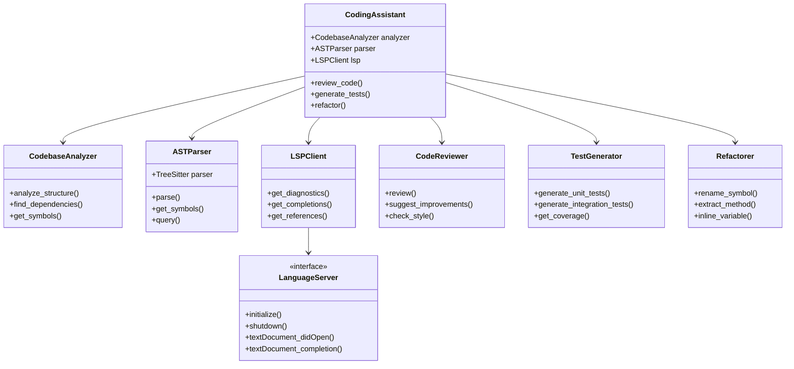
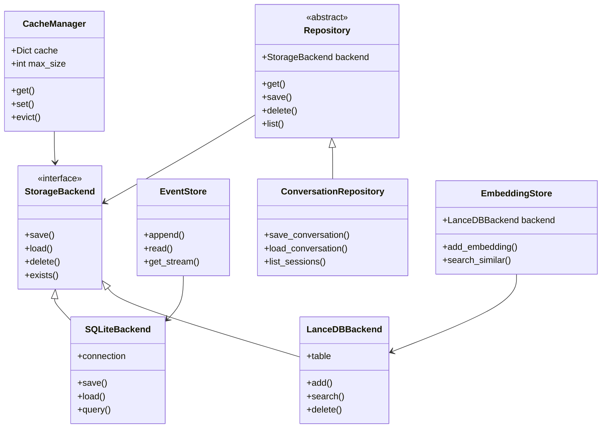
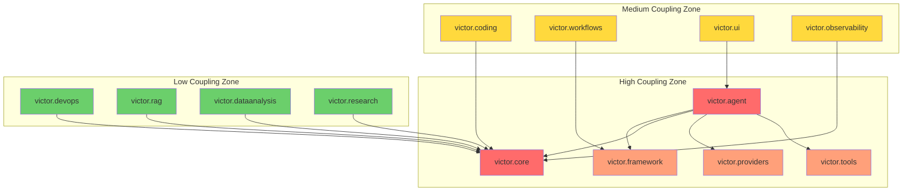

# Victor Codebase Architecture Diagrams

Generated: 2026-01-10

## 1. System Architecture Mindmap

## 2. High-Level Module Dependency Diagram

## 3. Use Case Diagram

## 4. Agent Component Class Diagram

## 5. Framework Component Class Diagram

## 6. Provider System Class Diagram

## 7. Tool System Class Diagram

## 8. Coding Vertical Class Diagram

## 9. Storage and Persistence Class Diagram

## 10. Module Coupling Heatmap (Conceptual)

## Legend

- **Red nodes**: High coupling (>500 cross-module edges)
- **Orange nodes**: Medium-high coupling (200-500 edges)
- **Yellow nodes**: Medium coupling (50-200 edges)
- **Green nodes**: Low coupling (<50 edges)

---

## Key Architectural Insights

1. **Single Giant Component**: 99.7% of nodes are in one weakly connected component, indicating high cohesion
2. **Central Hub**: `victor.agent` is the largest module (4,748 nodes) and primary orchestration point
3. **PageRank Leaders**: `emoji.get`, `event_sourcing.append`, `graph.items` are most referenced
4. **Vertical Independence**: Domain verticals (coding, devops, rag, dataanalysis, research) are relatively loosely coupled to each other
5. **Protocol Abstraction**: `victor.protocols` provides clean interface boundaries
