# Victor Architecture

> **Single source of truth** for Victor system architecture.
> Supersedes: `ARCHITECTURE.md`, `docs/architecture/overview.md`, `docs/diagrams/`

**Version**: {{ victor_version }} | **Last Updated**: 2026-06 | **Status**: Canonical

---

## Table of Contents

- [System Overview](#system-overview)
- [Layer Architecture](#layer-architecture)
- [Service Layer](#service-layer)
- [Agent Runtime](#agent-runtime)
- [Provider System](#provider-system)
- [Tool System](#tool-system)
- [Workflow Engine](#workflow-engine)
- [Multi-Agent Teams](#multi-agent-teams)
- [State Management](#state-management)
- [Database Architecture](#database-architecture)
- [Configuration System](#configuration-system)
- [Extension System](#extension-system)
- [Rust Native Extensions](#rust-native-extensions)
- [Integration Points Map](#integration-points-map)

---

## System Overview

Victor is a contract-first agentic AI framework in Python 3.10+ providing a typed,
service-first runtime for building agents that reason, call tools, execute DAG
workflows, and coordinate multi-agent teams across 24 LLM providers.

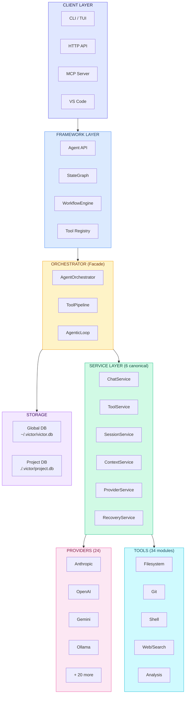

### Codebase Scale

| Metric | Value |
|--------|-------|
| Source files | 3,672 |
| Lines of code | 1,166,724 |
| Python packages | 294 |
| Provider adapters | 24 |
| Tool modules | 34 |
| Cargo crates | 5 |

### Layer Rules

| Rule | Description | Guard Test |
|------|-------------|------------|
| Clients use Framework only | UI never imports `victor.agent.*` | `test_architectural_boundaries.py` |
| Framework delegates to Runtime | `Agent.create()` goes through `AgentFactory` | Agent entry point |
| Runtime delegates to Services | Orchestrator is facade, services own logic | `test_service_layer_validation.py` |
| Services own infrastructure | Effectful behavior via `ExecutionContext.services` | Service accessor |
| External uses Contracts only | Verticals import `victor_contracts` | `test_core_vertical_import_boundary.py` |

### Data Flow

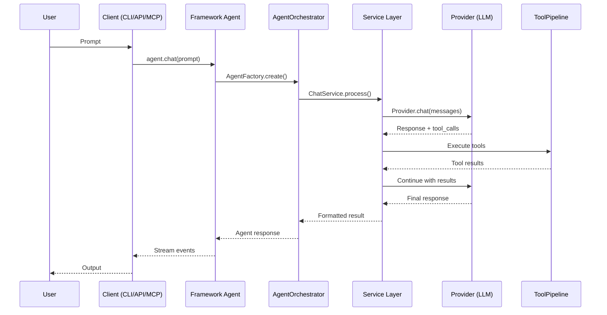

---

## Layer Architecture

Victor follows a strict layered design. Each layer only depends on the layer
directly below it.

```mermaid
flowchart LR
    subgraph L1["L1: Client Surface"]
        direction TB
        C1["CLI (Typer)"]
        C2["TUI (Textual)"]
        C3["HTTP API (FastAPI)"]
        C4["MCP Server"]
        C5["VS Code Extension"]
    end

    subgraph L2["L2: Framework API"]
        direction TB
        F1["Agent"]
        F2["StateGraph"]
        F3["WorkflowEngine"]
        F4["Tool Registry"]
        F5["Skills"]
    end

    subgraph L3["L3: Runtime"]
        direction TB
        R1["AgentOrchestrator"]
        R2["Service Layer"]
        R3["AgenticLoop"]
        R4["ExecutionContext"]
    end

    subgraph L4["L4: Infrastructure"]
        direction TB
        I1["Providers (24)"]
        I2["Tools (34)"]
        I3["State Mgmt"]
        I4["Database"]
        I5["Config"]
    end

    L1 --> L2 --> L3 --> L4

    style L1 fill:#e0e7ff,stroke:#4f46e5,color:#1e1b4b
    style L2 fill:#dbeafe,stroke:#3b82f6,color:#1e3a5f
    style L3 fill:#d1fae5,stroke:#10b981,color:#064e3b
    style L4 fill:#fef3c7,stroke:#f59e0b,color:#78350f
```

| Layer | Module | Entry Point | Responsibility |
|-------|--------|-------------|----------------|
| **Client** | `victor/ui/` | `cli.py` | CLI, TUI, commands |
| **Client** | `victor/integrations/api/` | `server.py` | FastAPI REST server |
| **Client** | `victor/integrations/mcp/` | — | MCP protocol bridge |
| **Framework** | `victor/framework/` | `agent.py` | Public API surface |
| **Runtime** | `victor/agent/` | `orchestrator.py` | Orchestration facade |
| **Runtime** | `victor/agent/services/` | `chat_service.py` | 6 canonical services |
| **Infrastructure** | `victor/providers/` | `base.py` | LLM provider adapters |
| **Infrastructure** | `victor/tools/` | `base.py` | Tool modules |
| **Infrastructure** | `victor/state/` | `__init__.py` | 4-scope state management |
| **Infrastructure** | `victor/config/` | `settings.py` | Settings and profiles |
| **Infrastructure** | `victor/core/` | `database.py` | Event sourcing, CQRS, DI |

---

## Service Layer

The runtime is **service-first**. Six canonical services own all effectful
behavior. The orchestrator is a facade that delegates to these services.

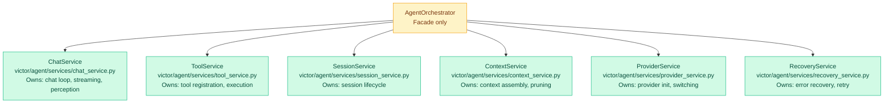

**Access pattern** via `ExecutionContext`:

```python
from victor.runtime.context import ExecutionContext

ctx = ExecutionContext(settings=settings)
chat_svc = ctx.services.chat       # ChatService
tool_svc = ctx.services.tool       # ToolService
session_svc = ctx.services.session # SessionService
```

> **UI layer** must use `VictorClient` + `SessionConfig` — never import
> `AgentOrchestrator` or `AgentFactory` directly.

---

## Agent Runtime

### AgenticLoop

The `AgenticLoop` (`victor/framework/agentic_loop.py`) is the canonical execution
authority for chat. It runs: **PERCEIVE → PLAN → ACT → EVALUATE → DECIDE**.

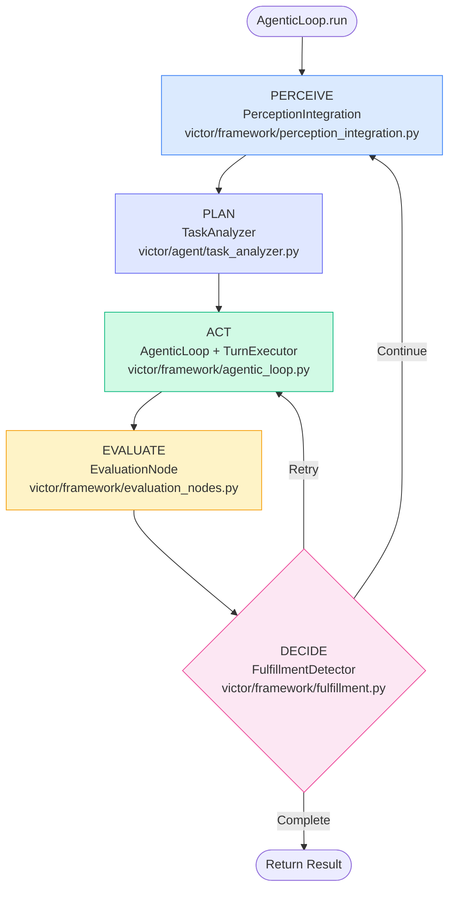

**Entry point**: `TurnExecutor.execute_agentic_loop()` at
`victor/agent/services/turn_execution_runtime.py`.

### AgentFactory

`AgentFactory` (`victor/framework/agent_factory.py`) is the **single authority**
for all agent creation paths (CLI, API, `Agent.create()`). It validates config,
bootstraps the DI container, creates the orchestrator, and wires observability.

---

## Provider System

24 LLM provider adapters behind a unified interface with circuit breaker,
retry, and smart routing.

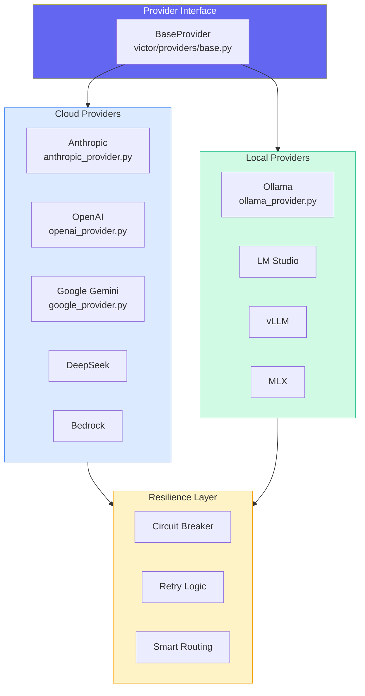

### Caching Architecture

Two independent caching capabilities per provider:

| Capability | Method | Cloud | Local |
|---|---|---|---|
| **API prompt caching** | `supports_prompt_caching()` | Billing discount | N/A |
| **KV prefix caching** | `supports_kv_prefix_caching()` | Stable prefix | Stable prefix |

**KV optimizations** (active for Ollama, LMStudio, vLLM, MLX):

- System prompt frozen after first build
- Tools sorted by name for prefix matching
- Dynamic content injected into user messages
- `Agent.warm_up()` primes KV cache

---

## Tool System

34 tool modules across 12 categories with semantic selection and budget enforcement.

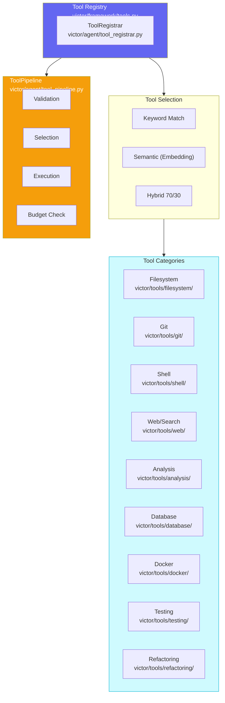

### Tool Presets

| Preset | Description |
|--------|-------------|
| `default()` | Standard production set |
| `minimal()` | Read-only, safe operations |
| `full()` | All available tools |
| `airgapped()` | Local-only, no network |

---

## Workflow Engine

YAML-to-StateGraph compiler with typed state, conditional edges, checkpointing,
and human-in-the-loop.

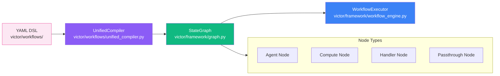

### StateGraph Features

- **Typed state** — `TypedDict` state schemas
- **Conditional edges** — Route based on state values
- **Cyclic graphs** — Loopback edges for iteration
- **Checkpointing** — Persist and resume state
- **Copy-on-write** — Efficient state mutations
- **Human-in-the-loop** — Interrupt for approval

---

## Multi-Agent Teams

Teams are **formations** (coordination patterns), not separate graphs.
`StateGraph` is always the execution engine.

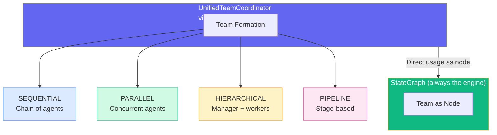

### Correct Usage

```python
from victor.framework import StateGraph
from victor.teams import UnifiedTeamCoordinator, TeamFormation

coordinator = UnifiedTeamCoordinator(orchestrator)
coordinator.set_formation(TeamFormation.PARALLEL)
coordinator.add_member(agent1).add_member(agent2)

graph = StateGraph(AgentState)
graph.add_node("research_team", coordinator)  # Direct usage!
```

> **Do not** create wrapper nodes for each formation or separate "multi-agent graph" types.

---

## State Management

Unified state management across 4 scopes with the `GlobalStateManager` facade
providing a single entry point with copy-on-write optimization.

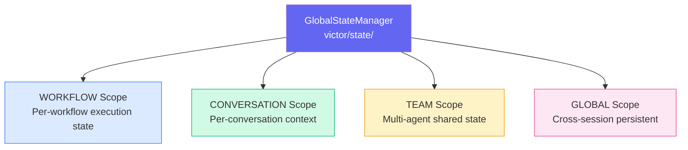

---

## Governance, Isolation & Cost

Cross-cutting runtime subsystems layered over tool execution and the provider path
(see [Features](features.md) for the user-facing summary):

- **Policy engine** (`victor/framework/policies/`) — evaluates **ALLOW / DENY / ASK** verdicts over
  tool calls across REQUEST and RESPONSE phases (streaming and non-streaming). ASK routes to a
  container-registered approval handler. Gated by `USE_POLICY_ENGINE` + `governance.enabled`.
- **Sandbox isolation** (`victor/tools/sandbox/`) — wraps subprocess/code-execution tools in an OS
  sandbox (bwrap on Linux, seatbelt on macOS), gated by `settings.sandbox.sandbox_enabled`
  (off by default, fail-open).
- **Cost co-design** — the dominant cost term (provider round-trips × context size) is measured and
  acted on: per-turn cost trace (**C0**, surfaced in the chat UI footer), reference-aware
  tool-result pruning (**L1**), per-task prompt-recompute caching (**L2**), and cost/latency-aware
  routing (**L4**, with `USE_SMART_ROUTING`).

## Additional Subsystems

Live packages under `victor/` that support the runtime but sit outside the core layer diagram
above:

| Package | Purpose |
|---------|---------|
| `victor/coordination/` | Multi-agent coordination — formation strategies for team execution. |
| `victor/classification/` | Unified task-type + complexity detection (consolidated pattern matching). |
| `victor/optimization/` | Workflow optimization algorithms (automated workflow tuning). |
| `victor/experiments/` | MLflow-like experiment tracking for workflow optimization. |
| `victor/analytics/` | Backward-compat namespace routing to `victor/observability/analytics/`. |
| `victor/benchmark/` | Benchmark vertical — high-level API for AI coding evaluations. |
| `victor/iac/` | IaC security scanner (Infrastructure-as-Code file scanning). |
| `victor/native/` | Re-exports of Rust/native processing hot paths (`victor/processing/native/`), with Python fallback. |

## Database Architecture

Victor uses a canonical two-database architecture (schema v7).

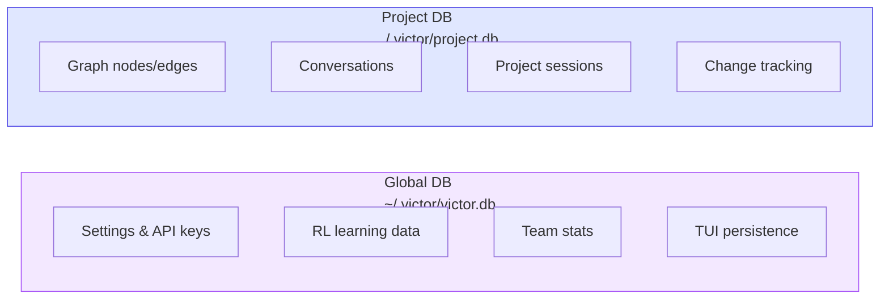

| Database | Path | Contents |
|----------|------|----------|
| **Global** | `~/.victor/victor.db` | Settings, API keys, RL data, team stats, TUI sessions |
| **Project** | `./.victor/project.db` | Graph, conversations, sessions, cache |
| **Undo** | `./.victor/undo.db` | File-edit undo/redo history (change groups + file changes) |

**Access pattern:**

```python
from victor.core.database import get_database, get_project_database
from victor.core.undo_database import get_undo_database

global_db = get_database()    # ~/.victor/victor.db
project_db = get_project_database()  # ./.victor/project.db
undo_db = get_undo_database()  # ./.victor/undo.db
```

**Why undo.db is separate:** `project.db` is written continuously by the graph
indexer (reindex-on-save). SQLite serializes writers even under WAL, so the
tiny per-edit undo write kept losing the write-lock and failing with
`database is locked` — silently dropping undo history. A dedicated `undo.db`
gives the undo writer its own lock (never contends with the indexer) and lets
multiple sessions editing the same project record history concurrently. Undo
history is rebuildable/ephemeral; durable rollback is covered by file backups
in `.victor/backups/`.

**Direction — correlated graph + vector backend:** the Code Context Graph (SQLite `graph_*`) and the
LanceDB embedding index are hand-joined today (`graph_node.embedding_ref` is unpopulated). The planned
direction collapses them into one correlated ProximaDB collection where a code symbol is one entity
(relational row + graph node + vector) addressed by a single `oid`. See
[ProximaDB as the CCG Backend](architecture/proximadb-codegraph-backend.md) (TD-11/TD-12/TD-13).

---

## Configuration System

Settings cascade: `.env` → `~/.victor/profiles.yaml` → CLI flags.
Runtime overrides via immutable `SessionConfig`.

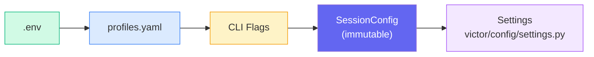

**Key config groups** (26+ nested groups in `victor/config/settings.py`):

| Group | Purpose |
|-------|---------|
| `ProviderSettings` | LLM provider configuration |
| `ToolSettings` | Tool registration and budgets |
| `SearchSettings` | Code search configuration |
| `ResilienceSettings` | Retry and circuit breaker |
| `SecuritySettings` | Safety and access control |
| `EventSettings` | Event sourcing configuration |
| `PipelineSettings` | Middleware pipeline |
| `PromptOptimizationSettings` | Runtime prompt evolution |

---

## Extension System

Three orthogonal integration mechanisms:

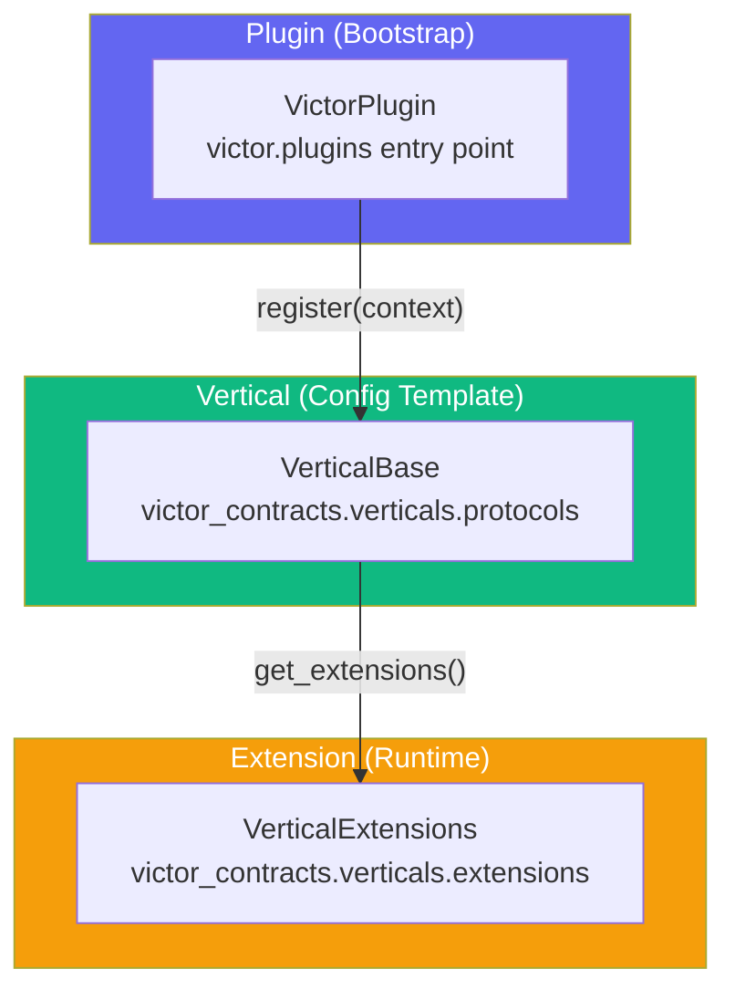

| Concept | Role | SDK Type | Lifecycle |
|---------|------|----------|-----------|
| **Plugin** | Bootstrap registrar | `VictorPlugin` | Transient: `register()` called once |
| **Vertical** | Configuration template | `VerticalBase` | Class-level: classmethods called |
| **Extension** | Runtime service | `VerticalExtensions` | Object-level: lazy-loaded |

**External packages** should import from:
- `victor_contracts` — Protocol/contract definitions
- `victor.framework.extensions` — Extension surfaces
- Never import `victor.agent.*` from external packages

### Extension Points

| Extension | How | Location |
|-----------|-----|----------|
| **Providers** | `BaseProvider` subclass | `victor/providers/` |
| **Tools** | `BaseTool` subclass | `victor/tools/` |
| **Workflows** | YAML DSL or StateGraph | `victor/workflows/` |
| **Middleware** | Pre/post hooks | `victor/agent/tool_pipeline.py` |

---

## Rust Native Extensions

Optional PyO3 extensions in `rust/` for performance-critical hot paths.

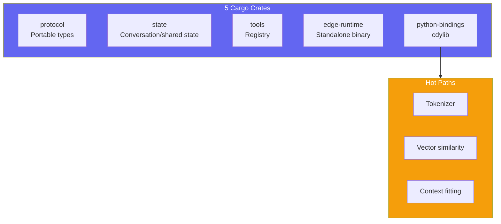

**Build**: `cd rust && maturin develop --release`

**Fallback pattern**: Every native path uses `_NATIVE_AVAILABLE` with graceful
Python fallback when Rust extensions are absent.

---

## Integration Points Map

Complete map of how all packages connect:

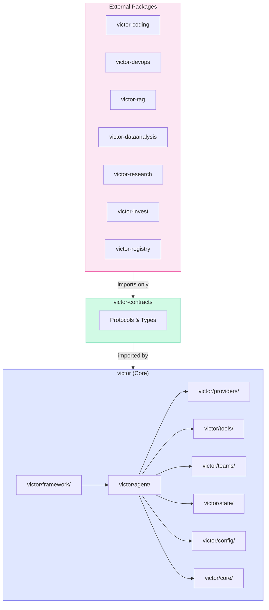

### Key Entry Points Summary

| Component | Path | Role |
|-----------|------|------|
| `Agent` | `victor/framework/agent.py` | Public API — `run()`, `stream()`, `chat()` |
| `StateGraph` | `victor/framework/graph.py` | DAG workflow engine |
| `AgentOrchestrator` | `victor/agent/orchestrator.py` | Central facade |
| `ChatService` | `victor/agent/services/chat_service.py` | Primary chat entry |
| `ToolService` | `victor/agent/services/tool_service.py` | Tool registration/execution |
| `AgentFactory` | `victor/framework/agent_factory.py` | Single authority for agent creation |
| `VictorAPIServer` | `victor/integrations/api/server.py` | FastAPI REST endpoint |
| `VictorClient` | `victor/framework/client.py` | UI layer entry point |
