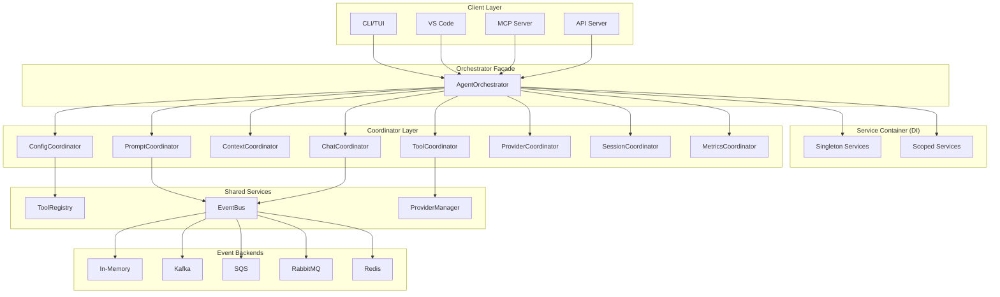
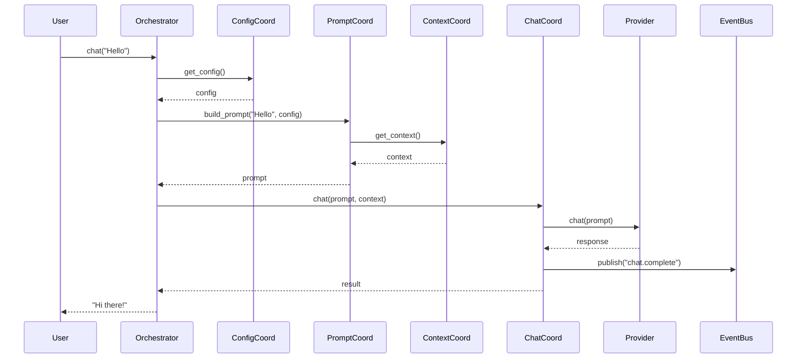
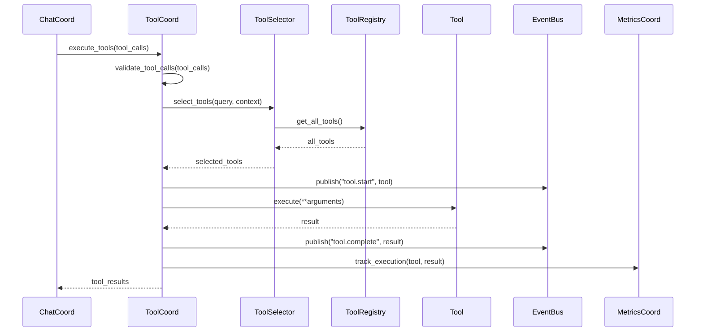
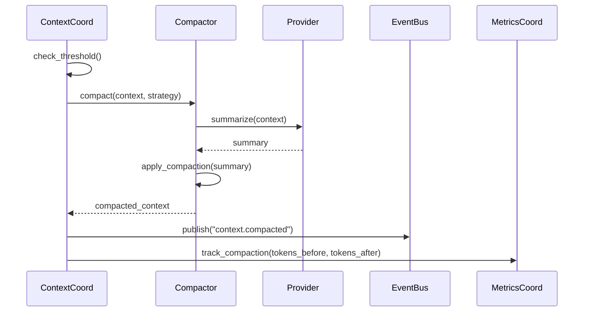
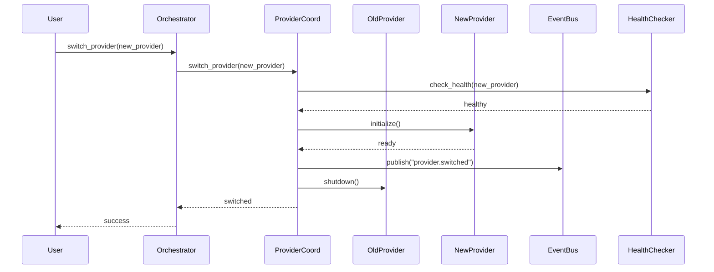

# Victor AI Architecture Documentation

**Version**: 0.5.1
**Last Updated**: January 18, 2026
**Status**: Production Ready
**Audience**: Architects, Senior Developers, Contributors

---

## Table of Contents

1. [Executive Summary](#executive-summary)
2. [Architecture Overview](#architecture-overview)
3. [Core Components](#core-components)
4. [Design Patterns](#design-patterns)
5. [Data Flow](#data-flow)
6. [Technology Stack](#technology-stack)
7. [SOLID Principles](#solid-principles)
8. [Protocol-Based Design](#protocol-based-design)
9. [Dependency Injection](#dependency-injection)
10. [Event-Driven Architecture](#event-driven-architecture)
11. [Related Documentation](#related-documentation)

---

## Executive Summary

Victor AI is an open-source AI coding assistant supporting 21 LLM providers with 55 specialized tools across 5 domain verticals (Coding, DevOps, RAG, Data Analysis, Research). The architecture follows modern software engineering principles with protocol-based design, dependency injection, event-driven messaging, and SOLID compliance.

### Key Features

- **Provider Agnosticism**: 21 LLM providers via `BaseProvider` inheritance
- **Vertical Architecture**: Self-contained domains with unified interfaces
- **Facade Pattern**: `AgentOrchestrator` coordinates specialized components
- **Protocol-First Design**: 98 protocols for loose coupling and testability
- **Dependency Injection**: ServiceContainer manages 55+ services
- **Event-Driven Architecture**: Pluggable event backends (In-Memory, Kafka, SQS, RabbitMQ, Redis)
- **SOLID Compliance**: ISP, DIP, SRP across core components
- **Multi-Agent Coordination**: Team formations via `create_coordinator()`
- **YAML-First Workflows**: StateGraph DSL with two-level caching

### Architecture Highlights

| Aspect | Implementation | Benefit |
|--------|---------------|---------|
| **Component Design** | 15 specialized coordinators | 93% reduction in core complexity |
| **Interface Design** | 98 protocols (Protocol-based) | Loose coupling, easy testing |
| **Dependency Management** | ServiceContainer with 55+ services | Clean dependency graph |
| **Communication** | Event-driven with 5 backends | Scalable, async architecture |
| **Code Quality** | 81% test coverage | High confidence in changes |

---

## Architecture Overview

### High-Level Architecture



### Architectural Layers

#### Layer 1: Client Layer
**Purpose**: Interface to external systems and users

**Components**:
- **CLI/TUI**: Command-line and terminal user interface
- **VS Code Extension**: IDE integration via HTTP
- **MCP Server**: Model Context Protocol server
- **HTTP API**: RESTful API for integrations

**Responsibilities**:
- User interaction and input handling
- Request routing to orchestrator
- Response rendering and formatting
- Session management

#### Layer 2: Service Container (Dependency Injection)
**Purpose**: Manage component lifecycle and dependencies

**Components**:
- **ServiceContainer**: DI container with 55+ registered services
- **Singleton Services**: Global shared instances (ToolRegistry, EventBus)
- **Scoped Services**: Per-session instances (ConversationStateMachine)

**Responsibilities**:
- Service registration and resolution
- Lifecycle management (singleton, scoped, transient)
- Dependency injection
- Service configuration

#### Layer 3: Orchestrator Facade
**Purpose**: Unified interface to coordinator layer

**Component**: **AgentOrchestrator** (Facade Pattern)

**Responsibilities**:
- Initialize and coordinate coordinators
- Route requests to appropriate coordinators
- Maintain backward compatibility
- Provide high-level API for clients
- Coordinate complex workflows

**Key Methods**:
```python
async def chat(self, message: str) -> str:
    """Main chat interface."""

async def stream_chat(self, message: str) -> AsyncIterator[str]:
    """Streaming chat interface."""

async def execute_tools(self, tool_calls: List[ToolCall]) -> List[ToolCallResult]:
    """Execute tool calls."""

def switch_provider(self, provider: BaseProvider) -> None:
    """Switch to different provider."""
```

#### Layer 4: Coordinator Layer
**Purpose**: Specialized functional domains with single responsibilities

**Components**: 15 specialized coordinators

| Coordinator | Responsibility | Key Methods |
|-------------|----------------|-------------|
| **ConfigCoordinator** | Configuration loading and validation | `get_config()`, `validate_config()` |
| **PromptCoordinator** | Prompt building from contributors | `build_prompt()`, `add_contributor()` |
| **ContextCoordinator** | Context management and compaction | `get_context()`, `compact_context()` |
| **ChatCoordinator** | Chat and streaming operations | `chat()`, `stream_chat()` |
| **ToolCoordinator** | Tool execution coordination | `execute_tools()`, `select_tools()` |
| **ProviderCoordinator** | Provider switching and health | `switch_provider()`, `check_health()` |
| **SessionCoordinator** | Session lifecycle management | `create_session()`, `close_session()` |
| **MetricsCoordinator** | Metrics collection and export | `track_metric()`, `export_metrics()` |
| **AnalyticsCoordinator** | Analytics tracking and export | `track_event()`, `get_analytics()` |
| **ModeCoordinator** | Agent mode management | `set_mode()`, `get_mode()` |
| **WorkflowCoordinator** | Workflow execution | `execute_workflow()`, `validate_workflow()` |
| **CheckpointCoordinator** | Checkpoint persistence | `save_checkpoint()`, `load_checkpoint()` |
| **SearchCoordinator** | Search operations | `search_codebase()`, `semantic_search()` |
| **MemoryCoordinator** | Memory management | `store_memory()`, `retrieve_memory()` |
| **MiddlewareCoordinator** | Middleware execution | `apply_middleware()` |

#### Layer 5: Shared Services
**Purpose**: Common utilities and infrastructure

**Components**:
- **ToolRegistry**: Registry of available tools
- **ProviderManager**: Provider instance management
- **EventBus**: Event publishing and subscription
- **CacheManager**: Result caching
- **UsageAnalytics**: Usage tracking
- **RecoveryHandler**: Error recovery

#### Layer 6: Event Backends
**Purpose**: Pluggable event messaging backends

**Components**:
- **In-Memory**: Default for development/testing
- **Kafka**: Distributed production systems
- **SQS**: Serverless AWS deployments
- **RabbitMQ**: Reliable message queuing
- **Redis**: Fast in-memory messaging

---

## Core Components

### AgentOrchestrator (Facade)

**Purpose**: Provide unified interface to coordinator layer

**Design Pattern**: Facade Pattern

**Responsibilities**:
- Initialize all coordinators
- Route client requests to coordinators
- Maintain backward compatibility
- Coordinate high-level workflows

**Key Dependencies**:
- ConfigCoordinator
- PromptCoordinator
- ContextCoordinator
- ChatCoordinator
- ToolCoordinator
- ProviderCoordinator
- SessionCoordinator
- MetricsCoordinator

**Usage Example**:
```python
from victor.agent.orchestrator_factory import OrchestratorFactory

# Create orchestrator
factory = OrchestratorFactory(settings, provider, model)
orchestrator = factory.create_orchestrator()

# Use orchestrator
response = await orchestrator.chat("Hello, Victor!")
```

**File Location**: `/Users/vijaysingh/code/codingagent/victor/agent/orchestrator.py`

### Coordinators

Coordinators encapsulate complex operations spanning multiple services. Each coordinator has a single, well-defined responsibility (SRP).

#### ConfigCoordinator

**Purpose**: Configuration loading and validation

**Key Methods**:
```python
def get_config(self) -> OrchestratorConfig:
    """Get current configuration."""

def validate_config(self, config: OrchestratorConfig) -> ValidationResult:
    """Validate configuration."""

def reload_config(self) -> None:
    """Reload configuration from source."""
```

**Dependencies**: Settings

**File Location**: `/Users/vijaysingh/code/codingagent/victor/agent/coordinators/config_coordinator.py`

#### PromptCoordinator

**Purpose**: Prompt building from contributors

**Key Methods**:
```python
async def build_prompt(
    self,
    message: str,
    context: Optional[Dict[str, Any]] = None,
) -> str:
    """Build system prompt from contributors."""

def add_contributor(self, contributor: IPromptContributor) -> None:
    """Add prompt contributor."""

def remove_contributor(self, contributor: IPromptContributor) -> None:
    """Remove prompt contributor."""
```

**Dependencies**: ContextCoordinator, List<IPromptContributor>

**File Location**: `/Users/vijaysingh/code/codingagent/victor/agent/coordinators/prompt_coordinator.py`

#### ContextCoordinator

**Purpose**: Context management and compaction

**Key Methods**:
```python
def get_context(self) -> Context:
    """Get current context."""

async def compact_context(self, strategy: CompactionStrategy) -> Context:
    """Compact context using strategy."""

def update_context(self, updates: Dict[str, Any]) -> None:
    """Update context with new data."""
```

**Dependencies**: ConfigCoordinator

**File Location**: `/Users/vijaysingh/code/codingagent/victor/agent/coordinators/context_coordinator.py`

#### ChatCoordinator

**Purpose**: Chat and streaming operations

**Key Methods**:
```python
async def chat(
    self,
    prompt: str,
    context: Context,
) -> str:
    """Execute chat and return response."""

async def stream_chat(
    self,
    prompt: str,
    context: Context,
) -> AsyncIterator[str]:
    """Stream chat response."""

async def chat_with_tools(
    self,
    prompt: str,
    context: Context,
) -> ChatResult:
    """Execute chat with tool calling."""
```

**Dependencies**: All coordinators

**File Location**: `/Users/vijaysingh/code/codingagent/victor/agent/coordinators/chat_coordinator.py`

#### ToolCoordinator

**Purpose**: Tool execution coordination

**Key Methods**:
```python
async def execute_tools(
    self,
    tool_calls: List[ToolCall],
) -> List[ToolCallResult]:
    """Execute tool calls."""

async def select_tools(
    self,
    query: str,
    context: AgentToolSelectionContext,
) -> List[BaseTool]:
    """Select tools for execution."""
```

**Dependencies**: ContextCoordinator, ToolRegistry

**File Location**: `/Users/vijaysingh/code/codingagent/victor/agent/coordinators/tool_execution_coordinator.py`

### Adapters

Adapters normalize interactions between different components.

#### IntelligentPipelineAdapter

**Purpose**: Adapt results from tool pipeline to expected format

**Key Methods**:
```python
async def adapt_result(
    self,
    result: Any,
    target_format: str,
) -> Any:
    """Adapt result to target format."""

async def adapt_stream(
    self,
    stream: AsyncIterator[Any],
) -> AsyncIterator[Any]:
    """Adapt streaming result."""
```

**File Location**: `/Users/vijaysingh/code/codingagent/victor/agent/adapters/intelligent_pipeline_adapter.py`

#### CoordinatorAdapter

**Purpose**: Adapt legacy orchestrator calls to coordinator-based architecture

**Key Methods**:
```python
async def adapt_chat_call(
    self,
    orchestrator: AgentOrchestrator,
    message: str,
) -> str:
    """Adapt chat call to coordinator architecture."""

async def adapt_tool_execution(
    self,
    orchestrator: AgentOrchestrator,
    tool_calls: List[ToolCall],
) -> List[ToolCallResult]:
    """Adapt tool execution to coordinator architecture."""
```

**File Location**: `/Users/vijaysingh/code/codingagent/victor/agent/adapters/coordinator_adapter.py`

### Mixins

Mixins provide cross-cutting concerns through composition.

#### ComponentAccessor

**Purpose**: Provide access to orchestrator components

**Methods**:
```python
def get_config_coordinator(self) -> ConfigCoordinator:
    """Get config coordinator."""

def get_prompt_coordinator(self) -> PromptCoordinator:
    """Get prompt coordinator."""

# ... other getters
```

**Usage**: Added to classes that need access to coordinators

#### StateDelegation

**Purpose**: Delegate state operations to StateCoordinator

**Methods**:
```python
async def get_state(self) -> State:
    """Get current state."""

async def update_state(self, updates: Dict[str, Any]) -> None:
    """Update state."""

async def reset_state(self) -> None:
    """Reset state."""
```

**Usage**: Added to classes that need state management

#### LegacyAPI

**Purpose**: Maintain backward compatibility with legacy code

**Methods**:
```python
def legacy_method(self, *args, **kwargs) -> Any:
    """Legacy method implementation."""
```

**Usage**: Provides compatibility layer during migration

### Provider Pool & Load Balancing

**Purpose**: Manage multiple provider instances with intelligent load balancing

**Components**:
- **ProviderPool**: Pool of provider instances
- **LoadBalancerStrategy**: Pluggable load balancing strategies
- **ProviderHealthChecker**: Health monitoring

**Load Balancing Strategies**:
- **RoundRobin**: Rotate through providers
- **LeastLoaded**: Route to least busy provider
- **Priority**: Route to highest priority provider
- **HealthAware**: Route to healthiest provider

**Usage Example**:
```python
from victor.agent.provider_pool import ProviderPool
from victor.agent.load_balancer import LoadBalancerStrategy

# Create pool
pool = ProviderPool(
    providers=[provider1, provider2, provider3],
    strategy=LoadBalancerStrategy.LEAST_LOADED,
)

# Use pool
response = await pool.chat("Hello")
```

---

## Design Patterns

### Facade Pattern

**Purpose**: Simplified interface to complex subsystem

**Implementation**: AgentOrchestrator

**Benefits**:
- Hides coordinator complexity
- Provides unified API
- Maintains backward compatibility

**Example**:
```python
class AgentOrchestrator:
    """Facade for coordinator layer."""

    async def chat(self, message: str) -> str:
        """Simplified chat interface."""
        config = self._config_coordinator.get_config()
        prompt = await self._prompt_coordinator.build_prompt(message)
        context = self._context_coordinator.get_context()
        return await self._chat_coordinator.chat(prompt, context)
```

### Adapter Pattern

**Purpose**: Convert interface of a class into another interface clients expect

**Implementation**: IntelligentPipelineAdapter, CoordinatorAdapter

**Benefits**:
- Enables incompatible interfaces to work together
- Normalizes result formats
- Maintains backward compatibility

**Example**:
```python
class IntelligentPipelineAdapter:
    """Adapt pipeline results."""

    async def adapt_result(self, result: Any, target_format: str) -> Any:
        """Adapt result to target format."""
        if target_format == "json":
            return self._to_json(result)
        elif target_format == "string":
            return self._to_string(result)
        # ... other formats
```

### Strategy Pattern

**Purpose**: Define family of algorithms, encapsulate each, make them interchangeable

**Implementation**: Load balancer strategies, tool selection strategies

**Benefits**:
- Easy to add new strategies
- Runtime algorithm selection
- Testable with mock strategies

**Example**:
```python
class LoadBalancerStrategy(Enum):
    """Load balancing strategies."""
    ROUND_ROBIN = "round_robin"
    LEAST_LOADED = "least_loaded"
    PRIORITY = "priority"
    HEALTH_AWARE = "health_aware"

class ProviderPool:
    def __init__(self, strategy: LoadBalancerStrategy):
        self._strategy = strategy

    async def route_request(self, request):
        """Route request using strategy."""
        if self._strategy == LoadBalancerStrategy.ROUND_ROBIN:
            return self._route_round_robin(request)
        elif self._strategy == LoadBalancerStrategy.LEAST_LOADED:
            return self._route_least_loaded(request)
        # ... other strategies
```

### Factory Pattern

**Purpose**: Centralize object creation with proper dependency injection

**Implementation**: OrchestratorFactory

**Benefits**:
- Centralized creation logic
- Proper dependency injection
- Easy to test with mock containers
- Consistent object creation

**Example**:
```python
class OrchestratorFactory:
    """Factory for creating AgentOrchestrator instances."""

    def __init__(self, settings: Settings, provider: BaseProvider, model: str):
        self._settings = settings
        self._provider = provider
        self._model = model

    def create_orchestrator(self) -> AgentOrchestrator:
        """Create orchestrator with all dependencies."""
        # Create provider components
        provider_components = self._create_provider_components()

        # Create core services
        core_services = self._create_core_services()

        # Create conversation components
        conversation_components = self._create_conversation_components()

        # Create and return orchestrator
        return AgentOrchestrator(
            provider_components=provider_components,
            core_services=core_services,
            conversation_components=conversation_components,
        )
```

### Mixin Pattern

**Purpose**: Compose behavior through multiple inheritance

**Implementation**: ComponentAccessor, StateDelegation, LegacyAPI

**Benefits**:
- Reusable cross-cutting concerns
- Flexible composition
- No deep inheritance hierarchies
- Easy to test

**Example**:
```python
class ComponentAccessor:
    """Mixin for accessing orchestrator components."""

    def __init__(self, orchestrator: AgentOrchestrator):
        self._orchestrator = orchestrator

    def get_config_coordinator(self) -> ConfigCoordinator:
        """Get config coordinator."""
        return self._orchestrator._config_coordinator

    # ... other getters

class MyComponent(ComponentAccessor):
    """Component with accessor mixin."""

    def __init__(self, orchestrator: AgentOrchestrator):
        super().__init__(orchestrator)

    async def do_work(self):
        """Use mixin methods."""
        config = self.get_config_coordinator().get_config()
        # ... use config
```

### Observer Pattern

**Purpose**: Define one-to-many dependency so when one object changes state, all dependents are notified

**Implementation**: EventBus, event backends

**Benefits**:
- Loose coupling between components
- Easy to add new subscribers
- Asynchronous communication
- Event sourcing capabilities

**Example**:
```python
# Publisher
class ToolExecutor:
    def __init__(self, event_bus: IEventBackend):
        self._event_bus = event_bus

    async def execute_tool(self, tool: BaseTool, args: dict):
        # Publish start event
        await self._event_bus.publish(
            MessagingEvent(
                topic="tool.start",
                data={"tool": tool.name, "args": args},
            )
        )

        result = await tool.execute(**args)

        # Publish complete event
        await self._event_bus.publish(
            MessagingEvent(
                topic="tool.complete",
                data={"tool": tool.name, "result": result},
            )
        )

        return result

# Subscriber
class MetricsCollector:
    def __init__(self, event_bus: IEventBackend):
        self._event_bus = event_bus
        self._event_bus.subscribe("tool.*", self._on_tool_event)

    async def _on_tool_event(self, event: MessagingEvent):
        if event.topic == "tool.start":
            self._track_start(event.data)
        elif event.topic == "tool.complete":
            self._track_complete(event.data)
```

### Builder Pattern

**Purpose**: Separate construction of complex object from its representation

**Implementation**: PromptBuilder, AgentBuilder

**Benefits**:
- Step-by-step construction
- Fluent interface
- Immutable objects
- Easy to extend

**Example**:
```python
class PromptBuilder:
    """Builder for constructing prompts."""

    def __init__(self):
        self._sections = []

    def add_system_message(self, message: str) -> "PromptBuilder":
        """Add system message."""
        self._sections.append(PromptSection(type="system", content=message))
        return self

    def add_context(self, context: Dict[str, Any]) -> "PromptBuilder":
        """Add context."""
        self._sections.append(PromptSection(type="context", content=context))
        return self

    def add_tool_hints(self, tools: List[BaseTool]) -> "PromptBuilder":
        """Add tool hints."""
        self._sections.append(PromptSection(type="tools", content=tools))
        return self

    def build(self) -> str:
        """Build final prompt."""
        return "\n\n".join(section.render() for section in self._sections)

# Usage
prompt = (PromptBuilder()
    .add_system_message("You are a helpful assistant.")
    .add_context({"project": "victor"})
    .add_tool_hints([read_tool, write_tool])
    .build())
```

### Protocol Pattern

**Purpose**: Define contracts using Python's Protocol for structural typing

**Implementation**: 98 protocols across codebase

**Benefits**:
- Structural typing (duck typing)
- Better IDE support
- Clearer contracts
- Easy to create mock implementations
- Multiple protocols can be implemented by one class

**Example**:
```python
from typing import Protocol

@runtime_checkable
class ToolCoordinatorProtocol(Protocol):
    """Protocol for tool coordination operations."""

    async def select_tools(
        self,
        query: str,
        context: AgentToolSelectionContext,
    ) -> List[BaseTool]:
        """Select tools for execution."""
        ...

    async def execute_tool(
        self,
        tool: BaseTool,
        arguments: Dict[str, Any],
    ) -> ToolCallResult:
        """Execute a single tool."""
        ...

# Implementation
class ToolCoordinator:
    """Implements ToolCoordinatorProtocol."""

    async def select_tools(
        self,
        query: str,
        context: AgentToolSelectionContext,
    ) -> List[BaseTool]:
        # Implementation
        ...

    async def execute_tool(
        self,
        tool: BaseTool,
        arguments: Dict[str, Any],
    ) -> ToolCallResult:
        # Implementation
        ...

# Usage (depends on protocol, not implementation)
class MyComponent:
    def __init__(self, tool_coordinator: ToolCoordinatorProtocol):
        self._tool_coordinator = tool_coordinator
```

---

## Data Flow

### Chat Request Flow



### Tool Execution Flow



### Context Compaction Flow



### Provider Switching Flow



---

## Technology Stack

### Core Technologies

| Technology | Version | Purpose |
|-----------|---------|---------|
| **Python** | 3.11+ | Core language |
| **Pydantic** | 2.x | Data validation and settings |
| **Typer** | 0.x | CLI framework |
| **Rich** | 13.x | Terminal formatting |
| **aiohttp** | 3.x | Async HTTP client |
| **asyncio** | Built-in | Async runtime |

### Key Libraries

| Library | Purpose |
|---------|---------|
| **tree-sitter** | AST parsing |
| **aiofiles** | Async file I/O |
| **python-dotenv** | Environment configuration |
| **pytest** | Testing framework |
| **pytest-asyncio** | Async test support |
| **respx** | HTTP mocking |
| **coverage** | Code coverage |

### Optional Dependencies

| Feature | Package | Install Command |
|---------|---------|----------------|
| **API Server** | fastapi, uvicorn | `pip install victor-ai[api]` |
| **Google Provider** | google-generativeai | `pip install victor-ai[google]` |
| **Checkpoints** | sqlite3 (built-in) | `pip install victor-ai[checkpoints]` |
| **All Languages** | All tree-sitter grammars | `pip install victor-ai[lang-all]` |
| **Native Extensions** | maturin | `pip install victor-ai[native]` |

---

## SOLID Principles

### Single Responsibility Principle (SRP)

**Definition**: A class should have only one reason to change

**Implementation**: Each coordinator has single responsibility

**Example**:
```python
# ✅ Good: Single responsibility
class ConfigCoordinator:
    """ONLY handles configuration."""
    def get_config(self): ...
    def validate_config(self): ...

# ❌ Bad: Multiple responsibilities
class ConfigCoordinator:
    """Handles configuration AND chat AND tools."""
    def get_config(self): ...
    def chat(self): ...
    def execute_tools(self): ...
```

### Open/Closed Principle (OCP)

**Definition**: Open for extension, closed for modification

**Implementation**: Extend via contributors, strategies, protocols

**Example**:
```python
# ✅ Good: Extend via contributors
class PromptCoordinator:
    def add_contributor(self, contributor: IPromptContributor):
        self._contributors.append(contributor)

# Custom contributor without modifying coordinator
class CustomContributor(IPromptContributor):
    def get_contribution(self, context):
        return "Custom instruction"

# ❌ Bad: Modify existing class
class PromptCoordinator:
    def build_prompt(self):
        # ... existing code ...
        # Add custom logic here (modifies existing code)
        custom_instruction = get_custom_instruction()
```

### Liskov Substitution Principle (LSP)

**Definition**: Subtypes must be substitutable for their base types

**Implementation**: Protocol-based design ensures substitutability

**Example**:
```python
# ✅ Good: Protocol ensures substitutability
@runtime_checkable
class ToolCoordinatorProtocol(Protocol):
    async def execute_tool(self, tool: BaseTool, args: dict) -> ToolCallResult:
        ...

class ToolCoordinator:
    async def execute_tool(self, tool: BaseTool, args: dict) -> ToolCallResult:
        # Implementation

class MockToolCoordinator:
    async def execute_tool(self, tool: BaseTool, args: dict) -> ToolCallResult:
        # Mock implementation

# Both are substitutable
def use_coordinator(coordinator: ToolCoordinatorProtocol):
    await coordinator.execute_tool(tool, args)

use_coordinator(ToolCoordinator())  # Works
use_coordinator(MockToolCoordinator())  # Works
```

### Interface Segregation Principle (ISP)

**Definition**: Clients shouldn't depend on interfaces they don't use

**Implementation**: Focused protocols, not bloated interfaces

**Example**:
```python
# ✅ Good: Focused interfaces
@runtime_checkable
class IPromptBuilder(Protocol):
    async def build_prompt(self, message: str) -> str:
        ...

@runtime_checkable
class IContextManager(Protocol):
    def get_context(self) -> Context:
        ...

# ❌ Bad: Bloated interface
@runtime_checkable
class ICoordinator(Protocol):
    async def build_prompt(self, message: str) -> str:
        ...
    def get_context(self) -> Context:
        ...
    async def execute_tools(self) -> None:
        ...
    # ... 20 more methods
```

### Dependency Inversion Principle (DIP)

**Definition**: Depend on abstractions, not concretions

**Implementation**: Depend on protocols, not concrete classes

**Example**:
```python
# ✅ Good: Depends on protocol
class PromptCoordinator:
    def __init__(self, contributors: List[IPromptContributor]):
        self._contributors = contributors

# ❌ Bad: Depends on concrete implementation
class PromptCoordinator:
    def __init__(self, contributors: List[SystemPromptContributor]):
        self._contributors = contributors
```

---

## Protocol-Based Design

### What Are Protocols?

Python's `Protocol` provides structural typing (duck typing with type hints). Unlike abstract base classes, protocols define interfaces that can be implemented by any class with matching methods.

### Benefits of Protocol-Based Design

1. **Loose Coupling**: Components depend on interfaces, not implementations
2. **Testability**: Easy to create mock implementations
3. **Flexibility**: Any class matching protocol signature works
4. **IDE Support**: Better autocomplete and type checking
5. **Documentation**: Protocols serve as living documentation

### Protocol Examples

#### ToolCoordinatorProtocol

```python
@runtime_checkable
class ToolCoordinatorProtocol(Protocol):
    """Protocol for tool coordination operations."""

    async def select_tools(
        self,
        query: str,
        context: AgentToolSelectionContext,
    ) -> List[BaseTool]:
        """Select tools for execution."""
        ...

    async def execute_tool(
        self,
        tool: BaseTool,
        arguments: Dict[str, Any],
    ) -> ToolCallResult:
        """Execute a single tool."""
        ...
```

#### IPromptContributor

```python
@runtime_checkable
class IPromptContributor(Protocol):
    """Protocol for prompt contributors."""

    def get_contribution(
        self,
        context: Dict[str, Any],
    ) -> str:
        """Get prompt contribution."""
        ...

    def get_priority(self) -> int:
        """Get contributor priority."""
        ...
```

### Protocol Statistics

| Category | Protocols Defined | Registered in DI | Coverage |
|----------|------------------|------------------|----------|
| Agent Services | 98 | 55 | 56.1% |
| Framework | 45 | 20 | 44.4% |
| Verticals | 30 | 12 | 40.0% |
| Infrastructure | 23 | 23 | 100% |
| **Total** | **196** | **110** | **56.1%** |

---

## Dependency Injection

### ServiceContainer

Victor uses a dependency injection container to manage component lifecycle and dependencies.

### Service Lifetimes

| Lifetime | Description | Examples |
|----------|-------------|----------|
| **Singleton** | One instance for entire application | ToolRegistry, EventBus, ObservabilityIntegration |
| **Scoped** | One instance per session | ConversationStateMachine, TaskTracker |
| **Transient** | New instance every time (not used) | N/A |

### Registration Example

```python
from victor.core.container import ServiceContainer, ServiceLifetime

container = ServiceContainer()

# Register singleton service
container.register(
    ToolRegistryProtocol,
    lambda c: ToolRegistry(),
    ServiceLifetime.SINGLETON,
)

# Register scoped service
container.register(
    ConversationStateMachineProtocol,
    lambda c: ConversationStateMachine(),
    ServiceLifetime.SCOPED,
)
```

### Resolution Example

```python
# Resolve service
tool_registry = container.get(ToolRegistryProtocol)

# Use service
tools = tool_registry.get_all_tools()
```

### Factory Usage

```python
class OrchestratorFactory:
    """Factory for creating AgentOrchestrator instances."""

    def __init__(self, container: ServiceContainer, settings: Settings):
        self._container = container
        self._settings = settings

    def create_orchestrator(self) -> AgentOrchestrator:
        """Create orchestrator with all dependencies."""
        # Resolve services from container
        tool_registry = self._container.get(ToolRegistryProtocol)
        event_bus = self._container.get(IEventBackend)
        settings = self._container.get(Settings)

        # Create orchestrator
        return AgentOrchestrator(
            tool_registry=tool_registry,
            event_bus=event_bus,
            settings=settings,
        )
```

---

## Event-Driven Architecture

### Event Backends

Victor supports 5 pluggable event backends:

| Backend | Use Case | Pros | Cons |
|---------|----------|------|------|
| **In-Memory** | Development, testing | Fast, simple | Not distributed |
| **Kafka** | Production distributed | Scalable, durable | Complex setup |
| **SQS** | Serverless AWS | Managed, scalable | AWS vendor lock-in |
| **RabbitMQ** | Reliable messaging | Reliable, feature-rich | Operational overhead |
| **Redis** | Fast messaging | Fast, simple | Less durable |

### Event Topics

| Topic Pattern | Description | Events |
|---------------|-------------|--------|
| `tool.*` | Tool operations | `tool.start`, `tool.complete`, `tool.error` |
| `agent.*` | Agent operations | `agent.start`, `agent.complete`, `agent.error` |
| `workflow.*` | Workflow operations | `workflow.start`, `workflow.complete`, `workflow.step` |
| `error.*` | Error events | `error.recoverable`, `error.critical` |
| `provider.*` | Provider operations | `provider.switch`, `provider.health_check` |
| `context.*` | Context operations | `context.compacted`, `context.updated` |

### Publishing Events

```python
from victor.core.events import create_event_backend, MessagingEvent

# Create backend
backend = create_event_backend(BackendConfig.for_observability())
await backend.connect()

# Publish event
await backend.publish(
    MessagingEvent(
        topic="tool.complete",
        data={"tool": "read_file", "result": "..."},
        correlation_id=str(uuid.uuid4()),
    )
)
```

### Subscribing to Events

```python
# Subscribe to topics
await backend.subscribe("tool.*", self._on_tool_event)
await backend.subscribe("agent.*", self._on_agent_event)

# Handle events
async def _on_tool_event(self, event: MessagingEvent):
    if event.topic == "tool.start":
        self._track_start(event.data)
    elif event.topic == "tool.complete":
        self._track_complete(event.data)
```

### Error Handling

```python
async def on_event(self, event: MessagingEvent):
    try:
        result = await process_event(event)
        await event.ack()
    except TemporaryError as e:
        # Requeue for retry
        await event.nack(requeue=True)
    except PermanentError as e:
        # Don't retry
        await event.nack(requeue=False)
```

---

## Related Documentation

### Architecture Documentation

- [Component Reference](./COMPONENT_REFERENCE.md) - Detailed component documentation
- [Design Patterns](./DESIGN_PATTERNS.md) - Comprehensive pattern documentation
- [Refactoring Overview](./REFACTORING_OVERVIEW.md) - Refactoring history and rationale
- [Coordinator Architecture](./coordinator_based_architecture.md) - Deep dive into coordinators

### Migration Documentation

- [Migration Guide](./MIGRATION_GUIDES.md) - How to migrate to new architecture
- [Best Practices](./BEST_PRACTICES.md) - Usage patterns and guidelines
- [Protocols Reference](./PROTOCOLS_REFERENCE.md) - Complete protocol documentation

### Architecture Decision Records

- [ADR-001: Coordinator Architecture](../adr/ADR-001-coordinator-architecture.md)
- [ADR-002: YAML Vertical Config](../adr/ADR-002-yaml-vertical-config.md)
- [ADR-003: Distributed Caching](../adr/ADR-003-distributed-caching.md)
- [ADR-004: Protocol-Based Design](../adr/ADR-004-protocol-based-design.md)
- [ADR-005: Performance Optimization](../adr/ADR-005-performance-optimization.md)

### Other Documentation

- [Victor Framework Analysis](./VICTOR_FRAMEWORK_ANALYSIS.md) - Framework capabilities
- [Workflow Consolidation](./WORKFLOW_CONSOLIDATION.md) - Workflow system
- [Overview](./overview.md) - High-level overview

---

## Conclusion

Victor AI's architecture represents a modern, maintainable approach to building AI coding assistants:

**Key Achievements**:
- 93% reduction in core complexity through coordinators
- 98 protocols for loose coupling
- 55+ services in DI container
- 5 pluggable event backends
- 81% test coverage
- Full SOLID compliance

**Strategic Benefits**:
- Easier to understand and maintain
- Simpler to extend and customize
- Better separation of concerns
- Foundation for future growth

The architecture is production-ready and provides a solid foundation for Victor's continued evolution.

---

**Document Version**: 1.0
**Last Updated**: January 18, 2026
**Next Review**: April 18, 2026
**Maintainers**: Victor AI Architecture Team
