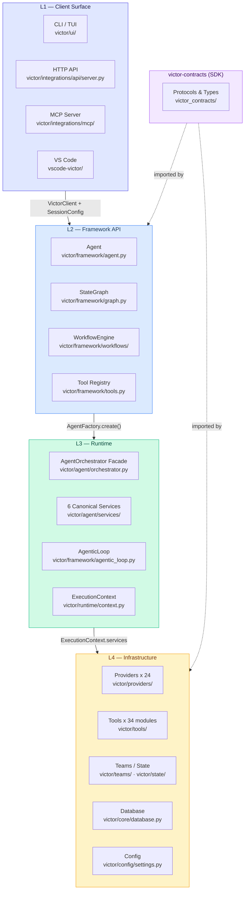
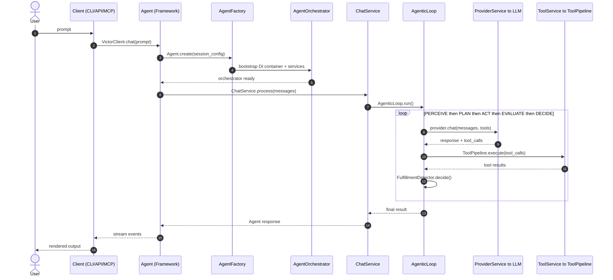
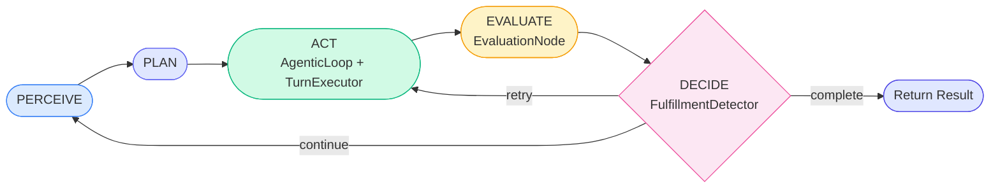
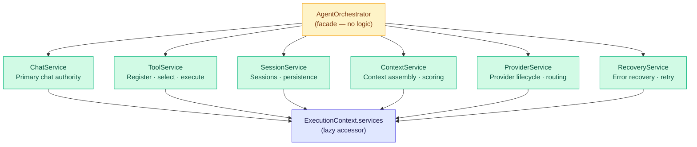
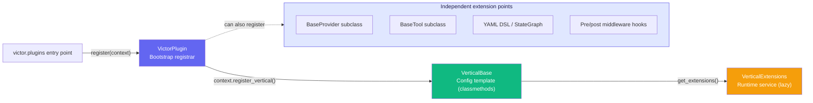
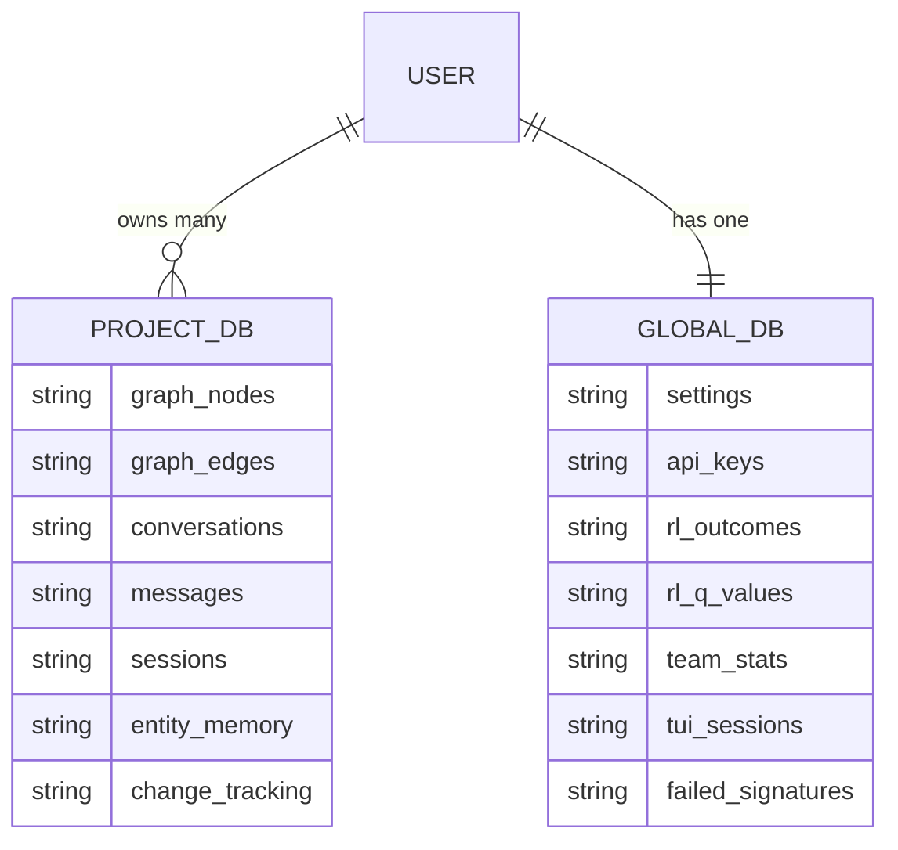
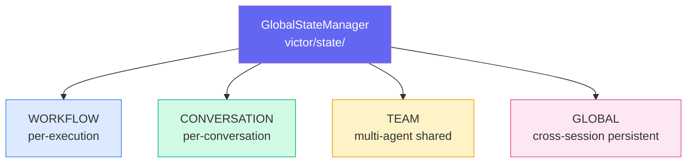
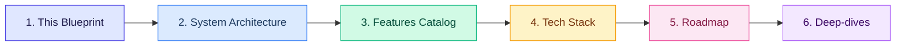

# Victor — Master Blueprint

> **The starting point for understanding Victor.** A single-page, top-down and
> bottom-up orientation map of the entire codebase — grounded in real modules
> and integration points. All diagrams are Mermaid and render inline.

**Version**: {{ victor_version }} | **Status**: Canonical orientation document

---

## Table of Contents

- [What Victor Is](#what-victor-is)
- [Top-Down View — Layer Architecture](#top-down-view--layer-architecture)
- [Request Flow — A Single Chat Turn](#request-flow--a-single-chat-turn)
- [Bottom-Up View — Package & Module Map](#bottom-up-view--package--module-map)
- [The Six Canonical Services](#the-six-canonical-services)
- [Extension Surfaces](#extension-surfaces)
- [Data & State Model](#data--state-model)
- [Reading Order — Suggested Path](#reading-order--suggested-path)
- [Glossary](#glossary)

---

## What Victor Is

Victor (`victor-ai`) is a **contract-first, service-first agentic AI framework**
in Python 3.10+ for building autonomous agents that reason, call tools, execute
DAG workflows, and coordinate multi-agent teams across **24 LLM providers**.

Three packages compose the ecosystem:

| Package | Role | Direction |
|---------|------|-----------|
| `victor` (this repo) | Core runtime + framework | Depends on contracts |
| `victor-contracts` | Stable SDK protocols/types | Imported by everyone |
| `victor-coding` … `victor-invest` | External domain verticals | Import contracts only |

**In one line:**
`User → Client → Agent API → AgentOrchestrator (facade) → 6 Services → Providers + Tools → Storage`.

> Authoritative depth lives in the [System Architecture](../architecture.md).
> This blueprint is the map; that document is the territory.

---

## Top-Down View — Layer Architecture

Victor is a strict four-layer stack. Each layer only depends on the layer below.



**Layer rules (enforced by CI):**

| Rule | Guard test |
|------|-----------|
| L1 uses L2 only — never imports `victor.agent.*` | `tests/unit/framework/test_architectural_boundaries.py` |
| L2 delegates creation to `AgentFactory` | `victor/framework/agent_factory.py` |
| L3 orchestrator is a facade — services own logic | `tests/unit/runtime/test_service_layer_validation.py` |
| External verticals import `victor_contracts` only | `tests/unit/sdk/test_core_vertical_import_boundary.py` |

---

## Request Flow — A Single Chat Turn

How one prompt travels through the system — the most important diagram to
internalize first.



The `AgenticLoop` is the **canonical execution authority for chat** — it runs
unconditionally. Each cycle:



| Phase | Owner module |
|-------|-------------|
| PERCEIVE | `victor/framework/perception_integration.py` |
| PLAN | `victor/agent/task_analyzer.py` |
| ACT | `victor/framework/agentic_loop.py` |
| EVALUATE | `victor/framework/evaluation_nodes.py` |
| DECIDE | `victor/framework/fulfillment.py` |
| **Entry point** | `TurnExecutor.execute_agentic_loop()` — `victor/agent/services/turn_execution_runtime.py` |

---

## Bottom-Up View — Package & Module Map

Read this to find where any concern lives in the source tree.

```mermaid
flowchart TB
    subgraph FW["victor/framework/ — Public API"]
        agent["agent.py — run/stream/chat/run_workflow/run_team"]
        graphf["graph.py — StateGraph (DAG engine)"]
        agloop["agentic_loop.py — AgenticLoop"]
        af["agent_factory.py — AgentFactory (single authority)"]
        rl["rl/ — prompt optimization (GEPA, MiPROv2, CoT)"]
        extf["extensions.py — extension surfaces"]
    end
    subgraph AG["victor/agent/ — Runtime"]
        orc["orchestrator.py — Facade"]
        svcs["services/ — 6 canonical + runtime helpers"]
        conv["conversation/ — store, scoring, assembler"]
        coord["coordinators/ — extracted coordinators"]
        rt["runtime/ — ExecutionContext, boundary modules"]
    end
    subgraph INF["victor/ — Infrastructure"]
        prov["providers/ — 24 BaseProvider subclasses"]
        tools["tools/ — 34 modules · BaseTool"]
        teams["teams/ — UnifiedTeamCoordinator, formations"]
        statef["state/ — GlobalStateManager (4 scopes)"]
        config["config/settings.py — 26+ config groups"]
        core["core/ — DI container, database, CQRS, events"]
    end
    subgraph CT2["victor-contracts/ — SDK"]
        ct["verticals/protocols/base.py — VerticalBase"]
        plugins["core/plugins.py — VictorPlugin"]
        skills["SkillDefinition · SkillProvider"]
    end
    subgraph EXT["External Verticals (separate repos)"]
        ext1["victor-coding"]
        ext2["victor-devops"]
        ext3["victor-rag"]
        ext4["victor-dataanalysis"]
        ext5["victor-research"]
        ext6["victor-invest"]
    end
    FW --> AG
    AG --> INF
    CT2 -.->|"imported by"| FW
    CT2 -.->|"imported by"| AG
    EXT -->|"imports only"| CT2
    style FW fill:#dbeafe,stroke:#3b82f6,color:#1e3a5f
    style AG fill:#d1fae5,stroke:#10b981,color:#064e3b
    style INF fill:#fef3c7,stroke:#f59e0b,color:#78350f
    style CT2 fill:#f3e8ff,stroke:#a855f7,color:#3b0764
    style EXT fill:#fce7f3,stroke:#ec4899,color:#831843
```



### Key entry points

| Component | Path | Role |
|-----------|------|------|
| `Agent` | `victor/framework/agent.py` | Public API — `run()`, `stream()`, `chat()` |
| `StateGraph` | `victor/framework/graph.py` | DAG workflow engine |
| `AgentFactory` | `victor/framework/agent_factory.py` | Single authority for agent creation |
| `VictorClient` | `victor/framework/client.py` | UI layer entry point |
| `AgentOrchestrator` | `victor/agent/orchestrator.py` | Central facade (delegates, no logic) |
| `ChatService` | `victor/agent/services/chat_service.py` | Primary chat entry |
| `ToolService` | `victor/agent/services/tool_service.py` | Tool registration/execution |
| `BaseProvider` | `victor/providers/base.py` | Abstract base for all 24 providers |
| `BaseTool` | `victor/tools/base.py` | Foundation for all 55+ tools |
| `VerticalBase` | `victor_contracts/verticals/protocols/base.py` | Core abstraction for 101+ plugins |
| `VictorAPIServer` | `victor/integrations/api/server.py` | FastAPI REST endpoint |

---

## The Six Canonical Services

The orchestrator is a **facade** — all effectful behavior is owned by exactly
six mandatory services (no feature flags, no fallbacks).



| Service | Module | Owns |
|---------|--------|------|
| `ChatService` | `victor/agent/services/chat_service.py` | Turn execution, AgenticLoop wiring |
| `ToolService` | `victor/agent/services/tool_service.py` | Registration, semantic selection, budgets |
| `SessionService` | `victor/agent/services/session_service.py` | Session lifecycle, persistence (canonical) |
| `ContextService` | `victor/agent/services/context_service.py` | Context assembly, scoring, pruning |
| `ProviderService` | `victor/agent/services/provider_service.py` | Provider lifecycle, caching, switching |
| `RecoveryService` | `victor/agent/services/recovery_service.py` | Error recovery, loop-prevention |

**Access pattern:**

```python
from victor.runtime.context import ExecutionContext

ctx = ExecutionContext(settings=settings)
ctx.services.chat       # ChatService
ctx.services.tool       # ToolService
ctx.services.provider   # ProviderService
```

> **UI layer rule**: must go through `VictorClient` + `SessionConfig` — never
> import `AgentOrchestrator` or `AgentFactory` directly.

---

## Extension Surfaces

Three **orthogonal, complementary** mechanisms — not duplicates.



| Mechanism | Role | Location |
|-----------|------|----------|
| **Plugin** (`VictorPlugin`) | Bootstrap registrar — discovered via `victor.plugins` entry point | `victor_contracts/core/plugins.py` |
| **Vertical** (`VerticalBase`) | Configuration template — tools, prompts, stages | `victor_contracts/verticals/protocols/base.py` |
| **Extension** (`VerticalExtensions`) | Runtime service — middleware, safety, prompts | `victor_contracts/verticals/extensions.py` |
| **Provider** (`BaseProvider`) | LLM adapter | `victor/providers/` |
| **Tool** (`BaseTool`) | Tool implementation | `victor/tools/` |

**Rule:** External verticals import `victor_contracts` or
`victor.framework.extensions` only — never `victor.agent.*`.

---

## Data & State Model

Victor uses a **two-database architecture** plus a four-scope state model.



| Database | Path | Contents |
|----------|------|----------|
| **Global** | `~/.victor/victor.db` | Settings, API keys, RL data, team stats, TUI sessions |
| **Project** | `./.victor/project.db` | Graph, conversations, sessions, cache, change tracking |



---

## Reading Order — Suggested Path

New to the codebase? Read in this order:



| Step | Document | Purpose |
|------|----------|---------|
| 1 | [Master Blueprint](BLUEPRINT.md) *(this page)* | 10-minute mental model |
| 2 | [System Architecture](../architecture.md) | Canonical, full-depth reference |
| 3 | [Features Catalog](../features.md) | What's implemented, grounded in modules |
| 4 | [Tech Stack](../tech-stack.md) | Dependencies + technical debt register |
| 5 | [Roadmap](../roadmap.md) | Priorities, horizons, feature status |
| 6 | [Deep-dives](#) | [Orchestrator decomposition](orchestrator_decomposition.md), [SDK boundary](CONTRACTS_BOUNDARY.md), [State-passed architecture](state-passed-architecture.md), [Streaming pipeline](streaming-pipeline.md) |

---

## Glossary

| Term | Meaning |
|------|---------|
| **Facade** | `AgentOrchestrator` — delegates all requests; contains no business logic |
| **Canonical service** | One of the 6 mandatory effectful owners (Chat, Tool, Session, Context, Provider, Recovery) |
| **AgenticLoop** | The PERCEIVE→PLAN→ACT→EVALUATE→DECIDE cycle; canonical chat execution authority |
| **Vertical** | A domain configuration template (`VerticalBase`) — tools, prompts, stages |
| **Contract** | A stable type/protocol in `victor-contracts` (independent semver) |
| **StateGraph** | The DAG execution engine — also the foundation for multi-agent teams |
| **SessionConfig** | Immutable runtime-override object — the only sanctioned settings mutation point |
| **Global DB** | `~/.victor/victor.db` — user-wide data (settings, RL, team stats) |
| **Project DB** | `./.victor/project.db` — repo-scoped data (graph, conversations, sessions) |
| **KV caching** | Local-provider optimization: frozen system prompt + deterministic tool ordering |

---

> **Next**: Read the [System Architecture](../architecture.md) for full depth,
> or the [Features Catalog](../features.md) for what's implemented.
