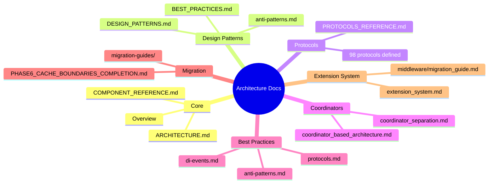

# Architecture Documentation

Victor's architecture documentation covering design patterns, protocols, and best practices.

## Architecture Documentation Map

## Quick Links

| Document | Description | Audience |
|----------|-------------|----------|
| **Overview** | System architecture overview | All users |
| **Best Practices** | Usage patterns and anti-patterns | Developers |
| **Design Patterns** | Architectural patterns | Architects |
| **Protocols Reference** | All 98 protocols | Developers |
| **Migration Guides** | Upgrading and migration | Developers |

---

## Core Architecture

### [Overview](overview.md)
High-level system architecture with two-layer coordinator design.

**Topics:**
- System layers and components
- Two-layer coordinator architecture
- Key design patterns
- Provider and tool systems
- Event-driven architecture

### [Architecture Deep Dive](ARCHITECTURE.md)
Comprehensive architecture documentation.

**Topics:**
- Facade pattern implementation
- Provider agnostic design
- Tool pipeline architecture
- Workflow system
- Vertical architecture

### [Component Reference](COMPONENT_REFERENCE.md)
Detailed component documentation.

---

## Design Patterns

### [Design Patterns](DESIGN_PATTERNS.md)
Architectural patterns used throughout Victor.

**Patterns:**
- Facade Pattern (AgentOrchestrator)
- Protocol-Based Design (98 protocols)
- Dependency Injection (ServiceContainer)
- Event-Driven Architecture (EventBus)
- Two-Layer Coordinator Pattern
- Strategy Pattern (tool selection)
- Observer Pattern (event bus)
- Factory Pattern (OrchestratorFactory)

### [Best Practices](BEST_PRACTICES.md)
Usage patterns and anti-patterns.

**Topics:**
- Using protocols
- Using dependency injection
- Using event-driven architecture
- Using coordinators
- Choosing patterns
- Anti-patterns to avoid

---

## Coordinator Architecture

### [Two-Layer Design](coordinator_separation.md)
Application vs Framework layer separation.

**Layers:**
- Application Layer: Victor-specific (ChatCoordinator, ToolCoordinator, etc.)
- Framework Layer: Domain-agnostic (YAMLWorkflowCoordinator, GraphExecutionCoordinator, etc.)

### [Coordinator-Based Architecture](coordinator_based_architecture.md)
Coordinator pattern implementation details.

---

## Protocols

### [Protocols Reference](PROTOCOLS_REFERENCE.md)
Complete reference for all 98 protocols.

**Categories:**
- Provider protocols
- Tool protocols
- Coordinator protocols
- Service protocols

---

## Migration & Upgrading

### [Migration Guides](MIGRATION_GUIDES.md)
Guides for upgrading between versions.

**Note**: Legacy refactoring and workflow migration guides were removed from the docs tree. Refer to git history if you
  need older materials.

---

## Additional Resources

- [Developer Guide](../contributing/index.md) - Development setup and workflows
- [API Reference](../reference/index.md) - Complete API documentation
- [Testing Guide](../testing/TESTING_GUIDE.md) - Testing strategy

---

**[← Back to Documentation](../index.md)**

**Architecture Documentation**

*System design and patterns*

---

## See Also

- [Documentation Home](../../README.md)

**Last Updated:** February 01, 2026
**Reading Time:** 2 min
