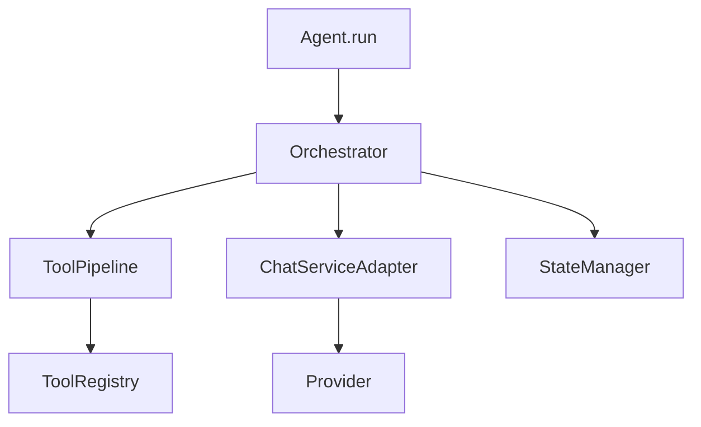

# Victor Tools: Graph Enhancement Opportunities

## Overview

This document maps Victor's existing tools to graph-based enhancements derived from the research papers. Each tool can benefit from specific graph mechanisms.

---

## Tool Enhancement Matrix

| Tool | Current Function | Graph Enhancement | Priority | Paper Inspiration |
|------|------------------|-------------------|----------|-------------------|
| **CodeSearchTool** | Semantic code search | Add structural similarity, multi-hop context | P0 | GraphRAG |
| **CodeReadTool** | Read file contents | Add dependency context, caller graph | P0 | GraphCodeAgent |
| **SymbolSearchTool** | Find symbols by name | Add graph traversal, path queries | P0 | CodexGraph |
| **ContextBuilder** | Build init.md | Add call chains, dependency tree | P0 | GraphCodeAgent |
| **RefactorTool** | Code refactoring | Add impact analysis via graph | P1 | CCG |
| **TestGeneratorTool** | Generate tests | Add dependency-aware test gen | P1 | CCG |
| **DebugTool** | Debug code | Add multi-hop fault localization | P1 | CGM |
| **DocGeneratorTool** | Generate docs | Add API graph documentation | P2 | CodexGraph |

---

## Detailed Enhancement Plans

### 1. CodeSearchTool 🔍

**Current**: `victor/tools/code_search.py`

**Current Capabilities**:
- Semantic search via embeddings
- Keyword search via FTS
- File-based filtering

**Proposed Graph Enhancements**:

```python
class GraphEnhancedCodeSearchTool(BaseTool):
    """Code search with graph-aware retrieval."""

    async def search(
        self,
        query: str,
        search_mode: SearchMode = SearchMode.HYBRID,
        graph_depth: int = 2,
    ) -> SearchResult:
        """Search with semantic + structural context."""

        if search_mode == SearchMode.STRUCTURAL:
            # Graph-only search
            return await self._graph_search(query, graph_depth)

        elif search_mode == SearchMode.HYBRID:
            # Combine semantic + structural
            semantic_results = await self._semantic_search(query)
            graph_results = await self._graph_search(query, graph_depth)

            # Re-rank by combined score
            return self._rerank_hybrid(semantic_results, graph_results)

    async def _graph_search(
        self,
        query: str,
        depth: int
    ) -> GraphSearchResult:
        """Search via graph traversal."""
        # 1. Translate NL to graph query
        graph_query = await self.translator.translate(query)

        # 2. Execute query
        results = await self.graph_store.execute_query(graph_query)

        # 3. Multi-hop expansion
        for result in results:
            neighbors = await self.graph_store.get_neighbors(
                result.node_id,
                max_depth=depth
            )
            result.add_context(neighbors)

        return results

    async def find_similar_patterns(
        self,
        code_snippet: str,
        max_results: int = 10
    ) -> List[CodePattern]:
        """Find structurally similar code patterns."""
        # 1. Extract CCG from snippet
        snippet_ccg = await self.ccg_builder.build(code_snippet)

        # 2. Find similar CCGs in repository
        similar_ccgs = await self.graph_store.find_similar_graphs(
            snippet_ccg,
            max_results
        )

        # 3. Return with usage examples
        return [self._to_pattern(ccg) for ccg in similar_ccgs]
```

**Benefits**:
- Find code by structure (not just semantics)
- Retrieve complete dependency context
- Better API usage discovery

**Inspired By**: GraphRAG, CodexGraph

---

### 2. ContextBuilder (init.md Generation) 📝

**Current**: `victor/tools/context_builder.py`

**Current Output**:
```markdown
# Repository Context

## Files
- victor/framework/agent.py
- victor/agent/orchestrator.py
...
```

**Proposed Graph-Enhanced Output**:

```markdown
# Repository Context

## Project Structure
- Repository: victor-ai
- 1,452 files, 23,312 symbols
- Languages: Python (85%), Rust (10%), TypeScript (5%)

## Relevant Symbols (via Graph Traversal)

### Direct Dependencies
1. **Agent.run()** (victor/framework/agent.py:156)
   - Signature: `async def run(self, prompt: str) -> str`
   - Calls: `Orchestrator.execute_turn()`, `ChatServiceAdapter.chat()`
   - Called by: `CLI.chat()`, `APIAgent.execute()`
   - Docstring: "Execute single agent turn"

### Transitive Dependencies (2 hops)
1. **Orchestrator.execute_turn()** (victor/agent/orchestrator.py:89)
   - Calls: `ToolPipeline.execute()`, `ChatServiceAdapter.chat()`
   - Used by: `AgenticLoop.run()`
2. **ToolPipeline.execute()** (victor/agent/tool_pipeline.py:45)
   - Uses: `ToolRegistry.get_tool()`, `RetryPolicy.execute()`

### Data Flow Graph
```
[User Prompt]
    ↓
[Agent.run] → [Orchestrator] → [ToolPipeline] → [Tools]
              ↓
         [ChatService] → [Provider] → [LLM]
              ↓
         [StateManager] → [Storage]
```

### Similar Code (Structural)
1. **StreamAgent.run()** - Similar pattern for streaming
   - File: victor/framework/stream_agent.py:203
   - Similarity: 0.87
2. **WorkflowAgent.run()** - Similar pattern for workflows
   - File: victor/framework/workflow_agent.py:89
   - Similarity: 0.82

### API Usage Examples
```python
# From victor/commands/chat.py:45
agent = Agent.create(
    provider="anthropic",
    model="claude-3-5-sonnet-20241022"
)
result = await agent.run("Hello, Victor!")
```

## Dependency Graph (Relevant Symbols)

```

**Implementation**:

```python
class GraphEnhancedContextBuilder:
    """Build init.md with graph context."""

    async def build_context(
        self,
        task: str,
        max_symbols: int = 50,
        max_hops: int = 2
    ) -> str:
        """Build context with graph information."""

        # 1. Identify relevant symbols from task
        relevant_symbols = await self._identify_symbols(task)

        # 2. Multi-hop traversal for dependencies
        graph_context = await self._traverse_dependencies(
            relevant_symbols,
            max_hops=max_hops
        )

        # 3. Build data flow graph
        data_flow = await self._build_data_flow(graph_context)

        # 4. Find similar code patterns
        similar_code = await self._find_similar_patterns(relevant_symbols)

        # 5. Format as init.md
        return self._format_init_md(
            graph_context,
            data_flow,
            similar_code
        )

    async def _traverse_dependencies(
        self,
        symbols: List[str],
        max_hops: int
    ) -> GraphContext:
        """Multi-hop dependency traversal."""
        context = GraphContext()

        for symbol in symbols:
            # Direct dependencies
            direct = await self.graph_store.get_neighbors(
                symbol,
                edge_types=["CALLS", "REFERENCES", "USES"],
                max_depth=1
            )
            context.add(direct, hop=1)

            # Transitive dependencies
            for hop in range(2, max_hops + 1):
                transitive = await self._hop_traversal(context, hop)
                context.add(transitive, hop)

        return context
```

**Inspired By**: GraphCodeAgent, GraphRAG

---

### 3. SymbolSearchTool 🎯

**Current**: `victor/tools/symbol_search.py`

**Current Capabilities**:
- Find symbols by name
- Filter by type (class, function, etc.)
- File-based filtering

**Proposed Graph Enhancements**:

```python
class GraphEnhancedSymbolSearchTool(BaseTool):
    """Symbol search with graph queries."""

    async def find_callers(
        self,
        symbol_name: str,
        max_depth: int = 3
    ) -> CallerGraph:
        """Find all callers of a symbol (reverse CALLS edges)."""
        return await self.graph_store.get_neighbors(
            symbol_name,
            edge_types=["CALLS"],
            direction="in",
            max_depth=max_depth
        )

    async def trace_execution_path(
        self,
        start_symbol: str,
        end_symbol: str
    ) -> ExecutionPath:
        """Find execution path between two symbols."""
        # BFS on CALLS edges
        return await self.graph_store.find_path(
            start_symbol,
            end_symbol,
            edge_types=["CALLS"]
        )

    async def find_inheritance_chain(
        self,
        class_name: str
    ) -> InheritanceChain:
        """Find full inheritance chain for a class."""
        return await self.graph_store.get_neighbors(
            class_name,
            edge_types=["INHERITS"],
            direction="out",
            max_depth=10  # Deep for inheritance
        )

    async def find_unused_symbols(
        self,
        file_path: str | None = None
    ) -> List[Symbol]:
        """Find symbols that are never called/referenced."""
        # 1. Get all symbols
        all_symbols = await self.graph_store.find_nodes(file=file_path)

        # 2. Check for incoming edges
        unused = []
        for symbol in all_symbols:
            callers = await self.graph_store.get_neighbors(
                symbol.node_id,
                edge_types=["CALLS", "REFERENCES"],
                direction="in"
            )
            if not callers:
                unused.append(symbol)

        return unused

    async def query_graph(
        self,
        natural_language_query: str
    ) -> GraphQueryResult:
        """Execute natural language query on code graph."""
        # Translate NL to graph query
        graph_query = await self.translator.translate(natural_language_query)

        # Execute query
        return await self.graph_store.execute_query(graph_query)
```

**Example Queries**:
```python
# Find callers
await tool.find_callers("Agent.run")
# Returns: [CLI.chat, APIAgent.execute, WorkflowAgent.run]

# Trace path
await tool.trace_execution_path("Agent.run", "ToolRegistry.get_tool")
# Returns: Agent.run → Orchestrator → ToolPipeline → ToolRegistry.get_tool

# NL query
await tool.query_graph("Find all classes that have a validate method")
# Returns: [UserValidator, RequestValidator, FormValidator]
```

**Inspired By**: CodexGraph

---

### 4. RefactorTool 🔄

**Current**: `victor/tools/refactor.py`

**Proposed Graph Enhancements**:

```python
class GraphEnhancedRefactorTool(BaseTool):
    """Refactoring with impact analysis."""

    async def analyze_refactor_impact(
        self,
        symbol_name: str,
        proposed_change: str
    ) -> ImpactAnalysis:
        """Analyze impact of proposed refactoring."""
        # 1. Find all callers (reverse CALLS)
        callers = await self.graph_store.get_neighbors(
            symbol_name,
            edge_types=["CALLS"],
            direction="in",
            max_depth=3
        )

        # 2. Find inheritors (reverse INHERITS)
        inheritors = await self.graph_store.get_neighbors(
            symbol_name,
            edge_types=["INHERITS"],
            direction="in",
            max_depth=5
        )

        # 3. Build impact tree
        impact_tree = self._build_impact_tree(callers, inheritors)

        # 4. Risk assessment
        risk = self._assess_risk(impact_tree)

        return ImpactAnalysis(
            symbol=symbol_name,
            impact_tree=impact_tree,
            risk_level=risk,
            affected_files=self._get_affected_files(impact_tree)
        )

    async def suggest_safe_refactors(
        self,
        file_path: str
    ) -> List[RefactorSuggestion]:
        """Suggest safe refactorings based on graph analysis."""
        # 1. Find symbols with low impact
        symbols = await self.graph_store.get_nodes_by_file(file_path)

        safe_refactors = []
        for symbol in symbols:
            # Check incoming edges
            callers = await self.graph_store.get_neighbors(
                symbol.node_id,
                direction="in"
            )

            if len(callers) == 0:
                # Unused - safe to remove
                safe_refactors.append(
                    RefactorSuggestion(
                        type="remove",
                        symbol=symbol.name,
                        confidence=0.95,
                        reason="No callers found"
                    )
                )
            elif len(callers) == 1:
                # Single caller - safe to inline
                safe_refactors.append(
                    RefactorSuggestion(
                        type="inline",
                        symbol=symbol.name,
                        confidence=0.8,
                        reason=f"Only called by {callers[0].dst}"
                    )
                )

        return safe_refactors
```

**Inspired By**: CCG, GraphRAG

---

### 5. TestGeneratorTool 🧪

**Current**: `victor/tools/test_generator.py`

**Proposed Graph Enhancements**:

```python
class GraphEnhancedTestGeneratorTool(BaseTool):
    """Test generation with dependency awareness."""

    async def generate_tests(
        self,
        symbol_name: str,
        test_framework: str = "pytest"
    ) -> TestSuite:
        """Generate tests with full dependency context."""
        # 1. Get symbol signature and docstring
        symbol = await self.graph_store.get_node_by_id(symbol_name)

        # 2. Get dependencies (what this function calls)
        dependencies = await self.graph_store.get_neighbors(
            symbol_name,
            edge_types=["CALLS", "REFERENCES"],
            direction="out",
            max_depth=2
        )

        # 3. Get dependents (what calls this function)
        dependents = await self.graph_store.get_neighbors(
            symbol_name,
            edge_types=["CALLS"],
            direction="in",
            max_depth=1
        )

        # 4. Find existing tests for similar functions
        similar_tests = await self._find_similar_tests(symbol)

        # 5. Generate tests with mock setup for dependencies
        return await self._generate_with_mocks(
            symbol,
            dependencies,
            similar_tests
        )

    async def _generate_with_mocks(
        self,
        symbol: GraphNode,
        dependencies: List[GraphEdge],
        examples: List[TestExample]
    ) -> TestSuite:
        """Generate tests with appropriate mocks."""
        # Build mock setup from dependencies
        mock_setup = self._build_mock_setup(dependencies)

        # Generate test cases
        prompt = f"""
        Generate tests for: {symbol.signature}

        Dependencies (to mock):
        {self._format_dependencies(dependencies)}

        Similar examples:
        {self._format_examples(examples)}

        Generate {self.test_framework} tests.
        """

        return await self.llm.generate(prompt)
```

**Inspired By**: CCG, GraphCodeAgent

---

### 6. DebugTool 🐛

**Current**: `victor/tools/debug.py`

**Proposed Graph Enhancements**:

```python
class GraphEnhancedDebugTool(BaseTool):
    """Debugging with multi-hop fault localization."""

    async def localize_fault(
        self,
        error_message: str,
        context: str
    ) -> FaultLocalization:
        """Localize fault using graph traversal."""
        # 1. Extract error location from traceback
        error_location = self._parse_traceback(error_message)

        # 2. Multi-hop backward from error
        potential_sources = await self._trace_back_causes(
            error_location,
            max_hops=3
        )

        # 3. Analyze data flow (DDG edges)
        data_flow = await self._trace_data_flow(error_location)

        # 4. Rank potential causes by likelihood
        ranked_causes = self._rank_causes(
            potential_sources,
            data_flow,
            error_message
        )

        return FaultLocalization(
            error_location=error_location,
            potential_causes=ranked_causes,
            data_flow_graph=data_flow
        )

    async def _trace_back_causes(
        self,
        error_location: str,
        max_hops: int
    ) -> List[PotentialCause]:
        """Trace backward from error location."""
        causes = []

        # Follow reverse data dependence edges
        ddg_sources = await self.graph_store.get_neighbors(
            error_location,
            edge_types=["data_dep"],
            direction="in",
            max_depth=max_hops
        )

        # Follow reverse control dependence edges
        cdg_sources = await self.graph_store.get_neighbors(
            error_location,
            edge_types=["control_dep"],
            direction="in",
            max_depth=max_hops
        )

        # Combine and analyze
        return self._analyze_causes(ddg_sources + cdg_sources)
```

**Inspired By**: CCG, CGM

---

## New Tools to Create

### GraphQueryTool 📊

```python
class GraphQueryTool(BaseTool):
    """Execute natural language queries on code graph."""

    name = "graph_query"
    description = """
    Query the code repository graph using natural language.
    Examples:
    - "Find all classes that inherit from BaseModel"
    - "Trace dependencies for Agent.run()"
    - "Find all callers of process_user"
    - "Show the inheritance chain for UserValidator"
    """

    async def execute(
        self,
        query: str,
        format: str = "text"
    ) -> GraphQueryResult:
        """Execute graph query."""
        # 1. Translate NL to graph query
        graph_query = await self.translator.translate(query)

        # 2. Execute query
        results = await self.graph_store.execute_query(graph_query)

        # 3. Format results
        if format == "mermaid":
            return self._format_mermaid(results)
        elif format == "json":
            return results.to_json()
        else:
            return self._format_text(results)
```

### ImpactAnalysisTool 📈

```python
class ImpactAnalysisTool(BaseTool):
    """Analyze impact of code changes."""

    name = "impact_analysis"
    description = """
    Analyze the impact of changing a symbol.
    Shows all callers, inheritors, and transitive dependencies.
    """

    async def analyze(
        self,
        symbol_name: str,
        include_transitive: bool = True
    ) -> ImpactReport:
        """Analyze impact of changing symbol."""
        # 1. Direct impact
        direct = await self.graph_store.get_neighbors(
            symbol_name,
            direction="in"
        )

        # 2. Transitive impact
        transitive = []
        if include_transitive:
            transitive = await self.graph_store.get_neighbors(
                symbol_name,
                direction="in",
                max_depth=3
            )

        # 3. Build report
        return ImpactReport(
            symbol=symbol_name,
            direct_impact=direct,
            transitive_impact=transitive,
            risk_level=self._calculate_risk(direct, transitive)
        )
```

---

## Summary of Enhancements

| Tool | Enhancement Type | Effort | Impact |
|------|-----------------|--------|--------|
| CodeSearchTool | Hybrid semantic+structural search | Medium | High |
| ContextBuilder | Multi-hop context in init.md | Medium | High |
| SymbolSearchTool | Graph queries, caller tracing | Low | High |
| RefactorTool | Impact analysis | Medium | Medium |
| TestGeneratorTool | Dependency-aware mocking | Medium | Medium |
| DebugTool | Fault localization via CCG | High | Medium |

---

**Last Updated**: 2025-04-28
