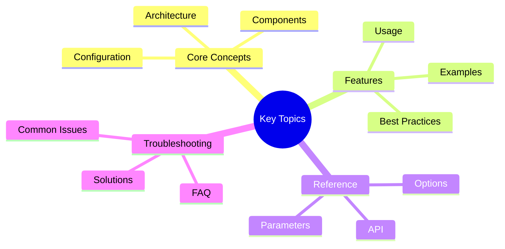

# Victor AI: Migration Guides

Complete migration guides for Victor AI 0.5.0 architectural improvements.

---

## Quick Summary
## Key Concepts




Victor 0.5.0 introduces major architectural improvements:
- **Protocol-Based Design**: 98 protocols for loose coupling
- **Dependency Injection**: ServiceContainer with 55+ services
- **Event-Driven Architecture**: 5 pluggable event backends
- **Coordinator Pattern**: 20 specialized coordinators
- **Vertical Template System**: YAML-first configuration
- **Universal Registry**: Unified entity management

**Migration Philosophy**:
- Backward Compatible: All existing code continues to work
- Incremental Migration: Migrate gradually, component by component
- Clear Migration Paths: Well-documented steps for each scenario
- Testing: Comprehensive test coverage for migrations
- No Breaking Changes: Deprecated but not removed

---

## Guide Parts

### [Part 1: Migration Paths](part-1-migration-paths.md)
- Overview
- Migration to Coordinators
- Migration to Protocol-Based Verticals
- Migration to Vertical Template System
- Migration to Event-Driven Architecture
- Migration to Dependency Injection

### [Part 2: Scenarios, Testing, Rollback](part-2-scenarios-testing-rollback.md)
- Common Migration Scenarios
- Testing Migrated Code
- Rollback Strategies
- Summary

---

## Quick Start

```python
# Before: Direct usage
from victor.tools import read_file
content = read_file("file.txt")

# After: Using coordinators
from victor.agent import AgentOrchestrator
orchestrator = AgentOrchestrator()
result = await orchestrator.tool_coordinator.execute_tool(
    "read",
    path="file.txt"
)
```text

---

## Related Documentation

- [Architecture Overview](../README.md)
- [Best Practices](../BEST_PRACTICES.md)
- [Coordinator Guide](../../guides/coordinators/)

---

**Last Updated:** January 18, 2026
**Reading Time:** 15 min (all parts)
