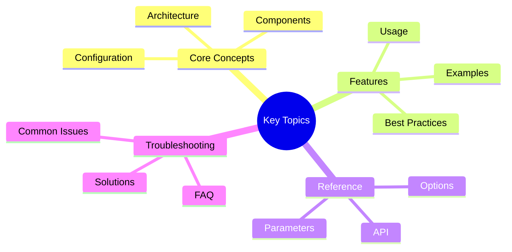

# Victor AI: Migration Guides - Part 2

**Part 2 of 2:** Common Migration Scenarios, Testing, and Rollback Strategies

---

## Navigation
## Key Concepts




- [Part 1: Migration Paths](part-1-migration-paths.md)
- **[Part 2: Scenarios, Testing, Rollback](#)** (Current)
- [**Complete Guide](../MIGRATION_GUIDES.md)**

---

## Common Migration Scenarios

### Scenario 1: Migrating from Direct Tool Calls

**Before**:
```python
# Direct tool calls
from victor.tools import read_file, write_file

content = read_file("file.txt")
write_file("output.txt", content)
```text

**After**:
```python
# Using ToolCoordinator
from victor.agent import AgentOrchestrator

orchestrator = AgentOrchestrator()

# Tools managed by coordinator
result = await orchestrator.tool_coordinator.execute_tool(
    "read",
    path="file.txt"
)
```

### Scenario 2: Migrating from Hardcoded Providers

**Before**:
```python
from victor.providers.anthropic import AnthropicProvider

provider = AnthropicProvider(api_key="...")
response = provider.chat(messages)
```text

**After**:
```python
# Using ProviderCoordinator
orchestrator = AgentOrchestrator()
provider = orchestrator.provider_coordinator.get_provider()
response = await provider.chat(messages)
```

### Scenario 3: Migrating from Manual State Management

**Before**:
```python
# Manual state tracking
state = {
    "messages": [],
    "context": {},
    "stage": "initial"
}
```text

**After**:
```python
# Using StateCoordinator
state = await orchestrator.state_coordinator.get_state()
await orchestrator.state_coordinator.update_state(
    stage="executing"
)
```

---

## Testing Migrated Code

### Unit Tests

Test individual components:

```python
import pytest

def test_coordinator_integration():
    """Test coordinator after migration."""
    orchestrator = AgentOrchestrator()

    # Test coordinator exists
    assert orchestrator.tool_coordinator is not None
    assert orchestrator.provider_coordinator is not None
```text

### Integration Tests

Test component interactions:

```python
@pytest.mark.asyncio
async def test_migration_workflow():
    """Test complete migrated workflow."""
    orchestrator = AgentOrchestrator()

    response = await orchestrator.chat(
        messages=[{"role": "user", "content": "Hello"}]
    )

    assert response.content is not None
```

### Regression Tests

Ensure backward compatibility:

```python
def test_backward_compatibility():
    """Test old API still works."""
    # Old direct usage should still work
    from victor.tools import read_file

    content = read_file("test.txt")
    assert content is not None
```text

---

## Rollback Strategies

### Strategy 1: Feature Flags

Use feature flags to enable/disable migrations:

```python
USE_NEW_COORDINATORS = os.getenv("USE_NEW_COORDINATORS", "false") == "true"

if USE_NEW_COORDINATORS:
    result = await orchestrator.tool_coordinator.execute_tool(...)
else:
    result = await legacy_tool_execute(...)
```

### Strategy 2: A/B Testing

Run both systems in parallel:

```python
# New system
new_result = await orchestrator.tool_coordinator.execute_tool(...)

# Legacy system
legacy_result = await legacy_tool_execute(...)

# Compare and log
log_comparison(new_result, legacy_result)
```text

### Strategy 3: Gradual Rollout

Roll out to users gradually:

```python
# Roll out to 10% of users
if user.id % 10 == 0:
    result = await new_system.execute(...)
else:
    result = await legacy_system.execute(...)
```

---

## Summary

Migration to Victor 0.5.0 architecture is designed to be:
- **Incremental**: Migrate at your own pace
- **Safe**: Backward compatible with existing code
- **Testable**: Comprehensive test coverage
- **Reversible**: Clear rollback strategies

**Next Steps:**
1. Review [Architecture Overview](../README.md)
2. Check [Best Practices](../BEST_PRACTICES.md)
3. Explore [Examples](../../examples/migrations/)

---

**Reading Time:** 2 min
**Last Updated:** January 18, 2026
