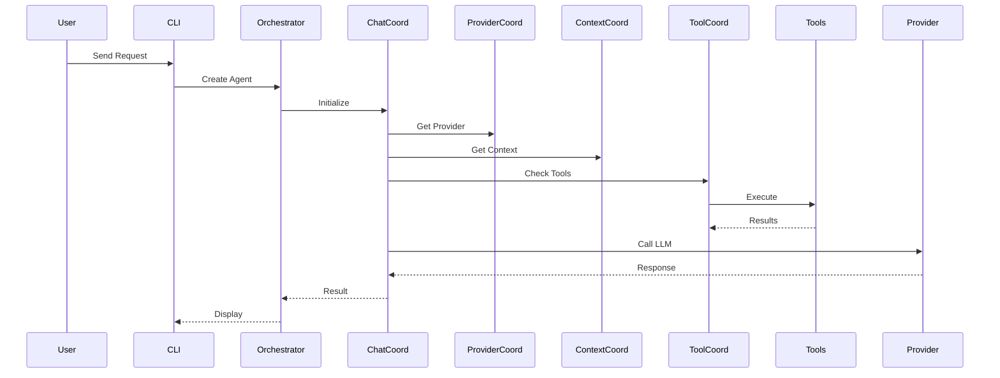

# Victor Architecture Overview

Victor is a provider-agnostic AI coding assistant built with **protocol-based design**, **event-driven communication**,
  and a **two-layer coordinator architecture**.

## Quick Stats

| Metric | Value |
|--------|-------|
| **Providers** | 21 (cloud + local) |
| **Tools** | 55+ specialized tools |
| **Verticals** | 5 domain verticals |
| **Protocols** | 98 protocols |
| **Coordinators** | 20 (10 app + 10 framework) |
| **Test Coverage** | 92.13% |
| **Services** | 55+ in DI container |

## System Architecture

```mermaid
graph TB
    Clients[CLI/TUI, HTTP, MCP] --> Container[ServiceContainer<br/>55+ Services]
    Container --> Orchestrator[AgentOrchestrator<br/>Facade]
    Orchestrator --> Coordinators[20 Coordinators]
    Coordinators --> Providers[21 Providers]
    Coordinators --> Tools[55+ Tools]
    Coordinators --> Workflows[StateGraph + YAML]
    Coordinators --> Verticals[5 Verticals]
    Coordinators --> Events[EventBus<br/>5 Backends]
```text

For a detailed view of the two-layer architecture, see [Coordinator Layers
  Diagram](../diagrams/architecture/coordinator-layers.mmd).

## Two-Layer Coordinator Design

### Application Layer (`victor/agent/coordinators/`)
Victor-specific business logic:

| Coordinator | Responsibility |
|-------------|---------------|
| ChatCoordinator | LLM chat operations, streaming |
| ToolCoordinator | Tool validation, budgeting, execution |
| ContextCoordinator | Context management, compaction |
| PromptCoordinator | System prompt building |
| SessionCoordinator | Conversation lifecycle |
| ProviderCoordinator | Provider switching |
| ModeCoordinator | Agent modes (build, plan, explore) |

### Framework Layer (`victor/framework/coordinators/`)
Domain-agnostic infrastructure:

| Coordinator | Responsibility |
|-------------|---------------|
| YAMLWorkflowCoordinator | YAML workflow loading/execution |
| GraphExecutionCoordinator | StateGraph execution/routing |
| HITLCoordinator | Human-in-the-loop workflows |
| CacheCoordinator | Workflow caching/invalidation |

**Benefits**: Single responsibility, clear boundaries, reusability across verticals, independent testing.

## Protocol-Based Design

Victor uses **98 protocols** for loose coupling:

```python
from victor.agent.protocols import ToolExecutorProtocol
from victor.core.container import ServiceContainer

container = ServiceContainer()
executor = container.get(ToolExecutorProtocol)
```

### Key Protocol Categories
- **Provider**: `ProviderProtocol`, `StreamProtocol`
- **Tool**: `ToolProtocol`, `ToolExecutorProtocol`
- **Coordinator**: `ChatCoordinatorProtocol`, `ToolCoordinatorProtocol`
- **Service**: `RegistryProtocol`, `CacheProtocol`, `MetricsProtocol`

## Dependency Injection

**ServiceContainer** manages 55+ services:

| Lifetime | Description | Use Cases |
|----------|-------------|-----------|
| Singleton | One instance for app lifetime | Stateless services |
| Scoped | One instance per scope | Session-specific state |
| Transient | New instance each get | Rarely used |

```python
container.register(
    ToolRegistryProtocol,
    lambda c: ToolRegistry(),
    ServiceLifetime.SINGLETON,
)
```text

## Event-Driven Architecture

**5 pluggable event backends** for async communication:

| Backend | Best For | Delivery |
|---------|----------|----------|
| In-Memory | Single-instance, low latency | None (lossy) |
| Kafka | Distributed, high throughput | Exactly-once |
| SQS | Serverless, managed | At-least-once |
| RabbitMQ | Reliable messaging | At-least-once |
| Redis | Fast, simple | At-least-once |

### Event Topics
```
tool.start         # Tool execution started
tool.complete      # Tool execution completed
tool.error         # Tool execution failed
agent.message      # Agent message sent
workflow.start     # Workflow started
workflow.complete  # Workflow completed
```text

## Providers

### Cloud (17)
Anthropic, OpenAI, Google, Azure, AWS Bedrock, xAI, DeepSeek, Mistral, Cohere, Groq, Together AI, Fireworks AI,
  OpenRouter, Replicate, Hugging Face, Moonshot, Cerebras

### Local (4)
Ollama, LM Studio, vLLM, llama.cpp

### Provider Interface
```python
class BaseProvider(Protocol):
    def chat(self, messages: List[Message]) -> ChatResponse: ...
    async def stream_chat(self, messages: List[Message]) -> AsyncIterator[StreamChunk]: ...
    def supports_tools(self) -> bool: ...
    @property
    def name(self) -> str: ...
```

## Tools

| Category | Tools | Examples |
|----------|-------|----------|
| File Operations | 8 | read, write, edit, grep |
| Git Operations | 6 | clone, commit, push, status |
| Testing | 5 | run_tests, coverage, lint |
| Web Tools | 4 | search, scrape, fetch |
| Analysis | 12 | complexity, refactor, review |

### Tool Interface
```python
class BaseTool(Protocol):
    name: str
    description: str
    parameters: dict  # JSON Schema
    cost_tier: CostTier
    async def execute(self, **kwargs) -> ToolResult: ...
```text

## Workflows

### StateGraph DSL
```python
from victor.framework import StateGraph, START, END

graph = StateGraph(AgentState)
graph.add_node("analyze", analyze_fn)
graph.add_conditional_edges("analyze", should_continue)
compiled = graph.compile()
```

### YAML Workflows
```yaml
name: code_review
nodes:
  - id: analyze
    type: agent
    provider: anthropic
    tools: [read, grep]
  - id: review
    type: agent
    depends_on: [analyze]
```text

## Verticals

| Vertical | Focus | Tools |
|----------|-------|-------|
| Coding | Code analysis, refactoring, testing | 15 tools |
| DevOps | Docker, Kubernetes, CI/CD | 12 tools |
| RAG | Document search, retrieval, Q&A | 8 tools |
| Data Analysis | Pandas, visualization, statistics | 10 tools |
| Research | Literature search, synthesis | 8 tools |

### Vertical Extension
```python
from victor.core.verticals import VerticalBase

class SecurityVertical(VerticalBase):
    name = "security"

    @classmethod
    def get_tools(cls) -> List[BaseTool]:
        return [security_scan, vulnerability_check]

    @classmethod
    def get_system_prompt(cls) -> str:
        return "You are a security expert..."
```

## Configuration

YAML-first configuration for modes, teams, capabilities, personas:

```yaml
# config/modes/build.yaml
name: build
exploration_multiplier: 1.0
allow_edits: true
tools: [read, write, edit, run_tests]
```text

```yaml
# config/teams/code-review.yaml
name: code_review_team
formation: parallel
roles:
  - name: security_reviewer
    persona: "You are a security expert..."
  - name: quality_reviewer
    persona: "You are a code quality expert..."
```

## Language Capabilities

Unified registry for **40+ languages** supporting both indexing and validation:

| Tier | Languages | Capabilities |
|------|-----------|--------------|
| **Tier 1** | Python, JavaScript, TypeScript | Native AST + Tree-sitter + LSP |
| **Tier 2** | Go, Java, Rust, C, C++ | Native/Tree-sitter + LSP |
| **Tier 3** | Ruby, PHP, Scala, Kotlin, etc. | Tree-sitter + optional LSP |
| **Config** | JSON, YAML, TOML, XML, HOCON | Native Python validators |

### Code Validation

Pre-write validation ensures code quality:

```python
from victor.core.language_capabilities.hooks import validate_code_before_write

should_proceed, result = validate_code_before_write(
    content="def foo():\n    pass",
    file_path=Path("main.py"),
    strict=False  # True = block on any error
)
```text

### CLI Validation

```bash
victor validate files main.py config.json  # Validate files
victor validate languages --tier 1         # List supported languages
victor validate check app.ts               # Check validation support
```

### Feature Flags

```bash
VICTOR_VALIDATION_ENABLED=false  # Disable validation globally
VICTOR_STRICT_VALIDATION=true    # Block writes on any error
```text

## Key Design Patterns

| Pattern | Implementation |
|---------|----------------|
| Facade | AgentOrchestrator simplifies complex subsystems |
| Strategy | Tool selection: keyword, semantic, hybrid |
| Observer | Event bus for pub/sub communication |
| Factory | OrchestratorFactory for configured instances |
| Template Method | VerticalBase defines integration template |

## Data Flow



## Security

### Air-Gapped Mode
```python
agent = await Agent.create(
    provider="ollama",
    airgapped_mode=True  # Only local providers and tools
)
```text

- Only local providers (Ollama, LM Studio, vLLM)
- No web tools
- Full functionality without internet

### API Key Management
- Load from `.env` file
- Use environment variables
- Never hardcode in source

### Tool Validation
- All tools validated before execution
- Budget enforcement prevents abuse
- Sandboxed code execution

## Performance

| Metric | Value |
|--------|-------|
| Test Coverage | 92.13% |
| Test Count | 1,149 tests |
| Startup Time | 2.3s (with lazy loading) |
| Tool Execution | <100ms average |

## Scalability

### Horizontal Scaling
- Stateless orchestrator instances
- Shared cache (Redis)
- Event bus (Kafka)

### Vertical Scaling
- Larger instance types
- More CPU/memory
- Faster storage (SSD)

### Caching
- Tool result caching
- LLM response caching
- Embedding caching

## Monitoring

### Metrics
- Tool usage metrics
- LLM latency tracking
- Error rate monitoring

### Observability
- OpenTelemetry integration
- Structured logging
- Distributed tracing

## Diagrams

- [System Architecture](../diagrams/system-architecture.mmd)
- [Coordinator Architecture](../diagrams/coordinator-architecture.mmd)
- [Verticals & Deployment](../diagrams/verticals-and-deployment.mmd)
- [Protocols & Events](../diagrams/protocols-and-events.mmd)
- [Developer Workflows](../diagrams/developer-workflows.mmd)

## Further Reading

- [Best Practices](BEST_PRACTICES.md) - Usage patterns
- [Coordinator Separation](coordinator_separation.md) - Two-layer design
- [Protocol Reference](PROTOCOLS_REFERENCE.md) - Protocol documentation
- [Migration Guides](MIGRATION_GUIDES.md) - Upgrading guide

---

## See Also

- [Documentation Home](../../README.md)


**Last Updated:** February 01, 2026
**Reading Time:** 4 minutes
