# Victor Architecture Overview

This document provides a comprehensive overview of Victor's architecture, covering high-level design, core components, key patterns, data flow, and extension points.

## Table of Contents

- [High-Level Architecture](#high-level-architecture)
- [Core Components](#core-components)
- [Key Patterns](#key-patterns)
- [Data Flow](#data-flow)
- [Extension Points](#extension-points)
- [Design Principles](#design-principles)
- [Related Documentation](#related-documentation)

---

## High-Level Architecture

Victor is an open-source agentic AI framework supporting 22 LLM providers with 33 tool modules across 9 domain verticals. The architecture follows a layered design with clear separation of concerns.

### System Architecture Diagram

```
+-------------------------------------------------------------------------+
|                              CLIENTS                                      |
|   +----------+    +-----------+    +-----------+    +------------+       |
|   | CLI/TUI  |    | VS Code   |    |MCP Server |    | API Server |       |
|   +----+-----+    | (HTTP)    |    +-----+-----+    +-----+------+       |
|        |          +-----+-----+          |                |              |
+--------|----------------|----------------|----------------|---------------+
         |                |                |                |
         v                v                v                v
+-------------------------------------------------------------------------+
|                     AGENT ORCHESTRATOR (Facade)                          |
|                                                                          |
|   Delegates to:                                                          |
|   +---------------------+  +---------------+  +-------------------+      |
|   |ConversationController|  | ToolPipeline |  |StreamingController|      |
|   +---------------------+  +---------------+  +-------------------+      |
|   +---------------+  +---------------+  +-----------------+              |
|   |ProviderManager|  | ToolRegistrar |  |  TaskAnalyzer   |              |
|   +---------------+  +---------------+  +-----------------+              |
+-----------------------------+--------------------------------------------+
                              |
         +--------------------+--------------------+
         |                    |                    |
         v                    v                    v
+----------------+   +----------------+   +-------------------+
|   PROVIDERS    |   |     TOOLS      |   |    WORKFLOWS      |
|      (22)      |   |  (33 modules)  |   |    StateGraph     |
|                |   |                |   |    + YAML         |
| - Anthropic    |   | - File Ops     |   |                   |
| - OpenAI       |   | - Git          |   | +---------------+ |
| - Google       |   | - Shell        |   | |UnifiedCompiler| |
| - Ollama       |   | - Web          |   | +---------------+ |
| - DeepSeek     |   | - Search       |   |                   |
| - 17 more...   |   | - Analysis     |   | +---------------+ |
+----------------+   +----------------+   | |WorkflowEngine | |
                                          | +---------------+ |
    +-------------------------------------+-------------------+
    |
    v
+-------------------------------------------------------------------------+
| TEAMS                  | STATE (4 scopes)                                |
| Sequential, Parallel   | Workflow, Conversation, Team, Global            |
| Hierarchical, Pipeline |                                                 |
+-------------------------------------------------------------------------+
    |
    v
+-------------------------------------------------------------------------+
|                           VERTICALS (9)                                  |
|                                                                          |
|   +----------+  +----------+  +------+  +-------------+  +----------+   |
|   |  Coding  |  | DevOps   |  | RAG  |  |DataAnalysis |  | Research |   |
|   +----------+  +----------+  +------+  +-------------+  +----------+   |
|   +----------+  +------+  +----------------+  +------------+            |
|   | Security |  | IaC  |  | Classification |  | Benchmark  |            |
|   +----------+  +------+  +----------------+  +------------+            |
+-------------------------------------------------------------------------+
```

### Mermaid Diagram

```mermaid
flowchart TB
    subgraph Clients["CLIENTS"]
        CLI["CLI/TUI"]
        HTTP["HTTP API"]
        MCP["MCP Server"]
        VSCODE["VS Code Extension"]
    end

    subgraph Orchestrator["AGENT ORCHESTRATOR (Facade)"]
        ORC["AgentOrchestrator"]
        CC["ConversationController"]
        TP["ToolPipeline"]
        SC["StreamingController"]
        PM["ProviderManager"]
        TR["ToolRegistrar"]
    end

    subgraph Providers["PROVIDERS (22)"]
        ANT["Anthropic"]
        OAI["OpenAI"]
        GGL["Google"]
        OLL["Ollama"]
        MORE["+ 18 more"]
    end

    subgraph Tools["TOOLS (33 modules)"]
        FILE["File Ops"]
        GIT["Git"]
        SHELL["Shell"]
        WEB["Web"]
        SEARCH["Search"]
    end

    subgraph Workflows["WORKFLOWS"]
        SG["StateGraph DSL"]
        YAML["YAML Workflows"]
        UC["UnifiedCompiler"]
    end

    subgraph Teams["TEAMS"]
        SEQ["Sequential"]
        PAR["Parallel"]
        HIER["Hierarchical"]
        PIPE["Pipeline"]
    end

    subgraph State["STATE (4 scopes)"]
        WFS["Workflow"]
        CONVS["Conversation"]
        TMS["Team"]
        GLS["Global"]
    end

    subgraph Verticals["VERTICALS (9)"]
        COD["Coding"]
        DEV["DevOps"]
        RAG["RAG"]
        DATA["Data Analysis"]
        RES["Research"]
        SEC["Security"]
        IAC["IaC"]
        CLS["Classification"]
        BENCH["Benchmark"]
    end

    Clients --> Orchestrator
    ORC --> CC
    ORC --> TP
    ORC --> SC
    ORC --> PM
    ORC --> TR
    Orchestrator --> Providers
    Orchestrator --> Tools
    Orchestrator --> Workflows
    Orchestrator --> Teams
    Orchestrator --> State
    Orchestrator --> Verticals

    style Clients fill:#e0e7ff,stroke:#4f46e5
    style Orchestrator fill:#d1fae5,stroke:#10b981
    style Providers fill:#fef3c7,stroke:#f59e0b
    style Tools fill:#cffafe,stroke:#06b6d4
    style Workflows fill:#fce7f3,stroke:#ec4899
    style Teams fill:#e0e7ff,stroke:#6366f1
    style State fill:#f3e8ff,stroke:#a855f7
    style Verticals fill:#fef9c3,stroke:#eab308
```



---

## Core Components

### AgentOrchestrator

**Location:** `victor/agent/orchestrator.py`

Central **Facade** — thin coordination layer delegating to specialized components. Manages chat flow, configuration, session lifecycle, and provider switching.

```python
from victor.agent.orchestrator import AgentOrchestrator

orchestrator = AgentOrchestrator(
    provider_name="anthropic",
    model="claude-sonnet-4-5",
    settings=settings,
)
result = await orchestrator.process_message("Analyze this code")
```

### ConversationController

**Location:** `victor/agent/conversation_controller.py`

Manages message history, context window tracking, stage-based state transitions, and context retrieval for prompts. Key methods: `add_message()`, `get_context()`, `get_stage()`.

### ToolPipeline

**Location:** `victor/agent/tool_pipeline.py`

Validates, selects, and executes tools with budget enforcement. Key methods: `execute()`, `validate()`, `get_available_tools()`.

### ProviderManager

**Location:** `victor/agent/provider_manager.py`

Manages 22 LLM provider adapters — initialization, mid-conversation switching, health monitoring with circuit breaker, and fallback selection. Key methods: `get_provider()`, `switch()`, `check_health()`.

### ServiceProvider

**Location:** `victor/agent/service_provider.py`

Dependency injection container for component registration, resolution, and lifecycle management.

```python
from victor.agent.service_provider import ServiceProvider

provider = ServiceProvider()
tool_registry = provider.resolve(ToolRegistry)
```

### ToolRegistrar

**Location:** `victor/agent/tool_registrar.py`

Dynamic tool discovery, registration, plugin loading, and MCP integration.

### Teams

**Location:** `victor/teams/`

Multi-agent coordination with 4 formation strategies: SEQUENTIAL, PARALLEL, HIERARCHICAL, PIPELINE. Agents are defined via `TeamMemberSpec` and coordinated by `AgentTeam`.

### State Management

**Location:** `victor/state/`

Unified state management across 4 scopes: WORKFLOW, CONVERSATION, TEAM, GLOBAL. The `GlobalStateManager` facade provides a single entry point with copy-on-write optimization.

### Events & CQRS

**Location:** `victor/core/`

Event sourcing with structured event types (THINKING, TOOL_CALL, TOOL_RESULT, CONTENT, ERROR, STREAM_END). CQRS via `CommandBus` and `QueryBus` with middleware pipeline.

---

## Key Patterns

### Facade Pattern (Orchestrator)

The AgentOrchestrator implements the Facade pattern, providing a simplified interface to the complex subsystem of components.

```
                    +-------------------+
     User Request   |                   |
    --------------> | AgentOrchestrator |
                    |     (Facade)      |
                    +--------+----------+
                             |
         +-------------------+-------------------+
         |                   |                   |
         v                   v                   v
+------------------+ +---------------+ +-----------------+
|Conversation      | | ToolPipeline  | | ProviderManager |
|Controller        | |               | |                 |
+------------------+ +---------------+ +-----------------+
```

### Protocol-Based Design (ISP Compliance)

Victor uses Python Protocols for interface segregation, ensuring components depend only on what they need.

```python
# victor/agent/subagents/protocols.py
class SubAgentContext(Protocol):
    """Minimal interface for SubAgent dependencies."""

    @property
    def settings(self) -> Any: ...

    @property
    def provider_name(self) -> str: ...

    @property
    def model(self) -> str: ...

    @property
    def tool_registry(self) -> Any: ...
```

**Key Protocols:**
- `SubAgentContext` - ISP-compliant SubAgent dependencies
- `CapabilityRegistryProtocol` - Capability discovery
- `OrchestratorVerticalProtocol` - Vertical integration
- `StepHandlerProtocol` - Handler substitutability

### YAML-First Configuration

Workflows and configurations prefer YAML for structure with Python escape hatches for complex logic.

```yaml
# victor/{vertical}/workflows/example.yaml
workflows:
  example_workflow:
    nodes:
      - id: start
        type: agent
        role: analyzer
        goal: "Analyze the input"
        next: [process]

      - id: process
        type: compute
        handler: process_data  # Python escape hatch
        next: [check_quality]

      - id: check_quality
        type: condition
        condition: "quality_check"  # Python function
        branches:
          "pass": complete
          "fail": retry
```

### Vertical Architecture

Self-contained domain modules that encapsulate tools, prompts, workflows, and configurations.

```
victor/{vertical}/
    __init__.py           # Vertical class definition
    assistant.py          # Main VerticalBase implementation
    safety.py             # Safety patterns
    prompts.py            # Domain-specific prompts
    escape_hatches.py     # YAML workflow conditions
    workflows/
        __init__.py
        workflow.yaml
```

---

## Data Flow

### Request Processing Flow

```
+--------+    +-------------+    +----------+    +-------+    +--------+
|  User  |--->| Orchestrator|--->| Provider |--->| LLM   |--->| Tools  |
+--------+    +-------------+    +----------+    +-------+    +--------+
                    |                                ^             |
                    |                                |             |
                    +--------------------------------+-------------+
                              Tool Results
```

### Detailed Sequence


### Data Flow by Layer

| Layer | Input | Output | Components |
|-------|-------|--------|------------|
| **Client** | User input | Displayed response | CLI/TUI, HTTP, MCP |
| **Orchestrator** | Message | Structured response | Orchestrator, Controllers |
| **Provider** | Messages + Tools | Completion/Tool calls | ProviderManager, Adapters |
| **Tool** | Tool parameters | Execution result | ToolPipeline, Tools |
| **Vertical** | Context | Domain config | VerticalLoader, Extensions |

---

## Extension Points

### Custom Providers

Create new LLM providers by inheriting from `BaseProvider`.

**Location:** `victor/providers/base.py`

```python
from victor.providers.base import BaseProvider, ChatResponse

class MyProvider(BaseProvider):
    @property
    def name(self) -> str:
        return "my_provider"

    async def chat(self, messages, tools=None, **kwargs) -> ChatResponse:
        # Implementation
        ...

    async def stream_chat(self, messages, tools=None, **kwargs):
        # Streaming implementation
        ...

    def supports_tools(self) -> bool:
        return True
```

**Registration:**
```python
# victor/providers/registry.py
from victor.providers.registry import ProviderRegistry
ProviderRegistry.register("my_provider", MyProvider)
```

### Custom Tools

Create new tools by inheriting from `BaseTool`.

**Location:** `victor/tools/base.py`

```python
from victor.tools.base import BaseTool, CostTier, ToolResult

class MyTool(BaseTool):
    name = "my_tool"
    description = "Does something useful"
    cost_tier = CostTier.LOW

    parameters = {
        "type": "object",
        "properties": {
            "input": {"type": "string", "description": "Input parameter"}
        },
        "required": ["input"]
    }

    async def execute(self, **kwargs) -> ToolResult:
        # Implementation
        return ToolResult(success=True, data={"result": "..."})
```

### Custom Verticals

Create domain-specific assistants by inheriting from `VerticalBase`.

**Location:** `victor/core/verticals/base.py`

```python
from victor.core.verticals import VerticalBase

class SecurityAssistant(VerticalBase):
    name = "security"
    description = "Security analysis assistant"

    @classmethod
    def get_tools(cls) -> list[str]:
        return ["read", "grep", "shell", "web_search"]

    @classmethod
    def get_system_prompt(cls) -> str:
        return "You are a security analyst..."
```

**External Plugin Registration:**
```toml
# pyproject.toml
[project.entry-points."victor.verticals"]
security = "victor_security:SecurityAssistant"
```

### Workflow Escape Hatches

Add Python logic to YAML workflows for complex conditions.

```python
# victor/{vertical}/escape_hatches.py

def quality_check(ctx: dict) -> str:
    """Escape hatch for quality checking."""
    score = ctx.get("quality_score", 0)
    if score >= 0.9:
        return "high_quality"
    elif score >= 0.5:
        return "acceptable"
    return "needs_improvement"

CONDITIONS = {
    "quality_check": quality_check,
}
```

---

## Design Principles

### SOLID Compliance

Victor's architecture adheres to SOLID principles:

| Principle | Implementation |
|-----------|----------------|
| **Single Responsibility (SRP)** | Each StepHandler handles one concern; Orchestrator is a thin facade |
| **Open/Closed (OCP)** | ExtensionHandlerRegistry for pluggable components; Plugin system for providers/tools |
| **Liskov Substitution (LSP)** | Protocol-based interfaces ensure substitutability |
| **Interface Segregation (ISP)** | Focused protocols like `SubAgentContext` |
| **Dependency Inversion (DIP)** | Protocol-first capability invocation |

### Provider Agnosticism

Victor supports 22 LLM providers through a unified interface:

- **Frontier Cloud:** Anthropic, OpenAI, Google, Azure, AWS Bedrock, Vertex
- **Local (air-gapped):** Ollama, LM Studio, vLLM, llama.cpp
- **Specialized:** Groq (fast inference), DeepSeek (thinking tags), Cerebras, ZAI

Switch providers mid-conversation without losing context:
```
/provider openai --model gpt-4o
```

### Air-Gapped Capability

When `airgapped_mode=True`:
- Only local providers available (Ollama, LM Studio, vLLM)
- No web tools (web_search, web_fetch disabled)
- Local embeddings for semantic search
- Full functionality without internet access

### Performance Optimizations

| Optimization | Impact | Location |
|--------------|--------|----------|
| **Lazy Tool Loading** | Faster startup | `victor/tools/composition/lazy.py` |
| **AOT Manifest Cache** | 50-100ms startup savings | `victor/core/aot_manifest.py` |
| **Extension Caching** | One-time initialization | `VerticalBase._get_cached_extension()` |
| **Two-Level Workflow Cache** | Definition + execution caching | `victor/workflows/unified_compiler.py` |
| **RL Cache Eviction** | Smart cache management | `victor/storage/cache/rl_eviction_policy.py` |

---

## Related Documentation

### Architecture Deep Dives
- [Component Details](../development/architecture/component-details.md) - Detailed component documentation
- [Deep Dive](../development/architecture/deep-dive.md) - Architecture deep dive with diagrams
- [Data Flow](../development/architecture/data-flow.md) - Request execution flow
- [State Machine](../development/architecture/state-machine.md) - Conversation stage management
- [Framework Integration](../development/architecture/framework-vertical-integration.md) - Vertical integration protocols

### Extension Guides
- [Vertical Development](../development/extending/verticals.md) - Creating custom verticals
- [Plugin Development](../development/extending/plugins.md) - Creating plugins

### Reference
- [Tool Catalog](../reference/tools/catalog.md) - Complete tool reference
- [Provider Comparison](../reference/providers/comparison.md) - Provider capabilities
- [Configuration Keys](../reference/configuration/keys.md) - All configuration options

---

## Quick Reference

| Aspect | Details |
|--------|---------|
| **Architecture Pattern** | Facade with extracted components |
| **Provider Count** | 22 (cloud + local) |
| **Tool Count** | 33 tool modules |
| **Vertical Count** | 9 built-in (Coding, DevOps, RAG, Data Analysis, Research, Security, IaC, Classification, Benchmark) |
| **Team Formations** | 4 (Sequential, Parallel, Hierarchical, Pipeline) |
| **State Scopes** | 4 (Workflow, Conversation, Team, Global) |
| **Key Entry Point** | `AgentOrchestrator.process_message()` |
| **Configuration** | YAML profiles + Python settings |
| **Extension Mechanism** | Entry points (`victor.verticals`, `victor.providers`) |
| **Air-Gapped Support** | Yes (Ollama, LM Studio, vLLM, llama.cpp) |
