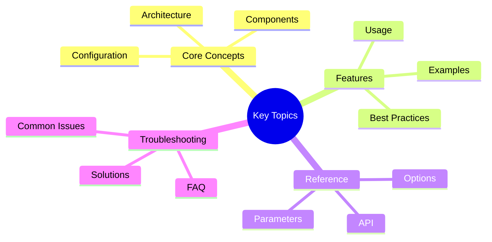

# Behavioral Design Patterns

**Version**: 0.5.0
**Last Updated**: January 31, 2026
**Audience**: Developers, Contributors
**Purpose**: Behavioral patterns in Victor AI (Strategy, Observer, Command, etc.)

---

# Structural and Behavioral Patterns

**Version**: 0.5.0
**Last Updated**: January 31, 2026
**Audience**: Developers, Contributors
**Purpose**: Adapter, Facade, Strategy, and Observer patterns

---

## Structural Patterns
## Key Concepts




## Behavioral Patterns

### Strategy Pattern

**Intent**: Define family of algorithms, encapsulate each, make them interchangeable

**Problem**:
- Need to use different algorithms
- Want to switch algorithms at runtime
- Have multiple ways to do the same thing
- Want to avoid conditional logic

**Solution**: Strategy pattern encapsulates algorithms

**Implementation**: Load balancer strategies, tool selection strategies

**File Location**: `/Users/vijaysingh/code/codingagent/victor/agent/load_balancer.py`

**Structure**:
```python
class LoadBalancerStrategy(Enum):
    """Load balancing strategies."""
    ROUND_ROBIN = "round_robin"
    LEAST_LOADED = "least_loaded"
    PRIORITY = "priority"
    HEALTH_AWARE = "health_aware"

class ProviderPool:
    """Pool of provider instances."""

    def __init__(self, strategy: LoadBalancerStrategy):
        self._strategy = strategy
        self._providers = []
        self._current_index = 0

    async def route_request(self, request):
        """Route request using strategy."""
        if self._strategy == LoadBalancerStrategy.ROUND_ROBIN:
            return await self._route_round_robin(request)
        elif self._strategy == LoadBalancerStrategy.LEAST_LOADED:
            return await self._route_least_loaded(request)
        elif self._strategy == LoadBalancerStrategy.PRIORITY:
            return await self._route_priority(request)
        elif self._strategy == LoadBalancerStrategy.HEALTH_AWARE:
            return await self._route_health_aware(request)

    async def _route_round_robin(self, request):
        """Round-robin strategy."""
        provider = self._providers[self._current_index]
        self._current_index = (self._current_index + 1) % len(self._providers)
        return await provider.process(request)

    async def _route_least_loaded(self, request):
        """Least-loaded strategy."""
        provider = min(self._providers, key=lambda p: p.load)
        return await provider.process(request)

    async def _route_priority(self, request):
        """Priority-based strategy."""
        provider = max(self._providers, key=lambda p: p.priority)
        return await provider.process(request)

    async def _route_health_aware(self, request):
        """Health-aware strategy."""
        healthy_providers = [p for p in self._providers if p.is_healthy()]
        provider = min(healthy_providers, key=lambda p: p.load)
        return await provider.process(request)
```text

**Usage Example**:
```python
# Create pool with strategy
pool = ProviderPool(strategy=LoadBalancerStrategy.ROUND_ROBIN)

# Use pool
response = await pool.route_request(messages)

# Switch strategy at runtime
pool._strategy = LoadBalancerStrategy.LEAST_LOADED
response = await pool.route_request(messages)  # Uses new strategy

# Add new strategy without modifying pool
class CustomStrategy:
    async def route(self, providers, request):
        # Custom routing logic
        ...

# Pool can use custom strategy
```

**Benefits**:
1. **Flexibility**: Easy to add new strategies
2. **Runtime**: Switch strategies at runtime
3. **Testability**: Test each strategy independently
4. **Clean Code**: Avoid conditional logic
5. **Open/Closed**: Open for extension, closed for modification

**Related Patterns**:
- Bridge Pattern (separates abstraction from implementation)
- State Pattern (similar but for states)

---

### Observer Pattern

**Intent**: Define one-to-many dependency so when one object changes state, all dependents are notified

**Problem**:
- Need to notify multiple objects when state changes
- Want loose coupling between publisher and subscribers
- Need to add/remove subscribers dynamically
- Want to broadcast events to multiple listeners

**Solution**: Observer pattern with event bus and subscribers

**Implementation**: EventBus, event backends

**File Location**: `/Users/vijaysingh/code/codingagent/victor/core/events/`

**Structure**:
```python
# Publisher
class ToolExecutor:
    def __init__(self, event_bus: IEventBackend):
        self._event_bus = event_bus

    async def execute_tool(self, tool: BaseTool, args: dict):
        # Publish start event
        await self._event_bus.publish(
            MessagingEvent(
                topic="tool.start",
                data={"tool": tool.name, "args": args},
                correlation_id=str(uuid.uuid4()),
            )
        )

        # Execute tool
        result = await tool.execute(**args)

        # Publish complete event
        await self._event_bus.publish(
            MessagingEvent(
                topic="tool.complete",
                data={"tool": tool.name, "result": result},
                correlation_id=correlation_id,
            )
        )

        return result

# Subscriber
class MetricsCollector:
    def __init__(self, event_bus: IEventBackend):
        self._event_bus = event_bus
        self._metrics = {}

        # Subscribe to events
        self._event_bus.subscribe("tool.*", self._on_tool_event)

    async def _on_tool_event(self, event: MessagingEvent):
        if event.topic == "tool.start":
            self._track_start(event.data)
        elif event.topic == "tool.complete":
            self._track_complete(event.data)

    def _track_start(self, data):
        tool_name = data["tool"]
        self._metrics[f"{tool_name}_start"] = time.time()

    def _track_complete(self, data):
        tool_name = data["tool"]
        start_time = self._metrics.get(f"{tool_name}_start")
        if start_time:
            duration = time.time() - start_time
            self._metrics[f"{tool_name}_duration"] = duration

# Another subscriber
class LoggingObserver:
    def __init__(self, event_bus: IEventBackend):
        self._event_bus = event_bus
        self._event_bus.subscribe("tool.*", self._on_tool_event)

    async def _on_tool_event(self, event: MessagingEvent):
        logger.info(f"Tool event: {event.topic} - {event.data}")
```text

**Usage Example**:
```python
# Create event bus
event_bus = create_event_backend(BackendConfig.for_observability())

# Create publisher (doesn't know about subscribers)
executor = ToolExecutor(event_bus)

# Create subscribers (independent of publisher)
metrics = MetricsCollector(event_bus)
logger = LoggingObserver(event_bus)

# When tool is executed, both subscribers are notified
await executor.execute_tool(tool, {"path": "test.py"})
# MetricsCollector tracks metrics
# LoggingObserver logs events
```

**Benefits**:
1. **Loose Coupling**: Publisher doesn't know about subscribers
2. **Dynamic**: Add/remove subscribers at runtime
3. **Broadcast**: One event to many listeners
4. **Asynchronous**: Non-blocking communication
5. **Scalability**: Easy to add new subscribers

**Related Patterns**:
- Pub/Sub Pattern (similar for messaging)
- Mediator Pattern (centralized communication)

---

### Command Pattern

**Intent**: Encapsulate requests as objects

**Problem**:
- Need to parameterize objects with requests
- Want to queue, log, or undo requests
- Need to compose requests into composite commands
- Want to decouple sender from receiver

**Solution**: Command objects encapsulate requests

**Implementation**: Tool calls, workflow commands

**Structure**:
```python
class Command(ABC):
    """Abstract command."""

    @abstractmethod
    async def execute(self) -> Any:
        """Execute command."""
        pass

    @abstractmethod
    async def undo(self) -> None:
        """Undo command."""
        pass

class ToolCallCommand(Command):
    """Command for tool execution."""

    def __init__(self, tool: BaseTool, arguments: Dict[str, Any]):
        self._tool = tool
        self._arguments = arguments
        self._result = None

    async def execute(self) -> Any:
        """Execute tool."""
        self._result = await self._tool.execute(**self._arguments)
        return self._result

    async def undo(self) -> None:
        """Undo tool execution if possible."""
        if hasattr(self._tool, "undo"):
            await self._tool.undo(**self._arguments)

class CompositeCommand(Command):
    """Composite command."""

    def __init__(self):
        self._commands = []

    def add_command(self, command: Command):
        """Add command to composite."""
        self._commands.append(command)

    async def execute(self) -> List[Any]:
        """Execute all commands."""
        results = []
        for command in self._commands:
            result = await command.execute()
            results.append(result)
        return results

    async def undo(self) -> None:
        """Undo all commands in reverse order."""
        for command in reversed(self._commands):
            await command.undo()

class CommandInvoker:
    """Invoker for commands."""

    def __init__(self):
        self._history = []

    async def execute_command(self, command: Command) -> Any:
        """Execute command and store for undo."""
        result = await command.execute()
        self._history.append(command)
        return result

    async def undo_last(self) -> None:
        """Undo last command."""
        if self._history:
            command = self._history.pop()
            await command.undo()
```text

**Usage Example**:
```python
# Create commands
read_cmd = ToolCallCommand(read_tool, {"path": "test.py"})
write_cmd = ToolCallCommand(write_tool, {"path": "output.txt", "content": "data"})

# Create composite
composite = CompositeCommand()
composite.add_command(read_cmd)
composite.add_command(write_cmd)

# Execute commands
invoker = CommandInvoker()
result = await invoker.execute_command(composite)

# Undo if needed
await invoker.undo_last()
```

**Benefits**:
1. **Encapsulation**: Requests are first-class objects
2. **Undo/Redo**: Easy to implement
3. **Composition**: Combine commands
4. **Queueing**: Queue commands for execution
5. **Logging**: Log all commands

**Related Patterns**:
- Composite Pattern (compose commands)
- Memento Pattern (for undo)

---

### Chain of Responsibility Pattern

**Intent**: Pass request along chain of handlers

**Problem**:
- Multiple objects can handle request
- Don't want to specify handler explicitly
- Want to add/remove handlers dynamically
- Need flexible request processing

**Solution**: Chain of handlers processes request

**Implementation**: Middleware pipeline, request handlers

**Structure**:
```python
class Handler(ABC):
    """Abstract handler."""

    def __init__(self):
        self._next_handler = None

    def set_next(self, handler: "Handler") -> "Handler":
        """Set next handler in chain."""
        self._next_handler = handler
        return handler

    @abstractmethod
    async def handle(self, request: Any) -> Any:
        """Handle request or pass to next."""
        pass

class ValidationHandler(Handler):
    """Validate request."""

    async def handle(self, request: Any) -> Any:
        """Validate request."""
        if not self._is_valid(request):
            raise ValueError("Invalid request")

        # Pass to next handler
        if self._next_handler:
            return await self._next_handler.handle(request)
        return request

class AuthenticationHandler(Handler):
    """Authenticate request."""

    async def handle(self, request: Any) -> Any:
        """Authenticate request."""
        if not self._is_authenticated(request):
            raise PermissionError("Not authenticated")

        # Pass to next handler
        if self._next_handler:
            return await self._next_handler.handle(request)
        return request

class LoggingHandler(Handler):
    """Log request."""

    async def handle(self, request: Any) -> Any:
        """Log request."""
        logger.info(f"Processing request: {request}")

        # Pass to next handler
        if self._next_handler:
            return await self._next_handler.handle(request)
        return request

class ProcessingHandler(Handler):
    """Process request."""

    async def handle(self, request: Any) -> Any:
        """Process request."""
        # Final processing
        result = await self._process(request)
        return result
```text

**Usage Example**:
```python
# Build chain
validation = ValidationHandler()
auth = AuthenticationHandler()
logging = LoggingHandler()
processing = ProcessingHandler()

validation.set_next(auth).set_next(logging).set_next(processing)

# Process request through chain
result = await validation.handle(request)
# Request goes through all handlers
```

**Benefits**:
1. **Flexibility**: Add/remove handlers dynamically
2. **Order**: Control processing order
3. **Decoupling**: Handler doesn't know chain
4. **Extension**: Easy to add new handlers
5. **Single Responsibility**: Each handler does one thing

**Related Patterns**:
- Decorator Pattern (similar wrapping)
- Pipeline Pattern (similar chain)

---

### Template Method Pattern

**Intent**: Define skeleton of algorithm, let subclasses override steps

**Problem**:
- Algorithm has invariant and variant parts
- Want to avoid code duplication
- Need to enforce algorithm structure
- Want to let subclasses customize specific steps

**Solution**: Template method defines skeleton, subclasses override steps

**Implementation**: Base classes with hooks

**Structure**:
```python
class BaseWorkflow(ABC):
    """Base workflow with template method."""

    async def execute(self, context: Dict[str, Any]) -> Any:
        """Template method - defines algorithm skeleton."""
        # Step 1: Initialize (invariant)
        await self._initialize(context)

        # Step 2: Validate (invariant)
        self._validate(context)

        # Step 3: Prepare (can be overridden)
        await self._prepare(context)

        # Step 4: Execute (must be overridden)
        result = await self._execute(context)

        # Step 5: Cleanup (invariant)
        await self._cleanup(context)

        return result

    async def _initialize(self, context):
        """Initialize workflow."""
        logger.info(f"Initializing workflow: {self.__class__.__name__}")

    def _validate(self, context):
        """Validate context."""
        if not context:
            raise ValueError("Context required")

    async def _prepare(self, context):
        """Prepare for execution. Override to customize."""
        pass  # Default: do nothing

    @abstractmethod
    async def _execute(self, context):
        """Execute workflow. Must be overridden."""
        pass

    async def _cleanup(self, context):
        """Cleanup after execution."""
        logger.info(f"Cleaning up workflow: {self.__class__.__name__}")

class RefactoringWorkflow(BaseWorkflow):
    """Refactoring workflow."""

    async def _prepare(self, context):
        """Prepare refactoring."""
        # Load file, analyze code, etc.
        context["file_content"] = await self._load_file(context["file_path"])
        context["ast"] = self._parse_ast(context["file_content"])

    async def _execute(self, context):
        """Execute refactoring."""
        # Apply refactoring
        refactored = await self._apply_refactoring(
            context["ast"],
            context["refactoring_type"]
        )
        return refactored

class TestingWorkflow(BaseWorkflow):
    """Testing workflow."""

    async def _prepare(self, context):
        """Prepare testing."""
        # Discover tests, set up environment, etc.
        context["test_files"] = await self._discover_tests(context["project_path"])

    async def _execute(self, context):
        """Execute testing."""
        # Run tests
        results = await self._run_tests(context["test_files"])
        return results
```text

**Usage Example**:
```python
# Use refactoring workflow
refactor_workflow = RefactoringWorkflow()
result = await refactor_workflow.execute({
    "file_path": "test.py",
    "refactoring_type": "extract_method"
})

# Use testing workflow (same structure, different execution)
test_workflow = TestingWorkflow()
result = await test_workflow.execute({
    "project_path": "/path/to/project"
})
```

**Benefits**:
1. **Structure**: Enforces algorithm structure
2. **Reuse**: Invariant steps defined once
3. **Customization**: Subclasses customize variant steps
4. **Consistency**: All workflows follow same pattern
5. **Maintenance**: Easy to maintain common code

**Related Patterns**:
- Strategy Pattern (entire algorithm varies)
- Factory Pattern (creates objects)

---

---

**Last Updated:** February 01, 2026
**Reading Time:** 3 minutes
