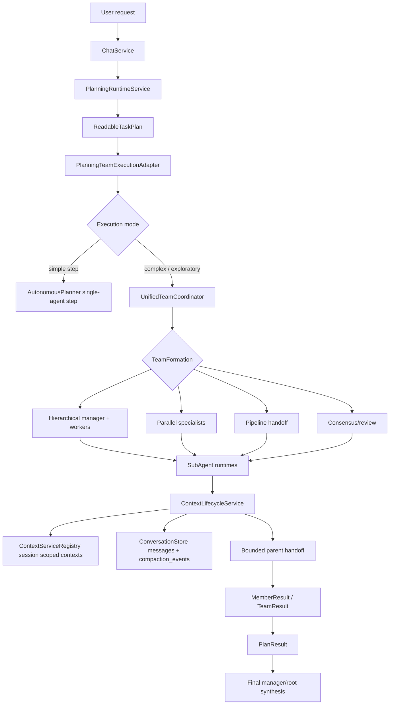
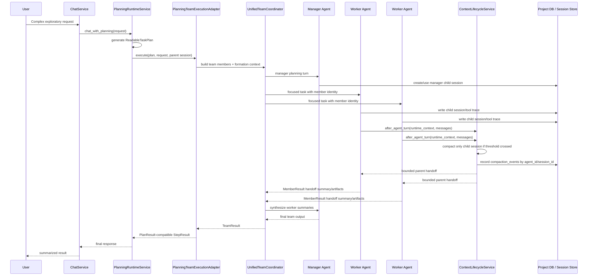

# Planning Team Formation Runtime

## Purpose

Victor planning mode should execute complex exploratory work through the reusable team
formation runtime instead of running every plan step through ad hoc parent-agent chat calls.
This keeps identity, sessions, context, observability, and result attribution consistent
across CLI chat, framework workflows, and future ORM-backed execution tracking.

## Current Gap

The current planning path can generate a structured plan, but step execution is mostly local:

1. `PlanningRuntimeService` creates a `ReadableTaskPlan`.
2. `_execute_plan()` creates an `AutonomousPlanner`.
3. `AutonomousPlanner._execute_step()` calls `orchestrator.chat(prompt)`.
4. The inner `AgenticLoop` may choose team topology for that turn, but the plan executor did
   not explicitly create a durable team formation with member identities and child sessions.

That means complex work can share one parent conversation, triggering compaction churn and weak
attribution between plan steps, agents, tools, and final summaries.

## Target Architecture

Planning remains the user-facing service, but team formation becomes the canonical execution
path for complex multi-agent work.

## Sequence

## Identity Contract

Every team-backed plan step should carry these identifiers in result metadata:

- `root_session_id`: parent chat session.
- `parent_session_id`: session that spawned the child agent.
- `child_session_id`: isolated session for the concrete subagent run.
- `plan_id`: structured plan id.
- `plan_step_id`: step being executed.
- `team_id`: durable team execution id.
- `formation`: effective team formation.
- `member_id`: stable logical team member id.
- `agent_id`: concrete runtime subagent id.
- `display_name`: human-friendly member name.
- `role`: subagent role.

The parent/root context should receive structured summaries and artifacts, not the full raw child
conversation history.

## Context Lifecycle Contract

Context and compaction behavior is service-owned, not orchestrator-owned.

- `AgentRuntimeContext` is the state-passed identity object for root agents and child agents.
- `ContextServiceRegistry` owns `session_id -> ContextService` mappings so sibling agents do not
  share history.
- `ContextLifecycleService` is the reusable hook called after agent turns and before large context
  handoffs. It hydrates/refreshes the agent context, checks thresholds, compacts only the target
  runtime session, persists `compaction_events`, and builds bounded parent handoff payloads.
- `ConversationStore` remains the queryable projection for messages and compaction events.
- JSONL/event streams remain append-only observability logs; they are not the query layer for
  per-agent context restoration.

Compaction can be deterministic or model-assisted. The lifecycle service should call deterministic
heuristics for routine pruning and delegate to existing LLM/router strategies when summarization
quality matters. In both cases, the parent receives a bounded summary plus artifacts, not raw child
history.

## Persistence And Restartability

Queryable lineage fields must be stored as first-class columns, not only nested metadata:

- `messages.session_id` and `messages.agent_id` identify one restorable agent context.
- `messages.parent_session_id`, `team_id`, `member_id`, `plan_id`, and `plan_step_id` provide
  parent/team attribution.
- `compaction_events` stores the same lineage fields with the summary, strategy, removed-message
  count, and freed-token estimate.

The JSONL event stream remains useful for chronological observability. The SQLite project database
is the restartable/queryable projection used by ORM-style retrieval and context restoration.

## Naming Contract

Internal IDs and display names intentionally differ:

- `agent_id` is stable, unique, and used for persistence joins.
- `member_id` is the logical team slot.
- `display_name` is human-facing and can be changed without breaking stored state.

Generated display names should be role/task-derived, for example `Rust Arc Reviewer`; random
dictionary names are not used for durable runtime identity.

## Reuse Rules

- Use `UnifiedTeamCoordinator` for formation execution.
- Use `TeamMember`, `TeamFormation`, `MemberResult`, and `TeamResult` for contracts.
- Use `SubAgent` and `SubAgentOrchestrator` for isolated member runtimes.
- Use one `AgenticLoop` per root agent or child agent session.
- Do not add a parallel multi-agent graph abstraction.
- Do not route complex plan steps through direct parent `orchestrator.chat()` unless the adapter
  classifies the step as single-agent.

## Incremental Implementation

1. Add identity fields to `SubAgentTask` and `SubAgentConfig`.
2. Propagate identity metadata through `SubAgentResult`.
3. Add a `PlanningTeamExecutionAdapter` that converts a plan step into a hierarchical team run.
4. Wire `PlanningRuntimeService._execute_plan()` to use the adapter for complex/exploratory plans.
5. Keep `AutonomousPlanner` as the fallback for simple single-agent steps.
6. Add queryable ORM columns and migrations for agent/team/session lineage.
7. Add `ContextLifecycleService` for per-agent threshold compaction and parent handoff.
8. Continue migrating root-agent and tool-output paths to call the lifecycle service instead of
   legacy orchestrator compaction directly.
9. Cover restartability, hierarchical handoff, parallel attribution, consensus attribution, and
   non-streaming/streaming root compaction in tests.
