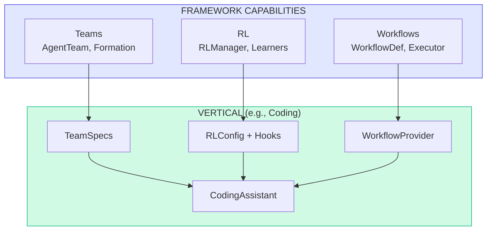

# Victor Vertical Framework Integration

> Specification for integrating verticals with the framework (Workflows, RL, Teams).
> Last Updated: December 2025

## Implementation Status

| Vertical | Workflows | RL Learners | Teams | Custom Tools |
|----------|-----------|-------------|-------|--------------|
| Coding | 7 | 5 | 6 | 15 |
| DevOps | 3 | 3 | 3 | 12 |
| Research | 4 | 3 | 5 | 8 |
| Data Analysis | 4 | 3 | 5 | 6 |

---

## Quick Reference

| Component | Purpose | Location |
|-----------|---------|----------|
| Workflows | Multi-step task automation | `victor/verticals/*/workflows/` |
| RL Config | Adaptive learning settings | `victor/verticals/*/rl/config.py` |
| RL Hooks | Learning event recording | `victor/verticals/*/rl/hooks.py` |
| Teams | Multi-agent coordination | `victor/verticals/*/teams/specs.py` |

---

## Architecture Overview



---

## Vertical Capability Matrix

| Capability | Coding | DevOps | Research | Data Analysis |
|------------|--------|--------|----------|---------------|
| Tools (45+) | 15 | 12 | 8 | 6 |
| System Prompt | Custom | Custom | Custom | Custom |
| Stages | 7 | 5 | 4 | 4 |
| Middleware | Code correction, Git safety | Deploy safety | Source validation | Data validation |
| Safety Extension | Git, code execution | Deploy, infrastructure | Citation, sources | PII, data access |
| Mode Config | 8 modes | 5 modes | 4 modes | 4 modes |
| **Workflows** | 7 | 3 | 4 | 4 |
| **RL Learners** | 5 | 3 | 3 | 3 |
| **Teams** | 6 | 3 | 5 | 5 |

---

## Workflows

### Coding Workflows

| Workflow | Steps | Description |
|----------|-------|-------------|
| `feature_implementation` | research -> plan -> implement -> review -> finalize | End-to-end feature development |
| `bug_fix` | investigate -> diagnose -> fix -> verify -> commit | Systematic bug resolution |
| `code_review` | analyze -> security -> style -> logic -> summarize | Comprehensive code review |
| `refactoring` | plan -> extract -> verify -> commit | Safe refactoring with tests |
| `test_coverage` | analyze -> generate -> run -> report | Increase test coverage |
| `documentation` | analyze -> generate -> review | Generate/update docs |
| `security_audit` | scan -> analyze -> fix -> verify | Security vulnerability fix |

### Workflow Definition Example

```yaml
# victor/verticals/coding/workflows/workflows.yaml
workflows:
  feature_implementation:
    description: "End-to-end feature development"
    nodes:
      - id: research
        type: agent
        role: researcher
        goal: "Analyze codebase for patterns"
        tool_budget: 20
        tools: [read, grep, code_search, overview]
        output: research_findings
        next: [plan]

      - id: plan
        type: agent
        role: planner
        goal: "Create implementation plan"
        tool_budget: 10
        input: { findings: research_findings }
        output: implementation_plan
        next: [implement]

      - id: implement
        type: agent
        role: executor
        goal: "Implement the feature"
        tool_budget: 40
        tools: [read, write, edit, shell, git]
        input: { plan: implementation_plan }
        output: implementation_result
        next: [review]

      - id: review
        type: agent
        role: reviewer
        goal: "Review and test"
        tool_budget: 20
        tools: [read, shell, run_tests, git_diff]
        next: [check_review]

      - id: check_review
        type: condition
        branches:
          has_issues: implement
          no_issues: finalize

      - id: finalize
        type: agent
        role: executor
        goal: "Commit and summarize"
        tool_budget: 5
        tools: [git_commit, git_status]
```

### Using Workflows

```python
from victor.framework import Agent
from victor.verticals.coding import CodingAssistant

agent = await Agent.create(provider="anthropic", vertical=CodingAssistant)

result = await agent.run_workflow(
    "feature_implementation",
    context={"feature_description": "Add user auth", "target_files": ["src/auth/"]},
)
print(result.final_output)
```

---

## RL Integration

### Active Learners by Vertical

| Learner | Coding | DevOps | Research |
|---------|--------|--------|----------|
| Tool Selector | Yes | Yes | Yes |
| Continuation Patience | Yes | Yes | - |
| Grounding Threshold | Yes | Yes | Yes |
| Mode Transition | Yes | - | Yes |
| Model Selector | Yes | - | - |

### RL Config Example

```python
@dataclass
class CodingRLConfig:
    active_learners: List[LearnerType] = field(default_factory=lambda: [
        LearnerType.TOOL_SELECTOR,
        LearnerType.CONTINUATION_PATIENCE,
        LearnerType.GROUNDING_THRESHOLD,
        LearnerType.MODE_TRANSITION,
    ])

    task_type_mappings: Dict[str, List[str]] = field(default_factory=lambda: {
        "refactoring": ["refactor", "rename_symbol", "extract_function", "edit"],
        "debugging": ["read", "grep", "shell", "run_tests", "git_log"],
        "feature": ["read", "write", "edit", "shell", "git"],
        "exploration": ["read", "grep", "code_search", "overview", "symbols"],
    })

    quality_thresholds: Dict[str, float] = field(default_factory=lambda: {
        "refactoring": 0.90,
        "debugging": 0.85,
        "feature": 0.80,
        "exploration": 0.70,
    })

    default_patience: Dict[str, int] = field(default_factory=lambda: {
        "anthropic": 3,
        "openai": 3,
        "deepseek": 5,
        "ollama": 7,
    })
```

### RL Hooks Integration

```python
class CodingRLHooks:
    def on_tool_success(self, tool_name, task_type, provider, model, duration_ms):
        self.rl.record_success(
            learner=LearnerType.TOOL_SELECTOR,
            provider=provider, model=model,
            task_type=task_type, quality_score=1.0,
            metadata={"tool": tool_name, "duration_ms": duration_ms},
        )

    def on_tool_failure(self, tool_name, task_type, provider, model, error):
        self.rl.record_failure(
            learner=LearnerType.TOOL_SELECTOR,
            provider=provider, model=model,
            task_type=task_type, error=error,
        )

    def get_tool_recommendation(self, task_type, available_tools):
        return self.rl.get_tool_recommendation(task_type, available_tools)
```

---

## Teams

### Team Formations

| Formation | Description | Use Case |
|-----------|-------------|----------|
| PIPELINE | Sequential execution | Feature implementation |
| PARALLEL | Concurrent execution | Code review (multiple reviewers) |
| HIERARCHICAL | Manager + workers | Large refactoring |

### Coding Team Specs

| Team | Formation | Members | Use Case |
|------|-----------|---------|----------|
| `feature_team` | Pipeline | researcher -> planner -> executor -> reviewer | Feature development |
| `bug_fix_team` | Pipeline | researcher -> executor -> reviewer | Bug fixing |
| `refactoring_team` | Hierarchical | planner + executors + reviewer | Large refactors |
| `review_team` | Parallel | security + style + logic reviewers -> summarizer | Code review |
| `test_team` | Pipeline | analyzer -> generator -> runner | Test coverage |
| `doc_team` | Pipeline | analyzer -> writer -> reviewer | Documentation |

### Team Spec Definition

```python
CODING_TEAM_SPECS = {
    "feature_team": {
        "name": "Feature Implementation Team",
        "formation": TeamFormation.PIPELINE,
        "members": [
            TeamMemberSpec(role="researcher", goal="Analyze codebase for patterns"),
            TeamMemberSpec(role="planner", goal="Design implementation approach"),
            TeamMemberSpec(role="executor", goal="Implement the feature"),
            TeamMemberSpec(role="reviewer", goal="Review code and run tests"),
        ],
    },
    "review_team": {
        "name": "Code Review Team",
        "formation": TeamFormation.PARALLEL,
        "members": [
            TeamMemberSpec(role="researcher", goal="Check security issues"),
            TeamMemberSpec(role="researcher", goal="Check code style"),
            TeamMemberSpec(role="researcher", goal="Check logic correctness"),
            TeamMemberSpec(role="planner", goal="Synthesize findings"),
        ],
    },
}
```

### Using Teams

```python
from victor.framework.teams import AgentTeam
from victor.verticals.coding.teams import get_team_for_task

spec = get_team_for_task("feature")

team = await AgentTeam.create(
    orchestrator=agent.get_orchestrator(),
    name=spec["name"],
    goal="Implement user authentication",
    members=spec["members"],
    formation=spec["formation"],
)

async for event in team.stream():
    if event.type == TeamEventType.MEMBER_COMPLETE:
        print(f"Completed: {event.member_name}")

print(team.result.final_output)
```

---

## Integration with CodingAssistant

```python
class CodingAssistant(VerticalBase):
    @classmethod
    def get_workflow_provider(cls) -> Optional[WorkflowProviderProtocol]:
        from victor.verticals.coding.workflows import CodingWorkflowProvider
        return CodingWorkflowProvider()

    @classmethod
    def get_rl_config_provider(cls) -> Optional[RLConfigProvider]:
        from victor.verticals.coding.rl_config import CodingRLConfig
        return CodingRLConfig()

    @classmethod
    def get_team_spec_provider(cls) -> Optional[TeamSpecProvider]:
        from victor.verticals.coding.teams import CODING_TEAM_SPECS
        return CODING_TEAM_SPECS
```

---

## Directory Structure

```
victor/verticals/coding/
|-- assistant.py           # Main vertical
|-- middleware.py          # Middleware (with RL hooks)
|-- mode_config.py         # Mode configurations
|-- prompts.py             # Prompt contributors
|-- safety.py              # Safety extensions
|-- service_provider.py    # DI service provider
|-- tool_dependencies.py   # Tool dependencies
|
|-- workflows/             # Workflow definitions
|   |-- __init__.py
|   |-- provider.py        # CodingWorkflowProvider
|   |-- feature.py         # Feature workflow
|   |-- bugfix.py          # Bug fix workflow
|   |-- review.py          # Code review workflow
|   +-- workflows.yaml     # YAML definitions
|
|-- teams/                 # Team specifications
|   |-- __init__.py
|   |-- specs.py           # Team specs
|   |-- roles.py           # Coding-specific roles
|   +-- formations.py      # Task formations
|
+-- rl/                    # RL integration
    |-- __init__.py
    |-- config.py          # RLConfig
    +-- hooks.py           # Recording hooks
```

---

## Implementation Checklist

### Adding a New Vertical
- [ ] Create `victor/verticals/your_vertical/assistant.py` inheriting `VerticalBase`
- [ ] Implement `get_tools()`, `get_system_prompt()`, `get_stages()`
- [ ] Create `workflows/provider.py` with workflow definitions
- [ ] Create `rl/config.py` with learner configuration
- [ ] Create `teams/specs.py` with team specifications
- [ ] Register in `VerticalRegistry`
- [ ] Add tests in `tests/unit/verticals/`

### Adding a New Workflow
- [ ] Add workflow to `workflows.yaml` or create `.py` file
- [ ] Define nodes (agent, condition, parallel)
- [ ] Specify tool budgets and allowed tools
- [ ] Add to `WorkflowProvider.get_workflows()`
- [ ] Test with `agent.run_workflow()`

### Adding a New Team
- [ ] Define team spec in `teams/specs.py`
- [ ] Specify formation (PIPELINE, PARALLEL, HIERARCHICAL)
- [ ] Define member roles and goals
- [ ] Add to `get_team_for_task()` mapping
- [ ] Test with `AgentTeam.create()`

---

## Benefits

| Benefit | Description |
|---------|-------------|
| Structured Workflows | Complex tasks become reproducible DAGs |
| Multi-Agent Coordination | Parallelize analysis, specialize roles |
| Adaptive Learning | System improves tool selection over time |
| YAML Configuration | Non-developers can modify workflows |
| Observability | Rich events from teams/workflows |
| Testability | Workflows can be tested in isolation |
| Reusability | Share workflows across verticals |

---

## Related Documentation

- [ARCHITECTURE_DEEP_DIVE.md](./ARCHITECTURE_DEEP_DIVE.md) - Overall architecture
- [VERTICALS.md](./VERTICALS.md) - Vertical implementations
- [RL_FRAMEWORK_PROGRESS.md](../progress/RL_FRAMEWORK_PROGRESS.md) - RL learner details (archived)
