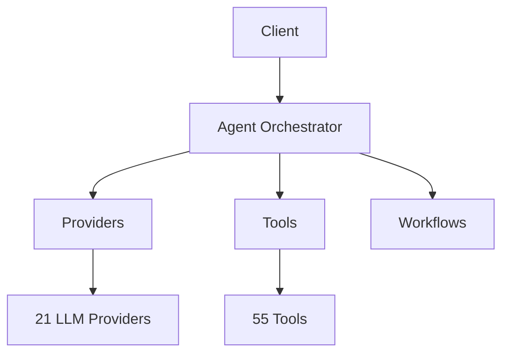

# Quick Start: Creating Documentation Assets

A quick reference for creating visual assets for Victor documentation.

## Immediate Tasks (Priority Order)

### 1. Create Logo Icon (Highest Priority)
```bash
# Target: docs/assets/images/victor-logo-icon.png
# Size: 128x128px or 512x512px (will be scaled down)
# Format: PNG with transparency or SVG
# Usage: Favicon, inline icons, badges

# Once created, uncomment in mkdocs.yml:
# favicon: assets/images/victor-logo-icon.png
```

### 2. Capture Core Screenshots
```bash
# TUI Mode
# Target: docs/assets/screenshots/tui-screenshot.png
# Size: 1200x800px minimum
# Capture: victor command in TUI mode with example conversation

# CLI Mode
# Target: docs/assets/screenshots/cli-chat-mode.png
# Size: 1200x800px minimum
# Capture: victor chat --no-tui with example conversation
```

### 3. Create Architecture Diagram
```bash
# Target: docs/assets/diagrams/architecture-overview.png
# Size: 1600x900px
# Content: Client → Orchestrator → Providers/Tools/Workflows/Verticals
# Tool: Draw.io, Excalidraw, or Mermaid.js
```

## Quick Commands

### Screenshot Capture (macOS)
```bash
# Full screen
screencapture -x -C -T 1 docs/assets/screenshots/tui-screenshot.png

# Interactive selection
screencapture -i -C docs/assets/screenshots/tui-screenshot.png

# With delay (5 seconds)
screencapture -T 5 -x -C docs/assets/screenshots/tui-screenshot.png
```

### Screenshot Capture (Linux - GNOME)
```bash
# Interactive
gnome-screenshot -a -f docs/assets/screenshots/tui-screenshot.png

# Full screen with delay
gnome-screenshot -d 5 -f docs/assets/screenshots/tui-screenshot.png
```

### Optimize PNG Files
```bash
# Using optipng
optipng -o7 docs/assets/**/*.png

# Using pngquant (lossy compression)
pngquant --quality=80-95 docs/assets/**/*.png

# Using ImageOptim (macOS GUI)
# Open ImageOptim app and drag docs/assets/ folder
```

### Convert to Different Formats
```bash
# PNG to SVG (requires potrace and autotrace)
# Use vectorization tools for best results

# Resize image
sips -z 512 512 victor-logo.png --out victor-logo-icon.png

# Batch resize
mogrify -resize 128x128 docs/assets/images/*.png
```

## Mermaid.js Quick Reference

Create diagrams directly in Markdown:

```markdown

```

## Recommended Free Tools

### Screenshots
- **Flameshot** (cross-platform) - https://flameshot.org/
- **ShareX** (Windows) - https://getsharex.com/
- **CleanShot X** (macOS paid) - https://cleanshot.com/

### Diagrams
- **Draw.io** (web/desktop) - https://app.diagrams.net/
- **Excalidraw** (web) - https://excalidraw.com/
- **Mermaid Live Editor** (web) - https://mermaid.live/

### Image Optimization
- **ImageOptim** (macOS) - https://imageoptim.com/
- **FileOptimizer** (Windows) - https://nikkhokkho.sourceforge.io/static.php?page=FileOptimizer
- **Squoosh** (web) - https://squoosh.app/

## File Naming Quick Reference

| Asset Type | Pattern | Example |
|------------|---------|---------|
| Logo | `victor-{type}.png` | `victor-logo.png` |
| Screenshot | `{mode}-{feature}.png` | `tui-main-interface.png` |
| Diagram | `{system}-overview.png` | `architecture-overview.png` |

## Color Scheme (for consistency)

- **Primary**: Indigo (#6366f1)
- **Accent**: Indigo (#6366f1)
- **Dark Background**: Slate (#1e293b)
- **Light Background**: White (#ffffff)

Use these colors in diagrams and screenshots when possible.

## Testing Your Assets

### 1. Check File Sizes
```bash
# Should be under 500KB for most assets
du -h docs/assets/**/*.png
```

### 2. Preview in Context
```bash
# Serve documentation locally
mkdocs serve

# Visit http://localhost:8000
# Check how assets look in both light and dark themes
```

### 3. Test Responsive Scaling
```bash
# MkDocs Material theme handles responsive images automatically
# Just ensure your source images are high resolution (2x)
```

## Common Issues & Fixes

### Issue: Images look blurry
**Fix**: Create at 2x resolution (e.g., 2400x1600 for 1200x800 display)

### Issue: File size too large
**Fix**: Run through PNG optimizer or convert to JPEG for screenshots

### Issue: Image not visible in dark mode
**Fix**: Use SVG with CSS variables, or provide separate dark/light versions

### Issue: Screenshot text is too small
**Fix**: Increase terminal font size to 14-16pt before capturing

## Next Steps After Asset Creation

1. ✅ Create asset in appropriate subdirectory
2. ✅ Optimize file size
3. ✅ Test in MkDocs serve (`mkdocs serve`)
4. ✅ Update documentation to reference new asset
5. ✅ Check in both light and dark themes
6. ✅ Commit changes with descriptive message

## Getting Help

- See `README.md` for detailed guidelines
- See `PLACEHOLDER_LIST.md` for complete asset checklist
- Check MkDocs Material theme docs: https://squidfunk.github.io/mkdocs-material/
