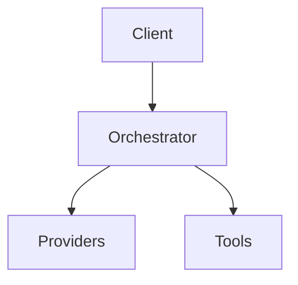

# Documentation Assets

This directory contains all visual assets used in the Victor documentation.

## Directory Structure

### `images/`
General purpose images including:
- Logo files
- Brand assets
- Icons and badges
- Illustrations
- Placeholder images

**Recommended formats:**
- PNG for screenshots and graphics with transparency
- JPEG for photographs
- SVG for logos and icons (scalable)

**Recommended sizes:**
- Logo: 512x512px (square)
- Banner: 1200x200px (wide)
- Icons: 64x64px or 128x128px

### `screenshots/`
Application screenshots including:
- TUI (Terminal UI) mode screenshots
- CLI mode screenshots
- Workflow examples
- Feature demonstrations
- Before/after comparisons

**Recommended formats:**
- PNG for screenshots (lossless compression)
- JPEG acceptable for large screenshots (smaller file size)

**Recommended sizes:**
- Full screenshots: 1200x800px or 1920x1080px
- Feature highlights: 800x600px
- Terminal screenshots: Use a monospace font at 14-16pt

**Best practices:**
- Capture at 2x resolution for retina displays
- Use consistent terminal themes (preferably dark)
- Trim unnecessary whitespace
- Annotate with arrows/text overlays when helpful
- Keep file sizes under 500KB when possible

### `diagrams/`
Technical diagrams and architecture visuals including:
- System architecture diagrams
- Flowcharts and sequence diagrams
- Data flow diagrams
- Component relationships
- Class hierarchies
- Entity-relationship diagrams

**Recommended formats:**
- SVG for vector graphics (preferred for diagrams)
- PNG for raster exports
- Mermaid.js diagrams can be embedded directly in Markdown

**Recommended sizes:**
- Architecture diagrams: 1600x900px or 1920x1080px
- Flowcharts: 1200x800px
- Component diagrams: 1200x900px

**Tools:**
- Mermaid.js (for text-to-diagram in Markdown)
- Draw.io / diagrams.net
- PlantUML
- GraphViz
- Lucidchart / Excalidraw

## Referencing Assets in Markdown

### Relative References
```markdown
# From any docs/ file


# From docs/getting-started/

```

### Absolute References (for MkDocs)
```markdown

```

### Using HTML for Custom Sizing
```markdown


```

### Mermaid Diagrams (Inline)
````markdown

````

## Naming Conventions

Use descriptive, lowercase names with hyphens separating words:

### Images
- `victor-logo.png` - Main logo
- `victor-logo-icon.png` - Smaller icon version
- `banner-wide.png` - Header banner

### Screenshots
- `tui-main-interface.png` - Primary TUI view
- `tui-workflow-execution.png` - Specific feature
- `cli-chat-mode.png` - CLI interface
- `workflow-builder.png` - Workflow tooling

### Diagrams
- `architecture-overview.png` - High-level architecture
- `provider-system-flow.png` - Specific system flow
- `data-flow-pipeline.png` - Data processing pipeline
- `class-hierarchy-verticals.png` - Class structure

### Versioning
For screenshots that change between versions:
```
tui-main-interface-0.5.0.png
tui-main-interface-0.6.0.png
```

## File Size Guidelines

- **Logos/Icons**: Under 100KB
- **Screenshots**: Under 500KB (optimize with PNG compression)
- **Diagrams**: Under 300KB (SVG preferred for scalability)
- **Banners**: Under 200KB

## Optimization Tips

1. **PNG Optimization**:
   ```bash
   # Optimize PNG files
   optipng -o7 docs/assets/**/*.png
   # or
   pngquant --quality=80-95 docs/assets/**/*.png
   ```

2. **JPEG Optimization**:
   ```bash
   # Optimize JPEG files
   jpegoptim --max=85 docs/assets/**/*.jpg
   ```

3. **SVG Optimization**:
   ```bash
   # Optimize SVG files
   svgo --config=svgo.config.js docs/assets/**/*.svg
   ```

## Adding New Assets

1. Place the asset in the appropriate subdirectory
2. Use a descriptive filename following the naming conventions
3. Optimize the file size
4. Reference it in documentation using relative paths
5. Update this README if adding a new category of assets

## Placeholder Assets

The following placeholder assets are recommended (create when ready):

- `victor-banner.png` (1200x200) - For landing page header
- `victor-logo.png` (512x512) - Main logo for branding
- `victor-logo-icon.png` (128x128) - Smaller icon version
- `tui-screenshot.png` (1200x800) - TUI mode demonstration
- `cli-screenshot.png` (1200x800) - CLI mode demonstration
- `architecture-diagram.png` (1600x900) - High-level architecture overview
- `workflow-diagram.png` (1600x900) - Workflow system visualization
- `provider-system-diagram.png` (1600x900) - Provider architecture

## Dark Mode Considerations

For screenshots and diagrams:
- Test assets in both light and dark themes
- Provide alternatives if necessary (e.g., `diagram-light.png` and `diagram-dark.png`)
- Use neutral colors that work in both modes
- Consider using SVG with CSS variables for theming support

## License

All assets in this directory should be compatible with the Victor project license. Ensure you have rights to use any third-party images or graphics.
