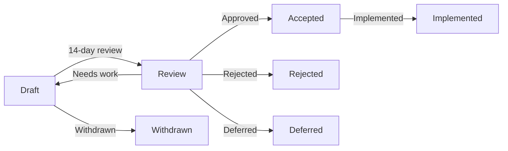

# Framework Enhancement Proposal (FEP) Process

This document describes the process for creating, submitting, and reviewing Framework Enhancement Proposals (FEPs) for the Victor project.

## Table of Contents

1. [What is a FEP?](#what-is-a-fep)
2. [When to Create a FEP](#when-to-create-a-fep)
3. [FEP Types](#fep-types)
4. [FEP Lifecycle](#fep-lifecycle)
5. [Submission Process](#submission-process)
6. [Review Criteria](#review-criteria)
7. [Decision Process](#decision-process)
8. [Implementation](#implementation)
9. [FEP Template](#fep-template)

---

## What is a FEP?

A **Framework Enhancement Proposal (FEP)** is a design document providing information to the Victor community, or describing a new feature for the Victor framework or its ecosystem. FEPs provide technical specifications and the rationale behind feature design.

The FEP process is inspired by similar processes in other open-source projects like Python (PEPs), Rust (RFCs), and Ethereum (ERCs/EIPs).

### Goals of the FEP Process

- **Community-driven**: Enable community members to contribute to Victor's direction
- **Transparent**: Make design decisions and rationale visible to all
- **Structured**: Provide a clear, documented path for proposing changes
- **Quality-focused**: Ensure changes are well-thought-out and properly reviewed

---

## When to Create a FEP

Not every change requires a FEP. Use the following guidelines to determine when to create one.

### Requires a FEP

- **New framework-level features**: Core functionality affecting multiple components
- **Breaking changes**: API/protocol changes that break backward compatibility
- **Major architectural changes**: Structural changes to Victor's design
- **New vertical types**: Adding new vertical categories
- **Workflow system changes**: Modifications to the workflow DSL or execution engine
- **Tool protocol changes**: Changes to tool interfaces or calling conventions
- **Provider protocol changes**: Changes to LLM provider interfaces
- **Configuration schema changes**: New config sections or modified structures

### Does NOT Require a FEP

- **Bug fixes**: Patches to existing functionality
- **Documentation improvements**: Typos, clarifications, new guides
- **Test improvements**: Additional test coverage, test refactoring
- **Code refactoring**: Internal cleanup without API changes
- **Performance optimizations**: Speed improvements without API changes
- **New vertical implementations**: Creating a new vertical using existing patterns
- **New tools**: Adding tools that fit existing patterns
- **Minor feature additions**: Small enhancements within existing APIs

### When in Doubt

If you're unsure whether a change requires a FEP:

1. Open a GitHub Discussion to gauge community interest
2. Ask in the Victor Discord/Slack community
3. Create a draft FEP (marked as "Draft") to solicit feedback

---

## FEP Types

FEPs are categorized into three types:

### Standards Track

These describe changes that affect most or all implementations, such as:
- New framework features
- API changes
- Protocol modifications
- Major architectural changes

**Status flow**: Draft → Review → Accepted → Implemented (or Rejected)

### Informational

These describe design issues, general guidelines, or community decisions, but do not propose new features.

**Status flow**: Draft → Accepted (no implementation required)

### Process

These describe changes to the FEP process itself, or changes to the Victor project governance.

**Status flow**: Draft → Accepted → Implemented (or Rejected)

---

## FEP Lifecycle



### Status Values

| Status | Description |
|--------|-------------|
| **Draft** | FEP is open for community feedback and refinement |
| **Review** | FEP is under active review (14-day minimum period) |
| **Accepted** | FEP is approved and implementation can begin |
| **Rejected** | FEP was not accepted (with documented rationale) |
| **Deferred** | FEP is postponed (can be revived later) |
| **Withdrawn** | Author withdrew the FEP |
| **Implemented** | FEP has been fully implemented and released |

---

## Submission Process

### 1. Pre-Submission Discussion (Optional but Recommended)

Before writing a full FEP:

- **Open a GitHub Discussion**: Present your idea and get initial feedback
- **Check for related FEPs**: Search existing FEPs to avoid duplication
- **Discuss with maintainers**: Get early feedback on feasibility and scope

### 2. Create the FEP

Use the `victor fep create` command:

```bash
victor fep create \
  --title "My Framework Enhancement" \
  --type standards \
  --author "Your Name" \
  --email "your.email@example.com"
```

This creates a new FEP file from the template with pre-filled metadata.

### 3. Write the FEP

Fill out all required sections of the FEP template:

- **Summary**: High-level overview (~200 words)
- **Motivation**: Why this change is needed
- **Proposed Change**: Detailed technical specification
- **Benefits**: What this improves
- **Drawbacks and Alternatives**: Honest assessment and alternatives considered
- **Implementation Plan**: Phased approach with timeline
- **Migration Path**: How to transition (if breaking)
- **Compatibility**: Backward compatibility analysis
- **Review Process**: Track review feedback
- **Acceptance Criteria**: Clear success criteria

### 4. Validate the FEP

Check your FEP for completeness:

```bash
victor fep validate fep-XXXX-my-enhancement.md
```

This checks:
- YAML frontmatter is valid
- All required sections are present
- Sections meet minimum word count guidelines
- Metadata is complete

### 5. Submit the FEP

Create a pull request with your FEP:

```bash
victor fep submit fep-XXXX-my-enhancement.md
```

Or manually:

1. Commit your FEP: `git commit -am "FEP-XXXX: My enhancement"`
2. Create a branch: `git checkout -b fep-XXXX-my-enhancement`
3. Push to GitHub: `git push -u origin fep-XXXX-my-enhancement`
4. Open a PR via GitHub web interface
5. Use the PR template for FEP submissions

### 6. FEP Number Assignment

The maintainers will assign a FEP number when they merge your PR. Update your filename and frontmatter:

- Rename: `fep-XXXX-my-enhancement.md` → `fep-0001-my-enhancement.md`
- Update frontmatter: `fep: XXXX` → `fep: 1`

### 7. Review Period

Once merged to the `feps` directory:

- **Minimum 14-day review period** begins
- FEP status is set to "Review"
- Community feedback is solicited via:
  - GitHub discussion thread
  - Announcement in Discord/Slack
  - Reviewers assigned

### 8. Address Feedback

- Respond to all review comments
- Update the FEP based on feedback
- Track revision history in the "Review Process" section

---

## Review Criteria

FEPs are evaluated based on the following criteria:

### Technical Excellence

- **Clarity**: Is the specification clear and unambiguous?
- **Completeness**: Does it cover all edge cases and error conditions?
- **API Design**: Does it follow Victor's conventions and best practices?
- **Feasibility**: Can this be implemented reasonably?

### Community Impact

- **Use Cases**: Are the use cases well-defined and compelling?
- **Benefits**: Do the benefits outweigh the costs/complexity?
- **Adoption**: Is the community likely to adopt this?
- **Compatibility**: What is the impact on existing code/verticals?

### Alternatives

- **Options Considered**: Were reasonable alternatives evaluated?
- **Rationale**: Is the chosen approach well-justified?
- **Trade-offs**: Are the trade-offs acknowledged and documented?

### Implementation

- **Testing**: Is there a comprehensive testing strategy?
- **Documentation**: Will documentation be updated?
- **Migration**: Is there a clear migration path (if breaking)?
- **Timeline**: Is the implementation plan realistic?

---

## Decision Process

### Reviewers

FEPs are reviewed by:
- **Framework maintainers**: Core Victor team
- **Vertical developers**: Authors of affected verticals
- **Community members**: Anyone interested in the proposal

### Decision Making

FEP decisions are made by consensus among maintainers:

1. **Review period concludes** (minimum 14 days)
2. **Maintainers discuss** the FEP in a dedicated meeting or async discussion
3. **Consensus is reached**:
   - **Accept**: Proceed to implementation
   - **Reject**: Document rationale and close
   - **Request Changes**: Return to author for revisions
   - **Defer**: Postpone for future consideration

### Acceptance

A FEP is accepted when:
- All review criteria are met
- Maintainers reach consensus
- No outstanding blocking objections
- Acceptance criteria are clearly defined

### Rejection

A FEP is rejected when:
- Fundamental technical flaws are identified
- The proposal doesn't align with Victor's direction
- The costs outweigh the benefits
- An alternative approach is strongly preferred

**Note**: Rejection is not a judgment of quality or effort. Rejected FEPs remain in the repository as a record of the discussion.

---

## Implementation

### After Acceptance

Once a FEP is accepted:

1. **Assign Implementation Owner**: Who will implement this?
2. **Create Tracking Issue**: GitHub issue to track implementation progress
3. **Start Implementation**: Following the phases in the FEP
4. **Update FEP Status**: Change to "Implemented" when complete

### Implementation Requirements

Before marking a FEP as "Implemented", ensure:

- [ ] Code is implemented per specification
- [ ] Tests have >80% coverage
- [ ] Documentation is updated
- [ ] Migration guide is provided (if breaking)
- [ ] Changelog entry is added
- [ ] Release notes are prepared
- [ ] Backward compatibility is verified
- [ ] Performance benchmarks are run (if applicable)

### Deviating from the FEP

If implementation reveals issues requiring deviation:

1. **Document the deviation**: Explain why
2. **Update the FEP**: Create an amendment or revision
3. **Get approval**: Maintainers must approve significant deviations
4. **Update status**: Note the changes in the "Review Process" section

---

## FEP Template

All FEPs must follow the template in `feps/fep-0000-template.md`.

### Required Sections

1. **Table of Contents**: Auto-generated list of sections
2. **Summary**: Executive summary (~200 words)
3. **Motivation**: Problem statement, goals, non-goals
4. **Proposed Change**: Detailed technical specification
5. **Benefits**: For users, developers, ecosystem
6. **Drawbacks and Alternatives**: Honest assessment
7. **Unresolved Questions**: Open questions
8. **Implementation Plan**: Phased approach
9. **Migration Path**: How to transition (if breaking)
10. **Compatibility**: Version/platform compatibility
11. **References**: Related FEPs, issues, discussions
12. **Review Process**: Track review feedback and decisions
13. **Acceptance Criteria**: Clear success criteria
14. **Copyright**: Apache 2.0 license

### YAML Frontmatter

Every FEP must include YAML frontmatter:

```yaml
---
fep: 1  # Assigned by maintainers
title: "FEP Title"
type: Standards Track  # or "Informational", "Process"
status: Draft  # Draft → Review → Accepted/Rejected
created: 2025-01-09
modified: 2025-01-09
authors:
  - name: "Author Name"
    email: "author@example.com"
    github: "authorname"
reviewers:
  - "reviewer1"
  - "reviewer2"
discussion: https://github.com/vijayps-ingh/victor/discussions/1
implementation: https://github.com/vijayps-ingh/victor/pull/1
---
```

---

## FEP Commands

Victor provides CLI commands for managing FEPs:

```bash
# Create a new FEP from template
victor fep create --title "My Feature" --type standards

# Validate a FEP
victor fep validate fep-0001-my-feature.md

# List all FEPs
victor fep list

# List by status
victor fep list --status accepted

# View a specific FEP
victor fep view 1

# Update FEP status
victor fep status 1 --status review

# Submit FEP via PR
victor fep submit fep-0001-my-feature.md
```

---

## Best Practices

### For Authors

1. **Start small**: Focus on a single, well-defined problem
2. **Seek early feedback**: Don't work in isolation
3. **Be thorough**: Address edge cases and error conditions
4. **Be realistic**: Provide achievable timelines
5. **Be responsive**: Address feedback promptly

### For Reviewers

1. **Be constructive**: Provide actionable feedback
2. **Be thorough**: Review all sections carefully
3. **Be respectful**: Assume good intentions
4. **Be timely**: Respond within the review period
5. **Be decisive**: Help move the FEP forward

### For Maintainers

1. **Be transparent**: Document decisions and rationale
2. **Be consistent**: Apply criteria evenly
3. **Be responsive**: Move FEPs through the process promptly
4. **Be flexible**: Allow for iteration and refinement
5. **Be supportive**: Help authors succeed

---

## FAQ

### How long does the FEP process take?

- **Draft to Review**: 1-2 weeks (depending on feedback)
- **Review period**: Minimum 14 days
- **Review to Decision**: 1-2 weeks
- **Total**: Typically 4-8 weeks from draft to decision

### What if I need to change an accepted FEP?

Create a revision or amendment following the same review process. Minor clarifications can be made directly.

### Can I implement before acceptance?

You can create a proof-of-concept, but implementation work should wait until acceptance to avoid wasted effort.

### What happens to rejected FEPs?

They remain in the repository as a historical record. They can be revived with substantial revisions.

### Who can submit a FEP?

Anyone! FEPs are open to all community members.

---

## Resources

- **FEP Repository**: `feps/` directory in Victor repo
- **FEP Template**: `feps/fep-0000-template.md`
- **FEP Discussion**: GitHub Discussions
- **FEP PRs**: GitHub Pull Requests with "fep" label

---

## Contact

For questions about the FEP process:

- **GitHub Discussions**: Use the "FEP" category
- **Discord**: Join the `#feps` channel
- **Email**: maintainer@victor.dev

---

*This FEP process document is itself a Process FEP. Version: 1.0. Last updated: 2025-01-09*

---

**Last Updated:** February 01, 2026
**Reading Time:** 9 minutes
