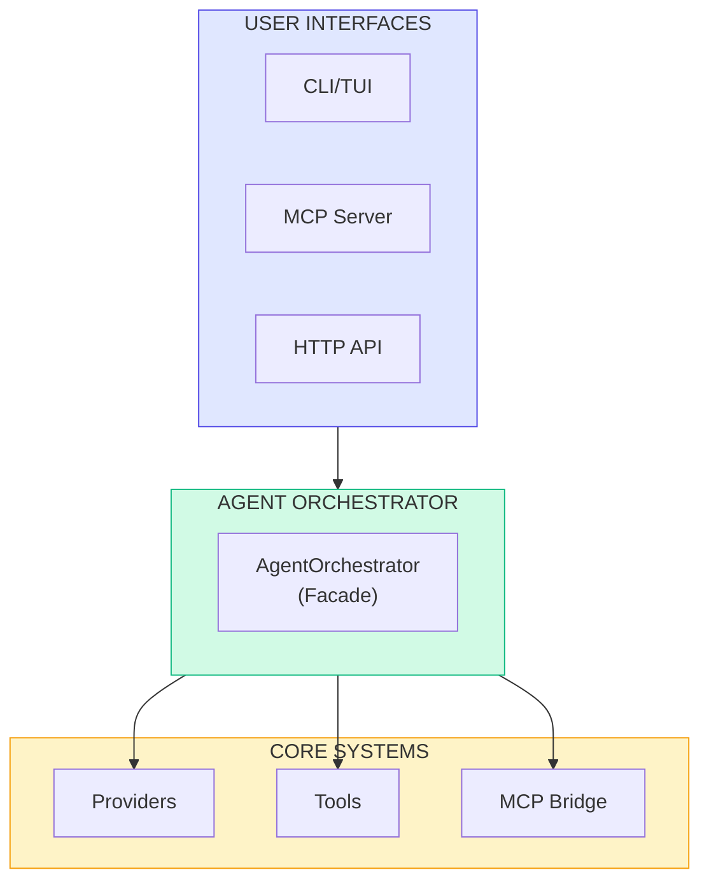
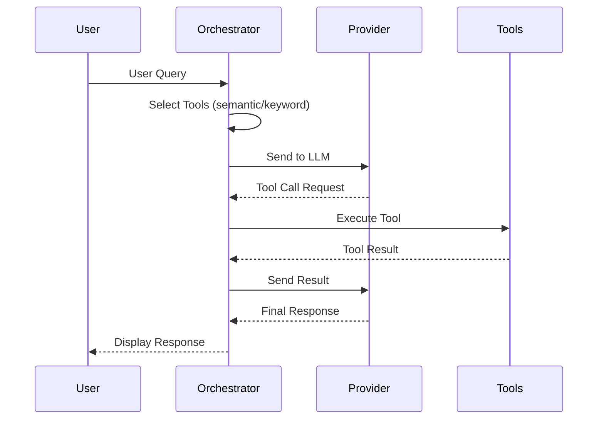
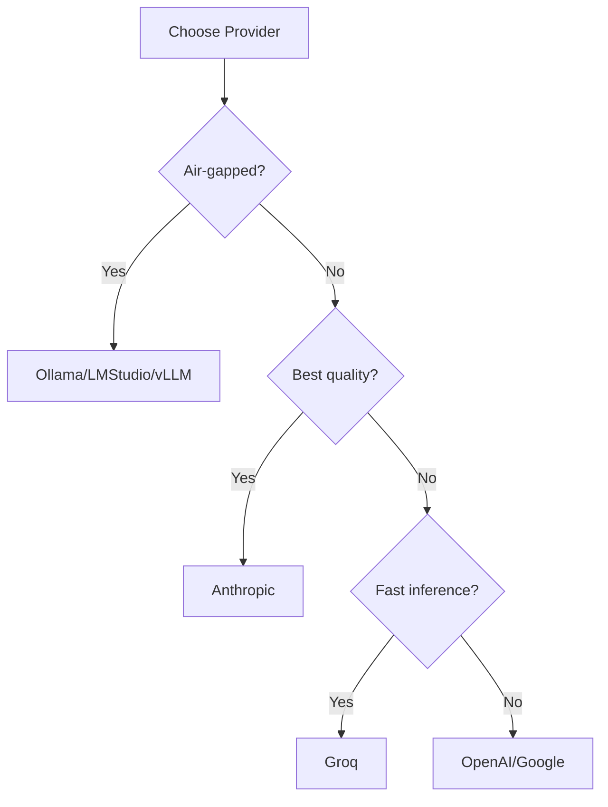
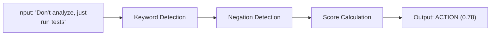
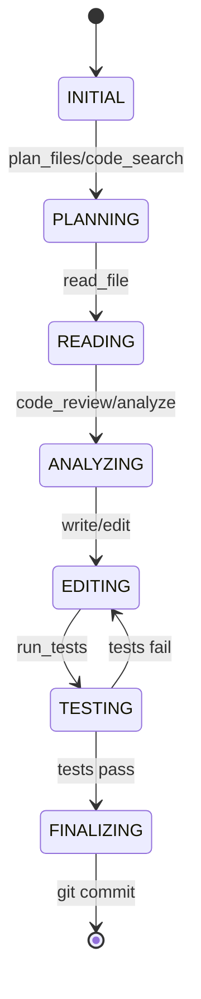

# Victor Architecture Deep Dive (Appendix)

> Detailed reference content and diagrams.
> Last Updated: December 2025

## Quick Reference

| Aspect | Value |
|--------|-------|
| Purpose | Open-source, provider-agnostic coding assistant |
| Core Tools | Dozens of built-in tools |
| Architecture | Layered protocol-first design |
| Key Pattern | Facade (orchestrator delegates to specialized components) |

---

## System Overview



---

## Component Responsibilities

| Component | Location | Responsibility | Key Methods |
|-----------|----------|----------------|-------------|
| `AgentOrchestrator` | `agent/orchestrator.py` | Session lifecycle, facade | `run()`, `process_message()` |
| `ConversationController` | `agent/conversation_controller.py` | Message history, context tracking | `add_message()`, `get_context()` |
| `ToolPipeline` | `agent/tool_pipeline.py` | Tool validation, execution, budget | `execute()`, `validate()` |
| `StreamingController` | `agent/streaming_controller.py` | Session lifecycle, cancellation | `start_session()`, `cancel()` |
| `MetricsCollector` | `agent/metrics_collector.py` | TTFT, throughput, cost tracking | `record_metric()` |
| `TaskAnalyzer` | `agent/task_analyzer.py` | Complexity/intent classification | `analyze()` |
| `ToolRegistrar` | `agent/tool_registrar.py` | Dynamic tool discovery, plugins | `register()`, `discover()` |
| `ProviderManager` | `agent/provider_manager.py` | Provider switching, health, fallback | `get_provider()`, `switch()` |
| `ContextCompactor` | `agent/context_compactor.py` | Context compaction (70% threshold) | `compact()` |
| `UsageAnalytics` | `agent/usage_analytics.py` | Tool/provider metrics, export | `track()`, `export()` |

---

## Data Flow



---

## Provider System

### Provider Comparison

| Provider | Quality | Tool Format | Parallel Tools | Notes |
|----------|---------|-------------|----------------|-------|
| Anthropic | 0.85 | ANTHROPIC | Yes | Best quality |
| OpenAI | 0.80 | OPENAI | Yes | GPT-4o, o1 |
| Google | 0.80 | NATIVE | Yes | Gemini |
| Groq | 0.78 | OPENAI | Yes | Fast inference |
| DeepSeek | 0.70 | OPENAI | Yes | Thinking tags |
| Ollama | 0.70 | FALLBACK | No | Local, air-gapped |
| LMStudio | 0.75 | OPENAI | Yes | Local GUI |
| vLLM | 0.75 | OPENAI | Yes | Production serving |

### Provider Selection Decision Tree



### Provider Interface

```python
class BaseProvider(ABC):
    @property
    @abstractmethod
    def name(self) -> str: ...

    @abstractmethod
    async def chat(self, messages, tools, **kwargs) -> CompletionResponse: ...

    @abstractmethod
    async def stream_chat(self, messages, tools, **kwargs) -> AsyncIterator[StreamChunk]: ...

    @abstractmethod
    def supports_tools(self) -> bool: ...
```

---

## Tool System

### Tool Categories

| Category | Tools | Budget |
|----------|-------|--------|
| File Operations | `read_file`, `write_file`, `edit_files`, `list_directory` | Low |
| Execution | `execute_bash`, `execute_python_in_sandbox` | Medium |
| Git | `git`, `git_suggest_commit`, `git_create_pr` | Low |
| Code Quality | `code_review`, `security_scan`, `analyze_metrics` | Medium |
| Testing | `run_tests` | Medium |
| Refactoring | `refactor_extract_function`, `refactor_inline_variable` | Medium |
| Code Intel | `find_symbol`, `find_references`, `rename_symbol` | Low |
| Web | `web_search`, `web_fetch` | High |
| Search | `code_search`, `semantic_code_search` | Low |

### Tool Cost Tiers

| Tier | Description | Examples |
|------|-------------|----------|
| FREE | Local operations | filesystem, bash, git |
| LOW | Compute-only | code review, analysis |
| MEDIUM | External API calls | web search, web fetch |
| HIGH | Resource-intensive | batch processing 100+ files |

### Tool Selection Strategy

| Strategy | Characteristics | Use Case |
|----------|-----------------|----------|
| Keyword | Fast, deterministic | Air-gapped, quick lookups |
| Semantic | Higher recall, needs embeddings | Complex queries |
| Hybrid | Blends keyword + semantic | Mixed workloads |

---

## Task Classification

### UnifiedTaskClassifier Flow



### Task Types

| Type | Keywords | Use Case |
|------|----------|----------|
| ACTION | execute, deploy, build, install, run | Command execution |
| ANALYSIS | analyze, review, audit, explain | Code analysis |
| GENERATION | create, generate, write, implement | Code creation |
| SEARCH | find, search, locate, grep | Code search |
| EDIT | refactor, modify, update, rename | Code modification |
| DEFAULT | - | Ambiguous/conversational |

### Negation Patterns

- Detects: "don't", "do not", "skip", "without", "avoid", "never"
- Window: 30 characters before keyword
- Positive overrides: ", just", ", instead", "but do"

---

## Conversation State Machine



### Stage-Tool Mapping

| Stage | Allowed Tools |
|-------|---------------|
| INITIAL | `plan_files`, `code_search`, `list_directory` |
| PLANNING | `plan_files`, `code_search`, `read_file` |
| READING | `read_file`, `list_directory`, `find_symbol` |
| ANALYZING | `code_review`, `analyze_metrics`, `security_scan` |
| EDITING | `edit_files`, `write_file`, `refactor_*` |
| TESTING | `run_tests`, `execute_bash` |
| FINALIZING | `git`, `git_suggest_commit` |

---

## MCP Integration

### MCP Modes

| Mode | Direction | Use Case |
|------|-----------|----------|
| MCP Server | Victor -> Clients | Expose tools to Claude Desktop, VS Code |
| MCP Client | Victor <- Servers | Connect to external MCP servers |

### MCP Configuration

```yaml
# ~/.victor/profiles.yaml
use_mcp_tools: true
mcp_servers:
  - name: filesystem
    command: ["npx", "@modelcontextprotocol/server-filesystem"]
  - name: database
    command: ["python", "mcp_db_server.py"]
```

---

## Agent Modes

| Mode | Description | Exploration Multiplier | Sandbox |
|------|-------------|----------------------|---------|
| BUILD | Implementation | 1.0x | All tools |
| PLAN | Analysis/planning | 2.5x | `.victor/sandbox/` |
| EXPLORE | Understanding only | 3.0x | Notes only |

---

## Caching Architecture

### Tiered Cache

| Layer | Storage | TTL | Hit Rate |
|-------|---------|-----|----------|
| L1 | Memory | 5 min | ~40% |
| L2 | Disk | 1 hour | ~25% |

### Tool Result Caching

Idempotent tools cached: `code_search`, `semantic_code_search`, `list_directory`, `plan_files`

---

## Implementation Checklist

### Adding a New Provider
- [ ] Create `victor/providers/your_provider.py` inheriting `BaseProvider`
- [ ] Implement `chat()`, `stream_chat()`, `supports_tools()`, `name`
- [ ] Register in `ProviderRegistry` (`victor/providers/registry.py`)
- [ ] Add tests in `tests/unit/providers/`

### Adding a New Tool
- [ ] Create `victor/tools/your_tool.py` inheriting `BaseTool`
- [ ] Define `name`, `description`, `parameters`, `cost_tier`, `execute()`
- [ ] Register in `AgentOrchestrator._register_tools()`
- [ ] Add tests in `tests/unit/tools/`
- [ ] Regenerate catalog: `python scripts/generate_tool_catalog.py`

### Adding Model Tool Support
Edit `victor/config/model_capabilities.yaml`:
```yaml
models:
  "your-model*":
    native_tool_calls: true
    parallel_tool_calls: true
    recommended_tool_budget: 15
```

---

## API Reference

### Core Classes

| Class | Module | Purpose |
|-------|--------|---------|
| `AgentOrchestrator` | `victor.agent.orchestrator` | Main facade |
| `BaseProvider` | `victor.providers.base` | Provider ABC |
| `BaseTool` | `victor.tools.base` | Tool ABC |
| `ToolRegistry` | `victor.tools.registry` | Tool management |
| `CompletionResponse` | `victor.providers.base` | LLM response |
| `StreamChunk` | `victor.providers.base` | Streaming chunk |
| `ToolResult` | `victor.tools.base` | Tool execution result |

### Key Protocols

| Protocol | Module | Purpose |
|----------|--------|---------|
| `IProviderAdapter` | `victor.protocols.provider_adapter` | Provider behavior normalization |
| `IGroundingStrategy` | `victor.protocols.grounding` | Response verification |
| `IQualityAssessor` | `victor.protocols.quality` | Quality assessment |

---

## Evaluation System (v0.4.0)

Victor includes an evaluation harness for benchmarking tasks.

### Evaluation Components

| Component | Module | Purpose |
|-----------|--------|---------|
| `EvaluationHarness` | `victor.evaluation.harness` | Task orchestration, result aggregation |
| `VictorAgentAdapter` | `victor.evaluation.agent_adapter` | Connects orchestrator to harness |
| `BenchmarkTask` | `victor.evaluation.protocol` | Task definition (prompt, tests, repo) |
| `TaskResult` | `victor.evaluation.protocol` | Result with tokens, duration, quality |
| `TokenUsage` | `victor.evaluation.protocol` | Input/output/total token tracking |
| `SafeTimeoutPolicy` | `victor.evaluation.timeout_calculator` | Ensures 180s minimum per turn |

### Token Tracking Flow


### Benchmark Commands

```bash
victor benchmark list              # Available benchmarks
victor benchmark run swe-bench     # Run SWE-bench
victor benchmark run humaneval     # Run HumanEval
victor benchmark compare           # Framework comparison
```

---

## Notes

> **Air-Gapped Mode**: Only local providers (Ollama, LMStudio, vLLM), no web tools, local embeddings.

> **Tool Selection**: Strategy is configurable via `tool_selection_strategy` (or legacy `use_semantic_tool_selection`).

> **Context Compaction**: Triggers at 70% context window usage. Truncates tool results, summarizes history.

> **Benchmark Timeouts**: SafeTimeoutPolicy ensures minimum 180s per turn for slow models (DeepSeek, Mixtral).

---

## Related Documentation

- [Overview](overview.md) - Architecture overview
- [Components](components.md) - Core components
- [Component Details](component-details.md) - Deep component reference
- [State Machine](state-machine.md) - Conversation stages
- [Data Flow](data-flow.md) - Request/response flow
- [Framework + Verticals](framework-vertical-integration.md) - Integration points
