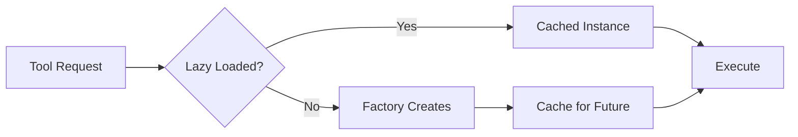
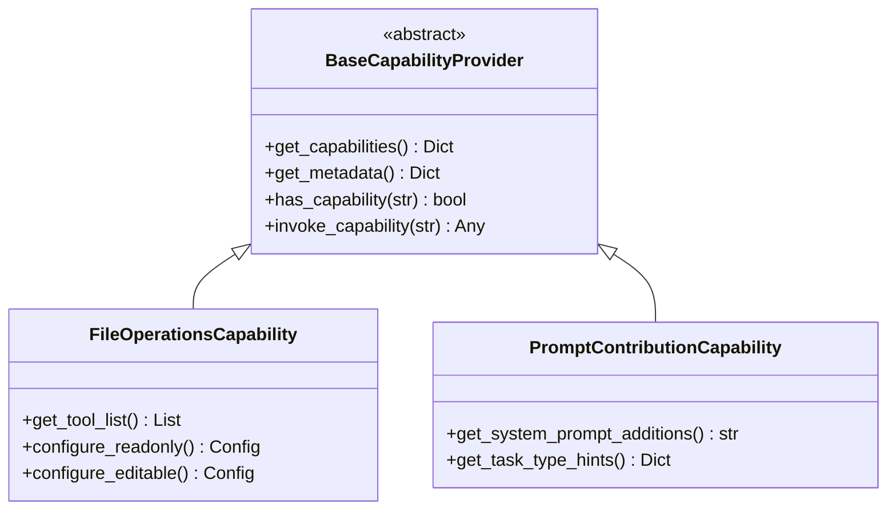

# Victor Components Reference

> **Archived**: This document is kept for historical context and may be outdated. See `docs/contributing/index.md` for current guidance.


**Quick reference for Victor's core components and interfaces.**

## Tool System

### Tool Categories & Cost Tiers

| Category | Tools | Tier | Description |
|----------|-------|------|-------------|
| **Filesystem** | read, write, edit, grep, ls, overview | FREE | File operations |
| **Git** | git_status, git_log, git_diff, git_commit | LOW | Version control |
| **Execution** | shell, python, docker_exec | MEDIUM | Code execution |
| **Search** | code_search, symbol, refs | LOW | Code navigation |
| **Web** | web_search, web_fetch | MEDIUM | Network requests |
| **Analysis** | review, test_generation | HIGH | LLM-intensive |

### Tool Selection Strategies

| Strategy | Description | Use Case |
|----------|-------------|----------|
| **keyword** | Exact name matching | Fast, deterministic |
| **semantic** | Embedding similarity | Fuzzy matching |
| **hybrid** | 70% semantic + 30% keyword | Default (balanced) |

### Tool Composition



## Provider System

### Provider Comparison

| Provider | Tool Calls | Streaming | Context | Air-Gapped |
|----------|------------|-----------|---------|------------|
| **Anthropic** | ✅ Native | ✅ | 200K | ❌ |
| **OpenAI** | ✅ Native | ✅ | 128K | ❌ |
| **Google** | ✅ Native | ✅ | 1M | ❌ |
| **Ollama** | ✅ Native | ✅ | Varies | ✅ |
| **LM Studio** | ✅ Native | ✅ | Varies | ✅ |
| **vLLM** | ✅ Native | ✅ | Varies | ✅ |
| **Azure** | ✅ Native | ✅ | 128K | ❌ |
| **AWS Bedrock** | ✅ Native | ✅ | Varies | ❌ |

### Provider Interface

```python
class BaseProvider(ABC):
    @abstractmethod
    def chat(self, messages, tools=None) -> ChatResponse: ...

    @abstractmethod
    async def stream_chat(self, messages, tools=None) -> AsyncIterator: ...

    @abstractmethod
    def supports_tools(self) -> bool: ...

    @property
    @abstractmethod
    def name(self) -> str: ...
```

## Vertical Integration

### Step Handlers

| Handler | Order | Responsibility |
|---------|-------|----------------|
| `CapabilityConfigStepHandler` | 5 | Capability config storage |
| `ToolStepHandler` | 10 | Tool filter canonicalization |
| `PromptStepHandler` | 20 | System prompt application |
| `SafetyStepHandler` | 30 | Safety patterns |
| `ConfigStepHandler` | 40 | Stage definitions |
| `ExtensionsStepHandler` | 45 | Extension coordination |
| `MiddlewareStepHandler` | 50 | Middleware chain |
| `FrameworkStepHandler` | 60 | Workflows, RL, teams |
| `ContextStepHandler` | 100 | Final context attachment |

### Extension Points

| Extension | Protocol | Purpose |
|-----------|----------|---------|
| `get_middleware()` | MiddlewareProtocol | Tool execution hooks |
| `get_safety_extension()` | SafetyExtensionProtocol | Dangerous operations |
| `get_workflow_provider()` | WorkflowProviderProtocol | YAML workflows |
| `get_team_specs()` | TeamSpecProviderProtocol | Multi-agent teams |

### Capability System



## State Machine

### Conversation Stages

```
┌────────────┐
│  INITIAL   │  Understanding request
└─────┬──────┘
      │
      ▼
┌────────────┐
│  PLANNING  │  Decomposing task
└─────┬──────┘
      │
      ▼
┌────────────┐
│  READING   │  Gathering context
└─────┬──────┘
      │
      ▼
┌────────────┐
│  ANALYZING │  Understanding code
└─────┬──────┘
      │
      ▼
┌────────────┐
│  EXECUTING │  Making changes
└─────┬──────┘
      │
      ▼
┌────────────┐
│ VERIFYING  │  Checking results
└─────┬──────┘
      │
      ▼
┌────────────┐
│ COMPLETION │  Summarizing
└────────────┘
```

### Stage-Tool Mapping

| Stage | Available Tools |
|-------|-----------------|
| INITIAL | read, ls, overview |
| PLANNING | read, grep, overview |
| READING | read, grep, code_search |
| ANALYZING | symbol, refs, web_fetch |
| EXECUTING | write, edit, shell, git |
| VERIFYING | shell, test, grep |
| COMPLETION | (all tools available) |

## Workflow System

### Workflow Components

| Component | Description | Location |
|-----------|-------------|----------|
| **StateGraph DSL** | Programmatic workflows | `victor/framework/graph.py` |
| **YAML Workflows** | Declarative workflows | `victor/{vertical}/workflows/` |
| **UnifiedCompiler** | Two-level caching | `victor/workflows/unified_compiler.py` |
| **WorkflowEngine** | Execution facade | `victor/framework/workflow_engine.py` |

### YAML Node Types

| Type | Purpose | Example |
|------|---------|---------|
| `agent` | LLM-powered task | Research, analysis |
| `compute` | Direct function call | Statistics, transforms |
| `condition` | Branching logic | Quality checks |
| `parallel` | Concurrent execution | Multi-source research |
| `hitl` | Human approval | Code reviews |

## Multi-Agent System

### Team Topologies

```
HIERARCHY          MESH             PIPELINE          HUB_SPOKE
    ●               ●   ●              ●      ●           ●
  ╱ │ ╲           ╱ │ ╲              │      │         ╱ │ ╲
 ●  ●  ●         ●──●──●             ●      ●        ●  ●  ●
```

| Topology | Use Case | Communication |
|----------|----------|---------------|
| **HIERARCHY** | Manager-worker | Top-down delegation |
| **MESH** | Peer collaboration | All-to-all |
| **PIPELINE** | Sequential stages | Linear handoff |
| **HUB_SPOKE** | Centralized coordination | Through hub |

### Persona Traits

| Trait | Range | Impact |
|-------|-------|--------|
| `verbosity` | 0.0-1.0 | Response length |
| `risk_tolerance` | 0.0-1.0 | Conservative vs bold |
| `creativity` | 0.0-1.0 | Novel vs standard approaches |
| `expertise` | NOVICE→EXPERT | Tool selection |

## Performance Optimizations

| Optimization | Impact | Status |
|--------------|--------|--------|
| **Lazy Tool Loading** | Faster startup | ✅ Implemented |
| **AOT Manifest Cache** | 50-100ms saved | ✅ Implemented |
| **Extension Caching** | One-time init | ✅ Implemented |
| **Progressive Tool Params** | Adaptive results | ✅ Implemented |
| **RL Cache Eviction** | Smart caching | ✅ Implemented |

## Protocol References

| Protocol | Purpose | Defined |
|----------|---------|---------|
| `CapabilityRegistryProtocol` | Capability discovery | `framework/protocols.py` |
| `OrchestratorVerticalProtocol` | Vertical integration | `framework/protocols.py` |
| `SubAgentContext` | SubAgent dependencies | `agent/subagents/protocols.py` |
| `StepHandlerProtocol` | Handler substitution | `framework/step_handlers.py` |
