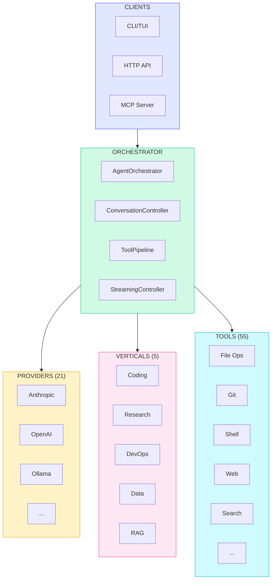

# Victor Architecture Overview

> **Archived**: This document is kept for historical context and may be outdated. See `docs/contributing/index.md` for current guidance.


**Visual guide to Victor's system architecture and component relationships.**

## System Architecture



## Request Flow

```
┌──────────┐     ┌─────────────────────────────────────────────────────────┐
│  User    │────▶│                   AgentOrchestrator                    │
└──────────┘     │  ┌─────────────────────────────────────────────────┐  │
                 │  │         VerticalIntegrationPipeline              │  │
                 │  │  ┌───────────┐  ┌──────────┐  ┌──────────────┐  │  │
                 │  │  │   Tools   │  │ Prompts  │  │   Config     │  │  │
                 │  │  │  Handler  │  │ Handler  │  │   Handler    │  │  │
                 │  │  └───────────┘  └──────────┘  └──────────────┘  │  │
                 │  └─────────────────────────────────────────────────┘  │
                 └─────────────────────────────────────────────────────────┘
                                    │
                                    ▼
                 ┌─────────────────────────────────────────────────────────┐
                 │                      VerticalBase                       │
                 │  (Coding | Research | DevOps | DataAnalysis | RAG)      │
                 └─────────────────────────────────────────────────────────┘
                                    │
                                    ▼
                 ┌─────────────────────────────────────────────────────────┐
                 │                    Provider                              │
                 │         (Anthropic | OpenAI | Ollama | ...)            │
                 └─────────────────────────────────────────────────────────┘
```

## Component Quick Reference

| Layer | Components | Purpose |
|-------|------------|---------|
| **Clients** | CLI, HTTP API, MCP Server | User interaction |
| **Orchestrator** | AgentOrchestrator, Controllers | Coordinate execution |
| **Verticals** | 5 built-in + custom | Domain specialization |
| **Providers** | 21 LLM providers | Model abstraction |
| **Tools** | 55 specialized tools | Capability execution |
| **Workflows** | StateGraph, YAML | Multi-step processes |

## Verticals Overview

| Vertical | Tools | Stages | Use Case |
|----------|-------|--------|----------|
| **Coding** | 30+ | 7 | Code analysis, refactoring, testing |
| **Research** | 9 | 4 | Web search, synthesis, citations |
| **DevOps** | 13 | 8 | Docker, CI/CD, infrastructure |
| **DataAnalysis** | 11 | 5 | Pandas, visualization, statistics |
| **RAG** | 10 | 5 | Document retrieval, vector search |

## Provider Support

| Provider | Tool Calling | Streaming | Air-Gapped |
|----------|--------------|-----------|------------|
| Anthropic | ✅ | ✅ | ❌ |
| OpenAI | ✅ | ✅ | ❌ |
| Google Gemini | ✅ | ✅ | ❌ |
| Ollama | ✅ | ✅ | ✅ |
| LM Studio | ✅ | ✅ | ✅ |
| vLLM | ✅ | ✅ | ✅ |

## Tool Categories

| Category | Examples | Cost Tier |
|----------|----------|-----------|
| **Filesystem** | read, write, edit, grep | FREE |
| **Git** | status, log, diff, commit | LOW |
| **Execution** | shell, python, docker | MEDIUM |
| **Search** | code_search, symbol, refs | LOW |
| **Web** | web_search, web_fetch | MEDIUM |
| **Analysis** | review, test_gen | HIGH |

## Key Design Principles

| Principle | Implementation |
|-----------|----------------|
| **SRP** | Each StepHandler handles one concern |
| **OCP** | ExtensionHandlerRegistry for pluggable components |
| **LSP** | Protocol-based interfaces (SubAgentContext, CapabilityRegistry) |
| **ISP** | Focused protocols, minimal dependencies |
| **DIP** | Protocol-first capability invocation |

## Deep Links

- [Components Reference](components.md) - Detailed component documentation
- [Data Flow](data-flow.md) - Request execution and event flow
- [State Machine](state-machine.md) - Conversation stage management
- [Vertical Integration](framework-vertical-integration.md) - Extension protocols
