# Releasing Victor

Guide for maintainers on creating and publishing Victor releases.

## Table of Contents

- [Release Process Overview](#release-process-overview)
- [Pre-Release Checklist](#pre-release-checklist)
- [Creating a Release](#creating-a-release)
- [Automated Release Pipeline](#automated-release-pipeline)
- [Manual Release Steps](#manual-release-steps)
- [Distribution Channels](#distribution-channels)
- [Post-Release Tasks](#post-release-tasks)
- [Hotfix Releases](#hotfix-releases)
- [Troubleshooting](#troubleshooting)

## Release Process Overview

Victor uses a fully automated release pipeline triggered by Git tags:

```mermaid
flowchart TB
    TAG["🏷️ Tag Push<br/>(v0.1.0)"]

    subgraph GHA["GitHub Actions"]
        TEST["✅ Test"]
        BUILD["📦 Build<br/>• Python<br/>• Binary<br/>• Docker"]
        PUBLISH["🚀 Publish<br/>• PyPI<br/>• GitHub<br/>• Docker"]

        TEST --> BUILD --> PUBLISH
    end

    TAG --> GHA

    style TAG fill:#e0e7ff,stroke:#4f46e5
    style GHA fill:#f0f9ff,stroke:#0284c7
    style TEST fill:#d1fae5,stroke:#10b981
    style BUILD fill:#fef3c7,stroke:#f59e0b
    style PUBLISH fill:#dbeafe,stroke:#3b82f6
```



## Pre-Release Checklist

Before creating a release, ensure:

- [ ] All tests pass: `make test`
- [ ] Linting passes: `make lint`
- [ ] Documentation is updated
- [ ] CHANGELOG.md is updated (if applicable)
- [ ] Version in `pyproject.toml` is correct
- [ ] All PRs for this release are merged
- [ ] Dependencies are up to date

### Version Numbering

We follow [Semantic Versioning](https://semver.org/):

- **MAJOR.MINOR.PATCH** (e.g., `1.2.3`)
- **Pre-release**: `0.5.0-alpha`, `0.5.0-beta`, `0.5.0-rc.1`

| Change Type | Version Bump | Example |
|-------------|--------------|---------|
| Breaking changes | MAJOR | 0.1.0 → 0.5.0 |
| New features (backward compatible) | MINOR | 0.1.0 → 0.2.0 |
| Bug fixes | PATCH | 0.1.0 → 0.1.1 |
| Pre-release | Suffix | 0.2.0-beta |

## Creating a Release

### Using Make (Recommended)

```bash
# 1. Ensure you're on main branch with latest changes
git checkout main
git pull origin main

# 2. Run tests
make test
make lint

# 3. Create the release (updates version, commits, tags)
make release VERSION=0.2.0

# 4. Push to trigger automated release
git push origin main
git push origin --tags
```

### Manual Steps

```bash
# 1. Update version in pyproject.toml
sed -i 's/version = ".*"/version = "0.2.0"/' pyproject.toml

# 2. Commit the version change
git add pyproject.toml
git commit -m "Release v0.2.0"

# 3. Create annotated tag
git tag -a "v0.2.0" -m "Release v0.2.0"

# 4. Push changes and tag
git push origin main
git push origin v0.2.0
```

## Automated Release Pipeline

When a tag matching `v*` is pushed, GitHub Actions automatically:

### 1. Runs Tests
- Unit tests on Python 3.10, 3.11, 3.12
- Linting with ruff and black
- Type checking with mypy

### 2. Builds Artifacts

**Python Package:**
- Source distribution (`.tar.gz`)
- Wheel (`.whl`)

**Standalone Binaries:**
- `victor-macos-arm64.tar.gz`
- `victor-macos-x64.tar.gz`
- `victor-windows-x64.zip`
- Linux: Use `pip install victor-ai` (PyInstaller + PyTorch too complex)

**Docker Images:**
- `vjsingh1984/victor-ai:<version>`
- `vjsingh1984/victor-ai:latest`

### 3. Publishes to Distribution Channels

- **PyPI**: Automatic via trusted publishing (OIDC, no token needed)
- **GitHub Releases**: Creates release with artifacts and checksums
- **Docker Hub**: Pushes images to `vjsingh1984/victor-ai`
- **Homebrew**: Auto-updates via PyPI polling (every 6 hours)

### Required Secrets

Configure these in GitHub repository settings:

| Secret | Purpose |
|--------|---------|
| `DOCKERHUB_USERNAME` | Docker Hub username (`vjsingh1984`) |
| `DOCKERHUB_TOKEN` | Docker Hub access token |

**Notes:**
- PyPI uses trusted publishing (OIDC, no token needed)
- Homebrew tap uses PyPI polling (no cross-repo token needed)

## Manual Release Steps

If automated release fails, follow these manual steps:

### Publish to PyPI

```bash
# Build packages
pip install build twine
python -m build

# Check packages
twine check dist/*

# Upload to PyPI
twine upload dist/*
```

### Build Binaries

```bash
# Install build dependencies
pip install -e ".[build]"

# Build for current platform
python scripts/build_binary.py --onefile

# Output in dist/
ls dist/
```

### Build and Push Docker

```bash
# Build
docker build -t vjsingh1984/victor-ai:0.2.3 .
docker tag vjsingh1984/victor-ai:0.2.3 vjsingh1984/victor-ai:latest

# Push
docker push vjsingh1984/victor-ai:0.2.3
docker push vjsingh1984/victor-ai:latest
```

### Create GitHub Release

1. Go to [GitHub Releases](https://github.com/vijayksingh/victor/releases)
2. Click "Draft a new release"
3. Select the tag (e.g., `v0.2.0`)
4. Title: "Victor v0.2.0"
5. Description: Include changelog
6. Upload binary artifacts
7. Check "Pre-release" if applicable
8. Publish

## Distribution Channels

### PyPI
- **URL**: https://pypi.org/project/victor/
- **Install**: `pip install victor`
- **Publishing**: Automated via GitHub Actions

### GitHub Releases
- **URL**: https://github.com/vijayksingh/victor/releases
- **Contains**: Source code, binaries, changelog

### Docker Hub
- **URL**: https://hub.docker.com/r/vjsingh1984/victor-ai
- **Pull**: `docker pull vjsingh1984/victor-ai:latest`

### Homebrew
- **Tap**: `vjsingh1984/tap`
- **Install**: `brew install vjsingh1984/tap/victor`
- **Formula**: Auto-updates every 6 hours via PyPI polling

## Post-Release Tasks

After a successful release:

1. **Verify Installation**
   ```bash
   pip install victor==0.2.0
   victor --version
   ```

2. **Test Docker Image**
   ```bash
   docker pull vjsingh1984/victor-ai:0.2.3
   docker run vjsingh1984/victor-ai:0.2.3 victor --version
   ```

3. **Update Documentation**
   - Update version references in docs
   - Update changelog

4. **Announce Release**
   - GitHub Discussions
   - Social media (if applicable)

5. **Monitor for Issues**
   - Watch GitHub Issues for reports
   - Check PyPI download stats

## Hotfix Releases

For critical bug fixes:

```bash
# 1. Create hotfix branch from tag
git checkout -b hotfix/0.2.1 v0.2.0

# 2. Apply fixes
# ... make changes ...
git commit -m "Fix critical bug"

# 3. Update version
make release VERSION=0.2.1

# 4. Merge to main
git checkout main
git merge hotfix/0.2.1

# 5. Push
git push origin main
git push origin --tags

# 6. Clean up
git branch -d hotfix/0.2.1
```

## Troubleshooting

### PyPI Upload Fails

**"Invalid distribution":**
```bash
# Check package
twine check dist/*

# Rebuild
rm -rf dist/
python -m build
```

**"Version exists":**
- Version already published to PyPI
- Increment version number

### Docker Build Fails

**"No space left on device":**
```bash
# Clean Docker cache
docker system prune -af
```

**"Permission denied":**
```bash
# Ensure logged in
docker login
docker login ghcr.io
```

### Binary Build Fails

**Missing dependencies:**
```bash
pip install -e ".[build]"
```

**PyInstaller errors:**
- Check `scripts/build_binary.py` for missing hidden imports
- Add imports to `get_hidden_imports()`

### GitHub Actions Fails

1. Check workflow logs in Actions tab
2. Verify secrets are configured
3. Check for rate limiting
4. Re-run failed jobs

### Homebrew Formula Not Updated

1. Check `vjsingh1984/homebrew-tap` workflow ran successfully
2. Formula auto-updates via PyPI polling (every 6 hours)
3. Manually trigger: Go to Actions → "Update Formula" → Run workflow
4. Run: `brew update && brew upgrade victor`

## Release Artifacts Reference

| Artifact | Location | Purpose |
|----------|----------|---------|
| `victor_ai-0.2.3.tar.gz` | PyPI, GitHub | Source distribution |
| `victor_ai-0.2.3-py3-none-any.whl` | PyPI, GitHub | Python wheel |
| `victor-macos-arm64.tar.gz` | GitHub | macOS Apple Silicon binary |
| `victor-macos-x64.tar.gz` | GitHub | macOS Intel binary |
| `victor-windows-x64.zip` | GitHub | Windows binary |
| `vjsingh1984/victor-ai:0.2.3` | Docker Hub | Docker image |
| `checksums.txt` | GitHub | SHA256 checksums |

## See Also

- [Installation Guide →](../../getting-started/installation.md)
- [Development Guide →](../index.md)
- [GitHub Actions Workflow](../../../.github/workflows/release.yml)
