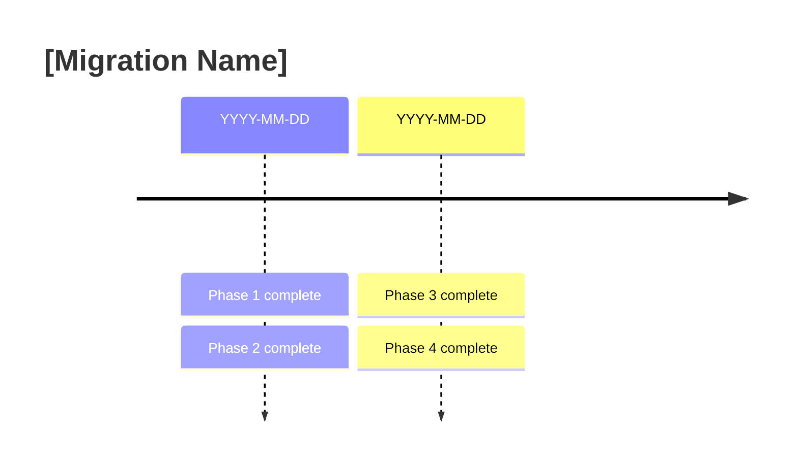
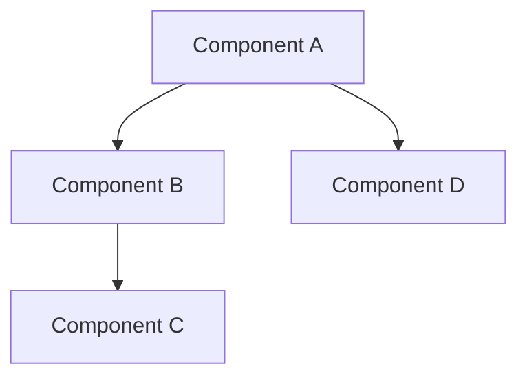
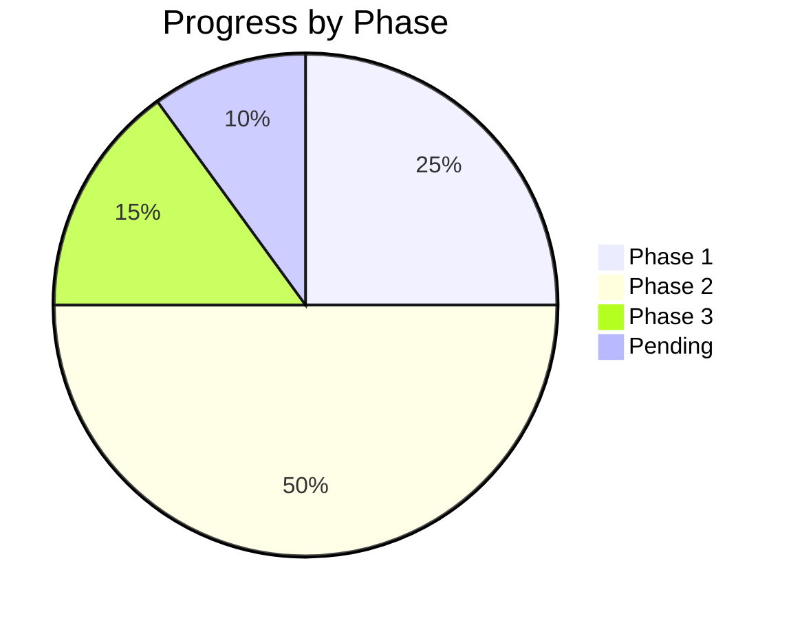
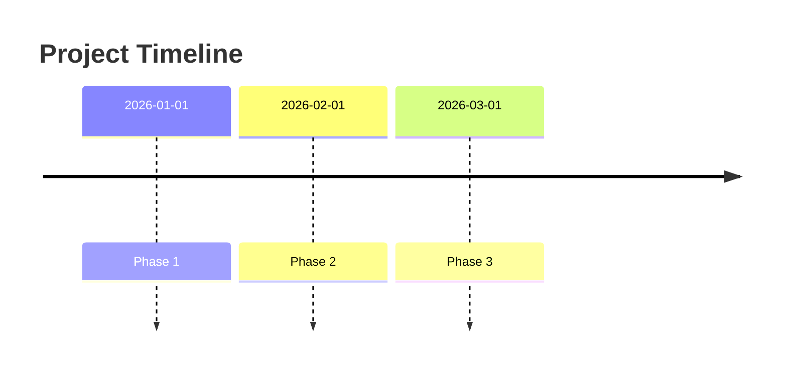

# Visual Documentation Standards

**Version**: 1.0 | **Date**: 2026-04-30

## Philosophy

**Use visual formats over verbose prose**:
- ✅ Tables, Mermaid diagrams, timelines, checklists
- ✅ Bullets over paragraphs
- ✅ Code examples over explanations
- ❌ Long paragraphs, verbose descriptions

## Templates

### Template 1: Session Summary

Use for completed development sessions, migrations, or features.

```markdown
# [Feature Name]

**Status**: ✅ Complete | **Date**: YYYY-MM-DD | **Effort**: Xh (vs. Y-Zh est.)

## Changes

| Aspect | Before | After |
|--------|--------|-------|
| Key aspect 1 | Old state | New state |
| Key aspect 2 | Old state | New state |

## Impact

- ✅ Benefit 1
- ✅ Benefit 2
- ✅ Benefit 3

**Files Modified**: N
**Tests**: M passing
**Commits`: abc123, def456
```

### Template 2: Migration Timeline

Use for multi-phase projects or migrations.

```markdown
# [Migration Name]



| Phase | Description | Status | Effort |
|-------|-------------|--------|--------|
| Phase 1 | Brief description | ✅ | Xh |
| Phase 2 | Brief description | ✅ | Yh |
| Phase 3 | Brief description | ⏳ | Zh |
```

### Template 3: Architecture Overview

Use for system architecture or component documentation.

```markdown
# [Component Name]

## Overview



## Components

| Component | Purpose | Status |
|-----------|---------|--------|
| Component A | Brief description | ✅ |
| Component B | Brief description | ✅ |
| Component C | Brief description | ⏳ |
```

### Template 4: Feature Comparison

Use for comparing features, providers, or configurations.

```markdown
# [Comparison Title]

| Feature | Option A | Option B | Option C |
|---------|----------|----------|----------|
| Feature 1 | ✅ | ❌ | ✅ |
| Feature 2 | ✅ | ✅ | ⚠️ |
| Feature 3 | ❌ | ✅ | ✅ |

## Recommendations

| Use Case | Recommended Option |
|----------|-------------------|
| Scenario 1 | Option A |
| Scenario 2 | Option B |
| Scenario 3 | Option C |
```

### Template 5: Status Dashboard

Use for project status or progress tracking.

```markdown
# [Project Name] Status

## Summary

| Metric | Value | Target |
|--------|-------|--------|
| Files Modified | 42 | 50 |
| Tests Passing | 95% | 90% |
| Coverage | 85% | 80% |

## Progress



## Blockers

| Issue | Impact | Resolution |
|-------|--------|------------|
| Blocker 1 | High | In progress |
| Blocker 2 | Medium | Proposed |
```

### Template 6: Troubleshooting Guide

Use for FAQ or troubleshooting documentation.

```markdown
# [Component] Troubleshooting

## Common Issues

| Problem | Solution | Command |
|---------|----------|---------|
| Error message | Fix description | `command to fix` |
| Error message | Fix description | `command to fix` |

## Quick Diagnostics

```bash
# Check status
command to check status

# View logs
command to view logs

# Test connection
command to test
```
```

## Format Guidelines

### Tables

✅ **DO**:
- Use for comparisons, status, configurations
- Keep headers concise
- Use icons (✅ ❌ ⏳) for status
- Limit to 5-7 columns

❌ **DON'T**:
- Put long text in cells
- Create tables with 10+ columns
- Use for sequential information

### Mermaid Diagrams

✅ **DO**:
- Use for: timelines, flows, relationships, state machines
- Keep diagrams simple (< 15 nodes)
- Use clear labels

❌ **DON'T**:
- Create complex diagrams (> 20 nodes)
- Put long text in nodes
- Use for simple lists

### Timelines

✅ **USE FOR**:
- Project phases
- Migration steps
- Feature roadmaps



### Checklists

✅ **USE FOR**:
- Completion status
- Verification steps
- Requirements

| Item | Status | Notes |
|------|--------|-------|
| Task 1 | ✅ | Completed |
| Task 2 | ⏳ | In progress |
| Task 3 | ❌ | Blocked |

## File Size Guidelines

| Document Type | Target Size | Max Size |
|---------------|-------------|----------|
| FAQ | 100-200 lines | 300 lines |
| Architecture doc | 150-250 lines | 400 lines |
| Session summary | 50-100 lines | 150 lines |
| Migration guide | 200-300 lines | 500 lines |
| API reference | 300-500 lines | 800 lines |

## Visual Format Usage Targets

| Format | Current | Target |
|--------|---------|--------|
| Tables | 20% | 60% |
| Mermaid diagrams | 5% | 25% |
| Checklists | 10% | 30% |
| Bullets | 40% | 70% |
| Verbose prose | 60% | <20% |

## Conversion Examples

### Before (Verbose Prose)

The Stringified Types Migration project was completed on April 19th, 2026. The project involved creating 67 different enum types across multiple phases of work. We started with the P0 critical phase which included 10 enums and 229 tests. Then we moved to P1 discretization which had 10 enums and 331 tests passing. After that we did P1 low priority which had 5 enums and 91 tests. Then we completed P2 high priority with 9 enums and 177 tests, followed by P2 medium priority with 7 enums and 85 tests. Finally we finished P3 edge cases with 4 enums. The total effort was 13 hours which was under the estimated 21-30 hours. The impact was that we now have type safety throughout the codebase with compile-time validation and IDE autocomplete support.

### After (Visual Format)

**Status**: ✅ Complete | **Date**: 2026-04-19 | **Effort**: 13h (vs. 21-30h est.)

| Phase | Enums | Tests | Status |
|-------|-------|-------|--------|
| P0 Critical | 10 | 229 | ✅ |
| P1 Discretization | 10 | 331 | ✅ |
| P1 Low Priority | 5 | 91 | ✅ |
| P2 High Priority | 9 | 177 | ✅ |
| P2 Medium Priority | 7 | 85 | ✅ |
| P3 Edge Cases | 4 | - | ✅ |

**Impact**: 67 enums, 600+ tests, zero magic strings

## Tools & Resources

### Mermaid Diagram Editor
- **Online**: [Mermaid Live Editor](https://mermaid.live)
- **VS Code**: Markdown Preview Mermaid Support extension

### Table Tools
- **Excel/Google Sheets**: Export as Markdown
- **VS Code**: Markdown Table Formatter extension

### Diagram Types

| Type | Best For | Mermaid Syntax |
|------|----------|----------------|
| Flowchart | Process flows, architecture | `flowchart` |
| Timeline | Project phases, milestones | `timeline` |
| Pie | Distribution, proportions | `pie` |
| State Diagram | State machines | `stateDiagram` |
| Gantt | Project schedules | `gantt` |
| Class | Class relationships | `classDiagram` |

## Review Checklist

Before submitting documentation, verify:

- [ ] Visual formats used (tables, diagrams, timelines)
- [ ] File size within guidelines
- [ ] No verbose paragraphs (> 5 lines)
- [ ] Tables have concise headers
- [ ] Mermaid diagrams are simple (< 15 nodes)
- [ ] Icons used for status (✅ ❌ ⏳)
- [ ] Code examples provided where applicable
- [ ] Links are working
- [ ] Spelling and grammar checked

---

**Maintained by**: Documentation team
**Last Updated**: 2026-04-30
**Version**: 1.0
