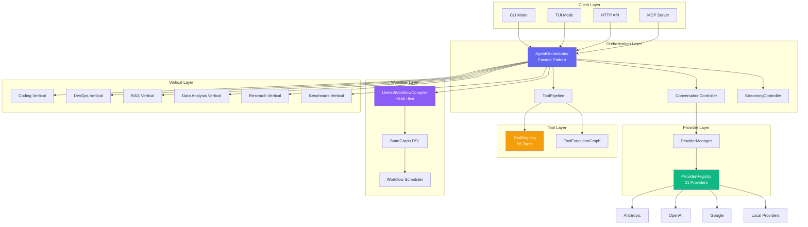
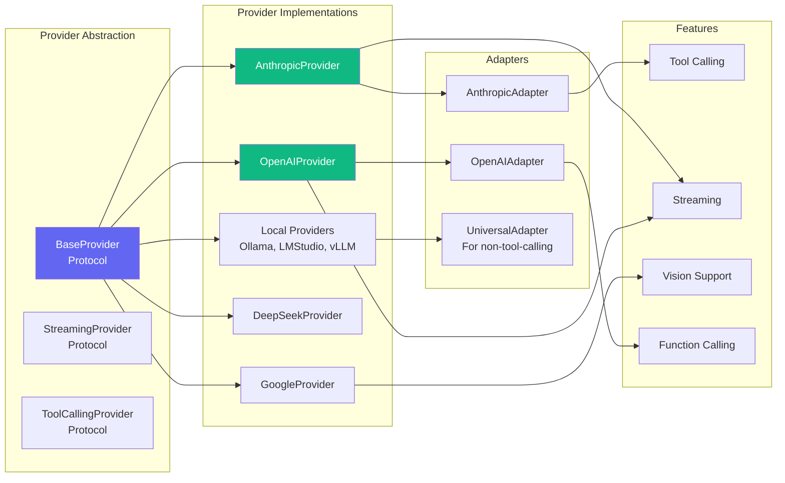
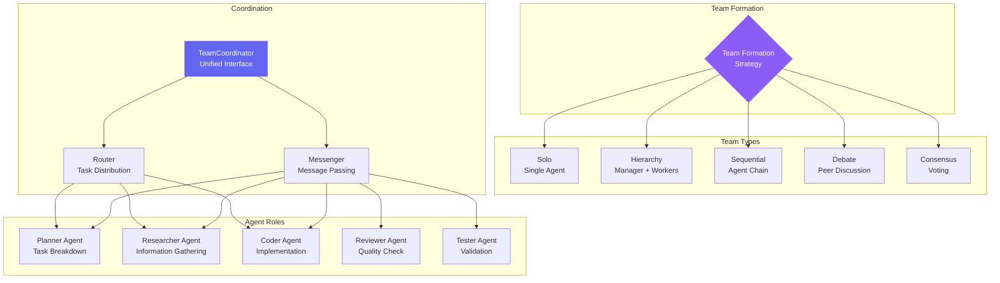
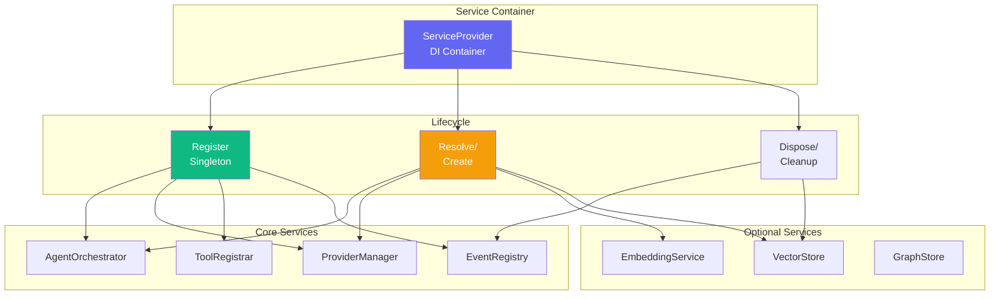
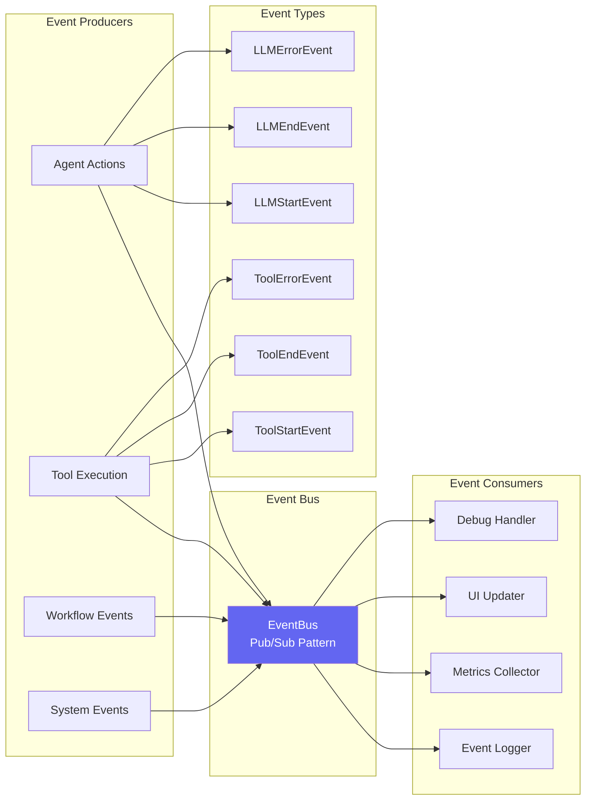
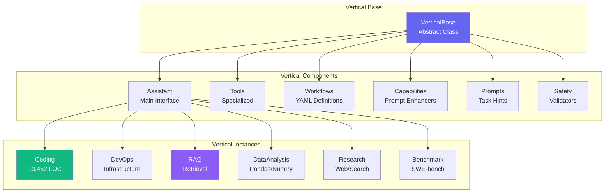
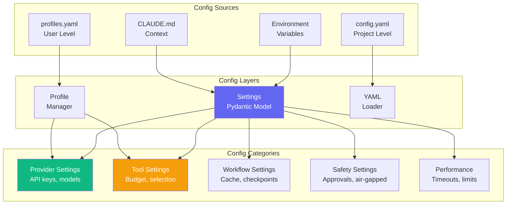
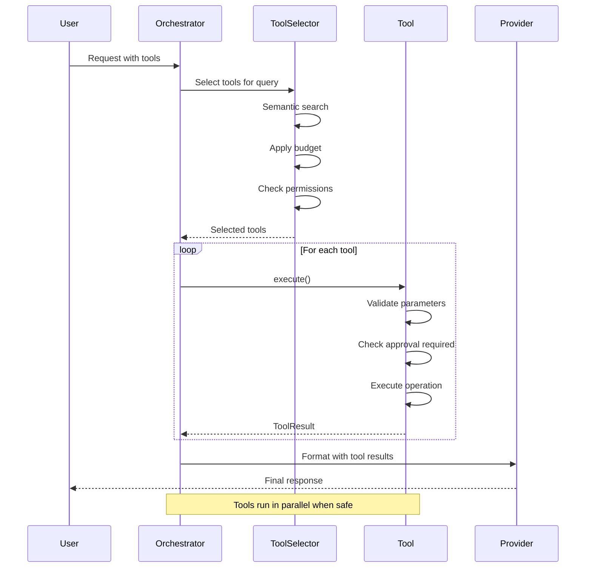
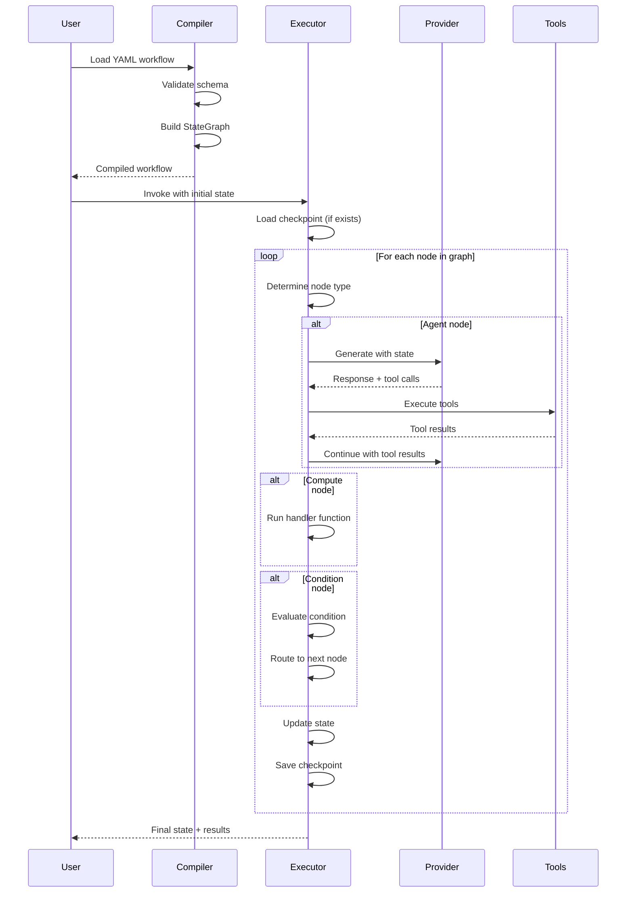

# Victor Architecture Diagrams

This file contains Mermaid diagrams for Victor's architecture documentation.

## System Architecture Overview



## Provider System Architecture



## Tool System Architecture

```mermaid
graph TB
    subgraph "Tool Abstraction"
        BaseTool[BaseTool<br/>Abstract Class]
        ToolDecorator[@tool<br/>Decorator]
    end

    subgraph "Tool Categories"
        FileOps[File Operations<br/>read, write, edit]
        CodeAnalysis[Code Analysis<br/>code_search, overview]
        Execution[Execution<br/>shell, bash]
        Git[Git Operations<br/>git_status, git_commit]
        Web[Web Tools<br/>web_search, web_fetch]
        RAG[RAG Tools<br/>rag_ingest, rag_search]
    end

    subgraph "Tool Properties"
        CostTier[Cost Tier<br/>FREE, LOW, MEDIUM, HIGH]
        AccessMode[Access Mode<br/>PUBLIC, RESTRICTED, PRIVATE]
        ApprovalRequired[Approval Required<br/>for destructive ops]
    end

    subgraph "Tool Selection"
        Keyword[Keyword<br/>Exact match]
        Semantic[Semantic<br/>Embedding-based]
        Hybrid[Hybrid<br/>70% semantic + 30% keyword]
    end

    BaseTool --> FileOps
    BaseTool --> CodeAnalysis
    BaseTool --> Execution
    BaseTool --> Git
    BaseTool --> Web
    BaseTool --> RAG

    FileOps --> CostTier
    FileOps --> AccessMode
    Execution --> ApprovalRequired

    ToolDecorator --> Hybrid

    style BaseTool fill:#6366f1,color:#fff
    style CostTier fill:#f59e0b,color:#fff
    style Hybrid fill:#10b981,color:#fff
```

## Workflow Execution Flow

```mermaid
graph TB
    Start([Start]) --> Load[Load YAML<br/>Workflow Definition]
    Load --> Validate[Validate YAML<br/>Schema Check]
    Validate --> Compile[Compile to<br/>StateGraph]

    Compile --> Checkpoint{Checkpoint<br/>Enabled?}

    Checkpoint -->|Yes| LoadState[Load State<br/>from Checkpoint]
    Checkpoint -->|No| InitState[Initialize<br/>Empty State]

    LoadState --> Execute
    InitState --> Execute[Execute<br/>Workflow]

    Execute --> Node{Node Type?}

    Node -->|Agent| AgentNode[Run LLM<br/>with Tools]
    Node -->|Compute| ComputeNode[Run Python<br/>Handler]
    Node -->|Condition| ConditionNode[Evaluate<br/>Condition]
    Node -->|Parallel| ParallelNode[Run branches<br/>concurrently]
    Node -->|Transform| TransformNode[Transform<br/>State]
    Node -->|HITL| HITLNode[Human Approval<br/>Required]

    AgentNode --> UpdateState
    ComputeNode --> UpdateState
    ConditionNode --> Branch
    ParallelNode --> Join
    TransformNode --> UpdateState
    HITLNode --> Decision

    Decision{Approved?}
    Decision -->|Yes| UpdateState
    Decision -->|No| [Stop/Halt]

    UpdateState[Update State]
    Branch --> UpdateState
    Join --> UpdateState

    UpdateState --> Checkpoint{Checkpoint<br/>Enabled?}
    Checkpoint -->|Yes| SaveState[Save State<br/>to Checkpoint]
    Checkpoint -->|No| Continue
    SaveState --> Continue

    Continue --> More{More<br/>Nodes?}
    More -->|Yes| Node
    More -->|No| End([End])

    style Compile fill:#8b5cf6,color:#fff
    style Execute fill:#10b981,color:#fff
    style HITLNode fill:#f59e0b,color:#fff
```

## Multi-Agent Coordination



## Dependency Injection Container



## Event System



## Vertical Architecture



## Configuration System



## Testing Architecture

```mermaid
graph TB
    subgraph "Test Levels"
        Unit[Unit Tests<br/>Fast, Isolated]
        Integration[Integration Tests<br/>Component Interaction]
        E2E[E2E Tests<br/>Full Workflows]
    end

    subgraph "Test Tools"
        Pytest[Pytest<br/>Test Runner]
        Mocks[Mocks<br/>unittest.mock]
        Respx[Respx<br/>HTTP Mocking]
        Fixtures[Fixtures<br/>Test Data]
    end

    subgraph "Test Markers"
        UnitMark[@pytest.mark.unit]
        IntegrationMark[@pytest.mark.integration]
        SlowMark[@pytest.mark.slow]
        WorkflowMark[@pytest.mark.workflows]
    end

    Unit --> Pytest
    Integration --> Pytest
    E2E --> Pytest

    Pytest --> UnitMark
    Pytest --> IntegrationMark
    Pytest --> SlowMark
    Pytest --> WorkflowMark

    Unit --> Mocks
    Integration --> Respx
    Integration --> Fixtures

    style Pytest fill:#6366f1,color:#fff
    style Unit fill:#10b981,color:#fff
    style Integration fill:#f59e0b,color:#fff
```

## Data Flow: Tool Execution



## Data Flow: Workflow Execution



---

## Usage in Documentation

To use these diagrams in Markdown files:

```markdown
## System Architecture

```mermaid
paste diagram code here
```
```

MkDocs with the Material theme automatically renders Mermaid diagrams.
