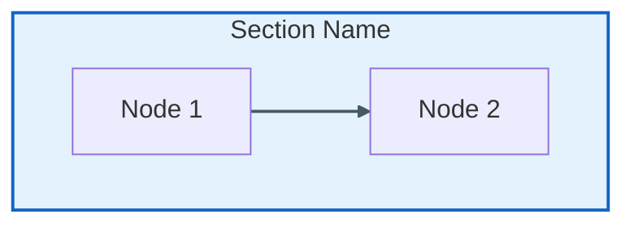

# Victor AI Documentation Diagrams

This directory contains visual documentation for Victor AI, created using Mermaid.js and PlantUML.

## Diagram Categories

### Architecture Diagrams (`docs/diagrams/architecture/`)

#### System Overview
- **coordinator-layers.mmd** - Two-layer coordinator architecture (application vs framework layer)
- **data-flow.mmd** - Sequence diagram showing complete request/response flow through the system
- **extension-system.mmd** - Extension system architecture (verticals, capabilities, tools)
- **tool-execution-detailed.mmd** - Detailed tool execution flow (5 phases)

#### Provider System
- **provider-switch-detailed.mmd** - Provider switching flow with context preservation (5 steps)
- **provider-system.mmd** - Provider system architecture (21 LLM providers)

#### Legacy Diagrams
- **config-system.mmd** - Configuration system (use reference/ instead)
- **multi-agent.mmd** - Multi-agent team system (use reference/teams/ instead)
- **system-overview.mmd** - System overview (use coordinator-layers.mmd instead)

### Operations Diagrams (`docs/diagrams/operations/`)

- **deployment.mmd** - Deployment patterns (local, cloud, hybrid, multi-cloud)

### User Journey Diagrams (`docs/diagrams/user-journeys/`)

- **beginner-onboarding.mmd** - Beginner onboarding journey (30 minutes, 5 steps)
- **contributor-workflow.mmd** - Contributor development workflow (6 steps)

### Sequence Diagrams (`docs/diagrams/sequences/`)

- **provider-switch.mmd** - Provider switching sequence diagram
- **tool-execution.mmd** - Tool execution sequence diagram
- **workflow-execution.mmd** - Workflow execution sequence diagram

### Workflow Diagrams (`docs/diagrams/workflows/`)

Contains 60+ SVG diagrams for specific workflow patterns:
- Coding workflows (bug fix, feature implementation, refactoring, etc.)
- DevOps workflows (CI/CD, container setup, deployment)
- RAG workflows (document ingest, query, maintenance)
- Data Analysis workflows (EDA, ML pipeline, statistical analysis)
- Research workflows (literature review, competitive analysis)

### Developer Diagrams (`docs/diagrams/`)

- **coordinator-architecture.mmd** - Coordinator architecture overview
- **developer-workflows.mmd** - Developer workflow patterns
- **protocols-and-events.mmd** - Protocols and events system
- **system-architecture.mmd** - High-level system architecture
- **verticals-and-deployment.mmd** - Verticals and deployment patterns

## Diagram Standards

All Victor AI diagrams follow these standards:

- **Max 20 nodes** per diagram for readability
- **Max 5 colors** using Victor standard palette:
  - Green: Success/Positive actions
  - Blue: Information/Processing
  - Orange: Warning/Transitions
  - Red: Errors/Failure paths
  - Purple: Completion/Final states
- **Alt text** required for accessibility
- **Source files** committed (.mmd, .puml)
- **Auto-generated images** in CI/CD (when configured)

## Rendering Diagrams

### Using Mermaid CLI

```bash
# Install mermaid-cli
npm install -g @mermaid-js/mermaid-cli

# Render diagram to SVG
mmdc -i docs/diagrams/architecture/coordinator-layers.mmd -o docs/diagrams/architecture/coordinator-layers.svg

# Render all diagrams
find docs/diagrams -name "*.mmd" -exec sh -c 'mmdc -i "$1" -o "${1%.mmd}.svg"' _ {} \;
```

### Using VS Code

Install the [Mermaid Preview](https://marketplace.visualstudio.com/items?itemName=bierner.markdown-mermaid) extension:
1. Open a `.mmd` file
2. Press `Cmd+Shift+V` to preview

### Using Online Editor

Visit [Mermaid Live Editor](https://mermaid.live):
1. Copy `.mmd` file content
2. Paste into editor
3. Export as PNG/SVG

## Adding New Diagrams

When adding new diagrams:

1. **Choose appropriate category** (architecture/, operations/, user-journeys/, sequences/, workflows/)
2. **Follow naming convention**: `descriptive-name.mmd`
3. **Keep it simple**: Max 20 nodes, use subgraphs for grouping
4. **Use standard colors**: See "Diagram Standards" above
5. **Add alt text**: Include `title` field or diagram description
6. **Update this README**: Add diagram to appropriate category

### Example Template



## Diagram Metrics

- **Total diagrams**: 20 Mermaid files + 60+ SVG files
- **Architecture diagrams**: 10
- **Operations diagrams**: 1
- **User journey diagrams**: 2
- **Sequence diagrams**: 3
- **Workflow diagrams**: 60+

## Related Documentation

- [Architecture Overview](../architecture/overview.md)
- [Best Practices](../architecture/best-practices/)
- [Design Patterns](../architecture/patterns/)
- [Contributing Guide](../contributing/)

---

**Reading Time:** 2 min
**Last Updated:** February 08, 2026**
